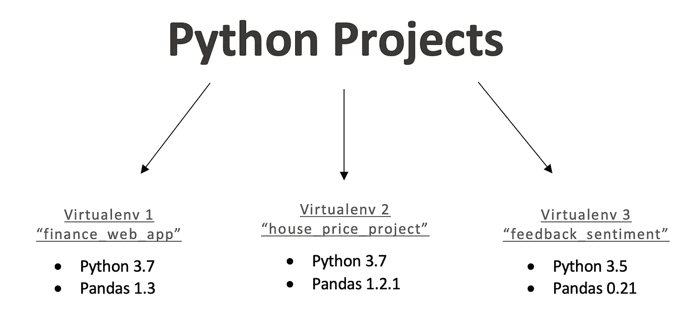
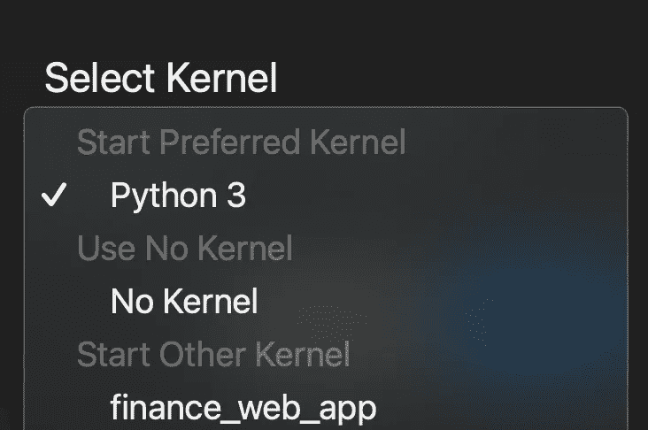

# 虚拟环境 Python 中的设置和重要性

> 原文：<https://towardsdatascience.com/virtual-environments-setup-importance-python-4375fed7d40b?source=collection_archive---------14----------------------->



(图片由作者提供)

## 直观的 5 步演练，可作为值得收藏的参考

虚拟环境往往是我发现自己反复返回谷歌的数据科学任务之一，以检查我的语法和日常使用中的类似情况。我希望浏览这个过程及其所有值得注意的元素，作为对自己的提醒，并希望作为一个值得收藏的资源，供其他人方便地参考。

我将在我的 Macbook Pro 上使用 virtualenv for Python。我主要使用 JupyterLab，它将在我以后的一些参考资料中出现。在本文中，我将介绍:

1.  虚拟环境的重要性
2.  创建虚拟环境(virtualenv)
3.  完成设置—激活和停用虚拟环境
4.  将虚拟环境连接到 Python
5.  使用 Pipfile (pipenv)管理需求/依赖关系

# 虚拟环境的重要性

随着项目组合的增长，管理包依赖变得更加重要。从一个项目跳到另一个项目意味着不同的库用于不同的目的，并且需要进行版本调整以确保兼容性。所有的软件包都不是以相同的节奏维护的，所以自从最新的熊猫发布以来，它可能不再与你在深夜搜索时发现的单人维护的软件包兼容。

虚拟环境为我们解决了这个问题。我们没有创建一个工作环境，试图不断适应我们正在进行的各种项目，这对多任务者来说是一个很大的麻烦，特别是，我们为每个项目创建了一个独立的工作环境。有点像一系列的容器，用来存放和保持我们的项目工作区分开和独立。这使得我们可以进入一个工作环境，而不用担心任何其他项目会影响我们当前正在进行的代码的稳定性。因此，每次我们在一个项目之间切换来运行我们的代码时，不再需要更新 pandas 版本。相反，我们简单地创建一个环境，该环境具有特定的项目依赖性和版本控制。当我们从中断的地方重新开始各自的项目时，或者当我们需要一个测试平台来确保我们在发布之前有正确的环境设置时，我们可以切换到那个环境。


(由[纪尧姆·博尔达克](https://unsplash.com/@guibolduc?utm_source=unsplash&utm_medium=referral&utm_content=creditCopyText)在 [Unsplash](https://unsplash.com/?utm_source=unsplash&utm_medium=referral&utm_content=creditCopyText) 上拍摄)

# 2.创建虚拟环境(virtualenv)

让我们开始创建第一个虚拟环境。在您的终端中，您需要确保安装了 virtualenv，您可以使用 pip 来安装它。如果需要，可以按如下所示安装 Virtualenv。

```
pip install virtualenv
```

现在已经安装了 virtualenv，可以用它来设置我们的第一个虚拟环境。仍然在终端中，使用终端中的“ls”和“cd”命令导航到要创建虚拟环境文件夹的位置。在终端中遇到的关于未找到引用文件的任何错误通常需要检查当前目录，以确保使用了正确的位置。下面的代码将在当前工作目录中创建我们的第一个虚拟环境。

> 所用的{…}包括括号本身，代表了我用来替代编码者为各自项目选择的名称的代码区域

```
virtualenv {name_for_your_virtualenv}
```

> 示例:virtualenv finance_web_app

现在，工作目录中应该会出现一个以您的虚拟环境命名的文件夹。它应该包含几个其他的嵌套文件夹，比如 python 安装，以及将来在环境中安装的任何库的程序。

# 3.完成设置—激活和停用虚拟环境

现在，在我们开始我们刚刚为之创建环境的项目之前，我们需要激活该环境，以便从终端安装任何需要的库。我们应该使用用于创建环境的同一工作目录，否则我们将需要为要定位的虚拟环境指定额外的路径详细信息。请注意，“bin”是我们在第 2 步中刚刚创建的{name_for_your_virtualenv}文件夹中的一个文件夹。

```
source {name_for_your_virtualenv}/bin/activate
```

> 示例:source finance _ web _ app/bin/activate

可选:通过检查在终端中运行的以下代码“哪个 python”是否返回包含虚拟环境名称(例如:“finance_web_app”)的路径，来验证虚拟环境是否已激活。

```
which python
```

一旦安装了项目所需的库(见第 5 节)，我们就用下面的代码关闭虚拟环境。停用后，现在可以激活不同的虚拟环境进行维护或更新。

```
deactivate
```

# 4.将虚拟环境连接到 Python

现在，假设虚拟环境已经设置好了，我们仍然需要将它连接到 python，以确保它被识别，并且可以作为内核在 shell 程序中用于我们的项目。

运行以下代码，将虚拟环境“连接”到 Python，作为创建的每个虚拟环境的内核选项。可以同时连接多个虚拟环境，并在 Python shell 程序中进行切换。

```
ipython kernel install --user --name={name_for_your_virtualenv}
```

> 示例:ipython 内核安装—用户名=财务 _web_app

现在，让我们用期望的虚拟环境(内核)来运行项目。在 Jupyterlab 中，当我开始一个新的笔记本时，我看到下面的选项来选择我希望在其中运行我的项目的环境。Python 3 是默认的内核，所有的库都是在没有虚拟环境的情况下安装的。请注意，我们之前创建的 finance_web_app 虚拟环境现在显示在列表中。



(图片由作者提供)

这些内核选项也可以通过点击页面左下方的一个已经打开的笔记本来显示，这个位置当前显示“Python 3”，这是项目运行的当前内核的名称。


(图片由作者提供)“Python 3”代表了该项目的当前内核选择

在 Jupiter Notebook 中，内核选择位置与上面略有不同，但在创建一个新项目或在当前项目中使用内核下拉菜单时有类似的体验。

成功！此时，创建的虚拟环境已经准备就绪。所以小心世界，因为这个虚拟环境已经准备好发出一个大大的“你好！”

当然，根据项目所需的库，可能需要额外的安装。安装包将在下一节也是最后一节介绍。

稍后删除旧的虚拟环境相当容易，可以删除文件本身，并运行以下代码来防止它在 Python shell 中显示为可用环境。只要确保当前目录与文件的位置匹配即可。

```
jupyter kernelspec uninstall {name_for_your_virtualenv}
```

> 示例:jupyter kernelspec 卸载 finance_web_app

# 5.使用 Pipfile (pipenv)安装和管理需求/依赖关系

在您的环境中安装软件包有几个不同的选项。

## Pip 方法

首先，需要激活相应的虚拟环境。然后可以执行软件包的 pip 安装，此时它应该是 shell 中的一个可导入库(可能需要刷新)。下面是 numpy 最新版本和 pandas 特定版本的安装示例。

```
pip install numpy
pip install pandas==0.21
```

如果后来在 shell 中导入该库时找不到它，可能是您的终端正在安装到您的默认 python 位置，而不是您的虚拟环境。

## Pipenv 方法

*如果使用 pipenv 与 Pipfile 的相关性跟踪功能，请确保目标虚拟环境是其文件夹中的唯一环境。这是因为创建的 Pipfiles 将在同一父文件夹中跟踪任何虚拟环境的已安装包。这可能需要使用“cd”命令将工作目录导航到这个新文件夹/路径。*

另一种可以缓解这类问题的方法是使用 pipenv，它是 pip 命令的包装器。Pipenv 将确保在虚拟环境中安装所有软件包。它可以用下面的代码*安装，而不需要*激活虚拟环境。

```
pip install pipenv
```

Pipenv 是*可选的*设置，通过激活虚拟环境，然后运行以下代码，除了安装包(更多细节见下文)之外，还提供其他功能。这将在与虚拟环境相同的父文件夹中创建 Pipfile 和 Pipfile.lock 文件。

```
pipenv install
```

现在我们已经设置好了，下面的代码显示了一个使用 pipenv 为最新版本的 numpy 和特定版本的 pandas 安装程序的例子。

```
pipenv install numpy
pipenv install pandas==1.2.1
```

除了 pipenv 方法确保将这些包安装到您的虚拟环境之外，它还内置了帮助记录项目依赖关系的功能。

“requirements.txt”文件作为记录项目所需包的标准方法被广泛使用。这里的挑战是，它通常是手动维护的，这带来了出错或不完整的可能性。pipenv 的好处是**一旦运行“pipenv install”命令，**就会创建两个 Pipfiles，或者伪“requirements.txt”文件，它们会随着软件包的安装而自动更新(**和卸载**)。Pipfile 包含一个散列，因此如果 python 文件和 Pipfile 被其他用户共享或从 Github 下载，他们只需运行下面的代码(“pipenv install”)，Pipfile 将使用散列位置自动定位，并使用必要的包设置环境。

```
pipenv install
```

如果之前使用了“requirements.txt ”,那么其中列出的依赖项也可以很容易地用 pipenv 安装，如下所示。

```
pipenv install -r requirements.txt
```

Murtaza Gulamali 的这篇文章很好地详细介绍了 pipenv 的用法，作为额外的参考。

# 结论

这就结束了我对虚拟环境设置和日常使用的演练。希望除了我自己之外，它还可以帮助其他人，在那些语法模糊的时刻作为一个简单的参考，这对于初学者来说是每天都会发生的，对于有经验的人来说甚至仍然是经常发生的脑雾时刻。

欢迎提出任何意见或建议，我会很高兴有机会与您联系。