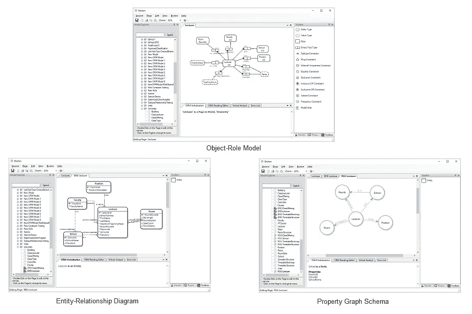
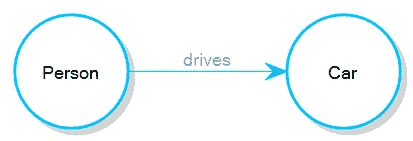
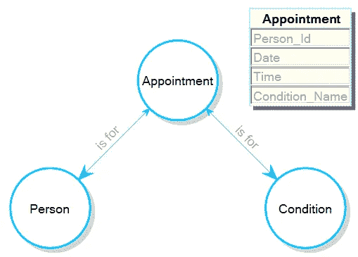
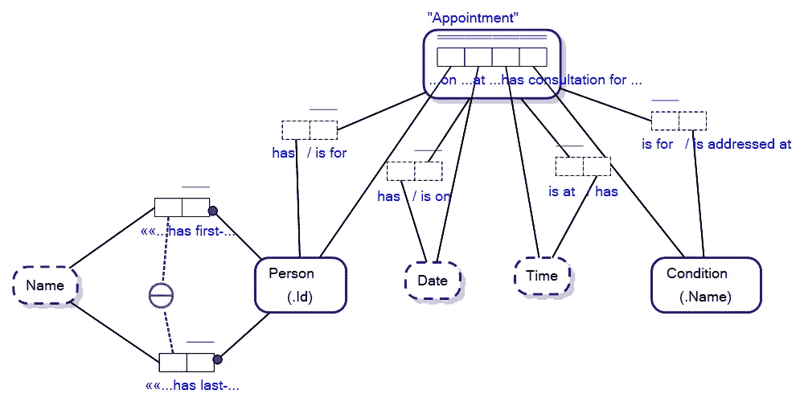
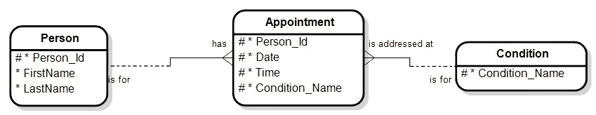
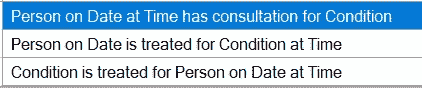
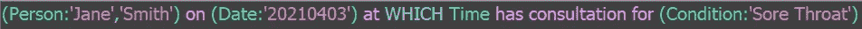
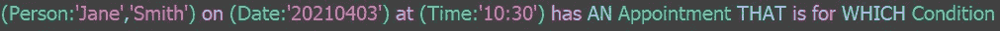

# 关系数据库中的虚拟图

> 原文：<https://towardsdatascience.com/virtual-graphs-in-a-relational-database-5813622a688?source=collection_archive---------30----------------------->

## 超图/关系数据库绝对有优势

同一型号的三视图。实体关系、图和对象-角色建模。图片作者。

我正在研究[专用图形数据库](/what-is-a-graph-database-249cd7fdf24d)如何处理关系/边上的唯一性约束，我的发现让我很惊讶…

假设我们有一个专用的图形数据库，其中有*人*节点和*车*节点，并且有一个模式，其中 ***人驾驶车*** 是一种关系类型。
在模式的图形数据库中，如何将人员节点限制为“驾驶”一辆汽车节点？

图表模式。图片作者。

我的研究表明，在一些专用的图形数据库中，当数据库执行约束时，你纯粹是运气不好。在创建新的关系之前，您必须以编程方式检查您选择的 Person 节点和 Car 节点之间是否存在关系……数据库不会自动检查关系类型的基数。

然后我发现了一个例子，有人试图用一个专用的图形数据库做一些事情，我认为这是非常了不起的。对我来说，这是一个试图把一个方钉装进一个圆孔的例子，超图/关系数据库肯定比一个专用的图形数据库有优势。让我们看看…

想象以下图表模式:

属性图架构。图片作者。

该模式用于有健康问题的人在医生诊所的预约。

发布问题的论坛上的人试图确定他们是否应该有用于查询目的的日期和时间的节点，并最终被推荐了一个复杂的模式映射关系(Person)-[ON _ Date]->(Date)->[AT _ Time]->(Time)->[TREATMENT _ FOR]->(Condition)，并想知道他们将如何管理这样一个模式中各个节点之间的关系基数。尽管专用图形数据库中的(时间)->[治疗条件]->(条件)关系的益处值得怀疑。

再一次，当涉及到管理关系的唯一性时，共识是…这取决于数据库 ***用户*** 而不是专用的图形数据库。基本上这是一个令人费解的组合混乱，有更好的方法来处理管理关系基数的场景。

## 当您使用超图/关系数据库和对象-角色建模时，所有可能的图在一个模式下都是可能的

让我们用[对象角色建模](/why-learn-object-role-modelling-4eebd93dcda2)来重新审视这个问题:

对象-角色模型。图片作者。

人、日期、时间和条件之间的关系在约会中是唯一的，约会关系是多对多对多的关系。例如，一个人可能在许多日期和时间有关于条件的约会，但是每个约会都是唯一的。我们已经通过在多个/组合关系上具有唯一性约束解决了关系基数的管理。为了使生活变得更容易…让我们看一下与关系数据库的实体关系图相同的模式:

实体关系图。图片作者。

与我们的对象-角色模型类似，关系模型通过设计来管理关系的基数，其中*约会*的主键(标记为#)覆盖了 Person_Id、Date、Time 和 Condition_Name 之间关系的唯一性。

在我们的对象-角色模型中，*对象类型*，人、日期、时间和条件在*约会*事实类型下连接在一起，如 ***人在日期时间对条件*** 进行了咨询。

这种关系的表述被称为对象-角色建模(ORM)中的*事实类型读取*，ORM 的美妙之处在于可以创建与事实类型关联的*对象类型*集合的任何组合表现:

同一事实类型的各种事实类型读数。图片作者。

基本上，这导致，如果你有一个图形查询语言在你的超图/关系数据库上使用对象-角色建模主干，那么你可以把任何或所有的人、日期、时间和条件当作图形数据库中的节点。例如，您可以将图形查询表述为*:

FactEngine 中的图形查询。图片作者。

* FactEngine 查询语言。有许多图形查询语言。

或者

FactEngine 中的图形查询。图片作者。

也就是说， ***图查询*** 中的节点决定可能与 ***属性图模式*** 不同，当查询您的数据库时，这些有效节点有时由超图(其中对象角色建模[被视为超图概念建模语言](/knowledge-hypergraphs-object-role-modeling-ef0f58f38066))处理更好，如果您有超图模式…默认情况下您有其相应的图模式。为什么？因为超图比属性图更具表达性，并且封装了所有信息来派生您的图模式。

同样，专用的图形数据库可能并不总是能够以您想要的方式被查询，在使用正确的工具时，数据库的超图处理为您提供了各种各样的查询选项。

考虑以下查询:

FactEngine 中的图形查询。图片作者。

该查询使用部分现存事实类型 Reading(***Person Date at Time……***)然后使用***Person has Appointment***and***Appointment for Condition***[Link 事实类型](/link-fact-types-in-object-role-modeling-3c68c15eec92)进行非常自然的读取图形查询。Person(_Id)，Date 和 Time 在我们的关系视图中是属性，但在查询时成为一个超图中的节点，解决了既有图查询又同时有关系基数约束的问题。

也就是说，关系数据库具有优势，因为它们用唯一索引管理关系基数，而用户不必编写额外的代码来检查关系基数约束是否被破坏。使用正确的工具，您可以在关系数据库上编写图形查询。

在本文中，我们介绍了:

1.  您不一定需要专用图形数据库中的节点来使用这些概念节点对数据库进行图形查询。
2.  对象角色建模中的对象类型可以被认为是超图数据库中的节点，而不管它们是相应属性图模式中的节点还是属性；和
3.  关系数据库中的单个实体可能实际上是节点及其在相应超图模式中的关系的集合，用于查询目的，管理复杂的关系基数约束，以及关系数据库最擅长的……索引关系。

Hypergraph 数据库查询引擎正在开始改变数据库的面貌，而 FactEngine 只是一种新型的查询引擎。事实上，FactEngine 体系结构及其查询语言是数据库不可知的，因此没有提升任何特定的数据库，但第一个版本是基于关系数据库的，并将图形查询转换为结构化查询语言(SQL)。目的是通过比较编写 SQL 或使用标准图形查询语言，使查询数据库[变得非常容易。你可以在这里阅读更多关于 FactEngine 架构的信息。](/natural-language-queries-for-real-this-time-5383bf42ad2a)

感谢您的阅读。我希望这有助于决定为您的下一个项目选择哪种类型的数据库，以及哪种查询语言会使工作更容易。如果时间允许，我会写更多关于图形/超图数据库、关系数据库和对象角色建模的文章。

— — — — —结束— — — —