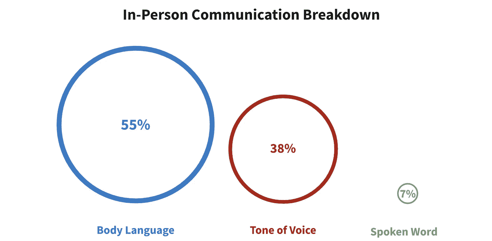
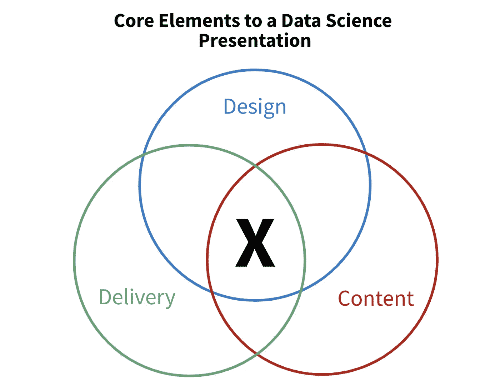

# 数据科学家的虚拟演示技巧

> 原文：<https://towardsdatascience.com/virtual-presentation-tips-for-data-scientists-d6ef4659024?source=collection_archive---------21----------------------->

## 如何有效地沟通你的工作

沟通是数据科学工作中最具挑战性的方面之一。以下是我的笔记…

# 互联网的想法

有一个古老的基于研究的格言，93%的交流是非语言的。你的交流 55%是肢体语言，38%是语气，7%是口语。

图 1:沟通障碍。图片作者。

视频通话中的肢体语言交流会发生什么？它通常会消失。

你应该试着弥补那 55%的损失，更加注重语气和话语。

一些有用的弥补肢体语言差距的技巧包括**夸大声音的变化和改变音量**。增加你的面部表情和手势也可以提高你的演讲的接受度。这可能看起来不自然，但是如果你记录下你的演讲并重新观看，你会惊讶于这些变化是多么的正常和有魅力。

另一个有趣的想法是内容、设计和交付框架— [src](https://data36.com/presentation-tips-for-data-professionals/) 。

图 2:内容、设计、交付框架。图片作者。

后面两个，设计和交付，分别指的是极简的幻灯片设计和复杂主题的简单措辞。然而，内容部分真的很有趣。

简而言之，这篇文章假设你的听众只会从你的演讲中拿走一句话，所以要让它有价值。要做到这一点，你需要了解他们的**技术水平、期望，以及项目的先验知识**。如果你为你的听众量身定做你的演讲，你可以让那一句话有价值。

一个非常简单的技巧是整合组织中其他团队的视觉效果。例如，展示一段支持你观点的 UX 研究视频。通过利用以前的工作，您可以节省时间，创建引人注目的演示文稿，并在公司内部建立关系。

# 我的想法

尽管这些想法很棒，但互联网上的绝大多数信息都是常识。在这一部分，我们将重点关注不太明显的策略。让我们开始吧…

## 1——了解你的听众的想法

对于超过 10 人的会议，假设其中一人不想参加是安全的。他们和你一样，都是生活忙碌的人。

**所以，试着去理解是什么让你的观众兴奋。兴奋是完成事情的动力。它让你的工作可见，从而有影响力。**

虽然组织之间的角色差异很大，但大多数数据科学家都有一定的自由来选择和开发自己的项目。如果你的工作成功涉及利益相关者的认同，你必须让他们对项目感到兴奋。句号。

不幸的是，这样做没有明确的捷径，但这里有一些对我有用的方法:

*   尽早、经常地将想法社会化。通过在整个项目过程中获得队友和利益相关者的反馈，你建立了兴奋感并产生了更有价值的最终项目。相信我，努力是值得的。
*   **了解你老板的老板关心什么。**知道什么会让上层管理兴奋，就知道什么会让下层管理兴奋。安排一次快速的一对一谈话，问一些好的问题。

通过将你的工作与令人兴奋的想法联系起来，你可以极大地增加你的演示的价值。

## 2 —提前结束会议

[不必要的信息有害](https://medium.com/@drsimonj/thinking-decisions-and-data-chapter-4-the-associative-machine-14ebedb35419)。你会认为展示你的步骤和假设会对你的听众有益。大多数情况下不是。

通过包含他们理解不必要的信息，你…

*   **增加** [**认知紧张**](https://tactics.convertize.com/definitions/cognitive-ease) **。**这会缩短注意力持续时间，降低信任感，并经常导致你在演示过程中一心多用。
*   下意识地偏向你的听众。每个人都有一种确认偏见，这种偏见会影响他们确认自己的信念。如果你给听众额外的信息，他们更有可能抓住有吸引力的想法而错过关键的结论。
*   浪费时间和金钱。时间就是金钱。试试这个练习——把电话中每个人的时薪加起来。呈现不必要的信息代价很高。

一个简单而有效的方法是尝试提前结束会议。我的一个队友已经受到利益相关者和数据科学家的喜爱，因为他总是提前结束会议。这个规则显然有例外，但这些例外比你想象的要少得多。

如果你的目标是早点结束会议，你会被迫变得有条理、简洁和相关。

## 3 —大约 80/20 的小费

以上两个部分可能是劳动密集型的，所以这里有一些简单的提示，有希望让你在 20%的时间里得到 80%的结果。

*   向你的沟通风格靠拢。如果你是一个正式的演讲者，就要正式地讲话。如果你讲笑话，就讲笑话。通过利用你自然说话的方式，你会变得更自信、更有亲和力，从而更有效率。
*   **以结论开始和结束。**以结论开始演讲，可以减轻认知负荷，让听众更深入地思考你的想法。通过在结尾重申结论，你促进了[的心理分块](https://www.nytimes.com/2017/08/04/education/edlife/learning-how-to-learn-barbara-oakley.html)，这促进了回忆并帮助他们利用新信息。
*   **少说“嗯”和“喜欢”。悲伤地重复说这些话会让你听起来更笨。抱歉。这是一个制作很差但免费的[“um/like”探测器](https://github.com/mberk06/um_detector)的一些基本代码。**
*   **对于技术概念，就像黑匣子一样对待。大多数听众并不关心这个方法是如何工作的。他们关心它的作用。所以你要做的就是解释输入和输出。**

*感谢阅读！上面链接的所有资源对我和我的职业生涯都非常有影响。请分享你自己的。*