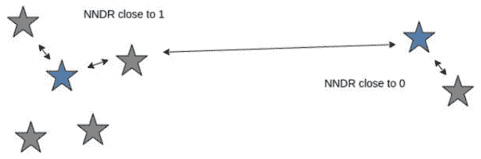
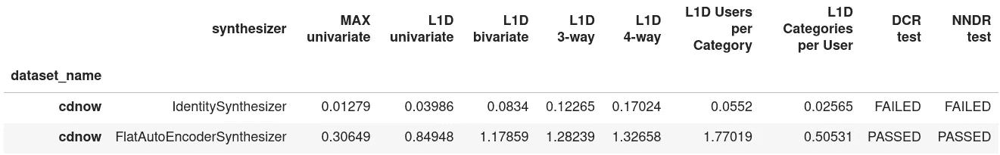

# VirtualDataLab:一个用于测量合成序列数据集质量的 Python 库

> 原文：<https://towardsdatascience.com/virtualdatalab-a-python-library-for-measuring-the-quality-of-your-synthetic-sequential-dataset-b9d79f0e03c3?source=collection_archive---------34----------------------->

## 包括内置的开源数据集、合成数据生成器接口和准确性/隐私指标

[美国传统巧克力](https://unsplash.com/@americanheritagechocolate?utm_source=medium&utm_medium=referral)在 [Unsplash](https://unsplash.com?utm_source=medium&utm_medium=referral) 上拍摄的照片

Gartner 估计，到 2022 年，40%的 AI/ML 模型将在合成数据上进行训练。[1]

事实上，合成数据越来越受欢迎——我在一家合成数据公司工作，每天都看到这种情况。如果你觉得是时候学习一些合成数据技能了，请继续读下去。我将告诉您一些基本知识，并向您介绍一个很酷的开源工具，您会发现它非常方便。开始吧！

所以，最基本的。用合成数据生成器创建合成数据。合成数据生成器或合成器获取其所谓的输入或目标数据，并返回包含与输入或目标数据相同的模式和统计关系的输出或合成数据。

合成数据生成器的范围从琐碎到复杂。一个简单的例子是返回目标数据的混合样本。这非常准确，但侵犯了隐私，因为它是目标数据的直接拷贝。深度神经网络就是一个复杂的例子。在这种情况下，我们牺牲一些准确性来保护隐私。

随着研究机构不断开发新算法，制作合成数据比以往任何时候都更容易，但我们如何决定哪个生成器是最好的*？*

***选择合成数据生成器的最佳实践***

*衡量质量的典型方法包括查看汇总统计数据或在下游机器学习任务中使用合成数据。不幸的是，这些方法仅测量合成数据反映目标数据的程度。但是，在合成数据复制大部分原始数据的情况下，精确度太高也会带来严重的后果。合成数据的一个关键好处是保护原始数据中所有个人的隐私。因此，我们希望将生成器保护隐私的能力纳入我们的质量测量中。*

*在创建合成数据方面不缺乏工具或操作指南，但在如何准确衡量合成数据的效用/隐私方面却很少。一个这样的资源是[SD gym](https://github.com/sdv-dev/SDGym)——从麻省理工学院的数据到人工智能实验室。然而，我们发现我们想要比图书馆提供的更多的功能，所以我们创建了虚拟数据实验室。*

***介绍虚拟数据实验室**
VDL 是一个 python 框架，用于在准确性和隐私性方面对顺序合成数据生成器进行基准测试。*

*我们希望它:*

*   *与熊猫一起工作(Python 的数据帧库)*
*   *使用任何可能的目标数据源进行生成*
*   *提供一个通用界面来添加新的合成器*
*   *创建填充了随机生成的数值类型和分类类型的虚拟数据*
*   *使用顺序数据*
*   *拥有直观的隐私指标*
*   *提供一组真实世界的数据集进行基准测试*

*我在[的团队主要是 AI](https://mostly.ai/) 经常使用虚拟数据实验室来快速评估对我们合成数据生成器的修改。它使我们能够进行标准化的测试分析，从而节省了我们制作一次性报告的大量时间。按照这些思路，虚拟数据实验室的一个用例可以是为下游机器学习任务测试各种合成数据生成器。不用部署几个昂贵的用几个不同的合成数据集来训练机器学习模型，VDL 可以用作选择最接近原始数据集而不是太接近的数据集的代理。*

***里面有什么？***

*在当前版本中，包括三种不同的合成器。三个合成器中有两个是普通的，旨在作为指标的基线。一个合成器是在 PyTorch 中实现的简单可变自动编码器。你可以按照这些[指令](https://github.com/mostly-ai/virtualdatalab#writing-your-own-synthesizer-class)编写自己的合成器。*

*接下来，我们继续讨论准确性和隐私指标。要更深入了解，请查看 [readme.md](https://github.com/mostly-ai/virtualdatalab#metric-definitions)*

*精确度是通过计算各列之间经验分布的差异来衡量的。我们用最大误差或 L1 距离/总和(L1D)来总结误差。最大误差告诉我们在数据集上看到的最大误差是什么，而 L1D 提供了我们看到的误差的总体分数。观察经验分布让我们对合成数据从目标数据中捕捉统计趋势的能力充满信心。NIST 在他们的[综合数据挑战赛](https://www.drivendata.org/competitions/74/competition-differential-privacy-maps-2/page/282/#calculation)中也使用了分布测量。*

*隐私是通过将目标数据分为参考集和维持集来衡量的。*

*从与维持集大小相同的合成数据中获取样本而不进行替换。使用两个基于最近邻的计算，将两个维持集与参考集进行比较。*

*到最近记录的距离(DCR)测量维持集中的点和参考集中的点之间的距离。坏的合成数据是当原始目标数据被噪声干扰时。DCR 就是要捕捉这样的场景。*

**

*可视化的 NNDR:作者的图像*

*最近邻距离比(NNDR)测量维持点的第一个邻居和第二个邻居之间的距离。点的 NNDR 范围可以从 0 到 1。接近 1 的值意味着该点可能位于聚类中。接近 0 的值意味着该点可能接近异常值。我们计算目标和维持集之间的每个点对的 NNDR，以获得 NNDR 分布。理想情况下，我们希望合成的 NNDR 分布与目标 NNDR 分布相匹配。通过测试其中的差异，我们可以确保合成数据不会比我们基于维持的预期更接近训练点。*

*这两个隐私指标旨在为数据集提供隐私保证。我们可以将这两个指标与差分隐私进行比较，差分隐私是一种流行的关于隐私损失量的数学限制。在算法的设计中必须建立不同的私有机制。然而，并不是所有的合成数据生成器都需要有差分隐私来生成高质量的私有数据。通过使用这两个度量，我们获得了在公平竞争环境下比较差分专用合成数据生成器与非差分专用合成数据生成器的能力。*

*您也不需要编写任何代码来生成合成数据。在 MOSTLY AI，我们发布了我们产品的[社区版。合成数据就像将原始数据拖放到浏览器中一样简单。](https://generate.mostly.ai/signup/register?state=ef9257b7-511a-4b7a-9bcc-095f2c1b3ade)*

***代码演示***

*该代码也可以在一个[谷歌 Colab 笔记本](https://colab.research.google.com/github/mostly-ai/virtualdatalab/blob/master/docs/notebooks/flatautoencoder_cdnow.ipynb)中找到。*

*使用 FlatAutoEncoderSynthesizer 生成合成数据*

*现在你知道了！生成合成数据并将其与原始合成数据进行比较，所有这一切只需不到 5 行代码。*

***分析结果***

*解释结果也同样简单。在这里，我们在 VDL 提供的 **cdnow** 数据集上查看 IdentitySynthesizer 和 FlatAutoEncoderSynthesizer 生成的比较结果。该表是使用 virtualdatalab . benchmark . benchmark 函数创建的。在这个 [Google Colab 笔记本](https://colab.research.google.com/github/mostly-ai/virtualdatalab/blob/master/docs/notebooks/benchmark_example.ipynb)中可以找到这个函数在更多合成器+数据集上的例子。*

**

*汇总表:按作者分类的图像*

*所有标有 MAX 或 L1D 的列都是误差的量度。高精度对应于这些列中的低值。我们注意到 IdentitySynthesizer 的值接近于 0。这并不奇怪，因为 IdentitySynthesizer 只是返回目标数据的分割。然而，这也正是它未能通过两项隐私测试的原因。相比之下，FlatAutoEncoderSynthesizer 的误差稍大，但通过了两项测试。这是有意义的，因为 FlatAutoEncoderSynthesizer 正在生成全新的数据，但保持与目标数据的统计关系。*

*您是否使用特定的合成数据生成器技术的标准将基于哪些指标对您最重要。我们建议，如果您正在为隐私进行优化，那么要警惕任何未通过隐私测试的合成数据生成器方法。*

***自己试试***

*要开始使用虚拟数据实验室，请使用 [repo](https://github.com/mostly-ai/virtualdatalab) 或尝试我们的 Google Colab 笔记本电脑！如果你有兴趣参与回购，请联系我！*

***致谢***

*这项研究得到了奥地利联邦气候行动、环境、能源、移动性、创新和技术部的“未来信息和通信技术”资助方案的支持。*

*[1]高德纳。2018.Maverick*研究:使用模拟赋予机器想象力。*