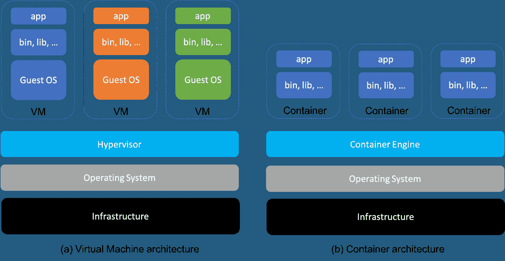
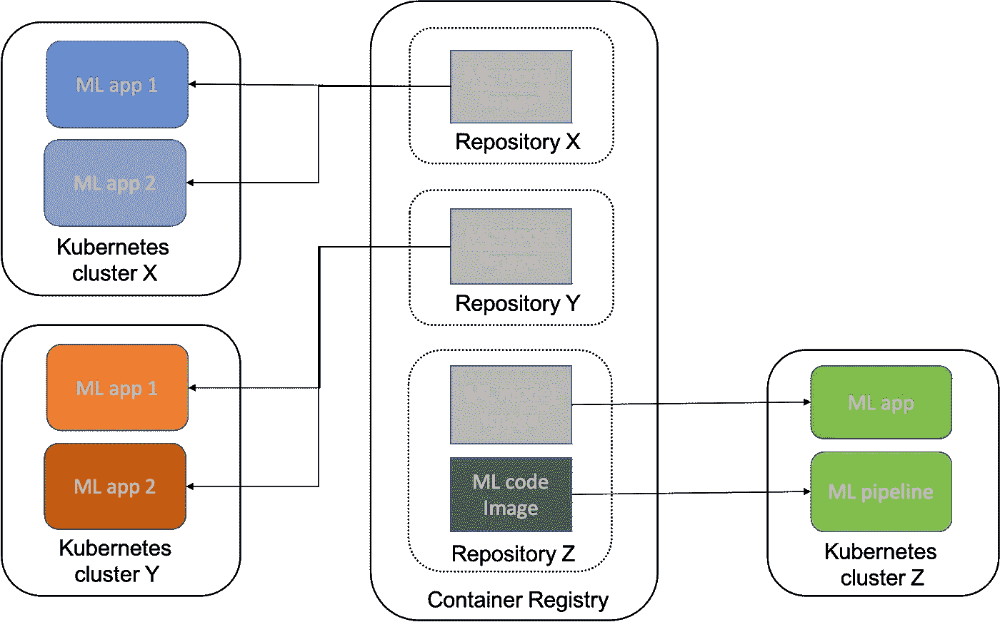

# 机器学习的虚拟化

> 原文：<https://towardsdatascience.com/virtualization-for-machine-learning-da11b7a59070?source=collection_archive---------16----------------------->

## [理解大数据](https://towardsdatascience.com/tagged/making-sense-of-big-data)、[行业笔记](https://towardsdatascience.com/tagged/notes-from-industry)

了解如何托管机器学习(ML)应用程序，例如培训/测试管道、批处理/流预测作业、以业务为中心的分析应用程序等。，是机器学习工程师必备的技能维度。操作化 ML 模型有许多不同的部署可能性。就在几年前，可再现的 ML 环境还是一个需要解决的挑战性问题。在这种情况下，声明式公共云平台上的虚拟化尤为重要。此外，借助虚拟化，可以更轻松地实现快速资源扩展、在云提供商之间过渡部署环境，甚至将应用从内部迁移到云中。本文探讨了用于托管 ML 应用程序的虚拟化技术。注意，我们没有深入讨论，比如实现细节，这将在后续文章中讨论。

[虚拟机](https://en.wikipedia.org/wiki/Virtual_machine) (VMs)和[容器](https://en.wikipedia.org/wiki/OS-level_virtualization)是在与底层硬件隔离的虚拟化环境中部署应用程序的最常见方式。这两种选择的主要区别在于隔离的程度。根据应用程序的要求，可能需要在使用虚拟机、容器或两者结合之间做出选择。我们将在下一节对这些方法进行概述。如果您熟悉这些概念，您可以跳到概述为 ML 应用程序使用虚拟化技术的部分。

# 常见的虚拟化技术

图 1:常见的虚拟化架构:(a)基于虚拟机和(b)基于容器。作者图。

## 虚拟机

虚拟机是托管在数据中心的物理服务器中的虚拟化服务。它提供了灵活性，允许团队托管应用程序，而不必担心如何获得或管理物理服务器。图 1(a)展示了虚拟机架构的概况。如图所示，在虚拟机内部运行的所有东西都在客户操作系统(OS)上，独立于主机操作系统，即[虚拟机管理程序](https://en.wikipedia.org/wiki/Hypervisor)。为了启动虚拟机，管理程序启动一个进程来管理特定虚拟机的虚拟化进程，并且主机系统将其一些硬件资源分配给虚拟机。它在启动时引导一个专用的内核环境和一大组操作系统进程。这使得 VM 的大小比仅包含应用程序的典型容器大得多。

运行专用内核和操作系统有三个主要优势:

1.  **安全性:**没有办法从主机上知道虚拟机内部正在运行什么。
2.  **可移植性:**可以在每一个主要的操作系统上运行管理程序，也可以在一个虚拟机中运行任何类型的操作系统。
3.  **回滚**:在一个给定的实例上创建一个虚拟机快照并在需要时回滚到那个实例是很容易的。这有助于处理数据损坏、安全漏洞和其他问题。

然而，虚拟机技术在托管现代应用程序方面有一个主要限制。由于虚拟机映像可能变得非常庞大，即它们可能具有数十千兆字节的大小，因此在没有很长停机时间的情况下，引导、更新和迁移这样大的映像是很难完成的。

## 容器

容器是关注完全解耦的应用的虚拟实体，例如，被称为微服务。如图 1(b)所示，容器仅包含必要的库和足以在给定操作系统(例如 Linux)上运行单元应用程序的其他系统依赖项。容器与主机系统中的其他容器共享相同的内核。Docker 是一个众所周知的集装箱化平台，能够广泛采用该技术。

容器技术具有以下优势:

1.  **开始时间:**与虚拟机相比，容器通常只需几秒钟就能启动，而虚拟机完成同样的任务需要几分钟
2.  **效率:**容器通常需要较少的计算资源，即 CPU 时间、RAM 和存储空间。因此，在同一基础设施中可以支持更多的应用程序。
3.  **许可:**用于容器的常用技术和库，如 [Docker](https://docs.docker.com/get-started/overview/) 、 [Kubernetes](https://kubernetes.io/docs/concepts/overview/what-is-kubernetes/) 等。，都是开源的，可以免费使用。因此，采用这些技术没有许可成本。
4.  **重用:****容器是基于映像的，它包含容器运行给定应用程序所需的二进制文件和库。例如，使用 [Dockerfiles](https://docs.docker.com/engine/reference/builder/) 很容易构建 docker 映像。此外，可以使用[容器注册中心](https://docs.docker.com/registry/)共享和重用这些图像，容器注册中心基本上是托管容器图像的存储库。**

**然而，容器缺乏应用程序在虚拟环境中获得的更紧密的安全性。此外，容器与 OS 版本紧密耦合，这使得它们的可移植性较差。**

## **Kubernetes 服务**

**Kubernetes (K8S)是一个通过提供以下功能来管理容器化应用程序的平台:**

1.  ****自动化容器打包**一组节点(如虚拟机)上的 K8S 可以根据给定的 CPU 和内存要求自动运行容器化任务，以充分利用计算资源。**
2.  ****故障鲁棒性:** K8S 自动重启、替换和终止无响应的容器化任务，停机时间非常短。**
3.  ****灵活的存储协调:** K8S 支持安装过多的存储系统，例如本地存储、网络文件系统、来自云提供商的 blob 存储等。，到集装箱化的任务。**
4.  ****受控的部署和回滚:**通过定义容器化任务的期望状态，K8S 支持以一种优雅的方式部署，这种方式支持众所周知的部署模式，例如 [Canary release](https://martinfowler.com/bliki/CanaryRelease.html) 。**
5.  ****服务发现和负载平衡:** K8S 可以将使用服务名/地址的容器公开给外部服务和集群中部署的其他容器。此外，它将平衡副本集中容器之间的负载。**
6.  ****秘密和配置管理:** K8S 以这样一种方式存储和管理密码、令牌和 SSH 密钥，使得这些敏感信息可以在不重建映像的情况下被动态更改。**

# **使用 Kubernetes 服务虚拟部署 ML 应用程序**

****

**图 2:使用 Kubernetes 服务和容器部署 ML 应用程序**

## **ML 应用程序**

**为了简化讨论，我们将 ML 应用程序分为两类:ML *管道*和*应用程序，如图 2* 中圆形的彩色方框所示。ML 管道(在图 2 中由浅绿色的方框描述)是用于训练和测试 ML 模型的工作流。ML 应用程序(在图 2 中用绿色、蓝色和橙色的实心方框表示)是使用 ML 模型的分析应用程序。图 2 显示了这样的应用。**

## **为 ML 应用程序使用容器**

**ML 管道中的任务可以在容器中编排。该容器将基于包含相关库和二进制文件的映像，如 [Python](https://docs.python.org/3/) 、 [PySpark](https://spark.apache.org/docs/latest/api/python/getting_started/index.html) 、 [scikit-learn](https://scikit-learn.org/stable/user_guide.html) 、 [pandas](https://pandas.pydata.org/docs/user_guide/index.html#user-guide) 等。此外，负责数据争论、模型训练、模型评估等的应用程序代码。也可以安装在映像中，或者安装在运行时容器可以访问的文件系统中。我们姑且称这个图像为 *ML 代码图像。*如图 2 所示，深灰色方框代表这样的图像，由 ML 管道使用。**

**像 ML 管道的容器一样，ML 应用程序的映像包括安装或挂载在本地文件系统中的库和二进制文件以及应用程序代码。此外，它或者包括在文件系统中本地部署的 ML 模型，或者可通过[模型服务系统](https://mlflow.org/docs/latest/index.html)访问，该系统的访问信息被提供。我们姑且称这个图像为 *ML 模型图像。*如图 2 所示，浅灰色方框代表 ML 应用程序使用的图像。**

**图像中使用的库和二进制文件可能(大部分)是通用的。因此，它们都可以基于共同定制的[基础图像](https://docs.docker.com/develop/develop-images/baseimages/)，或者模型图像基于代码图像。**

**对于采用越来越多 ML 应用程序的现代组织来说，使用公共云提供商的 ML 平台是很常见的，如 [AWS Sagemaker](https://docs.aws.amazon.com/sagemaker/latest/dg/whatis.html) 、 [Azure ML Studio](https://docs.microsoft.com/en-us/azure/machine-learning/overview-what-is-machine-learning-studio) 和 [Google Vertex AI](https://cloud.google.com/vertex-ai) 。所有这些系统都严重依赖于容器。**

****部署 ML 应用程序****

**想象一下 Kubernetes 服务，其中应用程序部署在虚拟机集群中。公共云公司提供这样的服务( [Azure Kubernetes 服务](https://docs.microsoft.com/en-us/azure/aks/)、 [Amazon Elastic Kubernetes 服务](https://docs.aws.amazon.com/eks/latest/userguide/what-is-eks.html)、 [Google Kubernetes 引擎](https://cloud.google.com/kubernetes-engine/docs/quickstart))，不需要或只需要很少的管理开销。这样的服务将使用某种容器注册中心( [Azure 容器注册中心](https://docs.microsoft.com/en-us/azure/container-registry/)、 [Amazon 弹性容器注册中心](https://docs.aws.amazon.com/AmazonECR/latest/userguide/what-is-ecr.html)、 [Google 容器注册中心](https://cloud.google.com/container-registry/docs/quickstart))。这些映像的创建和归档可以由持续集成和部署管道( [Azure 管道](https://docs.microsoft.com/en-us/azure/devops/pipelines/?view=azure-devops)、 [AWS 代码管道](https://docs.aws.amazon.com/codepipeline/latest/userguide/welcome.html)、[谷歌云构建](https://cloud.google.com/build/docs/quickstart-build))来支持。查看这个[指南](https://docs.microsoft.com/en-us/azure/architecture/reference-architectures/ai/mlops-python)，了解如何使用 Azure stack 实现这样一个管道的推荐方法。**

**图 2 提供了基于 Kubernetes 的 ML 应用程序部署的高级概述。应用程序包括三个领域:一个代表开发模型的团队，另外两个代表使用模型的团队。开发团队的应用程序由绿色方框表示，可以理解的是，涵盖了管道和应用程序类别。另一个团队，用蓝色和橙色框表示，只托管一系列使用该模型的应用程序。为了安全访问，不同团队的容器映像可能包含在不同的存储库中，这些存储库是用于控制对映像的访问的逻辑抽象。此外，一个图像可以被多个应用程序使用，这通过容器注册变得很容易。**

**这一思路引发了许多深层问题，包括但不限于:**

*   **图像创建的实现**
*   **对图像的访问管理**
*   **映像的持续集成和部署管道的设计和实现**
*   **向应用程序展示和回滚图像**

# **笔记**

**如果你对这些类型的挑战感兴趣，可以考虑从事操作机器学习模型的工程职业，即机器学习工程。如果您不熟悉这些技术，可以考虑在云、虚拟机和容器技术领域进行学习。如果你已经在应对这些挑战，请分享。最后，如果你不同意任何观点，请批评性地评论。**