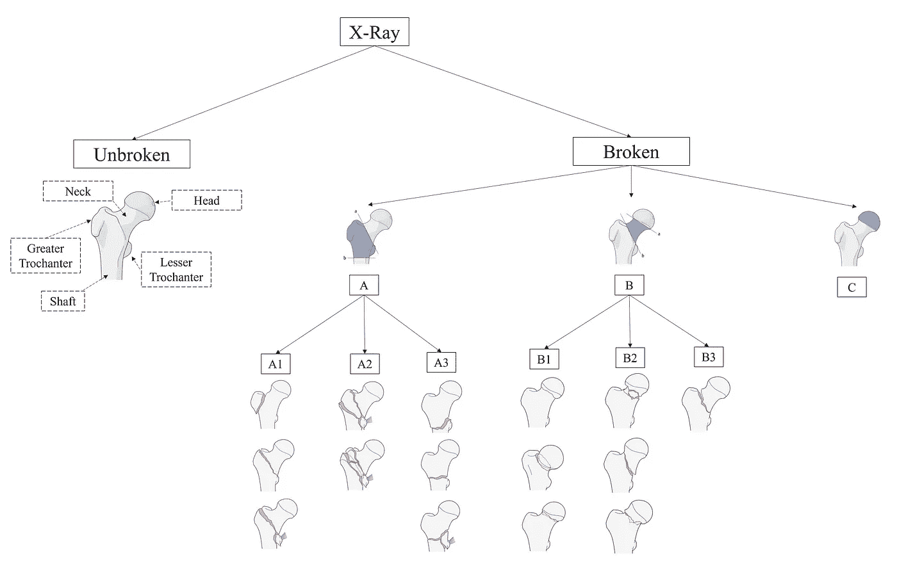
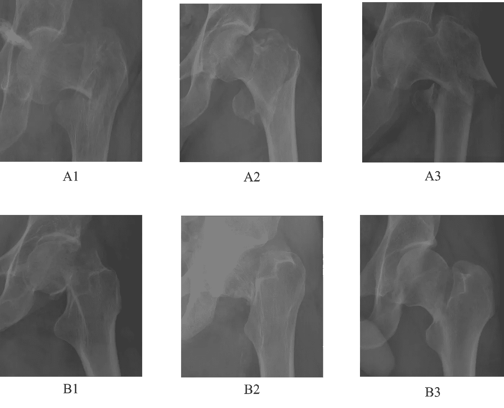
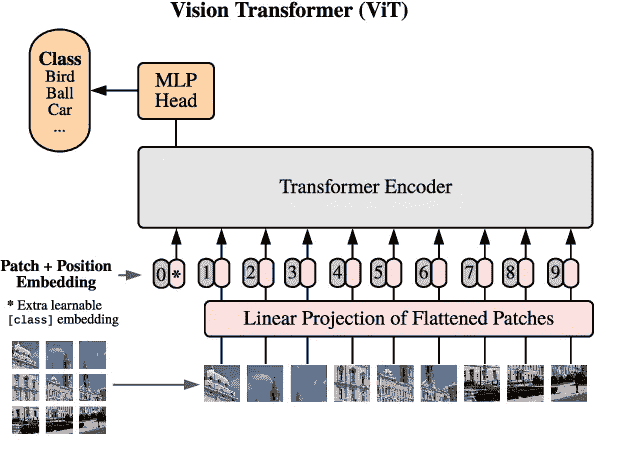
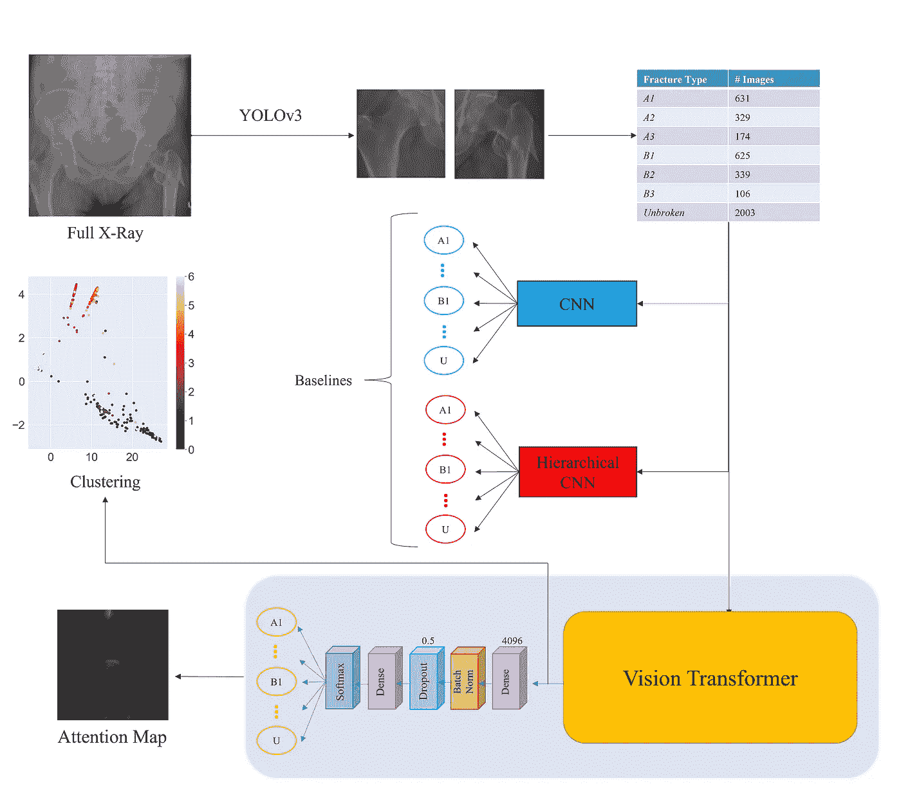
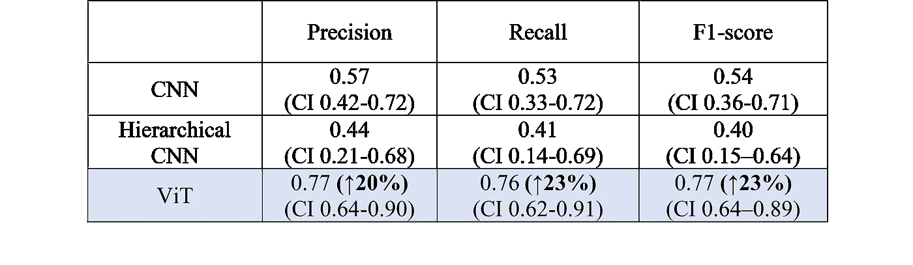
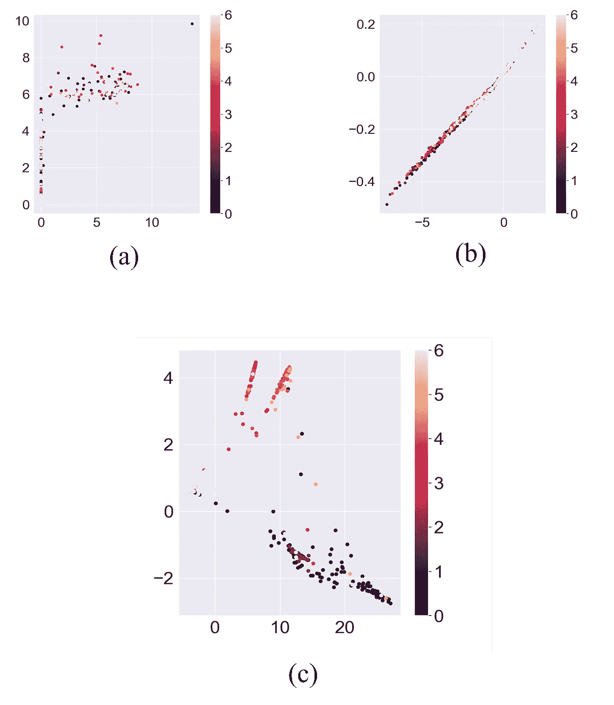
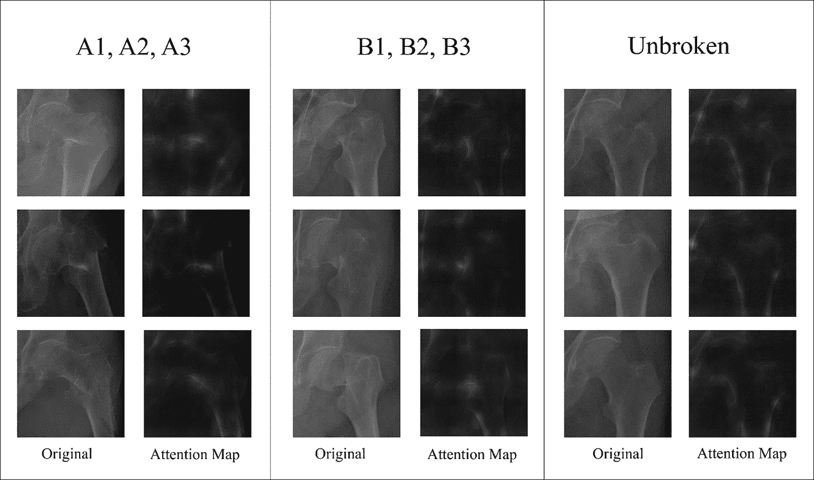
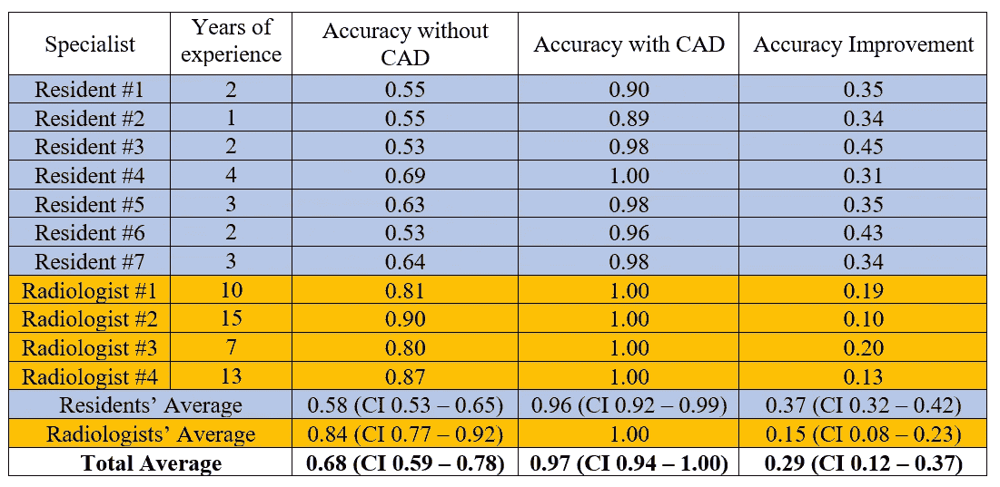
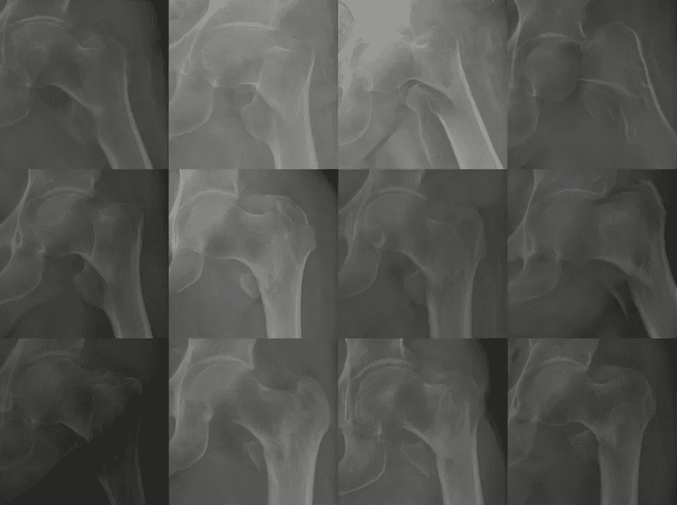

# 用于股骨骨折分类的视觉转换器

> 原文：<https://towardsdatascience.com/vision-transformers-for-femur-fracture-classification-480d62f87252?source=collection_archive---------15----------------------->

## [思想和理论](https://towardsdatascience.com/tagged/thoughts-and-theory)

## 我两年主要博士研究的简要简历

# 目录

1.  介绍
2.  背景
3.  我们系统的全部管道
4.  结果
5.  结论
6.  参考

[斯蒂夫·约翰森](https://unsplash.com/@steve_j?utm_source=medium&utm_medium=referral)在 [Unsplash](https://unsplash.com?utm_source=medium&utm_medium=referral) 上拍照

# 1.介绍

自从我开始攻读博士学位以来，我一直与都灵(意大利)CTO(骨科创伤中心)的骨科团队合作，开发一种能够帮助医生进行骨折诊断的算法。我们选择**股骨**作为起点，因为它是最常见的骨折，其正确分类强烈影响患者的治疗和预后。我们从卷积神经网络(CNN)开始了我们的旅程，最近，在文献中第一次应用了**视觉转换器** (ViT)来克服该主题中的艺术状态，并为专家提供基于深度学习的支持工具。

在这篇短文中，我将总结(尽可能以最简单的方式)并演示我们系统的有效性，这在 [arXiv 原始论文](https://arxiv.org/abs/2108.03414v2)中有更详细的描述。

# 2.背景

## 2.1 问题

肌肉骨骼疾病，尤其是髋部骨折，是全球范围内导致严重、长期残疾的**最常见**原因之一。由于人口的逐渐老龄化，脆性骨折的患病率和发病率正在增加，并且在未来将继续增加。

大致了解一下，2010 年，全球每年髋部骨折的估计发病率为**270 万**患者。这是一个非常庞大的诊断数量。

当然，医生在这方面负有很大的责任，他们每天要评估数十张 x 光照片。由于多种原因，他们很难评估 X 射线图像:

*   x 光可以隐藏骨骼的某些特性
*   正确分类不同类型的骨折需要长期的经验
*   医生经常不得不在紧急情况下采取行动，可能会受到时间和疲劳的限制

在这种情况下，在医生的工作流程中实施 CAD(计算机辅助诊断)系统可能会对患者的结果产生直接影响。

> **这个理念是我们工作的核心！** **开发快速、直观、准确的股骨骨折分类系统，完全依靠 2D X 线。**

为了建立一个监督分类器，第一个必要的步骤是理解你想要识别的特定类。在标准分类问题中，最终目标通常是训练一个至少和普通人一样好的网络(例如，几乎任何人都可以识别狗和猫)。不幸的是，这通常不适用于医学领域，尤其是骨折，这是非常棘手的评估，并且需要在该领域具有丰富经验的“非一般”人。那么，专家是如何对股骨骨折进行分类的呢？

## 2.2 AO 分类

其中一个答案是股骨近端的 AO/OTA 分类，这是一个**等级**，由骨折线的位置和结构决定。

它区分了三种主要的裂缝类型，命名为 *A* 、 *B* 和 *C* 。然后，根据骨折的复杂程度，考虑骨折线的数量以及碎片的位移，将每组分成不同水平的亚组。

作者图片

从上图来看，这似乎是一个非常简单的问题。但是我们来看一些真实的样品！

作者图片

两年后，我仍然很难用眼睛区分不同的小组。幸运的是，我们实现的网络比我聪明多了。

## 2.3 分级 CNN

2019 年，当我和我的研究小组开始这项工作时，我对这个话题完全陌生。所以第一件事是进行文献综述，然后我们在这里发表了。从我们的分析来看，我们想要解决的问题显然还没有解决。大多数现有的方法集中在*断裂的*和*未断裂的*骨头之间的二元分类，不幸的是，这对于医生的诊断具有非常低的影响。只有两个研究小组试图将骨骼分为不同的亚骨折，但结果仍然不是最佳的。

我们尝试的第一种方法，在本[论文](https://doi.org/10.1016/j.ejrad.2020.109373)中解释，提出了一种多阶段方法，将裂缝分为 5 类(当时，我们还没有获得 *B* 亚组的标签，并且 *C* 裂缝由于样本数量少而被排除在外，现在仍然如此)，遵循 AO 分类的层次结构。原始 X 射线通过一种半自动方法进行裁剪，用于建立一个具有 2878 个样本的数据集，分为 *A1* 、 *A2* 、 *A3* 、 *B* 和*未中断*类。分级方法由三个阶段的级联组成:第一个网络识别*未破损*或*破损*骨骼，第二个网络将第一个网络预测为*破损*的图像分类为 *A* 和 *B、*，第三个网络处理 *A* 亚组。然后将该方法与三个经典 CNN，即 ResNet50、InceptionV3 和 VGG16 进行比较。

作者图片

这种非常琐碎的方法超过了三个 CNN，但远非最佳。当视觉变形金刚出现时，我们正在努力改善这些结果！

## 2.4 视觉转换器

最近，一种称为 Transformer 的新范式(以前为自然语言处理(NLP)引入)已经在广泛的语言任务中表现出了示范性的性能。

Transformer 架构基于**自我关注**机制，该机制学习序列元素之间的关系，并且 1)可以处理完整的序列，从而学习长距离关系 2)可以轻松并行化 3)可以扩展到高复杂性模型和大规模数据集。

自然语言处理领域中变形网络的发现引起了计算机视觉界的极大兴趣。然而，可视数据遵循典型的结构，因此需要新的网络设计和训练方案。

因此，不同的作者提出了他们自己的应用于视觉的变压器模型的实现，但是 SOTA 仅由 [**视觉变压器**](https://arxiv.org/abs/2010.11929) (ViT)实现，其特殊性在于聚焦于图像的小块，这些小块被视为令牌。

来自原始 ViT [纸](https://arxiv.org/abs/2010.11929)

关于自我关注和视觉转换的更深入的解释可以在我的第一篇关于媒介的文章中找到。

最后来讨论一下我们是如何利用 ViT 的超能力超越这个题目的艺术状态的。

# 3.我们系统的全部管道

预处理阶段与前一种方法非常相似，但有两个主要区别:裁剪阶段使用 YOLOv3 网络完全自动化，数据集中的样本现在是 4027 个，并分为 7 个不同的类别(出于同样的原因，仍然不包括 *C* 裂缝)。CNN 和分级 CNN(在第 1.3 节中讨论)用于比较 ViT 与两个基线的结果。在预训练 ViT 的最后，附加了两个密集层用于分类(关于架构的更多信息，我建议阅读 arXiv 上的论文)。

注意力图也被可视化以证明网络确实聚焦于骨骼的正确区域，并且执行聚类实验以观察 ViT 在特征提取中的能力。

作者图片

# 4.结果

从下表中可以看出，ViT 的表现超过了基线！要了解更多结果，您可以阅读(猜猜是什么？)arXiv 预印本。

## 4.1 聚类

我们对结果很满意，但我们也想证明网络确实擅长特征提取。为了证明这一点，我们转向了**无监督学习**:如果一个网络能够在没有标签的情况下识别不同的类别，那么提取的特征肯定是非常多样的。测试了三种聚类方法，结果如下所示:首先，使用卷积自动编码器(a)对图像的初始数据集进行聚类。在第二种情况下，卷积自动编码器被自动编码器代替，该自动编码器将 1024 个值的向量作为输入，一种情况下从 CNN (b)提取，另一种情况下从 ViT 编码器(c)提取。显然，ViT 是唯一一个能够提取有意义特征的，尽管可以理解它仍然在与亚断裂作斗争。

三个聚类的分布。聚类标签以边栏中显示的颜色显示。作者图片

## 4.2 可视化

我们还可视化了**注意力地图**，以突出网络在推理过程中关注的地方。专家对这些图进行了评估，确认了 ViT 定位骨折区域的正确方法。

作者图片

## 4.3 专家评估

最后，为了证明这种工具实际上可以用于医院的日常工作，我们请 7 名住院医生和 4 名放射科医生评估了 150 张没有网络预测的图像和(两周后)有网络预测的图像，平均改善了 **29%** ！

# 5.结论

这部作品带来了四个方面的新奇之处:

1.  我们介绍了有史以来最大和最丰富的股骨骨折分类标记数据集，4207 张图像分为 7 个不同的类别；
2.  我们首次为分类任务应用了视觉转换器(ViT)，超越了经典 CNN 和分级 CNN 的两条基线；
3.  我们可视化了 ViT 的注意力图，并对变压器编码器的输出进行了聚类，以了解这种架构的潜力；
4.  我们进行了最终评估，要求 11 名专家通过在线调查的方式对 150 幅图像进行分类，有无我们系统的帮助。

就是这样！第一次，我们取得了非常好的结果，同时达到了 AO 分类的深层次。

该工具的主要局限性在于，在数据集中，某些类的代表性不足。出于这个原因，我们正在与**生成对抗网络** (GANs)合作，以产生新的人工但可靠的样本。你能认出下图中的假货样品吗？

作者图片

都是假的！很神奇，不是吗？

# 6.参考

[一张图片抵得上 16x16 的文字](https://arxiv.org/abs/2010.11929)

[股骨骨折分类视觉转换器](https://arxiv.org/abs/2108.03414)

[股骨近端 X 线影像分级骨折分类](https://www.sciencedirect.com/science/article/pii/S0720048X20305635)

如果你喜欢这个故事，你也可以看看我的第一篇关于媒体的文章，在那里我解释了一个最有趣和最新的视觉架构，CoAtNet！

<https://medium.com/codex/coatnet-how-to-perfectly-combine-cnns-and-transformer-9632e187ecbf> 