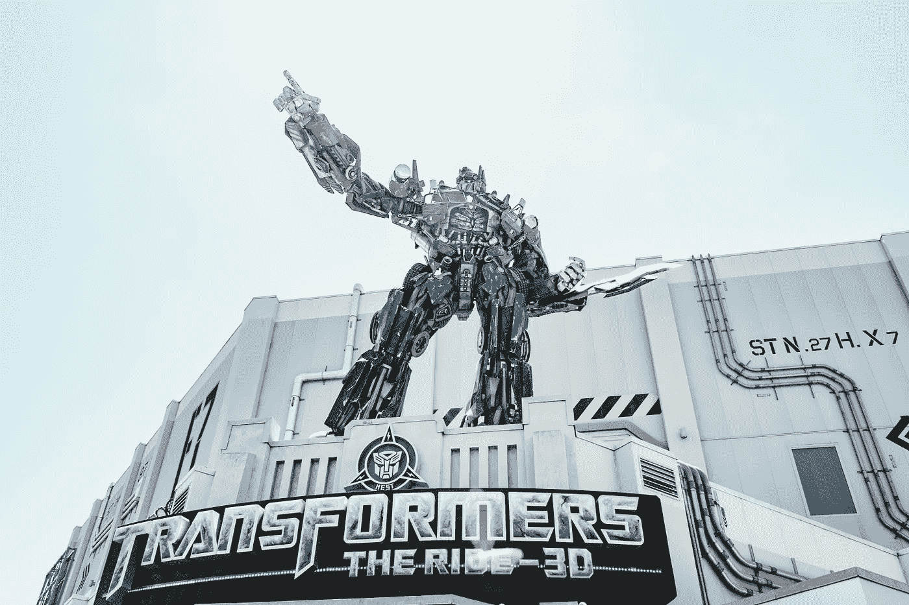
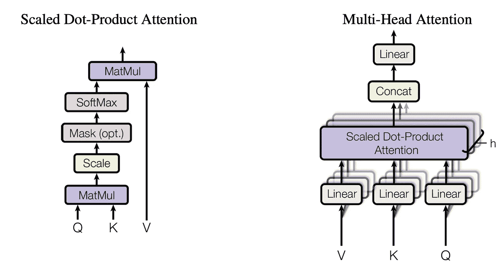
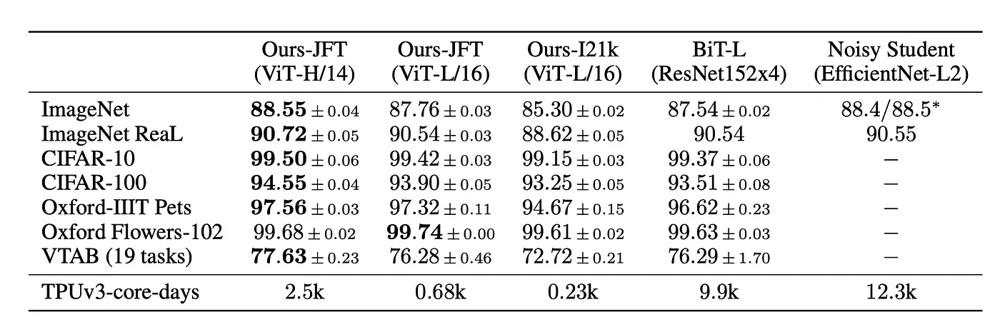

# PyTorch 中的视觉变形金刚

> 原文：<https://towardsdatascience.com/vision-transformers-in-pytorch-43d13cb7ec7a?source=collection_archive---------7----------------------->

## 当回旋不再是一种趋势。



图片来自 Unsplash。

卷积神经网络(CNN)已经成为几乎所有用于计算机视觉和图像相关任务的网络的主要骨干，因为与传统的多层感知器(MLPs)相比，它们在 2D 邻域感知和翻译均衡方面具有优势。然而，随着最近在语言处理领域中用变换器代替递归神经网络的转变，人们可能会怀疑变换器在图像领域中的能力。

幸运的是，最近在 *ICLR 2021** 发表的一篇[论文](https://arxiv.org/abs/2010.11929)已经探索了这种能力，并实际上提供了一种新的最先进的架构——视觉变压器——这与基于卷积的模型形成了鲜明对比。

本文深入探讨了变压器的概念，特别是视觉变压器及其与 CNN 的比较，并讨论了如何在 PyTorch 上整合/训练变压器，尽管训练这些架构很困难。

**边注:国际学习表示会议(ICLR)是一个顶级的知名会议，专注于深度学习和表示。*

# CNN 有什么好处？

为什么 CNN 在计算机视觉领域如此受欢迎？答案在于卷积的固有性质。内核或卷积窗口将附近像素的特征聚集在一起，允许在学习过程中一起考虑附近的特征。此外，当我们在图像中移动核时，图像上任何地方出现的特征都可以被检测到并用于分类——我们称之为平移等价。这些特征允许 CNN 提取特征，而不管特征在图像中的位置，因此在过去几年中鼓励了图像分类任务的显著改进。

但是如果 CNN 做了所有这些，变形金刚做了什么？

# NLP 中的变压器



图一。原始变压器中的缩放点积注意机制和多头注意机制。来源:[https://arxiv.org/abs/1706.03762](https://arxiv.org/abs/1706.03762)。

变形金刚最初是在自然语言处理领域的论文中提出的“[注意力是你所需要的全部](https://arxiv.org/abs/1706.03762)”。该领域的传统方法(例如，RNNs 和 LSTMs)在计算任何预测时考虑短语内邻近单词的信息。然而，由于当前状态(输入)需要计算所有先前的输入，所以该过程是顺序的，因此相当慢。

变形金刚利用注意力方案来计算最终的预测，在某种意义上，注意力方案实质上是矢量化单词之间的相关性。因为一个单词与其他单词的相关性独立于其他单词的相关性，所以同时计算是可能的，并且因此使得深度网络在这种情况下在计算方面更加合理。通过考虑所有的单词和相关性，结果实际上明显优于传统的递归方法。

此外，transformer 融入了多头注意力，它可以并行多次运行注意力机制，并将分离的向量连接到最终输出中。

# 转向视觉世界


图二。视觉转换管道。图像被分成小块，并被展平以模仿序列。来源:[https://arxiv.org/abs/2010.11929](https://arxiv.org/abs/2010.11929)。

随着它给语言处理带来的成功，问题出现了:我们如何将技术从语言转移到图像？纸质视觉转换器提供了最直接的方法。它将图像分成小块，并进一步使用这些小块并将它们转换成嵌入，然后将它们作为等价于语言处理中的嵌入的序列来馈送，以找到彼此之间的关注点。

# 实验代码

在本节中，我们将探索经过良好预训练的视觉转换器，并在各种数据集上测试其功能。值得注意的是，在原始论文的广泛研究中，只有当预训练数据集达到非常大的规模时，vision transformers 才优于 CNN。因此，如果您的计算资源相当有限，那么最好不要自己训练它。

## 数据集

为了探索视觉转换器的功能和通用性，我们可能需要在多个数据集上进行测试。幸运的是， [*Graviti*](https://gas.graviti.com/open-datasets?utm_source=medium&utm_medium=blog&utm_campaign=1012Taying) 的开放平台提供了计算机视觉领域众多著名数据集的链接和数据库。人们可以简单地选择他们的服务并直接找到数据集的链接。

如果你只关注推理而不是训练，你甚至可以使用他们目前开发的 API，这将简化数据组织和加载过程。

# PyTorch 中的视觉转换器

如前所述，由于学习良好的特征提取需要非常大规模的数据，视觉变压器非常难以训练。幸运的是，现在许多 Github 库都提供预构建和预培训的视觉变形器。我们的教程将基于来自<https://github.com/lucidrains/vit-pytorch>**的视觉转换器。**

*要导入他们的模型，需要通过 pip 安装，如下所示:*

```
*pip install vit-pytorch*
```

*确保 Pytorch 和 Torchvision 库也得到更新，以便版本相互一致。*

*然后，您可以使用以下内容初始化视觉转换器:*

*要进行推断，只需执行以下操作:*

*如果你真的想进一步训练你的视觉转换能力，你可以参考最近发表在这篇[论文](https://arxiv.org/abs/2012.12877)中的通过蒸馏进行数据有效训练。这种训练方法比直接训练视觉转换者要有效得多。代码也可以在上面提到的 vit-pytorch 库中获得。*

# *结果*

**

*图二。视觉转换器在多个数据集上的结果。资料来源:https://arxiv.org/abs/2010.11929。*

*如果我们回头参考这篇论文，我们可以看到，当使用超大规模数据集进行预训练时，大型视觉转换器模型可以提供最先进的结果。然而，预训练要求这种模型具有相当大的训练能力来实现高精度。*

# *超越视觉变形金刚*

*近年来，计算机视觉社区一直致力于改进变形金刚，以适应基于图像的任务，甚至 3D 点云任务的需要。最近的 *ICCV 2021* 论文如[云变形金刚](https://arxiv.org/abs/2007.11679)和最佳论文获奖者 [Swin 变形金刚](https://arxiv.org/abs/2103.14030)都显示了注意力机制的力量是图像任务的新趋势。*

# *结论*

*原来就是这样！趋势变换及其在计算机视觉中的应用概述。*

**感谢您坚持到现在*🙏*！* *我会在计算机视觉/深度学习的不同领域发布更多内容，所以* [*加入并订阅*](https://taying-cheng.medium.com/membership) *如果你有兴趣了解更多！**