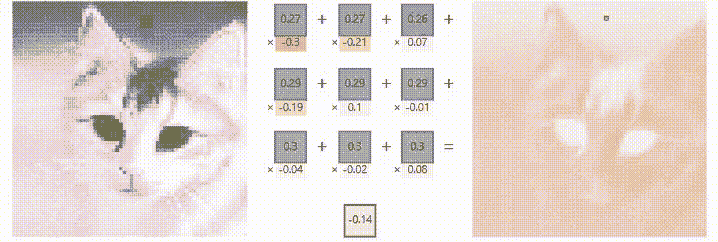
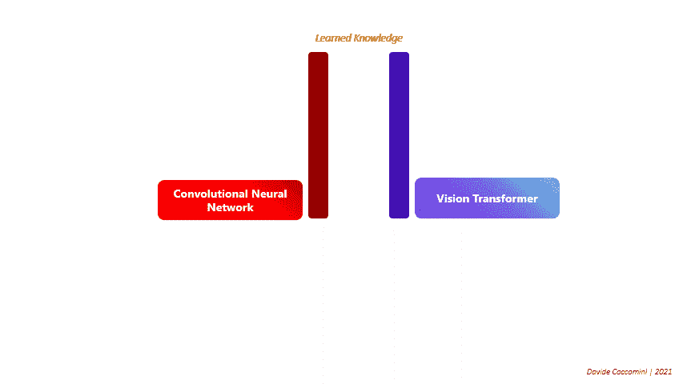

# 视觉变形器还是卷积神经网络？都是！

> 原文：<https://towardsdatascience.com/vision-transformers-or-convolutional-neural-networks-both-de1a2c3c62e4?source=collection_archive---------7----------------------->

## 探索使用卷积神经网络和视觉转换器构建混合架构的各种方法

作者图片

计算机视觉领域多年来一直由卷积神经网络(CNN)主导。通过使用过滤器，这些网络能够通过创建突出最相关部分的特征图来生成输入图像的简化版本。这些特征然后被多层感知器用来执行期望的分类。

图片由作者使用 [CNN 解说者](https://poloclub.github.io/cnn-explainer/)创建

但是最近这个领域已经被视觉变形器(ViT)的架构带来了令人难以置信的革命，它通过自我关注的机制已经被证明在许多任务中获得了优异的结果。

[在这篇文章中，视觉变形金刚的一些基本方面被认为是理所当然的，如果你想更深入地了解这个主题，我建议你阅读我以前的架构概述。](/transformers-an-exciting-revolution-from-text-to-videos-dc70a15e617b)

虽然变压器已被证明是 CNN 的优秀替代品，但有一个重要的限制因素使其应用相当具有挑战性，即需要大型数据集。事实上，CNN 甚至能够在相当少量的数据存在的情况下学习，这主要归功于归纳偏差的存在[1，8]。这些建议让模型更快地学习，更好地概括。具体而言，CNN 有两个与架构功能直接相关的偏见，即:

*   图像中的相邻像素彼此相关；
*   图像的不同部分必须以相同的方式处理，而不管它们的绝对位置。

然而，变压器架构中不存在这些偏差，因此他们需要更多数据来全面了解问题，但同时，他们能够以更自由的方式做到这一点。因此，可以说，变压器能够学习更多，但需要更多的数据，而卷积神经网络实现了对所处理的任务的较低理解，但也用较小的数据摩尔实现了这一点。

作者图片

**但是，难道没有一种方法可以从两种架构中获得最佳效果吗？**幸运的是，这两种架构基于两种截然不同的概念，可以以多种不同的方式结合起来，以获得能够利用两者优点的东西！

# 使用 CNN 作为补丁提取器

第一种可能的方法包括在将补片作为输入传递到视觉转换器之前，改变提取补片的方式。这些小块通常是通过将输入图像分成许多小部分而获得的。

图片由作者基于[关于变形金刚、时间形成者和注意力](/transformers-an-exciting-revolution-from-text-to-videos-dc70a15e617b)

为了理解如何通过卷积网络从图像到补丁，观察其内部功能就足够了:

作者图片

当大图像作为 CNN 的输入时，通过卷积层，它从三通道 RGB 图像转换为 N 通道图像。同时，它的尺寸急剧减小，图像本身的内容也发生了变化。
如果在卷积过程结束时，N 通道图像被认为是一组 N 个小图像，我们就获得了视觉转换器所必需的补丁。因此，可能的卷积视觉变换器的新架构将如下构成:

图片由作者基于 [*结合 EfficientNet 和视觉变形金刚进行视频深度打假检测*](https://arxiv.org/abs/2107.02612)

这种技术已被证明在许多情况下特别有效，也可以使用预先训练的卷积网络(如 EfficientNet)作为补丁提取器来应用。这种方法的一个可能的应用已经被我和 Pisa 的 CNR 的研究人员应用于执行视频 deepfake 检测[2]，如果你想了解它的更多信息[点击这里](https://arxiv.org/abs/2107.02612)。

# 从自我关注到门控位置自我关注(GPSA)

为了能够利用变压器内的卷积网络，利用了自我关注层可以作为卷积层工作的直觉。我们之前已经指出视觉转换器没有感应偏差。因此，脸书研究人员的目标是修改架构，以引入软卷积电感偏差。必要时，新网络必须能够充当卷积网络。

为了实现这个目标，门控位置自我注意(GPSA) [1]被引入，一种带有额外参数λ的位置自我注意形式。该参数用于平衡该层作为卷积层或经典自关注层的功能。在训练期间，网络将校准该参数，并且如果必要的话，在过程结束时，这些层中的一些将充当卷积层。

图片由作者根据 [ConViT 制作:利用软卷积电感偏置改进视觉转换器](https://arxiv.org/abs/2103.10697?fbclid=IwAR2ticnB0VeB5r_DaxPr2ClsAQIbDZZHmm78GW_cGHmcdyST2AZo25PLoy0)

除了在发生时用于捕获输入中的本地信息的 GPSA 层之外，还有形成网络的非本地部分的经典自我注意层。这种架构被称为卷积视觉转换器(ConViT)。

# CMT:卷积神经网络遇到视觉变压器

另一个最近的提议来自华为的实验室，他们引入了一个比迄今为止看到的更先进的架构，提出了他们所谓的 CMT 块[3]。其中许多模块用于新的架构中，将自我关注机制与卷积机制相结合，还引入了一些性能优化。

图片由作者基于 [CMT:卷积神经网络遇见视觉变形金刚](https://arxiv.org/abs/2107.06263)

每个 CMT 模块由三个基本部分组成:

*   **局部感知单元**:用于克服传统位置嵌入带来的限制，以及传统视觉转换器无法捕捉单个补丁内的局部关系和结构化信息。局部感知单元(LPU)通过简单的深度卷积提取局部信息。
*   **轻量级多头自我关注**:为了减少关注度计算中的计算量，通过该组件，使用 K×K 深度方向与 K 步距的卷积来减少矩阵 K 和 V 的空间大小。这样，通过处理由卷积过程产生的更小的矩阵，减少了自关注计算的数量；
*   **反向残差前馈网络**:这是每个块的最后一层，用一个扩展层取代了视觉变形器的经典多层感知器，之后是深度卷积和投影层。

因此，所得到的架构能够利用两种网络的优点，并且由于在不同层中引入的各种特性而有效地做到这一点。

# 结论

结合卷积网络和视觉转换器的想法不仅在许多方面可行，而且非常有效。迄今为止，这些变体在 ImageNet 等关键数据集上取得了优异的结果，就该数据集的准确性而言，CMT 目前是最先进的网络。似乎这还不够，进行的实验表明，这些网络也比完全基于卷积网络的经典方法和基于视觉变换器的方法轻得多，也小得多。

*许多人将视觉变压器视为卷积神经网络的继任者，但今天看来，这两种方法的结合具有巨大的威力。*

*我们可以肯定地说:“* ***团结就是力量！*** *。*

# 参考资料和见解

[1]“达斯科利等人”。" [ConViT:利用软卷积电感偏置改进视觉变压器](https://arxiv.org/abs/2103.10697?fbclid=IwAR2ticnB0VeB5r_DaxPr2ClsAQIbDZZHmm78GW_cGHmcdyST2AZo25PLoy0)"

[2]“cocco mini 等人”。*[*结合 EfficientNet 和 Vision Transformers 进行视频深度打假检测*](https://arxiv.org/abs/2107.02612)*

**[3]《郭等人》。" [CMT:卷积神经网络遇上视觉变形金刚](https://arxiv.org/abs/2107.06263)"**

**[4]《大卫·柯考米尼》。"[关于变形金刚，时间形成者和注意](/transformers-an-exciting-revolution-from-text-to-videos-dc70a15e617b)"**

**[5]《大卫·柯考米尼》。[在迪诺上，无标签自蒸馏](/on-dino-self-distillation-with-no-labels-c29e9365e382)**

**[6]《大卫·柯考米尼》。"[注意力是你在《变形金刚》中真正需要的吗？](/is-attention-what-you-really-need-in-transformers-6c161c2fca83)”**

**[7]《路易·布沙尔》。"[变形金刚会取代计算机视觉中的 CNN 吗？](https://pub.towardsai.net/will-transformers-replace-cnns-in-computer-vision-55657a196833?gi=9bca13a554d8)”**

**[8]《维克多·佩雷斯》。计算机视觉中的变形金刚:告别回旋！”**