# 混淆矩阵的可视化指南

> 原文：<https://towardsdatascience.com/visual-guide-to-the-confusion-matrix-bb63730c8eba?source=collection_archive---------12----------------------->

## [入门](https://towardsdatascience.com/tagged/getting-started)

## 二元和多类混淆矩阵解释

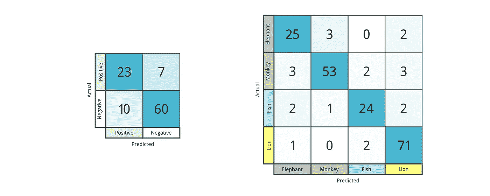

(图片由作者提供)

我们已经建立了一个机器学习模型来分类病人是否感染了某种病毒。一个病人可能处于两种状态:他们要么有病毒，要么没有。

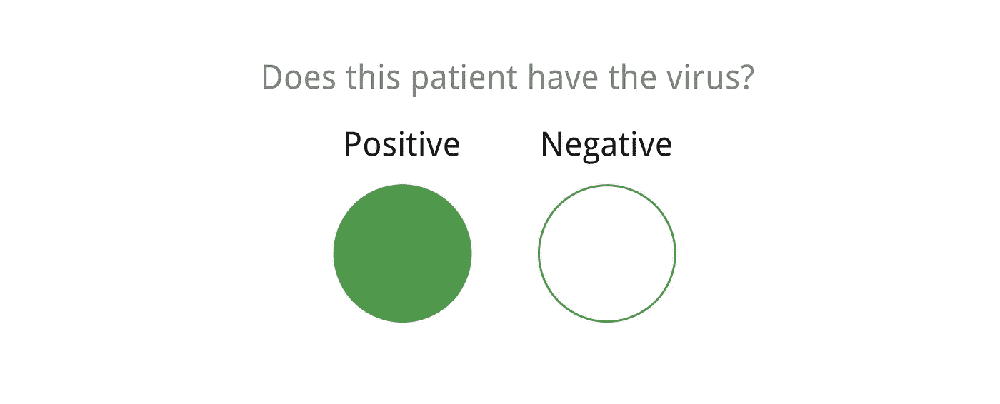

我们把病人描绘成一个圆圈。填了表示他们有病毒。未填充意味着它们没有。(图片由作者提供)

对于任何给定的患者，我们的模型产生 0 到 1 之间的分数。1 分意味着模型预测患者确实携带病毒，0 分意味着预测患者没有携带病毒。

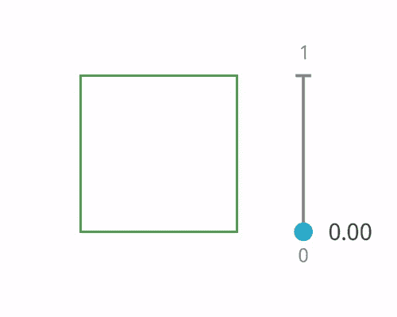

预测分数用正方形表示。填的越多，分数越高。(图片由作者提供)

如果我们选择 100 名患者，其中一部分患者携带病毒，然后我们让模型为每个患者生成一个分数，我们如何评估模型的性能？

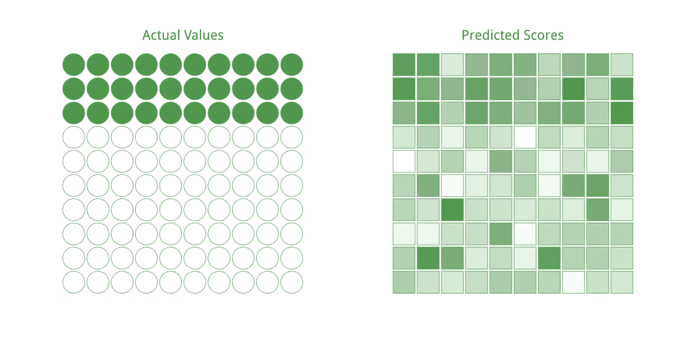

(图片由作者提供)

有许多不同的方法可以评估模型的分数与实际值的匹配程度。在这个例子中，我们将看一下混淆矩阵，其中我们使用一个网格来直观地评估结果。

## 阈值

为了确定这些分数是指对病毒的正面预测还是负面预测，我们需要决定在哪里设定阈值。我们可以通过选择一个值来做到这一点，其中大于该值的所有分数都被认为是正面预测，而小于该值的所有分数都是负面预测。

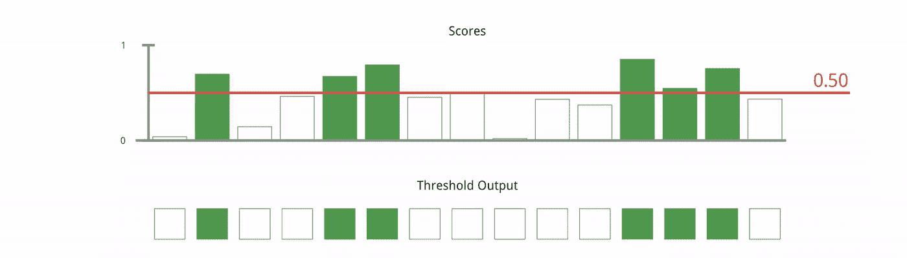

所有高于阈值(红线)的分数都被认为是病毒阳性。以下都被认为是负面的。(图片由作者提供)

我们放置这个阈值的位置决定了我们的模型对这两个类的偏向程度。低阈值导致偏向正输出，高阈值则相反。选择正确的阈值取决于您的模型的目标是什么以及如何使用它。不过现在我们将简单地选择 0.5 作为阈值。

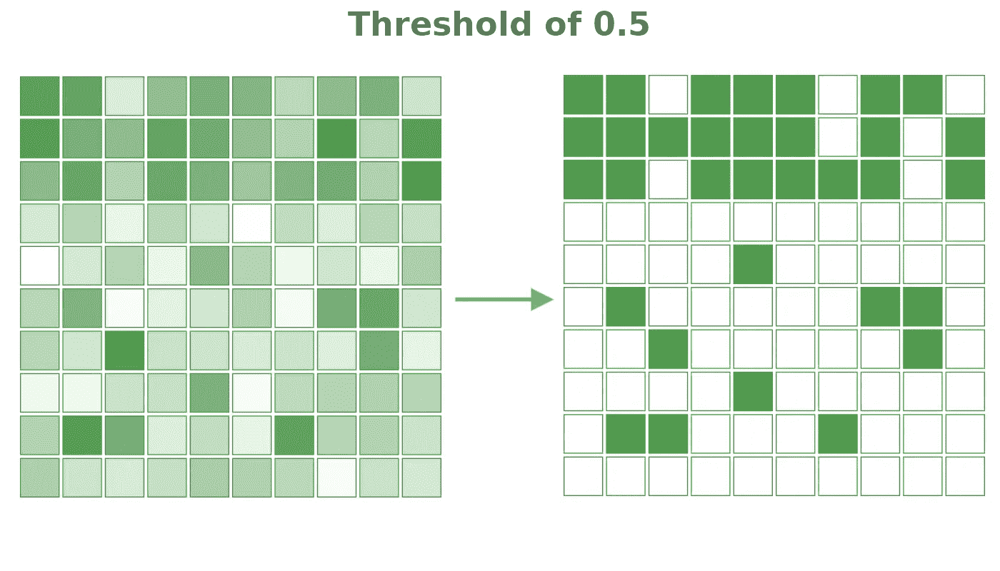

(图片由作者提供)

## 比较实际与预测

既然我们已经将阈值应用于每个输出得分，我们可以将我们的输出与实际患者进行比较。

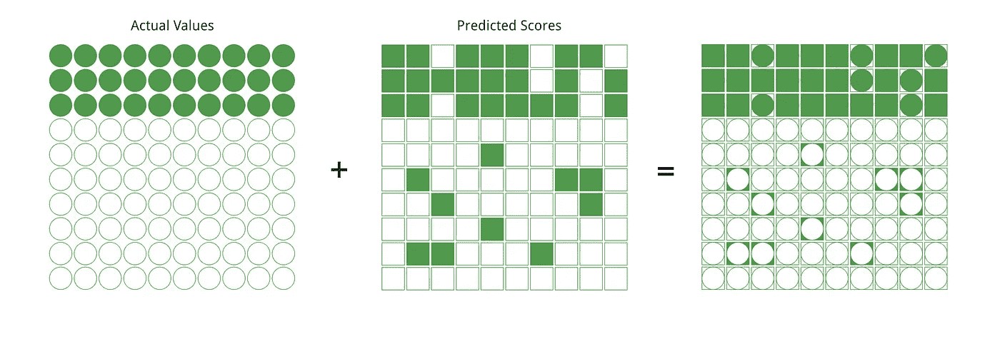

(图片由作者提供)

当我们比较结果时，出现了四个不同的组。

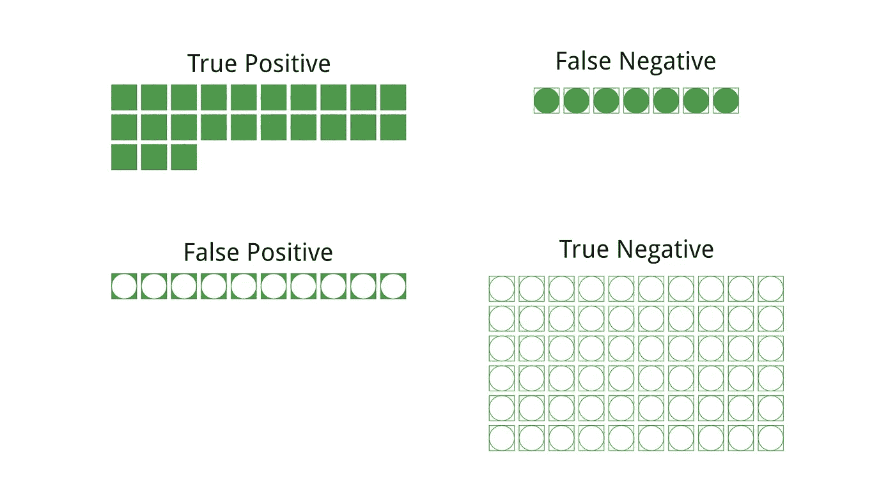

(图片由作者提供)

*   **真阳性(TP):** 预测类别为病毒阳性，实际类别为阳性。
*   **假阳性(FP):** 模型预测为阳性，实际类为阴性。
*   **假阴性(FN):** 预测类为阴性，实际类为阳性。
*   **真阴性(TN):** 病毒的预测类别为阴性，实际类别也为阴性。

第一个字是布尔型的*真*或*假*，当预测值和实际值匹配时为*真*，否则为*假*。第二个词指的是类:在这种情况下，它可以是正的，也可以是负的。一个表现良好的模型主要会有真实的正面和真实的负面，我们可以在一个混淆矩阵中看到它们。

## 混淆矩阵

通过对四个类别中的每一个进行计数，我们可以在一个 2×2 的网格中显示结果。y 轴是实际值(患者及其阳性或阴性标签), x 轴是我们的预测值。这个网格的每个象限指的是四个类别中的一个，因此通过计算一个象限的结果，我们可以将值放在该单元格中。

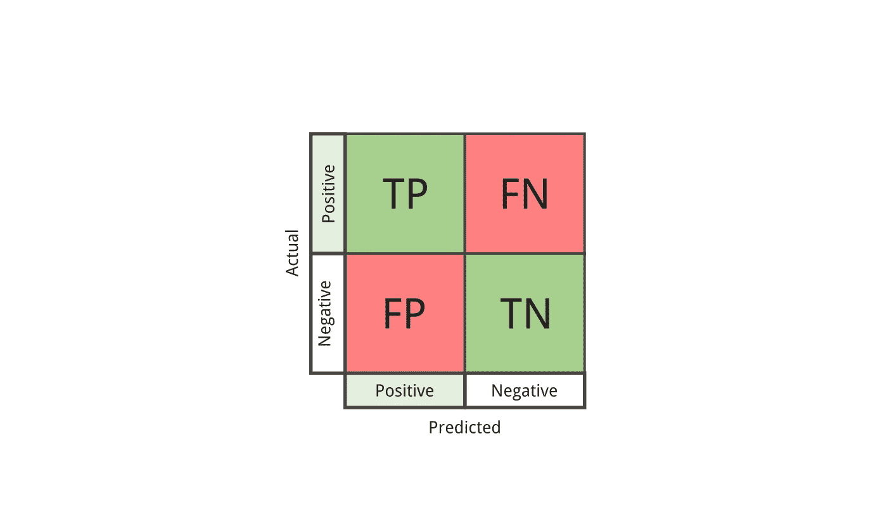

每个象限代表四种可能性中的一种。(图片由作者提供)

用单元格值占该行中所有单元格的比例来给每个象限着色是很有帮助的。由于真正的正面和真正的负面是沿着从左上到右下的对角线，如果这条对角线被突出显示，我们可以假设模型运行良好。

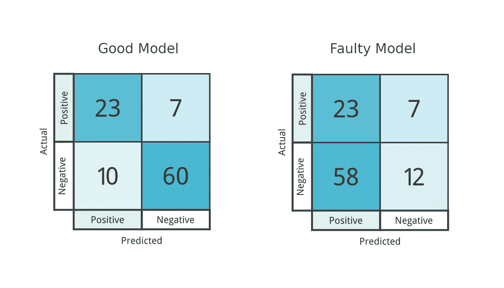

(图片由作者提供)

如果模型表现不佳，很容易确定哪里出了问题，因为对角线上的一个单元格只会被稍微填充，而该行上的另一个单元格会被突出显示。对于上面的错误模型，假阳性的数量比真阴性的数量高得多，所以我们的模型过度预测了阳性类别(该模型预测患者有病毒，而他们没有)。

我们可以返回模型，并根据这些信息进行更改。也许我们改变我们训练它的方式，或者模型本身的架构。这也可能是将阈值更改为更高值的好时机，这样输出会偏向负类。像这样的二元类混淆矩阵可以帮助我们在建立分类模型时指导决策。

## 多类混淆矩阵

事业成功后，我们从医学界退休，并决定从事野生动物摄影这一爱好。为了帮助组织我们拍摄的照片，我们建立了一个分类器模型来标记照片中的动物。如何使用混淆矩阵来评估多类问题？

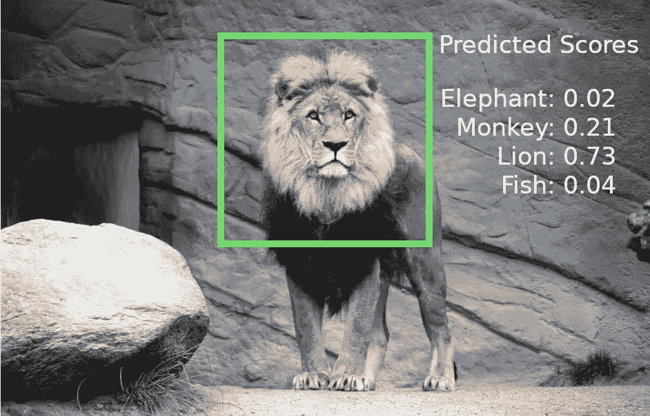

来自 [Unsplash](https://unsplash.com/photos/UlipBbZpweg) 的狮子图像由[米卡·布兰特](https://unsplash.com/@mikabr)

像以前一样，我们仍然需要确定输出分数已经预测了哪个类。我们将选择概率最高的输出，并考虑模型预测的类别，而不是执行阈值处理。

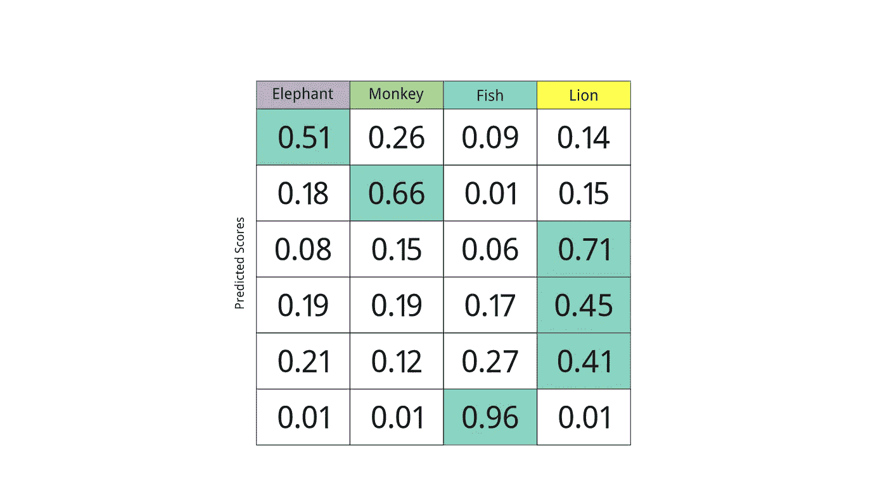

突出显示的单元格是照片的最高预测分数。(图片由作者提供)

混淆矩阵的建立方式和以前类似，只是现在多了两个类。总体思路也是一样的:对于每个预测，我们将结果与我们正在评估的标记数据进行比较。如果我们的模型预测到*大象*并且图像确实包含一只*大象*，那就是正确的分类！然后，我们可以将结果添加到相关的单元格中。当我们的模型出错时也是如此，比如当预测的类是*猴子*但照片实际上包含了*狮子*。

在将每个预测类与相关联的标签进行比较之后，混淆矩阵开始看起来类似于二元类的情况。此处的对角线是模型精确执行的位置，相对于同一行中的其他单元格，这些单元格将包含较高的值。

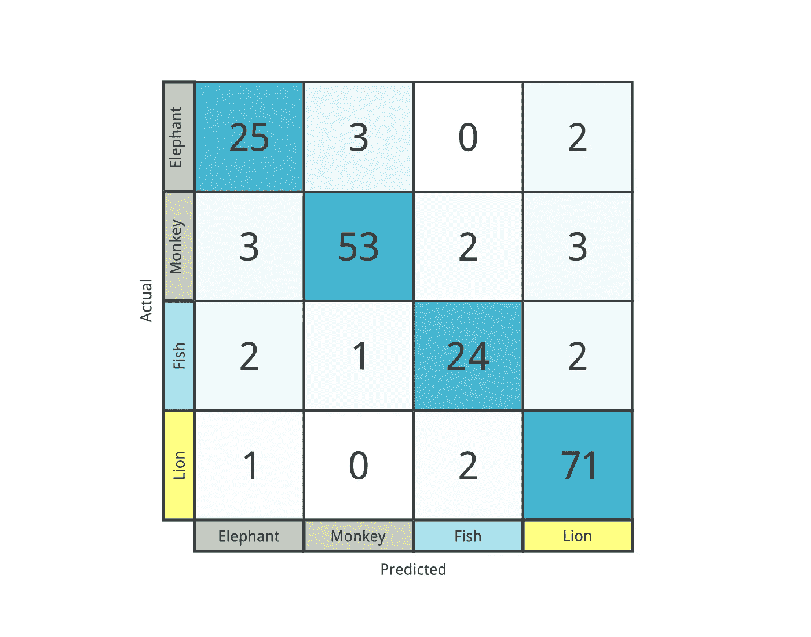

(图片由作者提供)

此外，我们仍然可以识别所有真阳性、假阳性、真阴性和假阴性相对于任何类的位置。假设我们对我们的模型在类 *fish* 上的表现感兴趣:

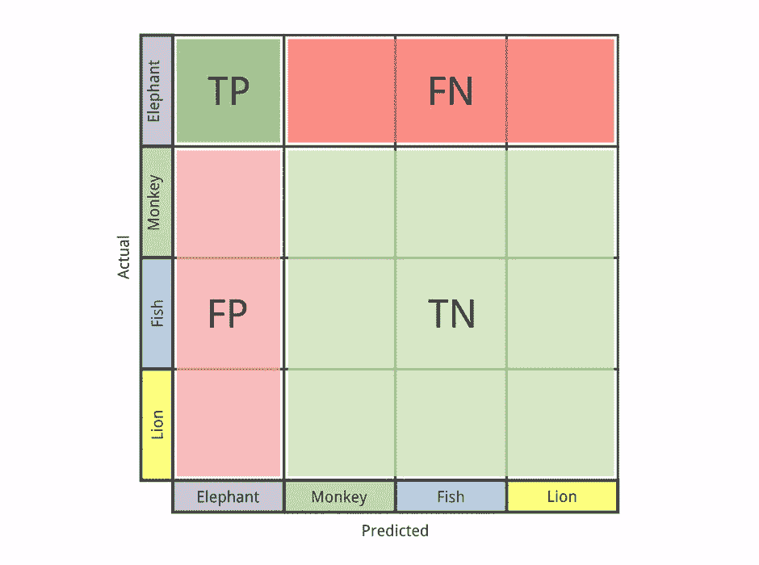

(图片由作者提供)

*   **真阳性(TP):** 实际类是鱼时对鱼的一种分类。
*   **假阳性(FP):** 鱼类的一个分类，但实际上是其他 3 类中的一类。
*   **假阴性(FN):** 不是鱼的一个分类，但实际上是鱼。
*   **真否定(TN):** 鱼以外的东西的一个分类，实际的类是鱼以外的东西。(预测类和实际类不必匹配，因为我们只关心 fish 类)。

当分类不正确时，我们可以直观地看到模型错误的确切位置。这里我们可以看到我们的模型将狮子归类为猴子:

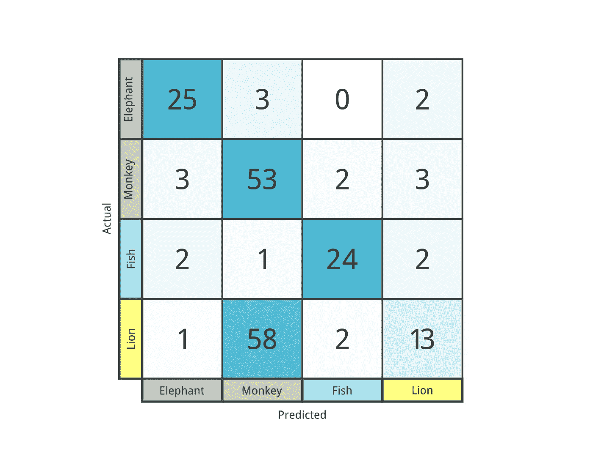

(图片由作者提供)

希望这种模型不要部署在任何高风险环境中！

想支持更多这样的内容？使用此链接[https://mlee-articles.medium.com/membership](https://mlee-articles.medium.com/membership)注册 Medium 的会员资格，您的一部分会员资格将用于未来内容的开发