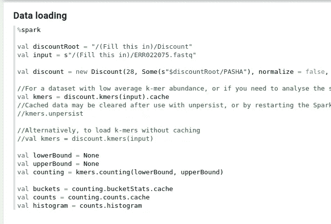
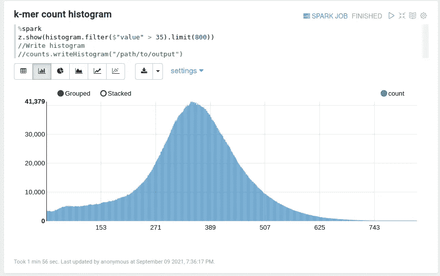

# 折扣给齐柏林飞船上的基因组数据分析带来了火花

> 原文：<https://towardsdatascience.com/visual-k-mer-analysis-with-zeppelin-b33af396a26?source=collection_archive---------15----------------------->

## 下一级 k-mer 分析教程


齐柏林飞艇上的折扣 k-mer 分析。(图片由作者提供。)

在生物信息学中，k-mers 是长度为 *k、*的序列片段，通常是 20 到 50 之间的一个小数字。K-mer 分析是许多其他分析的重要组成部分，包括宏基因组分类、基因组组装和序列比对。Jupyter 和 [Zeppelin](https://zeppelin.apache.org/) 等交互式笔记本正在成为数据科学家的重要工具，提供了相当大的功能和灵活性，我们可以混合和匹配语言、可视化和代码片段，与其他用户合作，以及版本控制更改。然而，直到现在，由于爆炸式的数据大小和高内存和 CPU 要求，k-mer 数据在这种笔记本电脑中一直难以处理。[今年](https://academic.oup.com/bioinformatics/advance-article/doi/10.1093/bioinformatics/btab156/6162158)，我们发布了 [Discount](https://github.com/jtnystrom/discount) ,(分布式计数)一个在 [Apache Spark](http://spark.apache.org/) 上推动 k-mer 分析艺术的工具。Discount 从根本上加快了数据分析和操作，如计数、排序和搜索 k-mers，从泛基因组数据到高度复杂的宏基因组数据集。通过在 Discount 和 Spark 的基础上构建 Zeppelin 笔记本，我们现在可以将这种能力用于交互使用，使笔记本中的 k-mer 分析变得微不足道。


在大肠杆菌短读数据集中计数 k-mers (k=28)。(图片由作者提供。)

在本文中，我将详细介绍如何在带有大肠杆菌数据的 Zeppelin 笔记本中使用 Discount。我们将在独立的机器上安装软件，但数据分析也可以在云中更快地进行，例如在 AWS EMR 上。

# 设置火花和齐柏林飞艇

首先，我们需要[下载 Apache Zeppelin](https://zeppelin.apache.org/download.html) 版本 0.10.0(或更高版本)。有两个下载可用。较小的一个(zeppelin-netinst-0.10.0.tgz)将足以满足我们的目的。

Zeppelin 包含一个内置的 Spark 解释器，但是这里我们需要一个更新的版本。因此，我们还需要从 [Spark 下载页面](https://spark.apache.org/downloads.html)下载一个单独的 Spark 发行版。对于本文，我们使用的是 Spark 3.1。

最后，我们需要下载折扣 k-mer 分析工具。它可以从我们的 GitHub 库的[版本](https://github.com/jtnystrom/Discount/releases)页面获得。Discount 2.0.1 zip 包含 Discount jar(我们将把它放在 Spark 类路径中)以及一些必要的数据文件。我们提取这三个下载并从 Zeppelin 目录中启动 Zeppelin:

```
./bin/zeppelin-daemon.sh start
```

默认的 Zeppelin 端口(可以在`conf`目录中更改)是 8080，所以假设一切顺利，我们应该可以在 [http://127.0.0.1:8080](http://127.0.0.1:8080) 上加载 Zeppelin 笔记本界面。

# 获取大肠杆菌数据

对于我们的例子，我们将从大肠杆菌菌株中寻找下一代测序(NGS)短序列。这是一个相对适中的数据集，可以快速分析。但是，您可以随意对您喜欢的任何数据尝试这些方法。登录号为 ERR022075 的数据集可以从[NCBI 测序读取档案](https://trace.ncbi.nlm.nih.gov/Traces/sra/?run=ERR022075)下载。由于 Discount 目前只接受 **fasta** 和 **fastq** 格式的文件，您可能需要使用 [sratools](https://ncbi.github.io/sra-tools/) 将下载的文件转换成 fastq 文件。

# 设置和数据加载

我们将使用的折扣演示笔记本的最新版本可从以下网址获得:[https://raw . githubusercontent . com/jtnystrom/Discount/master/notebooks/Discount % 20 demo . zpln](https://raw.githubusercontent.com/jtnystrom/Discount/master/notebooks/Discount%20demo.zpln)。这是一个 JSON 格式的导出笔记本。从 Zeppelin 的起始页，点击**导入注释**链接将允许您粘贴并导入该 URL。接下来，我们需要配置一些基本设置。

齐柏林笔记本分为*段*。运行一个段落将执行里面的代码片段并显示结果。


在做任何事情之前，编辑 spark.jars 和 SPARK_HOME，如果您还没有在其他地方配置这个设置的话。段落可以通过按 shift+enter，或者点击右上角的“播放”按钮来运行。(图片由作者提供。)

编辑完“Spark settings”段落后，按 shift+enter 来“运行”该段落，让 Zeppelin 接受这些新设置。(如果您稍后再次更改这些设置，或者遇到问题，您可能需要重新启动 Spark 解释器，这可以从右上角的齿轮菜单中完成。)接下来，我们运行 Imports 段落，使一些折扣类可见。从这一点开始，这本笔记本中的代码大部分是用 Scala 语言编写的，但是如果你以前没有见过 Scala，请不要惊慌——它将非常简单，并且在这本笔记本中看起来很像 Python。

在“数据加载”中，我们将编辑一些与数据加载和缓存相关的设置。首先我们改变`discountRoot`和`input`。前者应该指向提取折扣包的位置。后者应该指向输入数据文件，在本例中是 ERR022075.fastq，我们在上面下载了它。



数据加载段落定义了本笔记本中其余段落使用的主要数据集。必须在运行之前配置 discountRoot 和 input。(图片由作者提供。)

我们还将把`val lowerBound = Some(2L)`改为`val lowerBound = None`，因为我们希望看到所有的 k-mers，而不仅仅是出现至少两次的 k-mers。(2L 是 Scala 对长整数的语法。)我们还可以在这里做一些小的改动，比如把 k 的值从默认值 28 改变为 28。

这一段是声明和缓存几个数据集，例如`val kmers = discount.kmers(input).cache`。在本笔记本中，`counts`、`buckets`、`kmers`等数据集在本数据加载段配置一次，然后被下游段重复使用。缓存将使 Spark 在计算一次后存储数据供以后使用，而不是每次都重新计算。这些数据集代表输入数据的三种不同视图:分别是计数的 k-mer、k-mer 桶和未计数的 k-mer。一旦我们运行了这一段，所有后续分析的数据环境就已经配置好了。要在以后进行更改，您可以随时编辑并重新运行此段落。

当我们运行这一段时，Discount 将抽取文件的一小部分。这可能需要几分钟时间。


采样完成后，您将看到类似于(但可能不完全相同)如下的输出。Discount 对 10 mer 频率进行了随机采样，以获得最佳数据分布。(图片由作者提供。)

当数据加载完成时，我们将看到一些输出，这表明我们已经为下一步做好准备。

# 数据集摘要


此数据集中 k-mers 的统计概述。(图片由作者提供。)

此时，我们已经准备好分析数据。统计摘要段落可能是我们要查看的第一件事，因为它告诉我们数据集中有多少 k-mers，它们的平均丰度(它们被看到的次数)，有多少不同的 k-mers，以及其他概述指标。我们第一次运行这一段可能需要几分钟，因为 Spark 将需要生成一次缓存数据集，但后续运行会更快。这些结果显示，k-mers 的总丰度约为 39 亿，平均丰度为 5.9。

# K-mer 直方图

一个给定的数据集通常会被排序到某个深度，这意味着有意义的 k-mers 应该在某种程度上均匀地分布在平均值周围。丰度低的 K-mers 被认为是噪音。如果我们简单地按原样运行 k-mer 计数直方图段落，我们将看到看起来像一个空图，但实际上是一个高度倾斜的直方图。


k-mer 直方图。z.show()调用显示 Zeppelin 的表格/交互式图表小部件。该直方图看起来是空的，但实际上在计数= 1 时在左侧有一个显著的峰值。(图片由作者提供。)

在这一段中，读者可能会发现以`z.show`开头的一行。这就是允许 Zeppelin 显示从 Spark 提取的数据的魔力。`z` 是一个引用 Zeppelin 的特殊对象，`show`告诉它以多种方式显示一些数据。默认情况下，我们得到一个显示表格的可视化显示，但也允许我们显示各种类型的图，或者保存一个 JSON/CSV 文件。

通过手动检查表格模式中的数据，我们形成了假设，即 35 是一个有意义的临界值。于是我们把这一段稍微改一下说:`z.show(histogram.filter($"value" > 35).limit(800))`。这将从直方图中删除计数低于 35 的 k-mers。表达式`$"value" > 35`在 Spark SQL 中定义了一个条件，告诉它过滤名为`value`的列。最后，`limit(800)`在这里告诉 Spark，我们也不关心丰度非常高的 k-mers；我们只希望看到直方图中的前 800 行。



k-mer 丰度截止值为 36 的过滤 k-mer 直方图。在此范围内，k-mer 计数似乎围绕一个平均值均匀分布。(图片由作者提供。)

这张图片与最初的直方图非常不同，似乎证实了数据集的行为符合预期。在这一点上，我们可以执行进一步的过滤，当我们满意时，将选择的子集写入文件。

# 查询感兴趣的 k-mers

有时，我们可能希望检查特定感兴趣区域的 k-mer 计数。大肠杆菌基因组中的一个编码区是基因[精氨酸脱羧酶](https://www.ebi.ac.uk/ena/browser/view/AAA23481)。[编码序列](https://www.ebi.ac.uk/ena/browser/api/fasta/AAA23481.1?lineLimit=1000)可在欧洲核苷酸档案馆(ENA)找到。如果一切都做对了，我们应该能够在数据中找到这个序列。我可以简单地从编码序列中复制前两行，并将它们插入到主题段落中的 Find k-mers 中(注意将它们连接成一行):

`val query = List(“ATGAAAGTATTAATTGTTGAAAGCGAGTTTCTCCATCAAGACACCTGGGTCGGTAACGCCGTTGAGCGTCTGGCAGATGCTTTAAGCCAGCAAAATGTTACCGTGATTAAATCCACCTCC”)`

当我们运行该段落时，该序列将被分解成 k-mers，并将找到数据中的任何匹配。我们可以看到，数据中确实存在丰度相对较高的匹配。和以前一样，如果我们愿意，可以将结果保存到文件中。这一段使用了与前面相同的`z.show()`语句，但是结果现在以表格模式显示。


K-mer 计数精氨酸脱羧酶基因的匹配部分。正如注释掉的代码所示，也可以从提供的 fasta 文件中的序列进行查询。(图片由作者提供。)

# 更进一步

演示笔记本包含许多其他可以探索的例子，在不同的段落中注释了一些有用的变化。Discount 最新版本的 [API 文档作为参考会很有用，有助于理解这些例子是如何工作的，以及看看还有什么是可能的。](https://jtnystrom.github.io/Discount/discount/spark/index.html)

不熟悉 Scala 的人可能会对单独的 k-mer counts 段落中的这段代码感到疑惑:`z.show(counts.filter(_ > 5).withSequences).``_`字符允许我们快速创建一个 lambda 函数，所以我们也可以编写:`filter(x => x > 5)`，它具有相同的含义。


大肠杆菌数据集的堆积 k-mer 丰度直方图，k=28、35 和 45。该图是通过使用 Spark SQL 将不同的 k-mer 直方图表连接在一起而生成的。(图片由作者提供。)

通过多次加载相同的数据，我们还可以比较多个 k 值的结果，如上图所示。这最后一个例子不是演示笔记本的一部分，而是留给读者作为练习。

# 敬未来

Spark 为云环境带来了强大的抽象和类似 SQL 的查询语言(以及 Python、R、Scala 等通用语言),让我们——大多数时候——可以将一个可能有数百台机器的集群看作一个实体。在写这篇文章的时候，我是在一台机器上运行实验，但是我也可以在云中以同样的方式运行，这样会更快。通过突破性的新 k-mer 分布算法，Discount 首次允许我们以真正实用的方式将 Spark 应用于 k-mer 数据。通过在此基础上添加 Zeppelin 笔记本，我们能够以交互方式探索和询问基因组的各种子集和基因组读取，比传统命令行工具允许的自由和灵活性更大，即使是在非常大的数据集上。随着泛基因组学和宏基因组学增加了对数据分析的需求，由 Discount 等技术支持的交互式笔记本将把我们从笨重的管道中解放出来，并改变生物信息学家的日常工作体验。