# 机器人视觉伺服

> 原文：<https://towardsdatascience.com/visual-servoing-part-1-of-3-cad49595564d?source=collection_archive---------6----------------------->

## 计算机视觉与机器人

## 使用摄像机传感器的路径规划

# 介绍

这个项目的目的是使用一个鱼眼镜头和一个带 ROS 的 Turtlubot3 实现一个端到端的视觉伺服项目。视觉伺服意味着，机器人将只使用一个传感器，即摄像头，实现自动驾驶！

1.  第一个目标是将机器人从当前位置移动到目标位置。为了指定这些位置和它们的姿态，我们使用两个 Aruco 标记。
2.  机器人的第二个任务是避开用红色指定的障碍物，我们用 A-star 路径搜索算法实现了这个任务。
3.  最后，当机器人在目标位置时，我们必须“停车”，这意味着目标的位置姿态应该与机器人的姿态相同。

在这个报告之后，我们将分析数学理论背景和我们实现的代码实现。

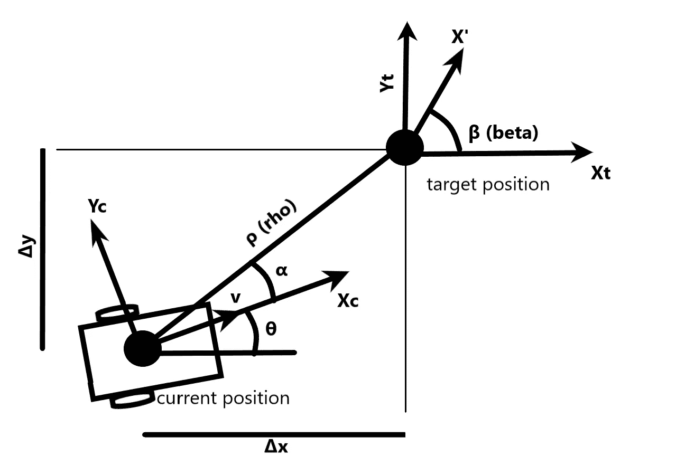

位置之间的角度，作者的图像

## ROS 是什么？

机器人操作系统(ROS)是一个开源中间件，它包含一组用于促进机器人应用程序开发的库、软件和工具。有太多的功能，从传感器驱动器到最先进的算法。作为中间件，它包含软件和硬件的特性，因此，它能够执行各种动作，如硬件抽象和低级控制。到目前为止，不同版本的 ROS 存在一些重要的差异，所以出于兼容性的原因，我们使用 Melodic release。

## 用于此场景的机器人——turtle bot 3

在这个项目中，使用的移动机器人是一个 Turtlebot3 汉堡。Turtlebot3 是一个紧凑、模块化和可编程的移动机器人。它使用 ROS，并且能够为培训研究和开发创建多个应用程序。

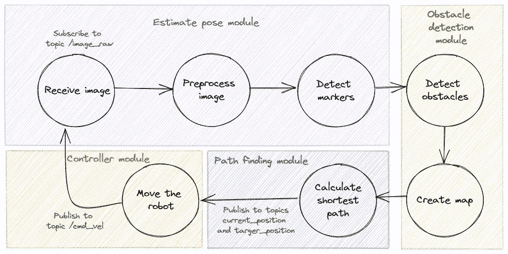

工作流程，按作者分类的图像

# 第一个目标—从当前位置移动到目标位置

## **1。摄像机校准**

摄像机校准是这个项目不可或缺的一部分。在这一阶段，该项目使用 [camera_calibration](http://wiki.ros.org/camera_calibration) 包，它允许使用棋盘校准目标轻松校准单目摄像机。这些包使用 OpenCV 库，其中包含摄像机校准方法。

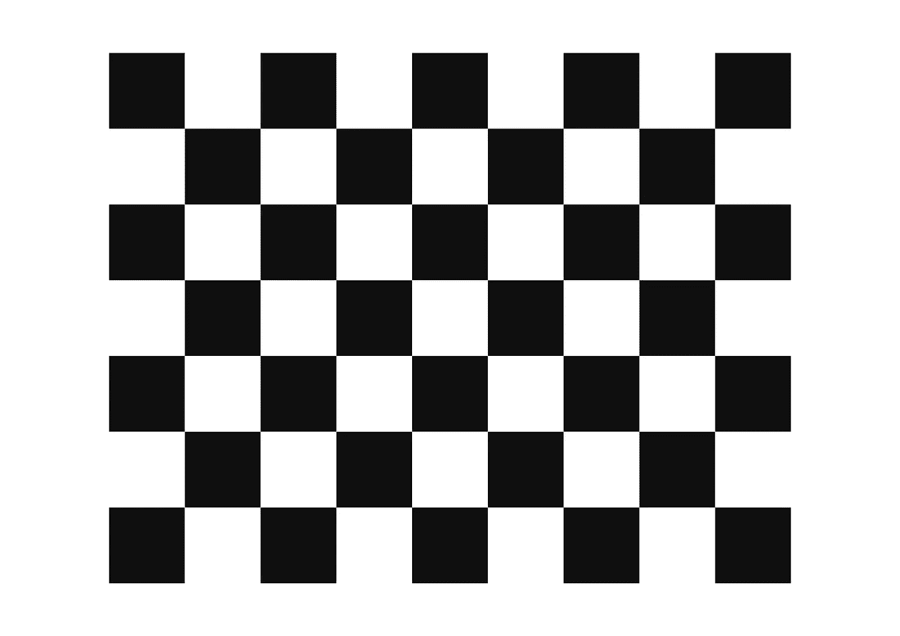

棋盘，作者图片

**内在校准**
正如我们前面提到的，它使用 [camera_calibration](http://wiki.ros.org/camera_calibration) 包。该套件可轻松校准单目或立体摄像机。棋盘是为了修复采集图像的 ***径向畸变*** 的工具。 ***径向或桶形失真*** 可以表示为:


x 失真，图片由作者提供

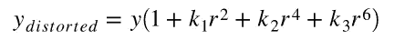

y 变形，图片作者

以同样的方式，因为成像镜头没有完全平行于成像平面对准，所以出现切向失真。因此，一些图像看起来比预期的要近。切向变形量可表示如下:

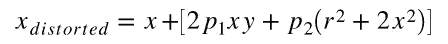

x 失真，图片由作者提供

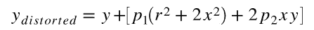

y 变形，图片作者

根据上面的等式，我们可以找到五个参数，称为失真系数

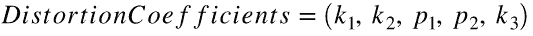

失真系数，图片由作者提供

此外，*内在参数*允许相机坐标和图像帧中的像素坐标之间的映射。它们包括像局部长度(fx，fy)和光学中心(Cx，Cy)这样的信息。

这些参数可以用摄像机矩阵表示:

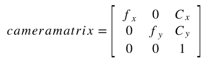

相机矩阵，图片由作者提供

## **2。接收图像**

下一步是通过订阅 ROS 主题“/camera/image_raw”接收图像帧，并将其转换为 NumPy 数组。然后我们需要根据我们的需要裁剪图像，通过指定我们需要工作的窗口。然后，我们使用摄像机矩阵和上一步接收到的失真系数对接收到的图像进行去失真处理。

## **3。检测标记**

使用 OpenCV 库，我们可以检测放置在机器人顶部的两个 Aruco 标记，一个标记用于当前位置，一个标记用于目标位置。我们只需调用函数“cv2.detectMarkers ”,从该函数中我们可以接收每个标记的角，然后我们可以继续进行姿态估计。

## **4。姿态估计**

下一步是估计当前和目标姿态，简单地调用[姿态估计模块](https://github.com/manoskout/visual_servoing/blob/master/scripts/pose_estimation.py)中的函数*cv2 . estimateposesinglemarkers*。从中我们接收每个标记的两个向量，一个平移向量[x，y，z]和一个旋转向量`[x，y，z]`。使用 ROS publisher，我们将这些向量发送给机器人控制器，后者负责以机器人应该能够移动的方式翻译这些矩阵。这是通过 ROS publisher 实现的

其中 *current_position* 是控制器将订阅的 ROS 主题，以获取我们创建的自定义消息*Pose _ estimation _ vectors*，以便发送这些向量。

该消息的结构如下:
*几何 _msgs/Vector3 旋转
几何 _msgs/Vector3 平移*

这是两种姿势的图像:

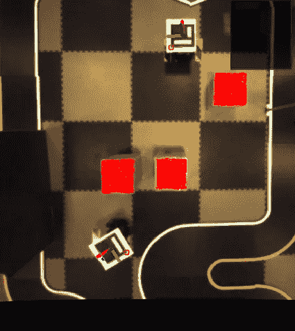

初始姿势，图片作者

## **5。控制器——将旋转和平移矩阵转换成齐次矩阵**

齐次变换由外部参数 *R* 和 *t* 编码，并表示从世界坐标系 *w* 到摄像机坐标系 *c* 的基的变化。因此，给定点 *P* 在世界坐标 *Pw* 中的表示，我们通过下式获得 *P* 在摄像机坐标系 *Pc* 中的表示:

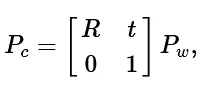

积分矩阵，作者图片

这种齐次变换由 3 乘 3 旋转矩阵 *R* 和 3 乘 1 平移向量 *t* 组成:

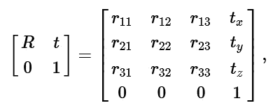

同质矩阵，作者图片

结合射影变换和齐次变换，我们获得了将世界坐标中的 3D 点映射到图像平面和归一化相机坐标中的 2D 点的射影变换:

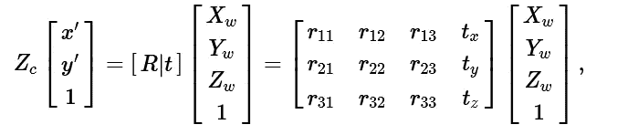

同质矩阵，作者图片

[控制器模块](https://github.com/manoskout/visual_servoing/blob/master/scripts/controller.py)必须通过 OpenCV 函数使用 Rodrigues 变换将旋转矢量转换成旋转矩阵:

```
rotational_matrix, _ = cv2.Rodrigues(np.array([data.rotational.x, data.rotational.y, data.rotational.z], dtype=np.float32))
```

然后，我们将旋转矩阵与变换向量水平堆叠，并在末尾添加行[0，0，0，1]以获得齐次矩阵。

## 6。计算当前位置和目标位置之间的α角和距离ρ

我们从上一步获得的齐次矩阵描述了每个位置相对于摄像机框架的位置。我们需要将它们组合起来，以便从一个位置接收相对于另一个位置的位置。为此，我们将当前齐次矩阵的逆矩阵与目标齐次矩阵相乘，以获得组合的齐次矩阵(t):

```
t = np.matmul(np.linalg.inv(self.curr_homogeneous_matrix), self.target_homogeneous_matrix)
```

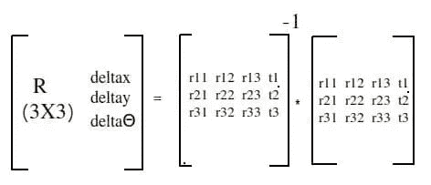

组合齐次矩阵，作者图片

接下来，我们需要计算机器人应该移动的角度(α)和距离(ρ):

我们从上面的矩阵中得到 *dx* ， *dy* :

```
dx = t[0][3]
dy = t[1][3]
```

然后我们用 *dx* ， *dy* 计算反正切:

```
self.alpha = math.atan2(dy, dx)
```

最后，我们通过应用欧几里德距离得到到目标的距离(rho ):

```
self.rho = math.sqrt(math.pow(dy, 2) + math.pow(dx, 2))
```

## **7。固定角度并将机器人移动到目标**

现在，我们通过向 ROS 主题“cmd_vel”发布仅角速度来确定β角，并且当根据目标角度角度角度正确时，我们再次向同一主题发布仅线速度，直到到目标的距离接近于零。我们使用比例控制器，所以给机器人的速度乘以两个常数，一个是角速度，一个是线速度。

# 第二个目标——避开障碍

## 1.障碍物检测

[障碍检测模块](https://github.com/manoskout/visual_servoing/blob/master/scripts/obstacle_detection.py)正在使用输入图像，并将其切割成与机器人大小相同的方块。这样，我们就有了一个数组，里面有机器人能完成的所有可能的动作。为了区分障碍物，这意味着如果图像中有一个障碍物——一个红色的盒子——机器人就不能移动到那里。

然后，我们对图像的每个框进行迭代，并将该框转换为 HSV。接下来，如果该框包含红色范围内的任何像素，我们将对图像进行遮罩，并对输出应用按位遮罩。如果盒子包含红色像素，我们假设它是一个障碍。

这一步的输出是一个长度等于盒子数量的单向数组，它包含 0(没有障碍物时)和 1(有障碍物时)。

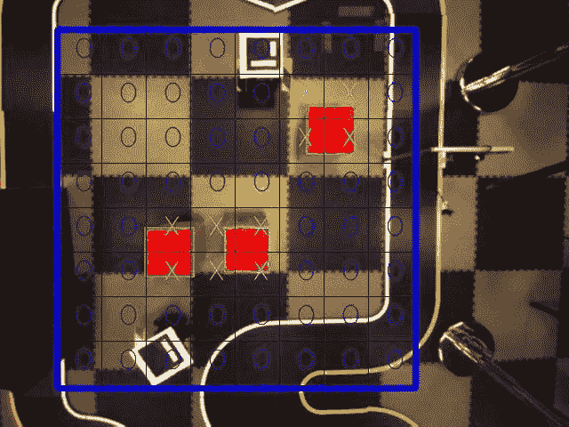

障碍地图，作者提供的图像

## 2.使用 A-star 算法寻找最短路径

使用上一步的障碍地图阵列，我们实现了[路径规划模块](https://github.com/manoskout/visual_servoing/blob/master/scripts/path_planning.py)，以获得机器人应该移动的最短路径，从而更快地进入目标。

这是一个基于图的算法，使用启发式方法来获得更好的性能。其核心是 f = g + h，其中:

*   f 是总成本
*   g 是当前节点和起始节点之间的距离。
*   h 是启发式的，即从当前节点到结束节点的估计距离。

阅读下面的[文章](https://medium.com/@nicholas.w.swift/easy-a-star-pathfinding-7e6689c7f7b2)了解更多信息。

## 3.估计中点姿态

最短路径包含一些中间点，机器人应该在不与障碍物发生任何碰撞的情况下更快地找到目标位置。

这里，我们面临一个问题，因为我们只有这些中间点的索引。因此，我们决定根据我们的框式框架将这些索引转换成像素。使用它们的角，我们计算它们的姿态，就像我们使用函数`cv2.aruco.estimatePoseSingleMarkers`计算 aruco 标记的姿态一样。

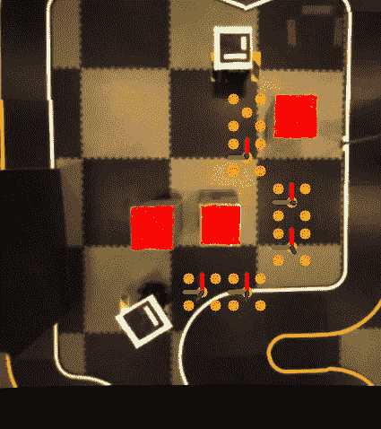

中点姿势，作者图片

## 4.绘制最短路径

然后，我们查看障碍地图，并在图像上画出我们在前面步骤中计算的最短路径的每个中点。

这是最终的地图，其中蓝色的零表示机器人有有效的移动，浅蓝色的 X 表示有障碍，橙色的圆圈表示最短的路径，粗体白色的 S 和 G 分别表示路径的起点和目标点。

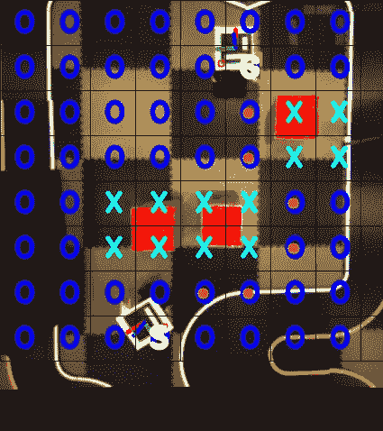

最终地图，图片由作者提供

## 5.在每个中间点上移动

每次执行`on_receive_image`回调时，我们的控制器都会接收当前的姿态向量。如前所述，它计算齐次矩阵，并将其保存为类变量`self.current_homogeneous_matrix`。

对于每个中间点，控制器接收相同的向量并更新列表`target_position_path`类变量。当这个列表没有值时，机器人不会移动，因为它不知道去哪里。当接收到一些值时，它计算这个特定中点的齐次矩阵，并将其保存为类变量`self.target_homogeneous_matrix`。

通过固定角度，然后移动到中点，机器人现在可以在`target_position_path`列表中指定的每个中点上移动。当机器人接近中点并且距离误差很小时，我们得到列表的下一个元素(中点),并继续移动直到列表为空！

# 第三个目标——停车

## 1.计算β欧拉角

在控制器`move_robot`上，有两个循环用于执行前面的步骤(固定角度，向前移动)。出于停车的目的，我们需要添加另一个循环，该循环仅在机器人位于目标位置时执行，该循环的目的是固定相对于指定目标姿态的最终角度。

我们需要额外代码很简单:

```
rotational_matrix = np.array([
            [t[0][0], t[0][1], t[0][2]],
            [t[1][0], t[1][1], t[1][2]],
            [t[2][0], t[2][1], t[2][2]],
        ])

r = R.from_matrix(rotational_matrix)
self.beta = r.as_euler('XYZ', degrees=False)[2]
```

我们将旋转矩阵转换为欧拉角，我们接收一个向量`[x,y,z]`并得到第三个值，因为我们只需要 z 角，我们将它保存为类变量 beta。

## 2.移动机器人以修正角度误差

最后，我们公布所需的角速度，机器人确定β角！

# 演示

执行 Roscore:

```
roscore
```

启动摄像机

```
roslaunch ueye_cam rgb8.launch
```

远程监控，了解更多详情[点击此处](http://wiki.ros.org/robotican/Tutorials/Remote%20monitoring%20and%20control):

```
ssh ubuntu@192.168.0.200
```

关于 turtlebot 运行，更多详情[请点击此处](https://emanual.robotis.com/docs/en/platform/turtlebot3/bringup/):

```
roslaunch turtlebot3_bringup turtlebot3_robot.launch
```

在远程计算机上启动我们的实现:

```
roslaunch visual_servoing visual_servoing.launch
```

[项目的 GitHub 链接](https://github.com/manoskout/visual_servoing/)

[我的 LinkedIn 账户](https://www.linkedin.com/in/manos-mark/)