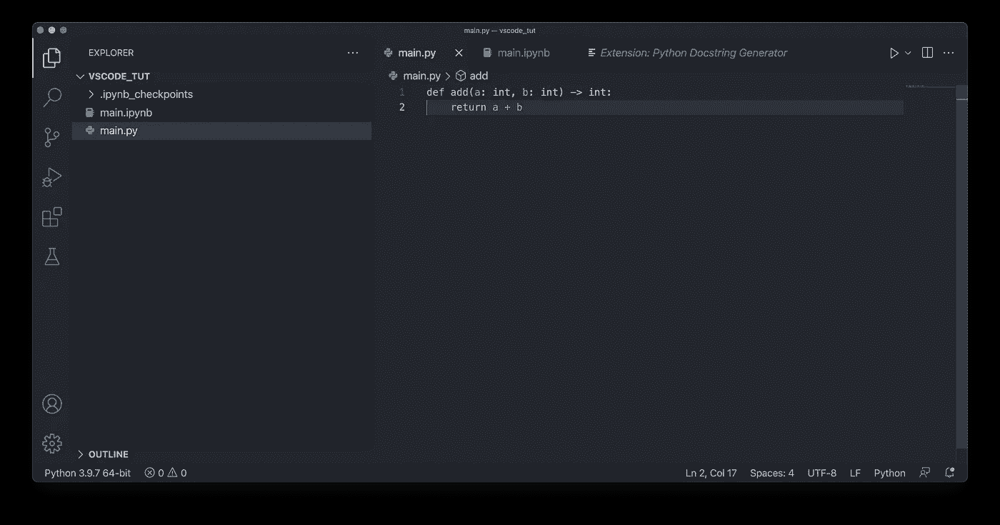
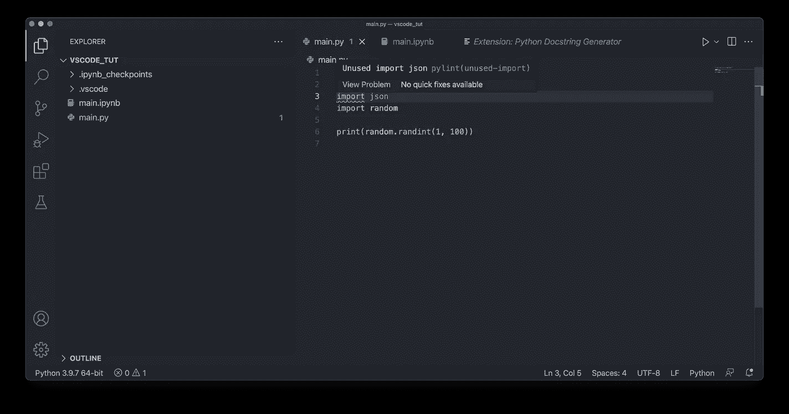

# Python 和数据科学的 Visual Studio 代码？你必须拥有的前 3 个插件

> 原文：<https://towardsdatascience.com/visual-studio-code-for-python-and-data-science-top-3-plugins-you-must-have-c39bb6ed8355?source=collection_archive---------5----------------------->

## 是 Python 和数据科学最好的代码编辑器吗？


照片由[克里斯蒂娜·莫里洛](https://www.pexels.com/@divinetechygirl?utm_content=attributionCopyText&utm_medium=referral&utm_source=pexels)从[佩克斯](https://www.pexels.com/photo/woman-sitting-while-operating-macbook-pro-1181676/?utm_content=attributionCopyText&utm_medium=referral&utm_source=pexels)拍摄

您是否正在努力寻找一个适合 Python 编程和数据科学的最佳代码编辑器？你并不孤单。有大量的选项可供选择——既有免费的也有付费的——今天我将向你展示我最喜欢的免费选项。

这是 Visual Studio 代码——微软的一个完全免费的代码编辑器。这是迄今为止我发现的最灵活、功能最丰富的代码编辑器。它甚至比 PyCharm 社区有更多的功能，py charm 社区应该是一个专业的 IDE。甚至不要让我开始使用 Jupyter——这可能是写笔记本的最好方法，但是对于数据专业人员来说，光有笔记本是不够的。

今天，您将看到我为 Python 编程和数据科学设置 VSCode 的常用方法。我们将从安装开始，从那里开始浏览插件。

不想看书？请观看我的视频:

# 下载并安装 Visual Studio 代码

前往 code.visualstudio.com[下载 VSCode。网页会自动检测你的操作系统，所以你只需要点击蓝色的下载按钮:](https://code.visualstudio.com)


图片 1 — Visual Studio 代码主页(图片由作者提供)

在 Mac 上，它会下载一个 ZIP 文件，你可以提取并拖动应用程序到*应用程序*文件夹。在 Windows 上，我假设您需要打开。EXE 文件，然后点击几次 Next，对于 Linux，它可能是一个终端命令或 DEB 文件。

一旦启动它，您应该会看到以下内容:


图片 2 — Visual Studio 代码(图片由作者提供)

您可以通过打开机器上的任何文件夹，右键单击左侧边栏并选择*新文件*来创建 Python 文件。我在桌面上创建了一个文件夹，里面有一个`main.py`文件:


图 3-在 VSCode 中创建 Python 脚本(图片由作者提供)

默认情况下，您不会有最好的调试选项，也不会有智能感知。您也无法选择虚拟环境。解决这个问题又快又简单。你只需要安装一个插件。但是让我们先解决一些更紧急的事情。

# 下载主题(可选)

在 VSCode 中，我喜欢做的第一件事是更改主题。与 Python 和数据科学无关，所以你要么跳过这一节，要么把它当作加分项。

默认的主题对我来说太微软化了。要更改它，你可以点击*扩展*标签并搜索主题。我特别喜欢 *One Dark Pro* 主题，它是免费的，尽管上面写着 *Pro* :


图 4 —一个深色专业主题(图片由作者提供)

点击主题并点击*安装*按钮。默认皮肤对我来说有点太浅了。在 Mac 上，你可以按 CMD+K CMD+T 打开主题下拉菜单。我最喜欢的是 *One Dark Pro Darker* :


图 5 —使用自定义主题(作者图片)

好多了，不是吗？接下来让我们处理扩展。

# 官方 Python 扩展

如果你想使用 Python，这是必须的。再次进入*扩展*选项卡，搜索 *Python* 。您应该安装微软的官方扩展:


图片 6-官方 Python 扩展(图片由作者提供)

现在，编写 Python 文件将变得更加容易。您现在还可以选择一个虚拟环境，这是您每天都要做的事情。点击左下角的文本 *Python 3.9.7 64 bit* (至少在我的机器上)并选择你想要的任何环境:


图 7 —选择虚拟环境(图片由作者提供)

你知道最棒的是什么吗？您可以立即开始使用 Jupyter 笔记本电脑工作！创建一个`.ipynb`文件来验证——它可能会提示您安装一些额外的依赖项，所以只要同意所有的东西就行了。

安装后，您可以在单元格中输入 Python 代码来验证一切正常:


图 8 —测试 Jupyter 笔记本电脑(图片由作者提供)

就这样——您现在已经安装了基础，因此您可以通过脚本或笔记本使用 Python。接下来让我们添加一些额外的功能。

# Python 文档字符串生成器

编写好的 Python 代码的一个基本技巧是文档。VSCode 可以帮你做到这一点。你需要做的就是安装*Python Docstring Generator*扩展。


图片 9 — Python 文档字符串生成器扩展(图片由作者提供)

让我们看看它是如何工作的。您将编写一个对两个整数求和的虚拟 Python 函数:

```
def add(a: int, b: int) -> int:
    return a + b
```

在`main.py`里面写函数:



图 10-虚拟 Python 函数(图片由作者提供)

现在，您可以通过在函数声明下面写三个双引号并选择*生成文档字符串*选项来添加文档字符串:


图 11 —文档字符串生成器(图片由作者提供)

它会立即为您编写样板文件:


图 12 — Docstring 样板文件(作者图片)

您现在所要做的就是编辑描述和每个参数的作用:


图 13 —编辑文档字符串(作者图片)

这比从头开始编写所有内容要容易得多。也许你看不到好处，因为我们只有一个函数，但是想象一下你有多个 Python 模块，每个模块有几十个函数——那么这个扩展是一个巨大的时间节省。

# 蟒蛇绒

最后，我想讨论一下林挺。您可以在 VSCode 中启用林挺来自动告诉您是否没有遵循 Python 约定。它会告诉您是否有未使用的导入、变量，或者您的代码中是否有需要改进的地方。

首先，打开*命令调色板*(设置—命令调色板…或按 SHIFT + CMD + P)并输入 *Linter* 。选择*选择棉绒*选项:


图 14-选择 Python linter(图片由作者提供)

*PyLint* 是最受欢迎的一个，点开就行了:


图 15 —棉绒选项(图片由作者提供)

如果还没有安装 PyLint，它会要求您安装它。您必须对每个虚拟环境重复这一过程，因此请记住:


图 16 —安装 PyLint(图片由作者提供)

现在让我们删除`add()`函数，探索一下 PyLint 提供了什么。您将导入`json`和`random`模块，并打印一个 1 到 100 之间的随机整数:

```
import json 
import random

print(random.randint(1, 100))
```

它应该是这样的:


图 17-警告信息(1)(图片由作者提供)

一旦保存文件，您就会看到警告消息。`print`语句报错是因为它后面没有新的一行，但这是一个快速解决方法——只需在行尾按 Enter 键。

顶部的 import 语句带有下划线，因为我们在顶部没有文件级的 docstring，所以让我们快速编写一个:


图 18-警告信息(2)(图片由作者提供)

如果保存文件，警告不会消失。它现在抱怨你已经导入了`json`，但是没有在文件中使用它:



图 19-警告信息(3)(图片由作者提供)

删除未使用的导入后，该消息将消失。

总而言之，linters 可以帮助您编写更好的 Python 代码，并确保您遵循所有的约定。如果 linter 向您发出警告消息，您的代码仍然会运行，但是查看这些消息很烦人，所以当它们出现时，您可能会处理它们。

今天就到这里。我在 VSCode 中的 Python 和数据科学设置有些简单，但它完成了工作。

*你最喜欢的 Python 和数据科学的 VSCode 扩展有哪些？请在下面的评论区告诉我。*

*喜欢这篇文章吗？成为* [*中等会员*](https://medium.com/@radecicdario/membership) *继续无限制的学习。如果你使用下面的链接，我会收到你的一部分会员费，不需要你额外付费。*

[](https://medium.com/@radecicdario/membership) [## 通过我的推荐链接加入 Medium-Dario rade ci

### 作为一个媒体会员，你的会员费的一部分会给你阅读的作家，你可以完全接触到每一个故事…

medium.com](https://medium.com/@radecicdario/membership) 

# 保持联系

*   注册我的[简讯](https://mailchi.mp/46a3d2989d9b/bdssubscribe)
*   订阅 [YouTube](https://www.youtube.com/c/BetterDataScience)
*   在 [LinkedIn](https://www.linkedin.com/in/darioradecic/) 上连接