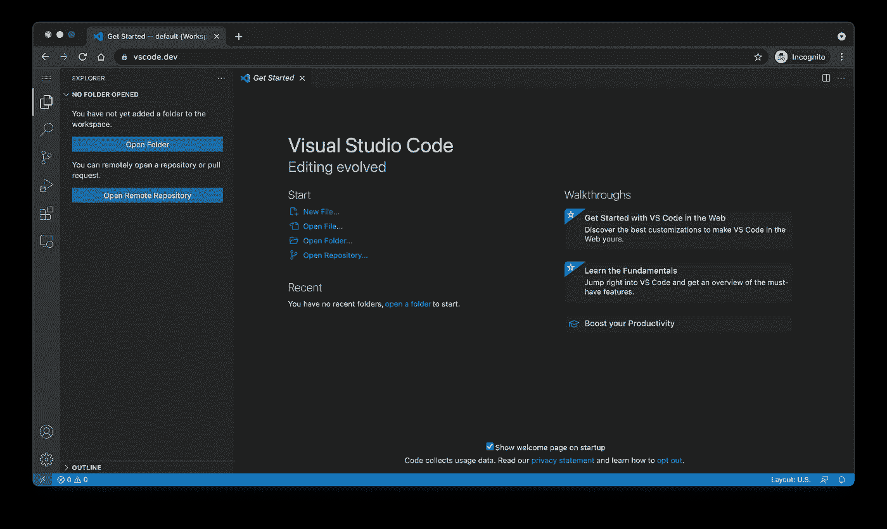
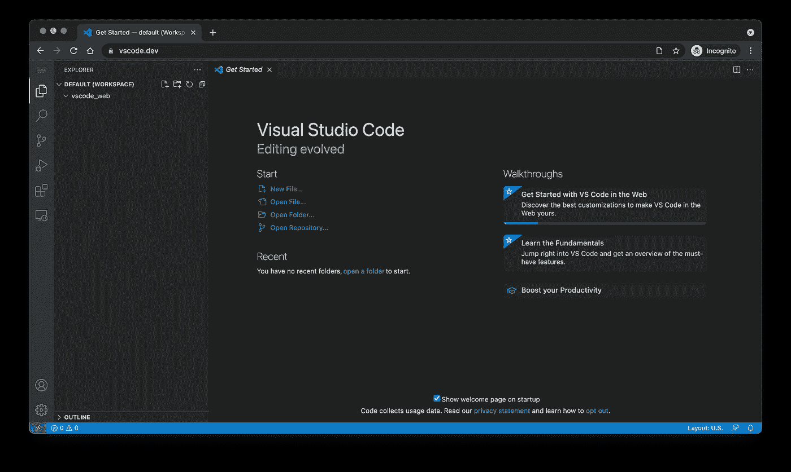
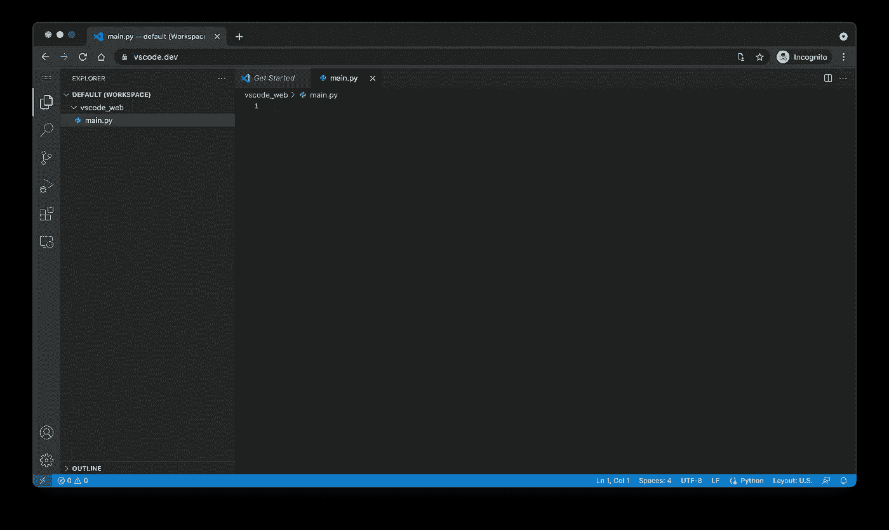
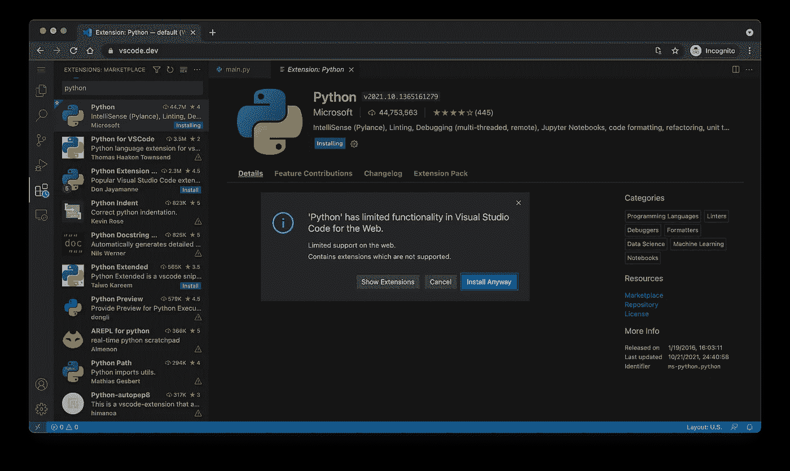
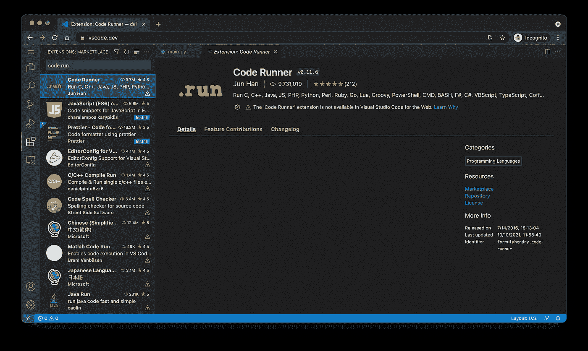
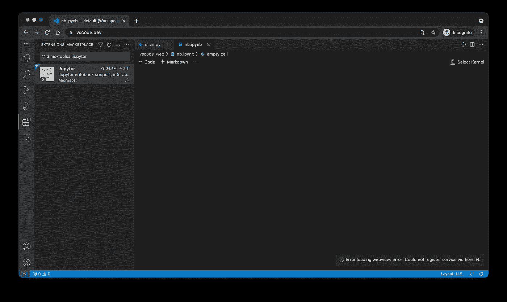

# Visual Studio 代码现在可以作为 Web 应用程序使用。你应该关心吗？

> 原文：<https://towardsdatascience.com/visual-studio-code-is-now-available-as-a-web-app-should-you-care-eb0a7f2766e6?source=collection_archive---------3----------------------->

## 意见

## 这让 Python 程序员和数据科学家非常失望——原因如下

照片由[韦斯·希克斯](https://unsplash.com/@sickhews?utm_source=unsplash&utm_medium=referral&utm_content=creditCopyText)在 [Unsplash](https://unsplash.com/?utm_source=unsplash&utm_medium=referral&utm_content=creditCopyText) 上拍摄

Visual Studio 代码是我最喜欢的 Python 编程和数据科学的代码编辑器。对于任何数据科学工作流来说，它都是一把瑞士军刀，因为它支持 Python 文件、笔记本、远程连接和几乎任何你能想象到的东西。此外，它是完全免费的。

微软最近决定把它带到网络上——这是一个大胆的举动，但我能看到开发者如何从中受益。对于数据科学家来说，这是一个完全不同的故事，因为它在当前的迭代中已经毫无用处。继续阅读，找出原因。

不想看书？请观看我的视频:

# 如何开始使用 VSCode Web

只需前往 [vscode.dev](https://vscode.dev) 。一个熟悉的界面会立即出现:

图 1 — Visual Studio 代码 Web 界面(图片由作者提供)

在这里，您可以从您的机器上打开一个文件夹，也可以打开一个远程存储库。我在桌面上为这篇文章创建了一个专用的`vscode_web`文件夹，所以我选择第一个选项。

**请记住** —你不能在 Safari 中打开本地文件夹，因为它还不被支持。一定要安装一个更消耗资源的网络浏览器。如果您发现另一个不受支持的浏览器，请告诉我。

假设您在受支持的浏览器中，您可以毫无问题地打开本地目录:

图 2 —在 VSCode Web 中打开本地目录(图片由作者提供)

好了，我们可以走了！在开始扩展之前，让我们创建一个 Python 文件。我给我的取名`main.py`:

图 3-在 VSCode Web 中创建 Python 文件(图片由作者提供)

这基本上涵盖了好的部分。对于 Python 程序员和数据科学家来说，事情从此开始走下坡路。

# 面向 Python 和数据科学的 VSCode Web 扩展

VSCode 就像没有扩展的记事本一样有用。目前，VSCode Web 的可用扩展数量令人失望。作为一名数据科学家，你可能找不到你想要的东西。

先说微软官方的 Python 扩展。您可以安装它，但它会立即警告您该扩展在 VSCode Web:

图片 VSCode 的 Python 扩展(图片由作者提供)

然而，你可以安装它没有任何问题。它增加了智能感知、林挺、代码格式化和任何你能想到的 web 应用。

如果你不会运行 Python 代码，那么写 Python 代码就毫无意义。 **Visual Studio 代码 Web 不包终端支持**。不容易消化但是可以理解。出于显而易见的原因，向 web 应用程序添加终端并不容易。

一个可能的解决方案是安装*代码运行器*扩展。它向 Python(和其他)文件添加了一个按钮，允许您运行代码。问题是——不支持扩展:

图 5 —不支持的扩展(图片由作者提供)

这意味着您被困在一个无法运行的 Python 文件中。您可以创建 Python 文件，并随意编辑它们，但仅此而已。

我现在看到的唯一选择是创建一个 **Jupyter Notebook** 并交互执行代码。我给我的取名为`nb.ipynb`。这又是一件令人失望的事情，因为你不能创建一个新的*代码*单元或者改变 Python 内核。猜猜为什么不支持 Jupyter 扩展:

图 6 —没有 Jupyter 支持(图片由作者提供)

总结一下，你能做的不多。在这一点上，我找不到任何值得谈论的好处。也许将来事情会有所改变，但不能保证。

我们可以花更多的时间来测试与远程机器的连接等等，但是如果连最基本的东西都不能用，那还有什么意义呢？

# 结论

如果您希望作为 Python 程序员或数据科学家使用 Visual Studio Code Web，您没有太多选择。您可以创建 Python 文件，并在适当的智能感知和林挺中享受，但这几乎概括了您的选择。您不能管理虚拟环境、调试代码、通过扩展或终端运行 Python 文件，甚至不能在 Jupyter 笔记本上运行代码。

简而言之，只需在本地安装 VSCode，目前使用 web 版本没有意义。也许未来的版本会扩展功能并增加对额外扩展的支持，但是谁知道呢。这肯定会是一个可喜的变化。

*你作为 Python 程序员或者数据科学家尝试过 VSCode Web 吗？你有什么想法？*请务必在下方评论区分享。

*喜欢这篇文章吗？成为* [*中等会员*](https://medium.com/@radecicdario/membership) *继续无限制学习。如果你使用下面的链接，我会收到你的一部分会员费，不需要你额外付费。*

 [## 通过我的推荐链接加入 Medium-Dario rade ci

### 作为一个媒体会员，你的会员费的一部分会给你阅读的作家，你可以完全接触到每一个故事…

medium.com](https://medium.com/@radecicdario/membership) 

# 保持联系

*   注册我的[简讯](https://mailchi.mp/46a3d2989d9b/bdssubscribe)
*   在 YouTube[上订阅](https://www.youtube.com/c/BetterDataScience)
*   在 [LinkedIn](https://www.linkedin.com/in/darioradecic/) 上连接