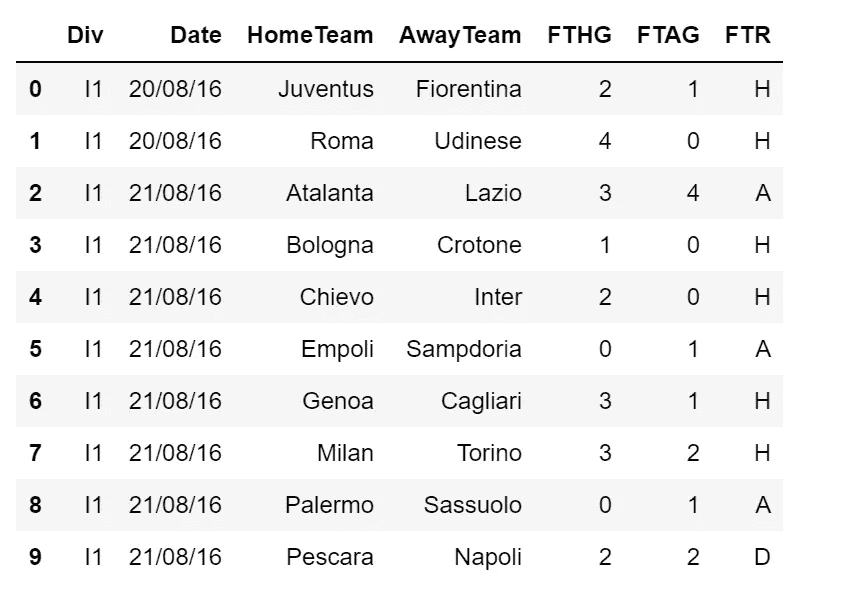
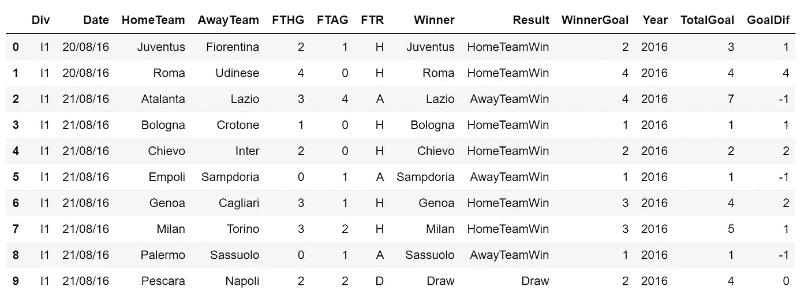
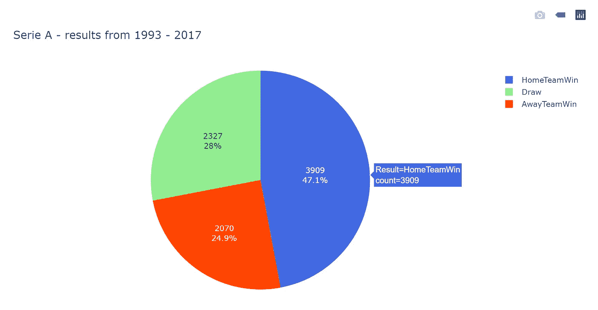
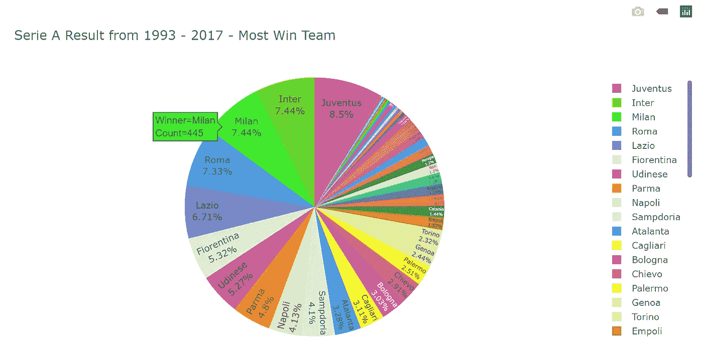
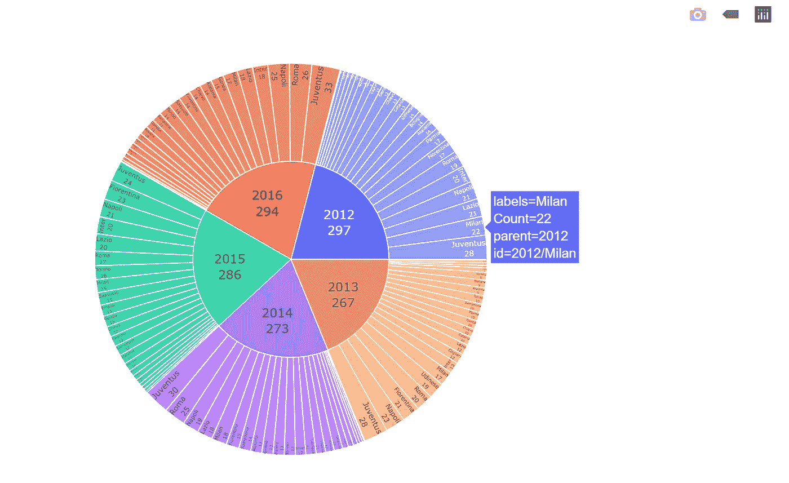
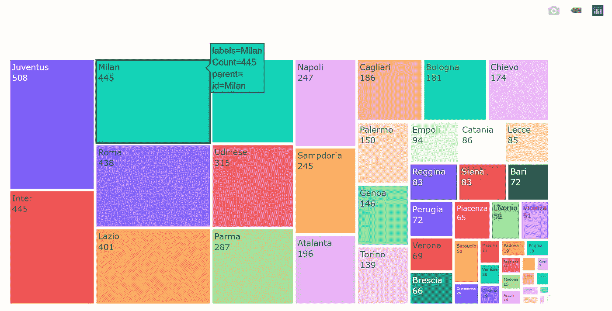
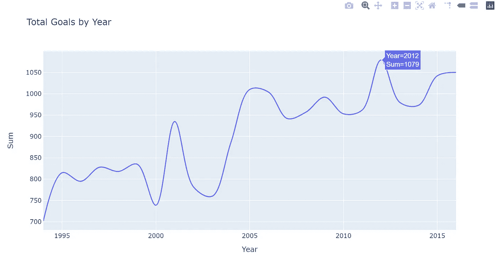
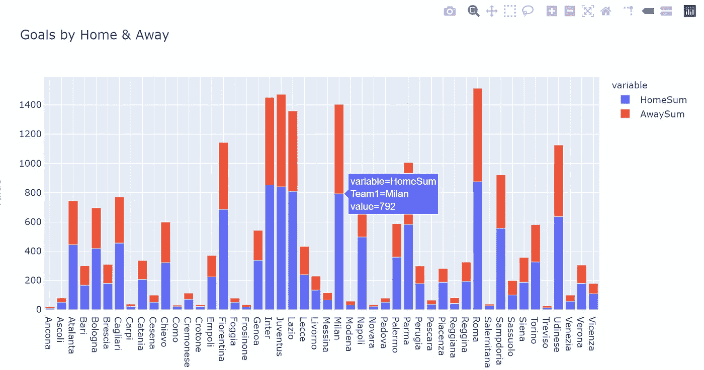
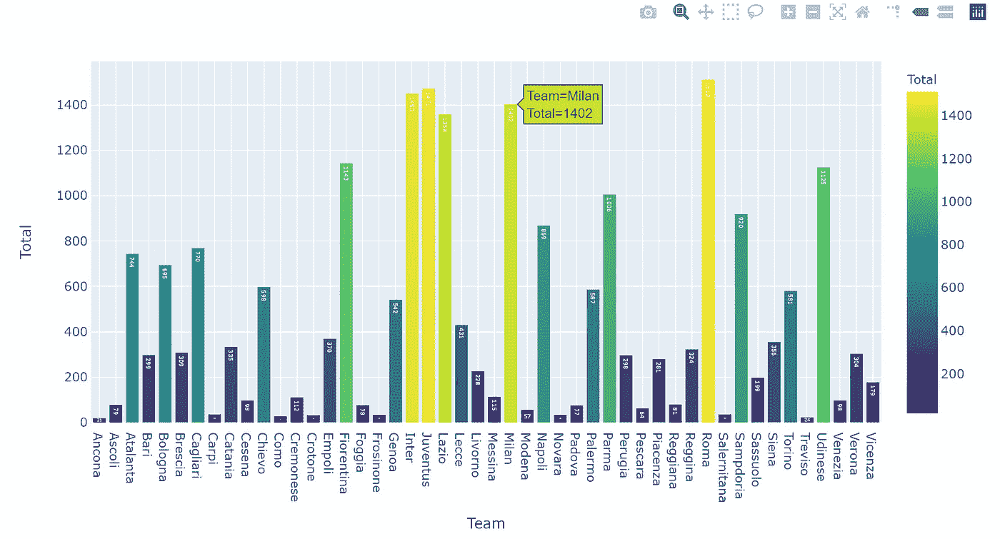

# 可视化与熊猫和 Plotly 意甲(足球联赛)数据

> 原文：<https://towardsdatascience.com/visualise-serie-a-football-league-data-with-pandas-and-plotly-3d26bcf26f2d?source=collection_archive---------28----------------------->

上次我用意甲数据比赛，试图了解更多关于米兰德比的信息。然后我想对数据做更多的探索，这样我可以更好地了解球队在意甲的表现。作为数据可视化的忠实粉丝，饼状图、树状图、线图和条形图都被采用。


托马斯·塞勒在 [Unsplash](https://unsplash.com/s/photos/football?utm_source=unsplash&utm_medium=referral&utm_content=creditCopyText) 上的照片

# 先决条件—软件包

本次分析使用的包有:**熊猫**用于数据清洗； **glob** 用于数据合并； **numpy** 用于数据过滤和分组； **plotly.express** 用于数据可视化

```
import pandas as pd
import glob
import numpy as np
import plotly.express as px
```

# 步骤 1 获取数据、导入数据和合并数据

当前分析中使用的数据来自 ka ggle([https://www.kaggle.com/massibelloni/serie-a-19932017](https://www.kaggle.com/massibelloni/serie-a-19932017))。我下载了 1993 年到 2017 年的所有意甲数据，保存到本地文件夹。

```
path = r'....(your local folder)\SerieA'
all_files = glob.glob(path + "/*.csv")table = []for filename in all_files:
    data = pd.read_csv(filename, index_col=None, header=0)
    table.append(df)frame = pd.concat(table, axis=0, ignore_index=True)
```

由于分析仅使用了前七列的数据，因此选择了这些列:

```
df = frame.iloc[:,0:7]
```

现在数据帧看起来像这样:



**图 1** :测向头(10)

# 步骤 2:根据可视化需要添加列

为了更好地显示，基于当前数据框添加了一些列:

```
### To identify the winner of each match: if "H"- the home team was the winner, if "A" the away team was the winner, else draw:df['Winner'] = np.where(df['FTR'] == 'H',df['HomeTeam'],
                          np.where(df['FTR'] == 'A', df['AwayTeam'], "Draw"))### To identify the result of each match: whether the home team won, the away team won, or drew:df['Result'] = np.where(df['FTR'] == 'H','HomeTeamWin',
                          np.where(df['FTR'] == 'A', 'AwayTeamWin', "Draw"))### To identify how many goals did the winner had:
df['Result'] = np.where(df['FTR'] == 'H','HomeTeamWin',
                          np.where(df['FTR'] == 'A', 'AwayTeamWin', "Draw"))### To get the "Year" of each match:
df['Year']=pd.DatetimeIndex(df['Date']).year### To get the total number of goals in each match and the goal differences:
df['TotalGoal'] = df['FTHG'] + df['FTAG']
df['GoalDif']= df['FTHG']- df['FTAG']
```

包含更多列的数据框如下所示:



**图二**:测向头(10)

# 视觉化

# 饼图 I

首先，我想知道的基本信息是，在意甲联赛中，赢一场比赛和平局的比例是多少；谁更有机会赢得这场比赛——主队还是客队:

为了获得这种可视化，在应用 plotly.express 之前，我首先对“结果”进行分组:

```
### Group the data by Result:
general = df.groupby('Result')['Result'].count().reset_index(name = "count")### Apply px.pie:
fig1 = px.pie(general, values ='count', names ='Result', title='Serie A - results from 1993 - 2017', color = 'Result',
             color_discrete_map={'HomeTeamWin':'royalblue',
                                 'AwayTeamWin':'orangered',
                                 'Draw':'lightgreen'})### Add text and define text information:
fig1.update_traces(textposition='inside', textinfo='percent+value')
fig1.show()
```



**图 3** :饼状图一——赢/平比例

这张图表清楚地表明，近 70%的比赛都有赢家，而且主队比客场更有可能获胜——我认为这就是所谓的——**主队优势**！

# 饼图 II

我真正感兴趣的另一件事是哪支球队赢得了最多的比赛，排名是怎样的:

```
### Group by Winner 
teamresult = df.groupby('Winner')['Winner'].count().reset_index(name = "Count")### Drop the results which were "Draw" as this data was not required for the visualisation
teamresult = teamresult[teamresult.Winner != 'Draw']### Visualisation
fig2 = px.pie(teamresult, values = 'Count', names = 'Winner', title = "Serie A Result from 1993 - 2017 - Most Win Team", color = 'Winner', color_discrete_sequence=px.colors.qualitative.Light24)
fig2.update_traces(textposition='inside', textinfo='percent+label')
fig2.show()
```



**图 4** :饼状图一 I——最多胜队比例

有趣的是，尤文图斯比其他球队赢得了更多的比赛，紧随其后的是国际米兰。

# 旭日图

我在 PowerBI 可视化中经常使用的一种奇特的图表是旭日图。在这个想象中，我想知道从 2012 年到 2016 年，哪支球队每年赢得更多的比赛。

```
### To remove "draw" results and filter the year between 2012-16
sun = df[(df.Winner != 'Draw') & (df.Year.between(2012,2016))]### Group results by Year & Winner
sun1 = sun.groupby(['Year','Winner'])['Winner'].count().reset_index(name = "Count")### Sunburst chart visualisation
fig3 = px.sunburst(sun1, path=[ 'Year','Winner'], values='Count')
fig3.update_traces(textinfo = 'label + value')
fig3.show()
```



**图 5** :旭日图——团队年度冠军

# 树形图

另一种形象化比例的方法是树形图，我发现这种方法非常方便且易于理解。下面是一个使用树形图直观显示团队获胜总数的示例:

```
### Remove the results which were "draw"
treemap = df[(df.Winner != 'Draw')]### Group data by Team
treemap1 = treemap.groupby('Winner')['Winner'].count().reset_index(name = "Count")### Visualise the data with treemap
fig4 = px.treemap(treemap1, path=['Winner'], values='Count'
            )
fig4.update_traces(textinfo = 'label + value')
fig4.show()
```



**图六**:树状图——最多获胜的队伍

如您所见，treemap 是一个非常好的图表，可以显示不同项目之间的比例和比较。尤其是当你比较许多项目时，饼图可能会受到文本/注释空间的限制，treemap 提供了一种更好的方式来呈现这些信息。

**折线图**

为了进一步探索这些数据，我想创建一个折线图，显示每年的总目标:

```
### Group total goals by year
total_goal =df.groupby('Year')['TotalGoal'].agg('sum').reset_index(name = 'Sum')### Remove the data for 1993 and 2017 as it seemed that the data for those years were not complate
total_goal = total_goal[(total_goal.Year != 2017) & (total_goal.Year != 1993)]### Visualise by line chart
fig5 = px.line(total_goal, x = 'Year', y = 'Sum', title = 'Total Goals by Year',
              line_shape = 'spline')
fig5.show()
```



**图 7** :折线图——总目标

**条形图**

我想知道的另一件事是，作为主客场球队，球队的表现有什么不同。当他们是主队时，他们进了更多的球吗？

```
### Number of goals for hometeam
test1 = df.groupby('HomeTeam')['FTHG'].agg('sum').reset_index(name = 'HomeSum')
test1 = test1.rename(columns={"HomeTeam": "Team1"})### Number of goals for awayteam
test2 = df.groupby('AwayTeam')['FTAG'].agg('sum').reset_index(name = 'AwaySum')
test2 = test2.rename(columns = {'AwayTeam':'Team2'})### Merge two dataframe
result = pd.concat([test1, test2], axis=1)
dt = result.drop(['Team2'], axis=1)### Visualise the chart
fig6 = px.bar(dt, x = "Team1", y =['HomeSum','AwaySum'], title = 'Goals by Home & Away')
fig6.show()
```



**图 8** :条形图——主场/客场进球

看起来球队在主场比赛时更有可能进球。

每个队的总目标是什么？

```
### Total goals by each team
dt['Total'] = dt['HomeSum']+dt['AwaySum']### Rename column
dt= dt.rename(columns={'Team1':'Team'})### Bar chart visualisation
fig6 = px.bar(dt, x='Team', y='Total', text = 'Total', color = 'Total',
              color_continuous_scale=px.colors.sequential.Viridis)
fig6.update_traces(textposition='inside')
fig6.show()
```



**图 9** :团队总目标

令人惊讶的是，罗马在那些年里有超过 1500 个进球，尽管这支球队赢得了一次联赛冠军。

**总而言之**

我喜欢图表讲述意甲历史的方式！