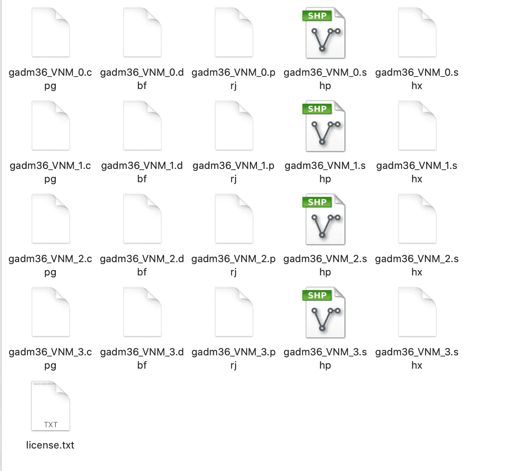
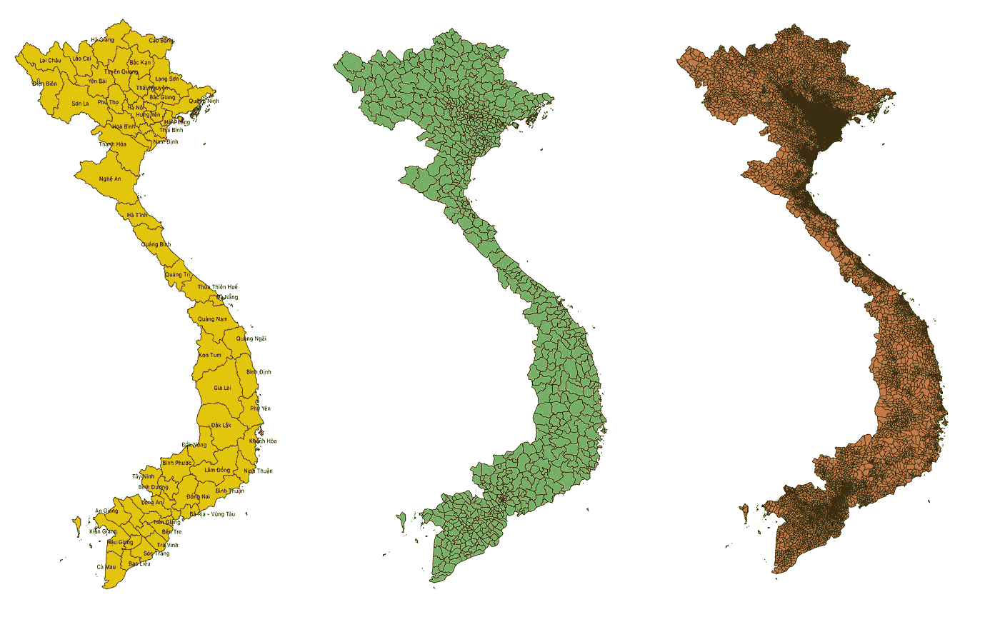
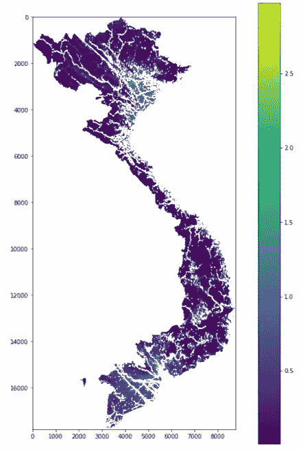
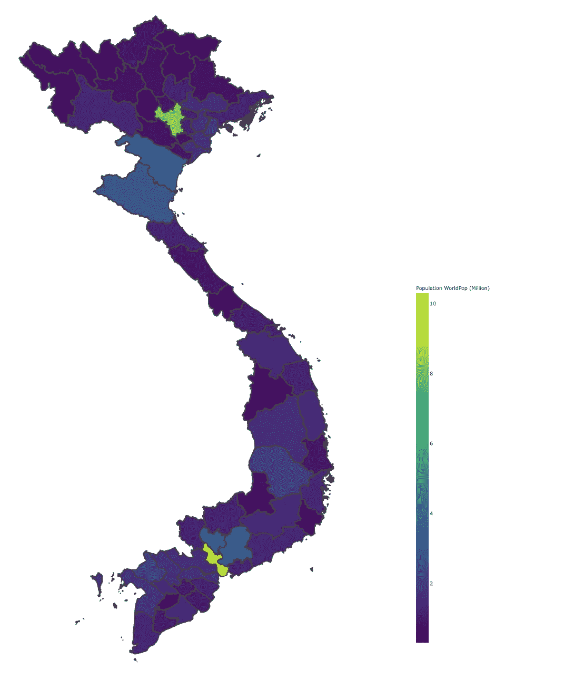
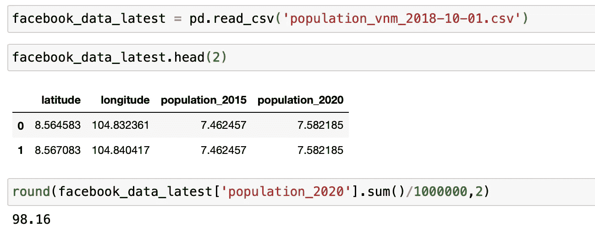
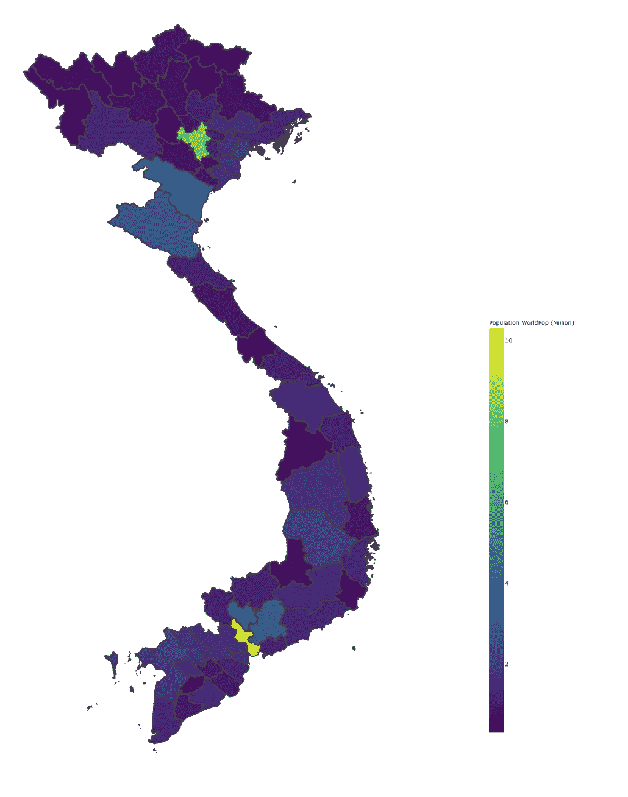
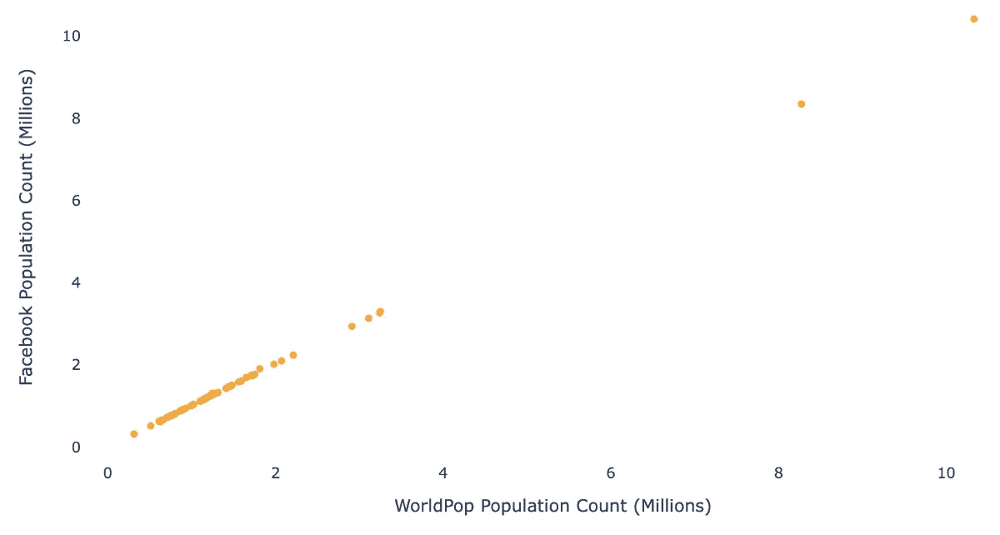

# 用 Python 可视化全球人口数据集

> 原文：<https://towardsdatascience.com/visualising-global-population-datasets-with-python-c87bcfc8c6a6?source=collection_archive---------17----------------------->

## Python 实践教程

## 由面 shapefiles 限定的地理空间栅格和矢量数据集的汇总统计数据

*这项工作完全使用公开可用的数据完成，并与*[***Kai Kaiser***](https://medium.com/@kaialexander.kaiser/about)*合作完成。所有错误和遗漏都是作者的。*


美国宇航局在 [Unsplash](https://unsplash.com/collections/6768759/population?utm_source=unsplash&utm_medium=referral&utm_content=creditCopyText) 拍摄的照片

**关于人口分布的地图信息**对于地球上不同国家背景下的一系列公共政策问题至关重要。掌握人口的地理分布及其主要特征的能力是衡量遭受灾害和气候变化影响的程度以及获得健康、环境和土地使用压力等关键服务的机会差异的一个组成部分。无论是出于规划、预算还是监管目的，足够精细和及时的人口数据对于更加循证的决策都是必要的。

新一代高分辨率人口估计计数图层将对公共部门决策做出越来越大的贡献，特别是在发展中国家。制图层依靠非传统的数据收集方法，包括使用卫星图像。因此，他们可以提供分辨率低至 30 米的地球上任何网格单元的人口估计。他们的最新更新可以通过应用程序编程接口(API)在线访问，这使他们成为数据驱动型决策者潜在的非常有价值的资产。

这些高分辨率人口地图解决了传统行政或统计人口普查数据的一些关键局限性。人口普查数据通常缺乏频繁更新，大多数国家大约每十年才更新一次。它们通常以表格管理分类的形式呈现，与更细粒度的基于网格的层相比，这限制了分析和可视化选项。家庭一级的人口普查数据很少在地理参照的基础上收集，或在这一级披露。国家和国家以下各级政府维持的出生和死亡行政登记册也不总是可靠或更新的，特别是在低收入和中等收入国家。

> 脸书研究高分辨率定居层(HRSL)和 World Pop 等数据集采用新一代高分辨率人口估计技术，可随时用于一系列描述性和规范性分析。

[WorldPop](https://www.worldpop.org/project/categories?id=3) 项目于 2013 年启动，目标是提供人口和人口统计数据集的开放访问，以支持发展、灾难和健康应用。它整合了在小区域进行的邻里级微观人口普查调查以及国家级卫星图像和数字制图。简而言之，WorldPop 利用机器学习建模(随机森林)从相对稀疏的微观人口普查数据中推断出高分辨率的国家人口估计值(包括预测未调查地区的人口)，并从 2000 年**到 2020 年**(截至 2020 年 11 月)每年提供**。网格化人口数据或光栅图像的空间分辨率详细到 **3 弧秒**(赤道**约为**100 米)。这种高分辨率人口统计估计数的时间可用性使得确定国家和区域两级的人口增长和动态更加容易。**

另一个这样的合作是脸书与国际地球科学信息网络中心(CIESIN)的合作，使用人工智能从卫星图像中识别建筑物，并以 30 米的分辨率估计人口。在国家一级也进行了调整，以使普查人口与联合国估计数相匹配。这些调整是为了配合联合国对 2015 年和 2020 年国家人口的估计。

在实践中，决策者可能还不太熟悉如何获取、分析、应用并最终采用这些数据来进行决策。更加熟悉也将有助于他们了解这些新数据资源的可能优势和应用，以及它们在决策方面的局限性。

> 为了支持基于数据和数据驱动的决策，在线 Jupyter 笔记本 Python 环境( **JPNEs** )允许以可访问和可复制的方式实现数据分析和可视化。

JNPEs 集成了编程代码、直观描述以及数字和视觉输出(cite)。当在线实施时，它们不需要用户安装或下载任何本地软件。JPNE 不仅在交付工作方面非常强大，而且最重要的是促进了领域和公共部门专家与数据科学家之间的密切合作。

> 在这篇博客中，我们用 Python 在一个 **JPNE** 中探索了 **WorldPop 人口统计(以 tif 文件下载的 100m *分辨率的栅格格式)和来自脸书的高分辨率***人口密度地图(**矢量**格式，以 ***30m 分辨率下载的 csv*** )并可视化了越南不同行政单位的人口统计。

为了提取不同行政单位的估计人口数量，我们还需要将越南的数字边界表示为 shapefiles(一种简单的非拓扑格式，用于存储表示为面或区域的要素的几何位置和属性信息)。

因此，这项分析需要三个数据集——来自 WorldPop 和脸书的人口数据，以及来自 GADM 的行政边界数据。分析包括 4 个步骤-

1.  从 **GADM** 加载并浏览行政边界数据
2.  从 **WorldPop** 加载、浏览和可视化人口数据
3.  从**脸书**加载、探索和可视化人口数据
4.  比较和总结结果

## 从 GADM 加载并浏览行政边界数据

[全球行政区域数据库 GADM](https://gadm.org/data.html)是一个高分辨率的国家行政区域数据库，最新版本划定了 386735 个行政区域。越南的国家级数据已下载，并生成了一个具有以下结构的文件夹。



GADM 的文件夹结构(来源——作者)

文件的索引(0，1，2，3)表示边界可用的管理级别。

越南被划分为 58 个省和 5 个直辖市，由中央政府管理，总共有 63 个一级行政区。越南各省再细分为二级行政单位，即区、省辖市和区级城镇。城市又分为农村地区、区级城镇和城市地区，城市地区又分为选区。因此，GADM 的数据包括 686 个二级单位和 7658 个三级行政单位。

gadm 造型文件用 [*geopandas*](https://geopandas.org/en/stable/) 读取。

```
vietnam_administrative_boundaries = geopandas.read_file('Data/gadm36_VNM_shp/gadm36_VNM_3.shp')vietnam_administrative_boundaries['NAME_0'].unique()
**> Vietnam**vietnam_administrative_boundaries['NAME_1'].nunique()
**> 63**vietnam_administrative_boundaries['NAME_2'].nunique()
**> 686**vietnam_administrative_boundaries['NAME_3'].nunique()
**> 7658**
```



越南一级、二级和三级行政单位(资料来源——作者)

## 从 WorldPop 加载和浏览人口数据

我们从 WorldPop 下载了光栅格式的越南人口每像素(PPP)数据，分辨率为 100 米，调整后与联合国国家估计值相匹配。我们使用 *rasterio* ，一个 GDAL 和基于 numpy 的 python 库来读取作为 tif 文件下载的栅格数据。

```
vietnam_worldpop_raster = rasterio.open('vnm_ppp_2020_UNadj.tif')
```

栅格数据是任何像素化(或网格化)的数据，其中每个像素都与特定的地理位置相关联。像素值可以是连续的(例如高程)或分类的(例如土地利用)。地理空间栅格与数字照片的唯一不同之处在于，它伴随着将数据与特定位置联系起来的空间信息。这包括栅格的范围和像元大小、行数和列数及其坐标参考系统(CRS)。栅格数据集包含一个或多个称为波段的图层。例如，彩色影像有三个波段(红色、绿色和蓝色)，而数字高程模型(DEM)有一个波段(保存高程值)，多光谱影像可能有多个波段。

```
print('No. of bands:',(vietnam_worldpop_raster.count))
**> No. of bands: 1**
```



WorldPop 栅格图层-越南(来源-作者)

```
**# Calculating total population of Vietnam**worldpop_raster_nonzero = vietnam_worldpop_raster_tot[vietnam_worldpop_raster_tot>0]population_worldpop = worldpop_raster_nonzero[worldpop_raster_nonzero > 0].sum()print(round(population_worldpop/1000000,2),'million')
**> 97.34 million**
```

栅格图层给出了越南总人口**9734 万。然后，我们使用从 GADM 文件中提取的多边形来遮罩此栅格图层，以识别越南 63 个省和直辖市(一级行政单位)中每个省和直辖市的人口数量。以下函数返回 vector_polygon 中栅格图层的人口数。**

来源—作者

该代码通过添加一个名为 population_count_wp 的列来创建以下结果，该列包含基于 WorldPop 栅格数据的 ADM 级别 1 的人口估计值。然后，我们使用下面的代码片段，使用 [Plotly Choropleth map](https://plotly.com/python/choropleth-maps/) 来可视化种群数量。

来源—作者



越南各城市的百万人口(资料来源-作者)

## 加载并浏览脸书的人口数据

脸书人口地图估计了居住在越南 30 米范围内的人口数量，该地图可以以 tif 文件或 CSV 文件的形式在 HDX 下载。由于我们对 tif 格式的 WorldPop 数据进行了预处理，我们在这里演示了以下列格式下载的 CSV 文件。



2021 年 11 月 11 日从 HDX 下载的数据(来源——作者)

CSV 文件包含截至 2015 年和 2020 年的纬度、经度和人口估计值。脸书的数据估计越南总人口为 9816 万。

为了使用 WorldPop 数据演示的地理空间工具和技术，我们需要将此数据框架转换为包含几何字段的地理数据框架。

然后，我们使用带有面的矢量图层的掩膜函数获得每个行政边界的人口数。

然后我们使用下面的代码绘制 choropleth 地图



越南各城市的脸书人口以百万计(资料来源-作者)

## **结论**

现在在 JPNE 中预览了两个地图图层，我们现在转向通过大多数决策者熟悉的更熟悉的管理定义镜头来比较结果。为了做到这一点，我们可以用下面的散点图来显示世界流行与脸书结果的比较比率。一条 45 度线意味着任何给定地点的结果都是相同的。

在省/市一级，世界人口普查和脸书的人口统计显示出高度的相关性。



在第二个行政级别，特别是在平阳和胡志明市，与世界人口普查相比，脸书的人口数量相对较少。这是否是一个问题最终取决于所提的问题。JPNEs 允许快速查看使用一个数据源而不是另一个数据源对当前问题产生实质性影响的程度。

脸书和越南 ADM 二级世界流行人口计数之间的相关性(来源-作者)

平台(如 JPNEs)和数据(脸书研究 HRSL 和 World Pop)方面的数字技术发展为解决一系列政策问题提供了强大的组合。但这些需要领域专家(例如，规划、金融或卫生领域的政府官员)以及数据科学家(工程师/程序员)之间的实际协作。

*这位从业者的博客是作为针对越南的* ***颠覆性公共资产治理技术(DT4PAG)*** *项目的一部分而产生的，该项目由世界银行在越南发起，得到了* ***瑞士国家经济事务秘书处(SECO)*** *的支持。*


*DT4PAG 提倡使用基于云的开源平台和数据，以及从业者通过技能建设进行学习。更好地为绿色、可持续发展提供信息。本说明中表达的观点是作者的观点，所有剩余的错误和遗漏都是我们自己的。*

*本教程的完整代码可以在*[*GitHub repo*](https://github.com/Analytics-for-a-Better-World/Blogs)*中找到。*即使您不是 Python 程序员，我们也希望这篇文章能让您直观地感受到利用这类数据进行新一代决策支持的可能性和过程。