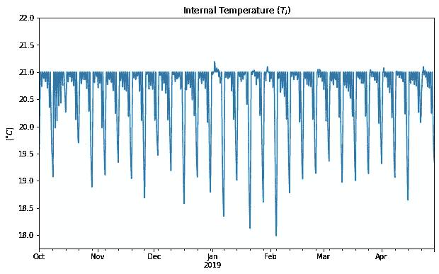
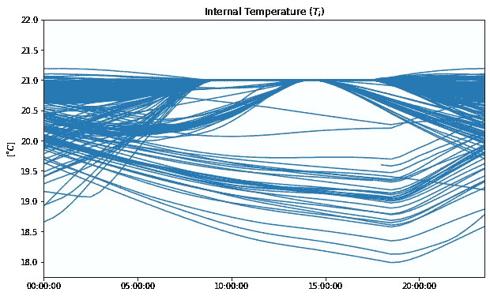
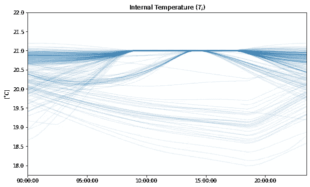
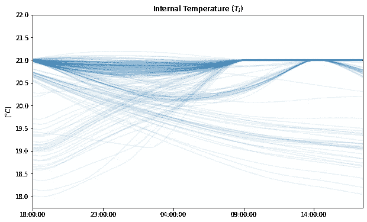
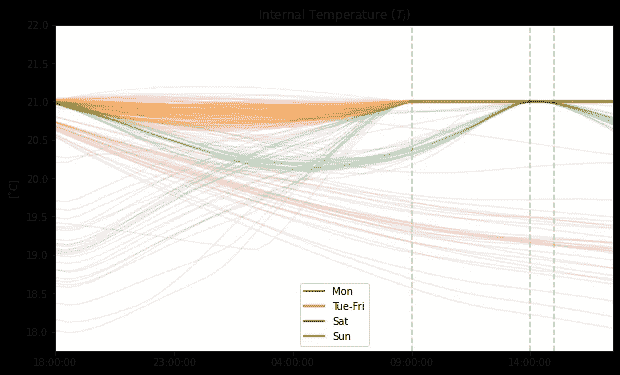

# 时间序列数据中的可视化模式:2D 叠加图

> 原文：<https://towardsdatascience.com/visualising-patterns-in-time-series-data-2d-overlay-plots-fb8920139044?source=collection_archive---------23----------------------->

## 如何为具有周期性的时间序列数据集创建漂亮的绘图

艾萨克·史密斯在 [Unsplash](https://unsplash.com?utm_source=medium&utm_medium=referral) 上拍摄的照片

# 什么是 2D 叠加图？

存在许多不同种类的时间序列数据，选择正确的方式来可视化它们并不总是简单的。具有周期性的数据尤其难以可视化，因为在许多情况下，由于单个图上的数据量巨大，周期性会丢失。

考虑到大多数人会发现很难识别一维照片上的任何东西，像素显示在一行中，这并不奇怪。然而，一旦像素以正确的二维格式重新排列，这个问题就神奇地消失了！

> 类似地，对具有周期性的数据应用简单的变换以使其二维化，通过以有助于人类理解的方式呈现数据，可以在可视化数据中固有的复杂模式方面创造奇迹。

有意地，我不会给你一个什么是 2D 叠加图的定义，也不会在这一点上给你看。我要做的是通过下面的一个例子一步一步地让你理解。

示例中的数据可能具有日、周和年模式。我希望你在每个情节前停下来，问自己以下问题:

*   这个情节传达的最重要的东西是什么？
*   该图显示的日、周和年模式有多清晰？

# 数据集示例

我们获得了一个数据集，其中包含 2018 年 1 月 10 日至 2019 年 4 月 31 日之间的 10，080 条记录。根据元数据，我们可以推断出，这些是整个供暖季期间建筑物内每半小时的内部温度读数。

## 对数据的初步观察

我们的第一直觉很可能是绘制随时间变化的值的传统方式，这产生了下面的图:

第一直觉:内部温度时间序列图(图片由作者提供)

通过观察该图，我们可以看到一些周期性:存在具有相对低δT 的日周期和在某些天具有较大δT 的周周期。年度模式(例如，周低点的最小值)不是很清楚。

请注意，在这一点上，这是对数据固有模式的一种相当模糊且不太有用的描述。我们认为有日模式和周模式，但我们不知道它们是什么。然而，这给了我们足够的时间继续下去，并指导我们的第二个直觉:由于数据集的值是建筑物的内部温度测量值，并且似乎存在日/周模式，因此建筑物可能有一个适当的供暖计划。

> 假设:如果这个数据集背后有一个驱动建筑热行为的供暖时间表，我们应该致力于展示供暖时间表，因为这是一个非常简单的概念。

## 可视化昼夜模式

我们决定下一步把重点放在观察昼夜模式上。一种方法是绘制数据，x 轴是一天中的时间，而不是完整的时间戳，包括日期(这是我们在第一次直觉中所做的)。我们的绘图仍将是二维的(x:一天中的时间；y: value ),各个日期相互重叠。要做到这一点，我们需要两个简单的转换来预处理数据。

首先，我们需要透视数据，以便时间戳的日期部分保存在索引中(即一条记录保存一天的信息)，时间戳的时间部分保存在标题中(即列名)。

第二，我们需要转置数据，因为默认情况下，单个字段会覆盖在图上，我们希望单个记录(即天数)被覆盖。

(您可能想知道，如果我们在接下来的步骤中需要转置数据，为什么要首先转置“错误的方式”。这样做的原因是为了遵守数据集结构的最佳实践:这样，如果我们向透视数据帧添加额外一天的测量值，我们将添加一条新记录，而不是一个新字段。)

支持 Matplotlib 的 Pandas 非常擅长制作简单的数据帧图，因此我们可以依靠它来制作我们的第一个尝试 2D 叠加图。

首次尝试显示日变化模式的 2D 叠加图(图片由作者提供)

## 让阿尔法正确

这看起来不太好，因为在图中有实心块，在那里不能跟随单独的线。这里的关键是向绘图传递一个自定义的透明度值，使单独的线条可见，并且在绘图变得非常繁忙时不会饱和。Matplotlib 使用 alpha 透明度，0.0 表示完全透明，1.0 表示完全不透明。在这种情况下，10%的 alpha 就很好了。

2D 叠加图显示自定义 alpha 的日变化模式(图片由作者提供)

## 整合领域知识

我们可以看到，从供暖系统的角度来看，18:00 对应于大多数日子的“供暖日”的开始。在这个时间之后的任何点，供暖系统可以决定开始预热建筑物，以在供暖计划的下一点达到所需的状态。

> 依靠我们的领域知识，我们正在将生成数据的系统的视角整合到我们希望查看者拥有的视角中。

2D 叠加图显示了以 18:00 作为“供暖日”开始的日变化模式(图片由作者提供)

## 添加更多模式与保持清晰

改变一天的开始时间对剧情的清晰度有很大的改善。然而，在这个情节上仍然有许多事情在进行，我们将努力使它变得更清楚。

这里我们要做一个重要的决定:我们要强调数据中的周和/或年模式吗？我们应该只选择周模式，原因如下:

1.  供暖时间表每周确定一次
2.  第一步的数据没有明确的年度模式
3.  我们需要保持清晰:试图想象年度模式和周模式，我们会牺牲理解的容易性

抛弃这个维度伴随着责任:我们需要意识到这个决定，如果必要的话，我们必须能够在以后调查它。

## 可视化每日和每周模式

在对一周中的几天进行了几次颜色编码试验后，我们得出了下面的颜色方案。请注意，虽然我们保留了关于周模式的信息，但我们丢失了关于年模式的信息:例如，我们知道蓝线代表星期一，但我们不知道哪条蓝线对应于一年中的哪一个星期一。

每日和每周的模式清楚地描述了供暖时间表(图片由作者提供)

如果你认为这不再是 2D 的情节，因为我们使用颜色作为第三维度，你是非常正确的。这种绘图风格与我们通常认为的 3D 绘图是如此不同，以至于我可以称之为 2D 叠加图(有点欺骗)。

我认为我们已经成功实现了我们的目标:这张图片清楚地传达了以下供暖时间表:

*   周日:未设定供暖时间表
*   周一:与周二-周五相同，但预热时间更长
*   周二至周五:09:00 至 18:00，21 摄氏度
*   周六:14:00–16:00，21 摄氏度

此外，生成情节的代码非常简单:

# 摘要

*   我们得到了一个数据集，乍一看，它显示了一些日周期和周周期。
*   通过在预处理步骤中应用两个简单的变换，我们能够创建一个 2d 叠加图来呈现日变化模式。
*   调整图的 alpha 值，并结合我们的领域知识来调整开始时间，使得图更加清晰。
*   使用颜色，我们能够将每周的图案添加到可视化中。
*   我们有意丢弃了关于年度模式的信息，但这是一个保持清晰的有意识的决定。

# Github 示例

您可以在 github 上获得示例数据和示例笔记本:

<https://github.com/czagoni/medium-visualising-patterns>  

感谢阅读！如果你喜欢这篇文章，你也应该看看:

<https://medium.com/analytics-vidhya/data-driven-thermal-models-for-buildings-15385f744fc5> 