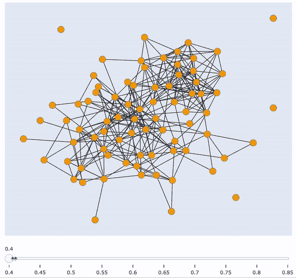
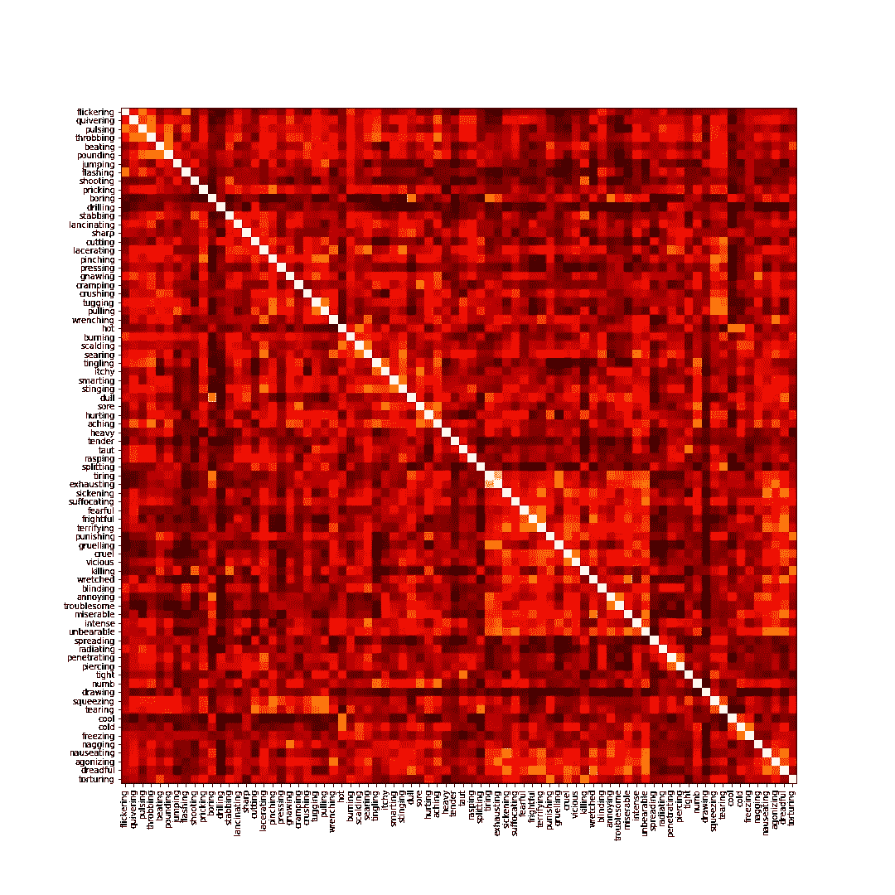
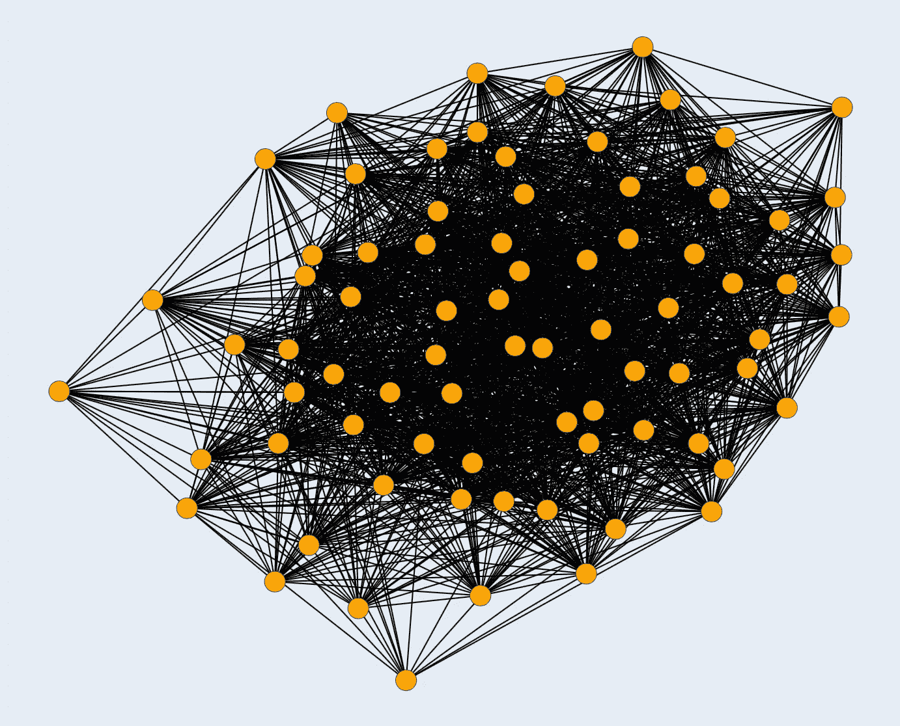
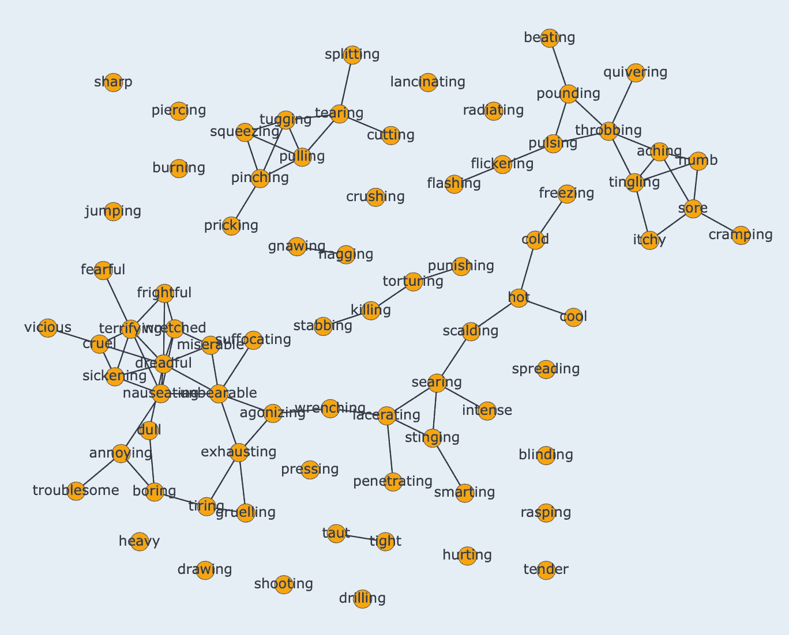

# 用交互式图形可视化相似性聚类

> 原文：<https://towardsdatascience.com/visualising-similarity-clusters-with-interactive-graphs-20a4b2a18534?source=collection_archive---------2----------------------->

## 利用 Python、Plotly 和 NetworkX 创建交互式图形来查找相似性聚类

让我们假设，作为一个运行的例子，我的数据由英语的单词嵌入组成。我想获得关于嵌入空间中的单词分布的见解，具体来说，是否存在非常相似的单词的任何簇，是否存在与其余单词完全不同的单词，是否存在与每一个其他单词都非常相似的单词，等等。我想直观地获得这些见解，以便更容易理解并与同事分享。

互动工具，我们将创造这个职位。连接的节点表示样本相似度高于滑块值阈值。图片作者。

在这篇文章中，我将向你展示如何构建一个交互式可视化工具来获得关于你的数据相似性聚类的见解。有各种各样的问题需要对数据分布有直观的理解。以一种互动的方式(在这个例子中，关于样本相似性)可视化这种分布可以给你这种直觉。**此外，它还是向他人展示结果的一个很好的工具**。

这是一篇非常实用的文章，因此，我将会更加精确地讨论构建细节。我提出的实现完全依赖于 [Plotly](https://plotly.com) 和 [NetworkX](https://networkx.org) 。

## 这篇文章分为四个部分:

1.  样本相似性
2.  图形构建
3.  用 Plotly 绘制图形
4.  交互实现

# 1)样本相似性

重要的事情先来。我们希望深入了解样本相似性聚类，因此，**我们需要首先计算每个样本与其他每个样本的相似性**。

**您可以使用任何最适合您的数据的相似性度量**。ideia 总是相同的:具有非常相似的特征向量(在我的例子中是嵌入)的两个样本将具有接近 1 的相似性得分。这些向量越不同，相似性得分就越接近于零。对于我的运行示例，我将使用[余弦相似度](https://scikit-learn.org/stable/modules/generated/sklearn.metrics.pairwise.cosine_similarity.html)。

从一个任意长度的 *N* 单词嵌入数组开始，我创建了一个维度为 *N* x *N* 的相似性矩阵，它指定了每对数据样本之间的相似性。在我运行的例子中，我有 78 个单词嵌入，每个对应一个不同的单词。

相似度得分热图:越亮得分越高(词对越相似)。图片作者。

# 2)图形构建

给定一个相似矩阵，使用 NetworkX 用图表示它是非常容易的。**我们只需要将矩阵输入到构造函数**中。

**我们的图将有 *N* 个节点**(每个节点对应于我们数据中的一个样本，在我的例子中是单词)，以及 ***N* * *N* 条边**，**代表每对单词**之间的相似度。有 *N^2* 是因为每对节点都有相似性得分，即使它非常接近于零。**边权重表示相似度得分。**

图 G 的可视化，包含相似性分数大于 0 的每对单词之间的链接。图片作者。

以静态方式形象化这个图表不是很有见地，主要是因为每一对单词都是相互关联的。我们可以做的第一件事是删除所有权重非常接近于零的边，并再次可视化图形。这显然不足以洞察相似性聚类。接下来我们可以做的是在区间[0，1]中迭代定义一个递增的阈值，移除所有权重低于阈值的边，并可视化该图。然而，以静态方式反复绘制这些图表在视觉上一点也不吸引人，而且会使事情更难理解。

**接下来的部分将向您展示如何在一个单独的交互式图表中绘制所有这些增加阈值的图表**，在底部有一个相似性得分滑块。**能够自由操作该滑块非常有助于提供关于样本相似性和可能聚类的新见解**。

# 3)用 Plotly 绘制图形

Plotly 是我们将用来创建我们的互动情节的框架。然而，到目前为止，它还不支持即插即用风格的图形绘制。为了避免这一点，我们将使用两种散点图来绘制我们的图形:一种用于节点，另一种用于边。

## 节点的散点图

这是一个简单的程序。给定一个 NetworkX 图，我们遍历所有节点并收集它们的 *x，y* 位置、颜色和文本(用于鼠标悬停信息)，这些都将在后面的部分中定义。然后，我们简单地使用这些信息，通过 Plotly 的接口创建一个散点图。在 Plotly 的语言中，散点图被称为轨迹，我们将其返回以备后用。

## 边缘散点图

事情在这里变得有点棘手。我们需要为图中的每一条边创建一个轨迹。将一条边想象成一个散点图，其中两个点由一条直线连接。

因此，对于 NetworkX 图中的每条边，我们获得其两点的位置，并创建一个连接这两点的线图。我们将这条边的轨迹添加到边轨迹列表中，并返回整个列表供以后使用。

# 4)交互实现

我们就要结束了。现在我们知道了如何使用 Plotly 绘制图表，我们可以创建一个交互式滑块来指定最小相似性阈值，这样权重低于阈值的边就不会显示。

虽然实现起来很长，**但是概念上非常简单**。基本上，对于每个滑块值(也称为步长)，我们用上一节中定义的例程创建一个完整的图形。**我们在这里所做的是“预加载”每个滑块步长**的每一个单独的图。因此，在图形的交互部分没有任何魔法:**我们只是让一个特定的图形图形可见，而所有其他的图形对于每个滑块都是不可见的，创造出我们想要的幻觉**。也是在这里，我们指定节点位置、颜色和文本。

# 最后，以交互方式绘制相似性聚类！

上面代码片段的输出(重复上面的 gif)。图片作者。

此外，**当悬停在节点上时，您可以很容易地看到哪些单词属于哪个簇**。在底部图像上显示的阈值中，人们可以立即看到“sharp”(左上)与任何其他单词都不够相似，而“arriable”(左下的 cluster)与许多单词相似，因此与许多节点有联系。

每个节点都标有单词名称的图表。将鼠标悬停在您的地块上以查看相同的文本。图片作者。

这就是如何创建一个交互式可视化工具来深入了解数据样本的相似性聚类。**在结论性说明中，需要注意的是，这并不是为了相似性而严格定义的**。您可以使用这个工具来可视化实体之间的任何类型的关系，只要用图形来表示它是有意义的。一个简单的例子是文档语料库中的单词共现。**最后，通用方法并不严格适用于绘制图表:您可以使用散点图、条形图、饼图以及您可以想象的任何其他图表来创建交互图**。重要的是它提供的交互性和解释的简易性。