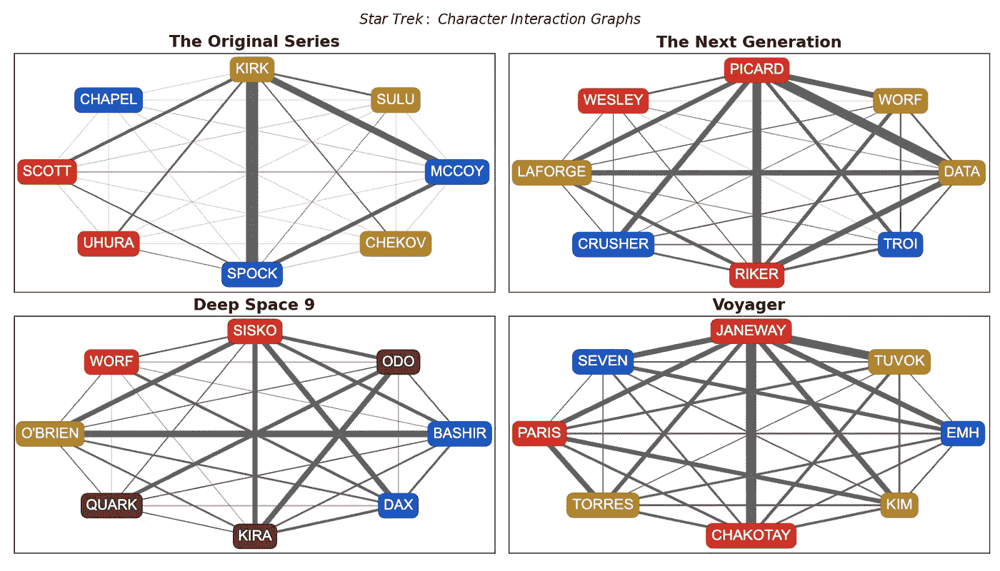
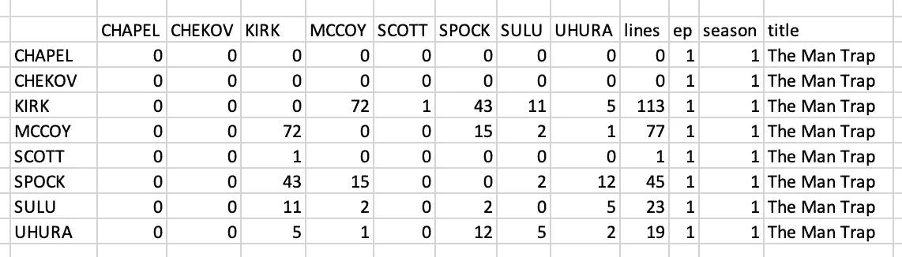
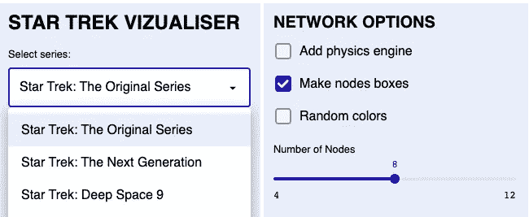
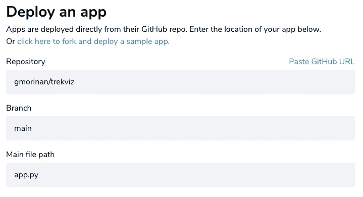
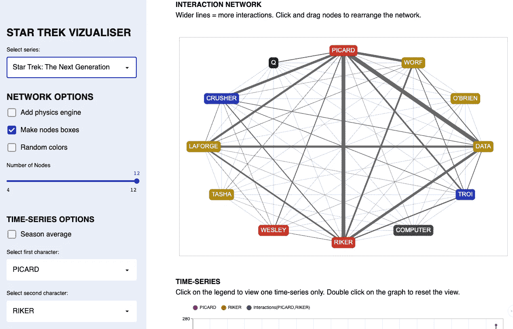

# 可视化星际迷航人物互动

> 原文：<https://towardsdatascience.com/visualising-star-trek-character-interactions-b337c6ca0afb?source=collection_archive---------31----------------------->

## 使用 [Networkx](https://networkx.org/) 、 [Pyvis](https://pyvis.readthedocs.io/en/latest/) 、&、 [Streamlit](https://streamlit.io/) 创建网络仪表板

每部《星际迷航》系列的主要角色互动的频率(图片由作者提供)

你可能遇到过交互式网络图(如果没有，我会推荐 José Manuel Nápoles Duarte 使用这个应用程序)。你可能也遇到过总结电视/电影角色之间互动的网络图(一个例子是最近在 r/dataisbeautiful 上发布的[)。但是你见过*互动*人物*互动*图形(ICIG)吗？嗯，我制作了](https://www.reddit.com/r/dataisbeautiful/comments/m9cver/oc_interaction_intensity_in_lord_of_the_rings/)[这个仪表板，其中包含《星际迷航》系列](https://gmorinan-trekviz-app-d7h5oq.streamlit.app)中每一部的 ICIGs，本文的其余部分将解释关键步骤。

# 1.找到数据

*经常检查别人是否已经为你做了工作*

所有数据科学项目都是从数据采集开始的。经过一番搜索，我找到了一个网站，上面有我需要的东西，每一集《星际迷航》的脚本(不包括最近的系列)，格式一致:

 [## 黄诗丹的成绩单网站

### 如果有任何更正，请发电子邮件给 chakoteya dot net 脸书集团的 chrissie。CBS 新推出的《星际迷航》系列是第一集…

www.chakoteya.net](http://www.chakoteya.net/) 

更重要的是，我甚至不用写脚本就可以从这个网站下载所有这些脚本。原来有人已经这样做了，并把它们都放在 Kaggle 上的 JSON 中:

 [## 星际迷航剧本

### 所有《星际迷航》系列剧本的原始文本剧本和经过处理的台词

www.kaggle.com](https://www.kaggle.com/gjbroughton/start-trek-scripts) 

# 2.处理数据

总是检查你的输出是否通过常识测试

虽然《星际迷航》的每一个剧本都是伟大的文学作品，但我来这里只是为了冰冷的硬数据。我所关心的是两个字符有连续行的频率(这就是我如何定义这两个字符之间的一个“交互”)。

计算这个需要使用一些选择正则表达式来解析所有的抄本。这里有相当多的普通步骤，所以我只挑选几个处理步骤的几个例子:

从原始脚本到场景列表

又走了几步，我找到了一个包含每一行对话的数据框架，然后它可以被转换成一个包含每集角色之间互动次数的表格:

《星际迷航:原始系列》第一集的台词和互动

但是在我得到这个最终输出之前，我的解析代码经历了几次迭代。每次迭代之后，我都会看着输出，问自己一些问题，比如:

q)为什么有些剧集只有 30 行对白？(答:解析代码中有一个错误，需要更新)。

q)为什么有那么多场景只有 1 行对白？(答:解析代码中有一个错误，需要更新)。

问:为什么有少数几集的对话行数是平均水平的两倍？(答:部分笔录为两集)。

当输出看起来很奇怪时，大多数时候是代码有问题。

# 3.创建交互图

*Networkx:自 2005 年以来创建 Python 网络图*

现在我们有了数据，是时候开始制作交互图了。据我所见， [Networkx](https://networkx.org/) 提供了用 python 定义图形的最直接的方法。

在下面的代码片段中，我们遍历每个字符，设置节点的属性以匹配我们希望该字符的节点如何显示。然后我们遍历交互表中的每个条目:

制作网络图

# 4.让它互动

*Pyvis:用几行代码制作互动网络*

没有理由不尝试 Pyvis(即使您和我一样，更熟悉 Networkx ),因为 Pyvis 可以直接从 Networkx graph 对象中读取。无论您向 Networkx 节点添加什么属性，都将被转移到这个 Pyvis 图中。值得一读的是 Pyvis 文档，看看所有可以设置的属性，尤其是关于物理引擎的。

一旦有了 Pyvis 对象，就可以直接生成一个在应用程序中使用的 HTML 文件(我已经使用过 Streamlit，下面会详细介绍):

Networkx -> Pyvis -> HTML

# 5.部署应用程序

*Streamlit:将数据科学家转变为应用开发者*

应用程序部署的平台即服务已经存在一段时间了(如 [Heroku](https://www.heroku.com/home) 或 [Firebase](https://firebase.google.com/) )，但是 [Streamlit](http://streamlit.io/) 使得构建和部署一个简单的单页应用程序变得非常快。对于想要成为应用程序开发人员但无法理解 Flask 的数据科学家来说，这是一个完美的解决方案！

Streamlit 提供了几个小部件，如选择框、复选框和滑块，可用于让用户轻松定制选项:

Streamlit 小部件:选择框(左)，复选框和滑块(右)(作者图片)

这些小部件中的每一个都可以用一行代码添加(在下面的代码片段中，每个部件都被添加到侧边栏，因此使用了 **st.sidebar** ):

真的就这么简单！

最重要的是，Streamlit 将免费托管您的应用程序(前提是您乐于公开您的代码)，这就是所需的全部内容:

Streamlit 应用部署流程(图片由作者提供)

最终的应用程序看起来像这样(并且包含一个额外的[牛郎星](https://altair-viz.github.io/))时间序列):

最终的应用仪表板是什么样子的(图片由作者提供)

# 看一下源代码

[星际迷航互动角色互动图应用](https://gmorinan-trekviz-app-d7h5oq.streamlit.app)的完整代码可以在这个库中找到(其中包括一些额外的 HMTL 版本的互动图，每个图节点都是那个角色的图像):

 [## gmorinan/trekviz

### 仪表板用于显示不同星际迷航系列中角色有多少台词和互动。要运行…

github.com](https://github.com/gmorinan/trekviz)