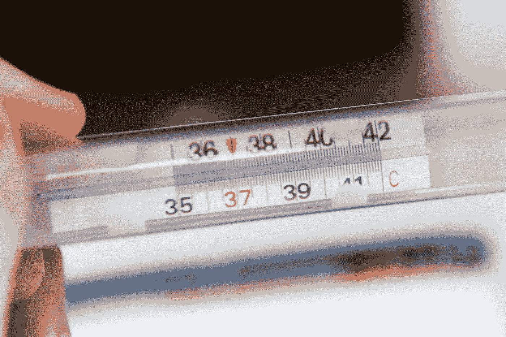
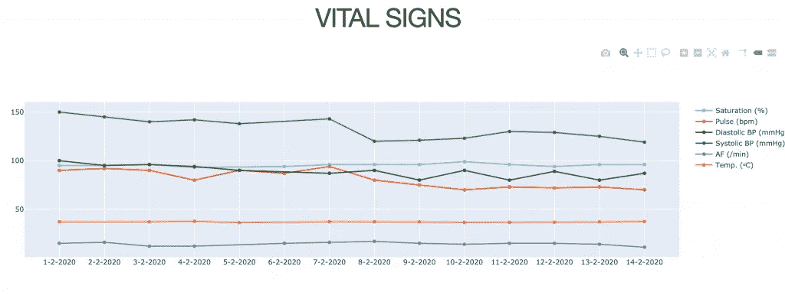
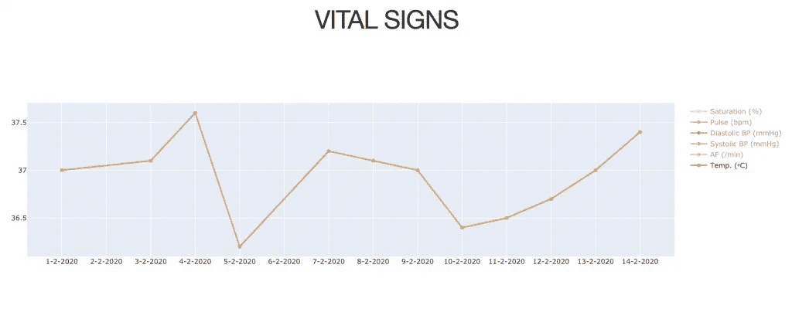

# 用 Python 可视化 Dash 中的生命体征

> 原文：<https://towardsdatascience.com/visualising-vital-signs-in-dash-with-python-978462b1fa1e?source=collection_archive---------26----------------------->

## 从表格到交互式图表

照片由[马泰奥·富斯科](https://unsplash.com/@matteofusco?utm_source=unsplash&utm_medium=referral&utm_content=creditCopyText)在 [Unsplash](https://unsplash.com/s/photos/temperature?utm_source=unsplash&utm_medium=referral&utm_content=creditCopyText) 拍摄

我清楚地记得我在 IC 部门担任 MD 期间，病人生命体征的图表。生命体征的图形表示有助于更好地了解幕后发生的事情。与其他工作环境中的生命体征快照相比，这些图表通常能更深入地了解患者的健康状况。

Dash 是一个 python 模块，正受到越来越多的关注。用<100 lines of code you can make remarkable beautiful and interactive charts. Dash creates a local server on your computer and the application you build can be accessed via your browser. By doing so you have a graphical user interface (GUI) that you can interact with within your browser. This saves you time in writing a whole user interface to control the functionality of a script or software package. Dash also has a steep learning curve, understanding how to get things done doesn’t take much time. Dash seems to be the perfect python package for data visualisations.

Let’s see if we can create a graphical user interface of the vital signs of a [模拟病人](https://medicalprogress.dev/patient_file2/)。实现这一目标的工作流程包括三个步骤。你得到数据，清理数据，然后展示金光闪闪的东西。由于 Dash，最后一个是最容易的，中间一个是最难的。完整代码在我的 Github 上。

我们使用 selenium 模块从虚拟患者那里获取数据，并创建了一个熊猫数据框架:

结果应该是这样的:

# 清洁

垃圾进，垃圾出。所以这里有几件重要的事情:

*   我们不能在图表中使用血压测量值中的不适用值(例如— / -)。
*   血压测量值中有文本(如 r.a. =右臂)。
*   存在与正常值的偏差(饱和度 20 和呼吸频率 95 在第 5 行(索引 4)中切换)。`
*   有错别字:372.0 应该是 37.2，问题是在患者档案中输入时使用了逗号而不是圆点。此外，第 6 行(索引 5)中的 7.4 可能代表 37.4。

我们用下面一行使用正则表达式的代码来解决(1)和(2)。关于正则表达式的更多信息，请参见科里·斯查费的教程:

对于血压列，唯一要做的是制作两个单独的列，一个用于舒张压，一个用于收缩压，这样我们就可以在图表中处理它们:

如果你打印出来，这个表看起来会像这样。您可以看到末尾有两个新列，仅显示数值:

第三点第四点，去除异常值，可以通过屏蔽和使用一些合理的值作为过滤器来实现。

你也可以考虑使用数学上更复杂的滤波器，例如 [Savitzky-Golay 滤波器](https://towardsai.net/p/l/savitzky-golay-filter-for-data-smoothing)，来平滑数据，但在我们的例子中，这不是我们想要的:数据中的异常通常是警报信号，而不是噪音。

# (英)可视化(= visualization)

我们用可视化软件包 plotly 创建一个图形对象:

为了在 Dash 中以图形显示我们的生命体征，我们需要安装一些软件包:

*   pip 安装仪表板
*   pip 安装仪表板-核心-组件
*   pip 安装仪表板-html-组件

我们通过使用 dash 核心组件“graph”来绘制图形。为此，我们提供上一节中的 graph 对象作为图形的变量:

结果如下图所示。现在，让我们想象患者在 2 月 7 日接受了美托洛尔(降压药)，我们现在可以在图中看到，在 2 月 8 日收缩压有所下降，脉搏也从大约 90 次/分钟下降到 70 次/分钟，因此看起来干预起作用了:

在随叫随到的轮班期间，许多电话都集中在根据特定的温度是否隔离病人的问题上。如果您取消选择右侧的所有生命体征，只保留列表中的温度，您将更深入地了解温度随时间的变化。在 2 月 4 日，确定零下温度(= 37.5-38.4)变得很容易。这似乎可能是正常生理节律(生物可变性)或错误测量(测量可变性)的结果，因为在后续测量中，温度在正常范围内。像这样的可视化可以使围绕 covid 相关咨询的决策变得更容易。

这是一个快速简单的生命体征数据可视化。这当然只是一个例子。在像这样的东西在日常工作环境中可用之前，还有很多工作要做，但是我希望我已经向您展示了 Python 和 Dash 这两个兄弟是未来工作的两个很好的候选人…