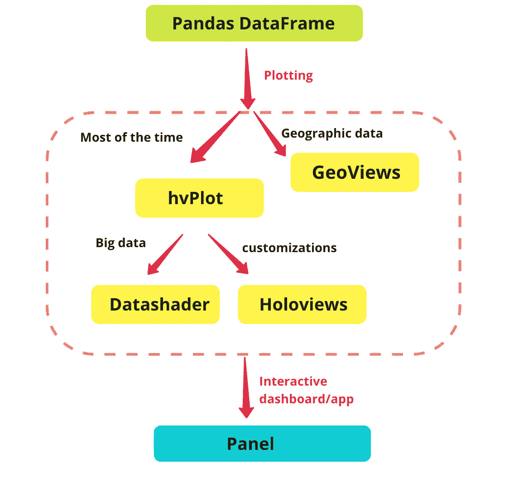
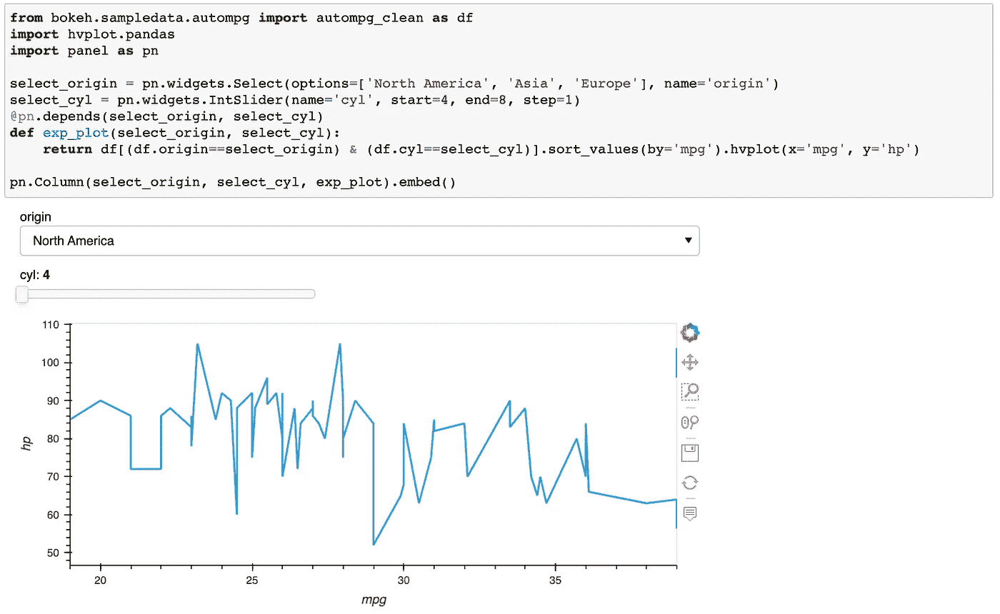
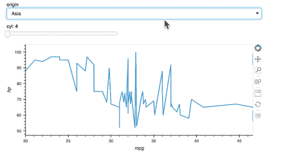

# Python 中的可视化和交互式仪表盘

> 原文：<https://towardsdatascience.com/visualization-and-interactive-dashboard-in-python-c2f2a88b2ba3?source=collection_archive---------0----------------------->

## *我最喜欢的 Python Viz 工具——holo Viz*

图片经许可来自 datashader.org

令我惊讶的是，许多数据科学家不知道 [HoloViz](https://holoviz.org/) 。HoloViz 是我最喜欢的 Python viz 生态系统，它由七个 Python 库组成——Panel、hvPlot、HoloViews、GeoViews、Datashader、Param 和 Colorcet。

# 我为什么爱 Holoviz？

HoloViz 允许用户用超级简单灵活的 Python 代码构建 Python 可视化和交互式仪表盘。它提供了在几个 API 后端中进行选择的灵活性，包括 bokeh、matplotlib 和 plotly，因此您可以根据自己的喜好选择不同的后端。另外，它是 100%开源的！

与其他 python viz 和 dashboarding 选项不同，HoloViz 非常认真地支持您可能想要使用 Python viz 或 app 工具的每一个合理的上下文:

*   一本 Jupyter 笔记本，
*   一个 Python 文件，
*   生成 pdf 或 SVG 或 png 或 gif 的批处理作业，
*   作为自动报告的一部分，
*   作为独立的服务器，
*   作为独立的。网站上的 html 文件。

每一种替代技术都很好地支持了其中的一些情况，但却忽略了其他情况。HoloViz 最大限度地减少了在所有这些环境之间切换的摩擦和成本，因为这是任何科学家或分析师的现实——只要你发布它，人们就希望改变！一旦你有了 Dash 应用程序；这就是你所拥有的一切，但是一旦你有了一个面板应用，你可以在第二天回到 Jupyter，从你离开的地方开始。

# 七个套餐是什么？

*   [**面板**](https://panel.holoviz.org/) 构建交互式仪表盘和应用。就像 R 闪亮，但更强大。我无法表达我有多爱 Panel。
*   根据我的经验，hvPlot 比其他任何绘图库都容易，尤其是如果你喜欢绘制熊猫数据帧的话。只需一行代码，hvPlot 将为您提供一个包含所有您想要的内置功能的交互式绘图。
*   [**HoloViews**](https://holoviews.org/) 是通过可视化进行数据探索和数据挖掘的伟大工具。
*   [**GeoViews**](http://geoviews.org/) 绘制地理数据。
*   [**Datashader**](https://datashader.org/) 处理大数据可视化。使用 Numba (Python 编译器)和 Dask(分布式计算)，Datashader 可以非常快速地创建大型数据集的有意义的可视化。我绝对喜欢 Datashader，喜欢它所产生的[美丽的情节](https://datashader.org/)。
*   [**Param**](https://param.holoviz.org/) 创建声明性用户可配置对象。
*   [**颜色创建颜色图。**](https://colorcet.holoviz.org/)

# 我的 HoloViz 工作流程是什么？

我通常从熊猫数据帧或 Dask 数据帧开始。对于地理数据，我使用 GeoViews。大多数时候，我只用 hvPlot。然后，如果我需要绘制大数据(数百万/数十亿个数据点)，我就用 Datashader 如果我需要不同的定制，我使用 Holoviews。然后，我可以在 Panel 中构建我的仪表板/应用程序。

HoloViz 工作流程(图片由作者提供)

# 一个非常简单的例子

正如您在下面看到的，通过几行代码，您可以获得一个交互式仪表板，它带有一个下拉菜单和一个用于绘图的滑块。

对于部署，我要么将仪表板直接输出为嵌入的 HTML 文件`jupyter nbconvert YOUR_NOTEBOOK.ipynb --to html --no-input --no-prompt --stdout > output.html`

或者我运行`panel serve YOUR_NOTEBOOK.ipynb`或`panel serve YOUR_PYTHON_FILE.py`将应用程序部署到服务器上的某个地方。

# 我希望 HoloViz 可以做得更好的事情有哪些？

我唯一希望 HoloViz 能做得更好的是图形设计。说实话，开箱即用的设计没有 Plotly 和 R 闪亮那么好看。然而，有一些模板和[主题](https://panel.holoviz.org/user_guide/Templates.html)有助于设计，你可以随时创建自己的主题。awesome-panel.org 展示了许多令人惊叹的使用面板的仪表板设计。

# 我在哪里可以找到支持？

HoloViz 团队非常积极地回应他们的 Github 页面(https://github.com/holoviz)上的问题和功能请求。我在他们的 Github 上提交了许多问题和功能请求。他们还提供 T21 咨询服务。事实上，HoloViz 的大部分工作都是由一些关键的公司和机构资助的，他们已经与这些公司和机构建立了长期的合作关系。

# 推荐的学习资源

[Pyviz.org](https://pyviz.org/)很好地总结了所有的 Python 可视化工具和前景。

如果你有兴趣了解更多关于 HoloViz 的知识，这里有一些我喜欢的教程和讲座:

*   https://holoviz.org/tutorial/index.html
*   【https://www.youtube.com/watch?v=v0QiTptWt3w 
*   [https://www.youtube.com/watch?v=t5oFw9NUhlQ](https://www.youtube.com/watch?v=t5oFw9NUhlQ)

希望你喜欢使用 HoloViz！

作者索菲亚·杨 2021 年 8 月 11 日