# Python 中的可视化-可视化地理空间数据

> 原文：<https://towardsdatascience.com/visualization-in-python-visualizing-geospatial-data-122bf85d128f?source=collection_archive---------6----------------------->

## 了解如何使用 Learn 轻松显示地图和标记


图片由 [T.H. Chia](https://unsplash.com/@teckhonc?utm_source=medium&utm_medium=referral) 在 [Unsplash](https://unsplash.com?utm_source=medium&utm_medium=referral) 上拍摄

可视化地理空间数据是您可以对数据做的最有趣的事情之一，尤其是当您的数据已经包含可以直接映射到地图上的位置的列时。对于 Python 开发人员来说，并不缺少可以完成这项工作的库。在本文中，我将向您展示一种在地图上快速显示地理空间数据的简单方法。具体来说，我们将使用**叶子**库。

# 什么是叶？

**leave**是 *leaflet.js* 库的 Python 包装器——一个用于绘制交互式地图的 JavaScript 库。使用 lyum，您现在可以直接在 Jupyter Notebook 中轻松地将地理空间可视化添加到您的 Python 项目中。

要安装 lyum，您可以在 Jupyter Notebook 中使用以下命令:

```
!pip install folium
```

# 显示地图

使用 leav 首先要做的是显示地图。所以让我们使用下面的代码片段:

```
import foliummymap = folium.Map(location = [1.366623, 103.821285], 
                   width = 950, 
                   height = 550,
                   zoom_start = 12, 
                   tiles = 'openstreetmap')
mymap
```

当您运行上面的代码片段时，您将看到下面的交互式地图:

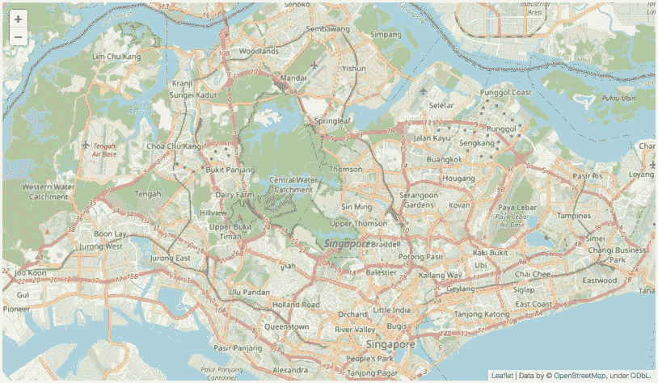

从上面可以看到，位置是新加坡的经纬度(1.366623，103.821285)，我还设置了地图的宽度和高度。`zoom_start`参数设置地图的初始缩放级别——数字越大，地图的缩放程度越大。下图显示了缩放级别为 15 的地图:

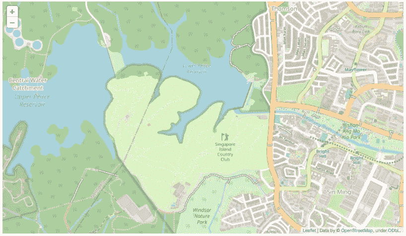

下图显示了缩放级别为 5 的地图:

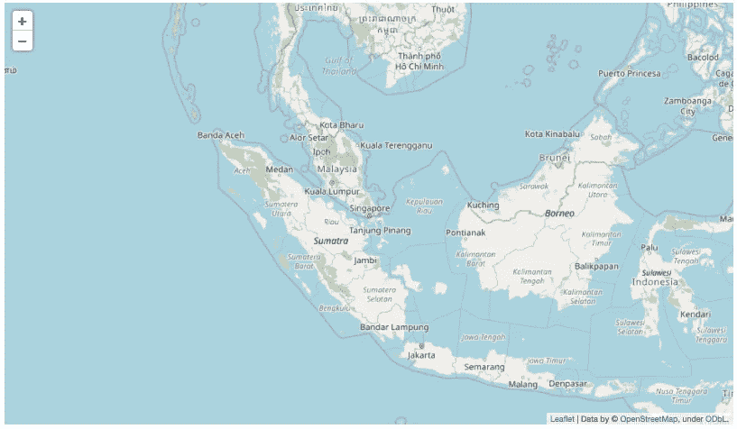

地图显示后，您可以使用鼠标上的滚轮来放大或缩小地图。您也可以使用地图上的+或-按钮来执行相同的操作。

`tiles`参数指定要使用的 *tileset* 。要使用的默认 tileset 是`openstreetmap`。下一节将更详细地讨论 tilesets。

> 一个 **tileset** 是一个由栅格或矢量数据组成的集合，这些数据被分割成一个统一的方格网格。

# 在 Tilesets 之间切换

不同的*图块集*提供了不同的地图显示方式。您可以在 leav 中使用以下 tilesets:

*   雄蕊地形
*   雄蕊调色剂
*   雄蕊水色
*   卡通正电子
*   黑暗物质

您可以使用`TileLayer`类向地图添加不同的 tileset，而不是通过`tiles`参数来固定地图以使用特定的 tileset。以下粗体语句将五个切片集添加到当前地图中:

```
import folium
mymap = folium.Map(location = [1.366623, 103.821285], 
                   width = 950, 
                   height = 550,
                   zoom_start = 12, 
                   tiles = 'openstreetmap')**folium.TileLayer('Stamen Terrain').add_to(mymap)
folium.TileLayer('Stamen Toner').add_to(mymap)
folium.TileLayer('Stamen Water Color').add_to(mymap)
folium.TileLayer('cartodbpositron').add_to(mymap)
folium.TileLayer('cartodbdark_matter').add_to(mymap)****folium.LayerControl().add_to(mymap)**mymap
```

`LayerControl`类在地图上显示图块图标:

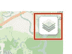

作者图片

单击图块图标会显示可用于地图的各种图块集:

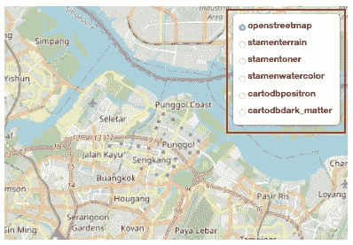

作者图片

以下部分显示了每个 tileset 的外观。

## 雄蕊地形

*雄蕊地形*地图显示了地形、山丘阴影和天然植物的颜色。

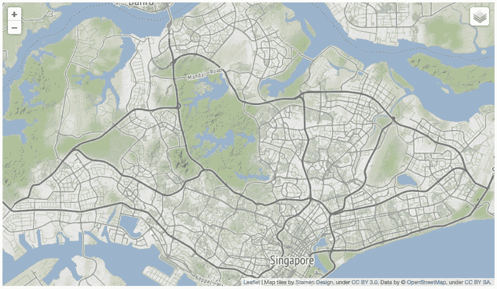

作者图片

## 雄蕊调色剂

*雄蕊调色剂*地图对于可视化河流蜿蜒和沿海地带等特征非常有用。

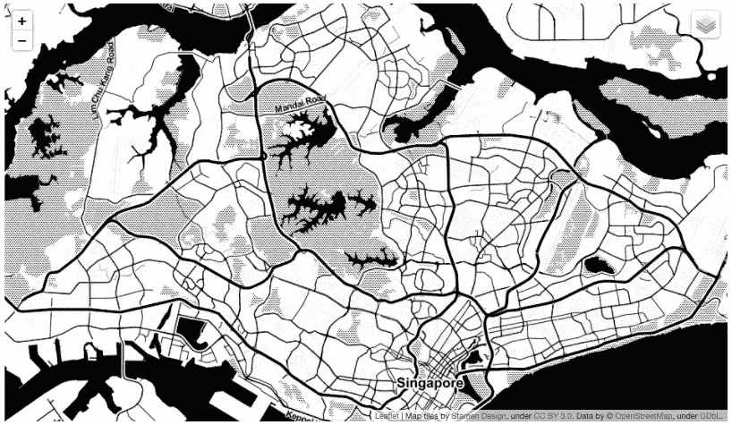

作者图片

## 雄蕊水色

**雄蕊水彩**贴图，顾名思义，使用水彩效果渲染贴图。

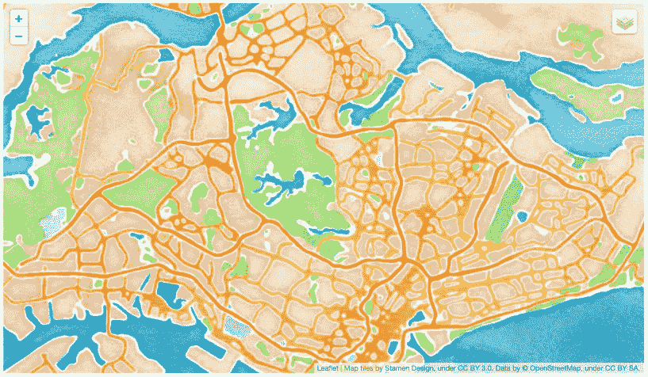

作者图片

如果你对《雄蕊水彩》的创作感兴趣，可以去 https://hi.stamen.com/watercolor-process-3dd5135861fe[看看。](https://hi.stamen.com/watercolor-process-3dd5135861fe)

> Stamen 是一个位于加州旧金山的数据可视化设计工作室。它的客户包括国家地理、脸书和达赖喇嘛。**来源**:[https://en.wikipedia.org 维基雄蕊 _ 设计](https://www.google.com/url?sa=t&rct=j&q=&esrc=s&source=web&cd=&cad=rja&uact=8&ved=2ahUKEwiM0uHvx4j1AhUmT2wGHdHjCRkQFnoECAcQAQ&url=https%3A%2F%2Fen.wikipedia.org%2Fwiki%2FStamen_Design&usg=AOvVaw0v9g-YOOiSy39SI3yiNj2f)

## 卡通正电子

**CartoDB 正**地图是 CARTO 的底图(以前称为 **CartoDB** )。CARTO 是一个软件即服务云计算平台，提供 GIS、web 制图和空间数据科学工具。

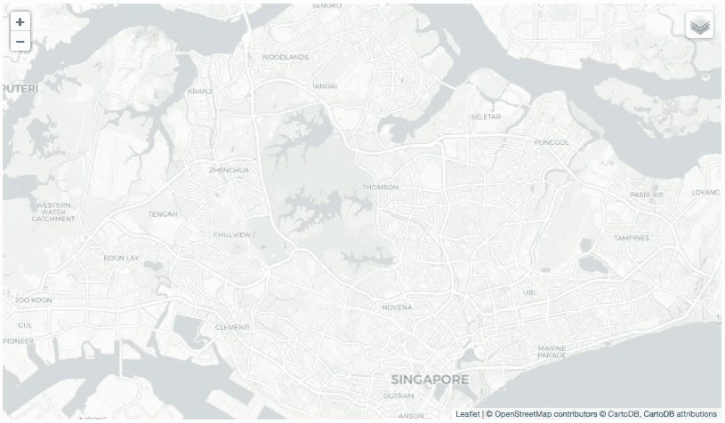

作者图片

## 黑暗物质

在黑暗模式下， **cartodbdark_matter** 贴图相当于**cartodbposient**贴图。

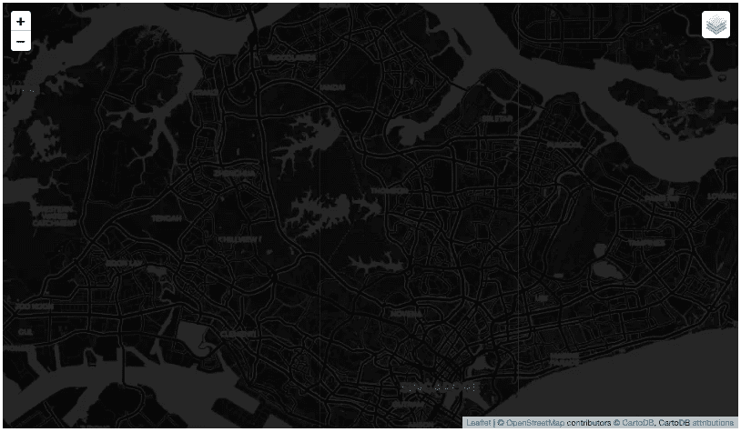

作者图片

# 注释地图

地图之所以有用，是因为它能够让我们给地图添加注释。例如，我想显示代表新加坡各种捷运站位置的标记。因此，在这一节中，你将学习如何添加标记到叶子地图。

首先，你需要得到新加坡各个捷运站的位置。为此，我将使用来自 https://data.world/hxchua/train-stations-in-singapore 的数据。

> 该数据集对公众开放。但是，您需要作为成员加入 data.world 才能下载此数据集。

以下粗体语句将 CSV 文件作为 Pandas 数据帧加载:

```
import folium
mymap = folium.Map(location = [1.366623, 103.821285], 
                   width = 950, 
                   height = 550,
                   zoom_start = 12, 
                   tiles = 'openstreetmap')folium.TileLayer('Stamen Terrain').add_to(mymap)
folium.TileLayer('Stamen Toner').add_to(mymap)
folium.TileLayer('Stamen Water Color').add_to(mymap)
folium.TileLayer('cartodbpositron').add_to(mymap)
folium.TileLayer('cartodbdark_matter').add_to(mymap)folium.LayerControl().add_to(mymap)**import pandas as pd
df = pd.read_csv('mrtsg.csv')
display(df)**mymap
```

数据帧看起来像这样:

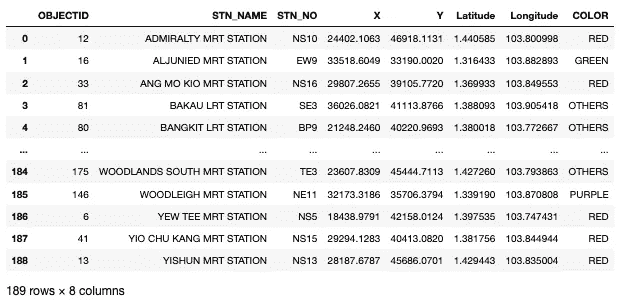

我们将在本文中使用三个专栏:

*   **工位名称**(工位名称)
*   **纬度**
*   **经度**

## 显示标记

我们要添加到地图上的第一个标记是一个**圆形标记**。这可以通过使用`CircleMarker`类来完成。以下粗体语句基本上使用`zip()`函数组合了`Latitude`和`Longitude`列，然后遍历位置集合并添加代表每个 MRT 站的圆形标记:

```
import folium
mymap = folium.Map(location = [1.366623, 103.821285], 
                   width = 950, 
                   height = 550,
                   zoom_start = 12, 
                   tiles = 'openstreetmap')folium.TileLayer('Stamen Terrain').add_to(mymap)
folium.TileLayer('Stamen Toner').add_to(mymap)
folium.TileLayer('Stamen Water Color').add_to(mymap)
folium.TileLayer('cartodbpositron').add_to(mymap)
folium.TileLayer('cartodbdark_matter').add_to(mymap)folium.LayerControl().add_to(mymap)import pandas as pd
df = pd.read_csv('mrtsg.csv')
display(df)**for lat, lng in zip(df['Latitude'], df['Longitude']):    
    station = folium.CircleMarker(
            location=[lat, lng],
            radius=8,
            color='red',
            fill=True,
            fill_color='yellow',
            fill_opacity=0.5)**  **# add the circle marker to the map
    station.add_to(mymap)**mymap
```

这是地图上的所有标记，每个标记代表一个捷运站:

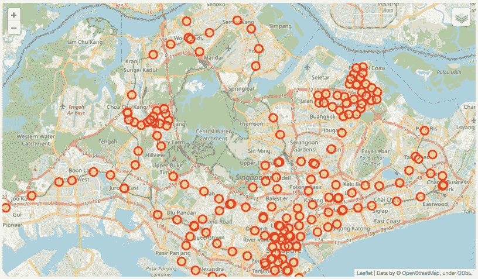

您可以放大以定位每个电台:

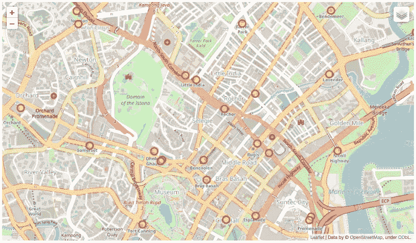

## 用弹出窗口显示标记

有时候，显示一个当用户点击时显示更多信息的标记更有意义。在这种情况下，您只需要添加`popup`属性。让我用另一种标记类型`Marker`来展示一下。`Marker`类在地图上显示一个简单的股票传单标记。

以下粗体语句将`Marker`对象添加到贴图中:

```
for lat, lng, name in \
    zip(df['Latitude'], df['Longitude'], df['STN_NAME']): **#** station = folium.CircleMarker(
    **#**         location=[lat, lng],
    **#**         radius=8,
    **#**         color='red',
    **#**         fill=True,
    **#**         fill_color='yellow',
    **#**         fill_opacity=0.5)   
    **#** station.add_to(mymap)

 **station_name = folium.Marker(
            location=[lat, lng],
            popup = name,            
        )   
    station_name.add_to(mymap)**mymap
```

> 请注意，`popup`参数也适用于`CircleMarker`类。

您可以在这里看到标记，而不是我们之前使用的圆形标记:

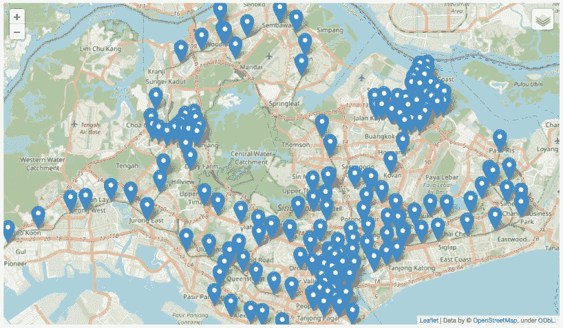

当您点击制造商时，您将看到一个弹出窗口，显示 MRT 站的名称:

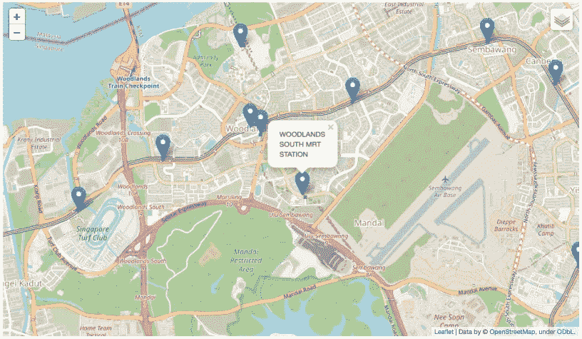

# 摘要

我希望这篇文章能为您更详细地探索 leav 库提供素材。我几乎没有触及到叶子能做什么的皮毛。如果您在现实世界的项目中使用了 real，请务必通过评论窗口与我们的读者分享。玩得开心！

<https://weimenglee.medium.com/membership> 