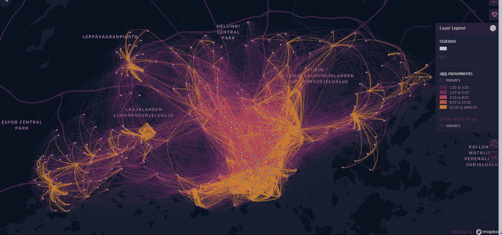
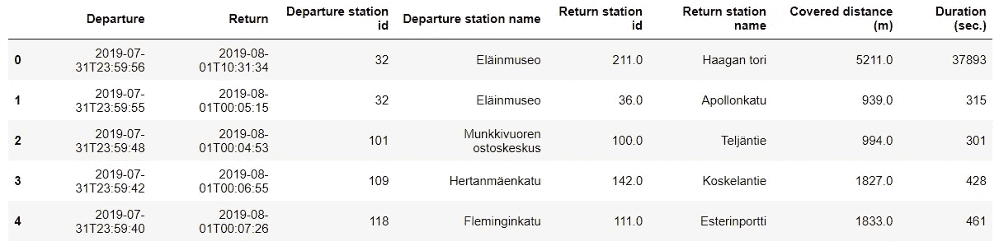
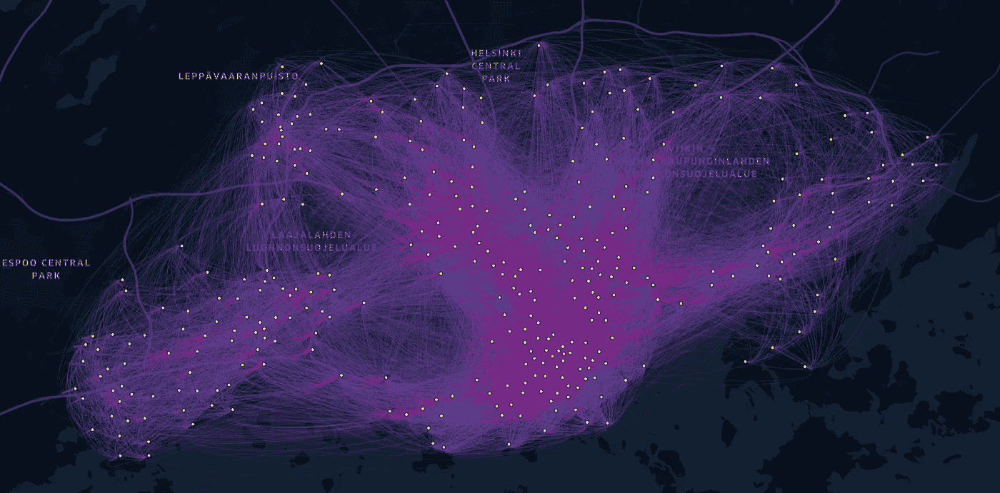
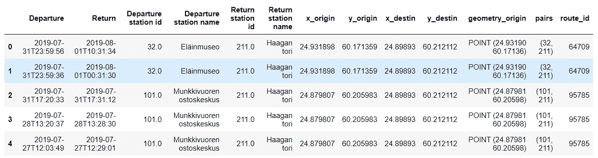
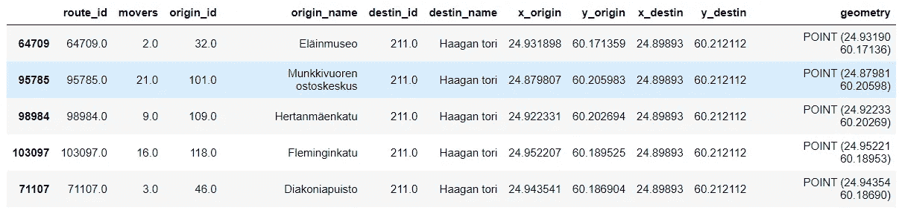
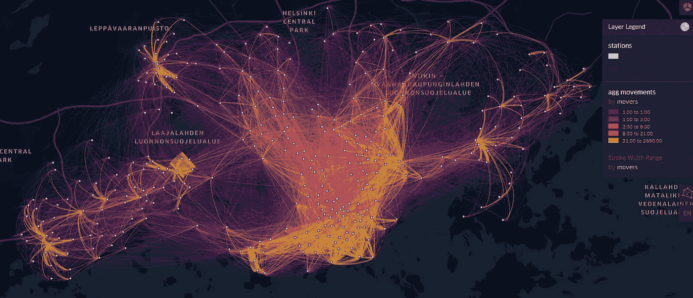

# 赫尔辛基的自行车共享系统运动:用交互式流程图进行聚合和可视化

> 原文：<https://towardsdatascience.com/visualization-of-bike-sharing-system-movements-in-helsinki-with-an-interactive-flow-map-451d897104fe?source=collection_archive---------21----------------------->

## 基于赫尔辛基自行车出行 OD 矩阵汇总出行量的 KeplerGL 流程图



图片由作者提供。赫尔辛基自行车站之间的合计自行车出行地图

赫尔辛基是一个由巨大的自行车道网络提供的城市，这使得替代交通(即自行车、踏板车、步行)变得高效。在某些情况下，骑自行车去目的地比乘坐公共交通工具更舒服。就我个人而言，它发生在我身上是由于三个主要方面:1)我省钱，2)我节省时间，3)精神健康。如果你想了解更多关于赫尔辛基不同交通方式的可达性，你可以查看文章:*[***在赫尔辛基使用 accessviz-mapper 工具绘制旅行时间(可达性)地图***](/travel-time-accessibility-maps-with-the-accessviz-mapper-tool-in-helsinki-7be23eadd4b0?source=your_stories_page-------------------------------------)*

**[芬兰城市自行车](https://www.citybikefinland.fi/about-city-bike-finland)致力于为赫尔辛基市民提供服务，是全球最先进的自行车共享系统之一。该服务包括 1.500 辆自行车和大都市地区(赫尔辛基和埃斯波，万塔)周围的 457 个车站，它是在当地城市规划部门的支持下开发的。BSS 在 2017 年春天完全运行，当时所有的自行车和车站都开始可用。自那以后，城市自行车作为交通工具的选择大大增加，它被认为是一种可持续(绿色)的交通工具选择。用户数量已超过 34.100 人，每周骑行约 68.000 次，平均每天骑行 7 次，16.4 分钟，3.2 公里。这些统计数据是在上面提到的芬兰城市自行车网页上找到的。此外，还可以在 [***赫尔辛基***](https://bikesharemap.com/helsinki/#/12/24.9316/60.1659/) 自行车共享地图中实时查看自行车的供应情况。**

> **最终图 [**这里**](https://bryanvallejo16.github.io/bike-movements-helsinki/) ！
> 回购[这里！](https://github.com/bryanvallejo16/bike-movements-helsinki)**

**自行车共享系统(BSS)的局限性始于这样的讨论，即该系统可能只对特定的市民群体有利。得益于赫尔辛基市的[开放数据](https://www.hsl.fi/en/hsl/open-data#journeys-made-by-city-bikes),可以分析车站之间的运动数据集，以提供与社会群体和最常用/最少使用的自行车站相关的见解。来自赫尔辛基大学地理系的[数字地理实验室](https://www2.helsinki.fi/en/researchgroups/digital-geography-lab) (DGL)一直在从不同的角度研究自行车共享系统(BSS)。2021 年 2 月，[***Elias Willberg***](https://researchportal.helsinki.fi/en/persons/elias-willberg)*可持续发展的专用研究员&活跃的城市流动性和可达性在[DGL](https://www2.helsinki.fi/en/researchgroups/digital-geography-lab/people-contact#section-34658)*发表*[***关于自行车共享系统用户的出行数据揭示了什么？***](https://www.sciencedirect.com/science/article/pii/S0966692321000247?via%3Dihub) ”展示了 BSS 行程数据对于了解 BSS 服务的用户特征和使用概况的重要性。BSS 的总体目标是为大多数公民创建一个包容和高效的结构。[1]*****

> ****自行车共享系统数据****

**BSS 发布的数据对应于服务的可用季节:从 4 月到 10 月。对于本练习，我们将使用 2019 年 7 月的月度数据集。出行数据[2]是开放访问以及城市周围 [**自行车站**](https://hri.fi/data/en/dataset/hsl-n-kaupunkipyoraasemat)****的位置由知识共享署名 4.0 许可。它被认为是一种出行数据，OD 矩阵是根据自行车站点的位置生成的。这意味着每次行程都是从起始自行车站点(起点)到终点自行车站点(终点)生成的。******

> ******本练习的目的是使用交互式流程图来可视化自行车共享系统出行数据的聚合移动，以了解赫尔辛基的自行车使用动态******

******这个可视化实践分为两个部分:1)数据生成，和 2)数据可视化。第一部分创建一个具有适当结构的数据集，可以在 KeplerGL 中使用，这个过程是在 Python 中完成的。第二部分使用 KeplerGL 实现流图的可视化。******

> ********1)数据生成********

******首先，我们读取存储库中名为`geodata` 的地理数据框架中的`bike-stations.shp`图层。我们会注意到总共有 457 个自行车站，它们看起来像这样:******

```
******import pandas as pd
import geopandas as gpd
from shapely.geometry import Point
from keplergl import KeplerGl
from pyproj import CRSfp = r'data/bike-stations.shp'
geodata = gpd.read_file(fp)geodata.plot(markersize=1);******
```

************

******图片由作者提供。赫尔辛基地区的自行车站******

******然后，我们阅读自行车出行的 OD 矩阵，它可以在名为`data`的数据框架中的存储库中找到。******

```
******bikefp = r'data/2019-07.csv'
data = pd.read_csv(bikefp)******
```

************

******图片由作者提供。自行车站点之间的移动(无汇总数据)******

******您可能会注意到，我们在一个数据集中有起点和终点，在另一个数据集中有位置(坐标)。因此，我们在这一步将数据合并到行程中，这样我们就可以获得 OD 矩阵和坐标。接下来是:******

```
******# some details for origins
geodata['ID'] = geodata[‘ID’].astype(int)
geodata_origin = geodata.add_suffix(‘_origin’)# merging data with no aggregation
coor_data = data.merge(geodata_origin, left_on='Departure station id', right_on='ID_origin', how='outer')# some details for destinations
geodata_destin = geodata.add_suffix('_destin')# creating a data with no aggregation
coor_data = coor_data.merge(geodata_destin, left_on='Return station id', right_on='ID_destin', how='outer')# obtaining the needed columns
coor_data = coor_data[['Departure','Return', 'Departure station id', 'Departure station name' , 'Return station id',
                      'Return station name', 'x_origin', 'y_origin', 'x_destin',  'y_destin', 'geometry_origin']]coor_data.head()******
```

******现在我们已经获得了一个包含个人出行的数据集。可视化很难理解，因为它包含大量信息。但是 KeplerGL 可以做出很好的东西，这里你可以看到粉红色是整个数据集的起点，蓝色是终点。总共 666.586 行(行程):******

************

******图片由作者提供。自行车站点之间的个性化出行。******

******现在，我们将汇总自行车站点之间的行程。我们要做的是为车站之间的旅行创建唯一的 id，并将它们算作搬运工。代码如下所示:******

```
******agg_data = coor_data.copy()# aggregating data
# creating pairs
# if 457 station, then we make a lot of pairs.
origins = geodata['ID'].to_list()
destins = geodata['ID'].to_list()# creating pairs of trips
pairs_list=[]for origin in origins:
    for destin in destins:
        stat_pair = (int(origin), int(destin))

        pairs_list.append(stat_pair)routes_list = list(range(len(pairs_list)))# dictionary with pairs and ID
routes_dict = dict(zip(pairs_list, routes_list))agg_data = agg_data.dropna()# adding a columns with station pairs
agg_data['pairs'] = [(int(orID), int(deID)) for orID, deID in zip(agg_data['Departure station id'].to_list(),
                                                                  agg_data['Return station id'].to_list())]agg_data = agg_data.reset_index(drop=True)# add route id through dictionary
agg_data['route_id'] = Nonefor i in list(range(len(agg_data))):
    pair_route = agg_data.at[i, 'pairs']

    route_id =  routes_dict[pair_route]

    agg_data.at[i, 'route_id'] = route_idagg_data.head()******
```

******我们得到一个包含`route_id`的新表，它看起来必须像这样:******

************

******图片由作者提供。具有路线 ID 的单个行程******

******下一步是通过将 ID 计数为移动者来进行聚合。在分组数据帧中是这样的:******

```
******# aggregating movers
movers = gpd.GeoDataFrame(index = agg_data[‘route_id’].unique())for key, group in agg_data.groupby(‘route_id’):

 movers.at[key, ‘route_id’] = key

 movers.at[key, ‘movers’] = int(len(group))

 movers.at[key, ‘origin_id’] = group[‘Departure station id’].unique()
 movers.at[key, ‘origin_name’] = group[‘Departure station name’].unique()[0]
 movers.at[key, ‘destin_id’] = group[‘Return station id’].unique()
 movers.at[key, ‘destin_name’] = group[‘Return station name’].unique()[0]

 movers.at[key, ‘x_origin’] = group[‘x_origin’].unique()[0]
 movers.at[key, ‘y_origin’] = group[‘y_origin’].unique()[0]
 movers.at[key, ‘x_destin’] = group[‘x_destin’].unique()[0]
 movers.at[key, ‘y_destin’] = group[‘y_destin’].unique()[0]movers['geometry'] = [Point(originx, originy) for originx, originy in zip(movers['x_origin'].to_list(),
                                                                          movers['y_origin'].to_list())]

movers.head()******
```

************

******图片由作者提供。自行车站点间自行车运动汇总表******

******现在我们对桌子做一些安排，使它形象化。******

```
******# defining CRS
movers.crs = CRS.from_epsg(4326)# columns
movers = movers[['route_id', 'movers', 'x_origin', 'y_origin', 'x_destin', 'y_destin', 'geometry' ]]******
```

******如果要将各个运动可视化为上面的地图，可能需要在地理数据框架中定义几何。本练习的目标是关注汇总的信息，所以我在这里只解释这个过程。新的聚合数据集包含 37.403 行(聚合移动)。******

> ********2)数据可视化********

******在这里，我们为 KeplerGL 创建一个实例，配置可视化，并保存地图。您可以在其他文章中找到更多可视化示例，例如: [***蓝鲸 GPS 跟踪中的停止检测—移动熊猫 0.6***](/stop-detection-in-blue-whales-gps-tracking-movingpandas-0-6-55a4b893a592)******

```
******# Create KeplerGl instance
m = KeplerGl(height=600)# Add stop duration
m.add_data(movers, 'agg movements')******
```

******然后你调用`m`，按照你的喜好正确配置地图。我是这样做的:******

************

******图片由作者提供。赫尔辛基自行车站的汇总自行车运动地图******

******然后你保存它:******

```
******# Save map as html
m.save_to_html(file_name='index.html')******
```

> *********结论*********

******自行车共享数据可以通过唯一的路线 ID 进行聚合。通过计算重复路线 id 的数量来定义站之间的移动者。在可视化中，移动器的值可以用作颜色强度(黄色)和内联大小。所以理解自行车运动很容易。******

******这就是本练习的全部内容，以防您需要帮助或想要使用自己的数据。你可以在我的职业简介**[**LinkedIn**](https://www.linkedin.com/in/bryanrvallejo/)**上联系我。**********

> ********参考文献********

******[1]威尔伯格，e .，萨洛宁，m .，托伊沃宁，T. (2021)。 ***“出行数据揭示了自行车共享系统用户的哪些信息？”。*** *土井:*【https://doi.org/10.1016/j.jtrangeo.2021.102971】T21******

******[2] [***城市自行车站点的起止点(OD)数据。数据集的维护者是 Helsingin seudun liikenne HSL，原作者是 City Bike Finland。该数据集已于 2021 年 7 月 18 日使用许可***](https://hri.fi/data/en/dataset/helsingin-ja-espoon-kaupunkipyorilla-ajatut-matkat)***[知识共享署名 4.0](https://creativecommons.org/licenses/by/4.0/) 从[赫尔辛基地区信息共享](https://hri.fi/)服务下载。*********

******[3] [***赫尔辛基地区交通局(HSL)的城市自行车站。***](https://hri.fi/data/en/dataset/hsl-n-kaupunkipyoraasemat) 数据集的维护者是 Helsingin seudun liikenne HSL。该数据集已于 2021 年 7 月 18 日使用许可[知识共享署名 4.0](https://creativecommons.org/licenses/by/4.0/) 从[赫尔辛基地区信息共享](https://hri.fi/)服务下载。******