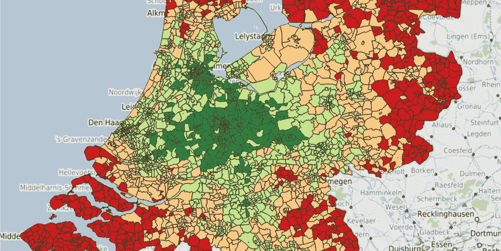
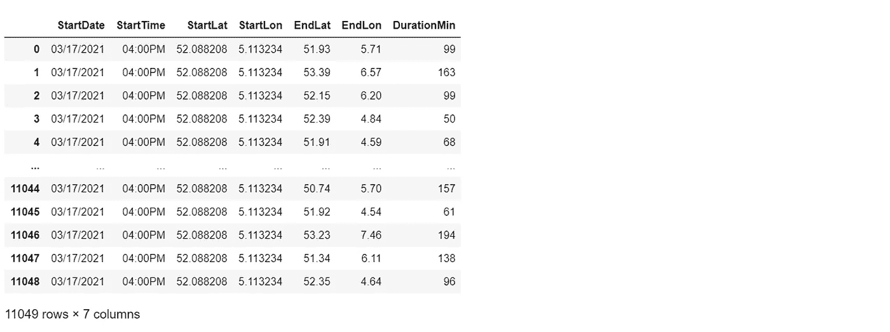
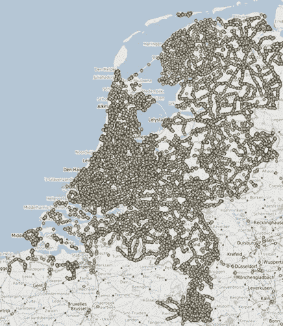
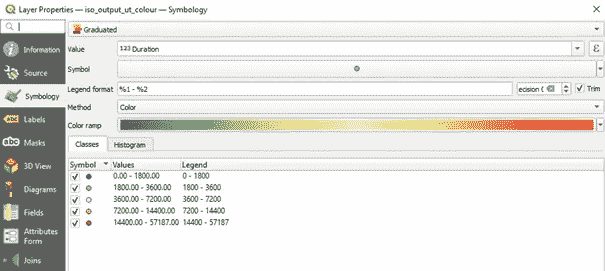
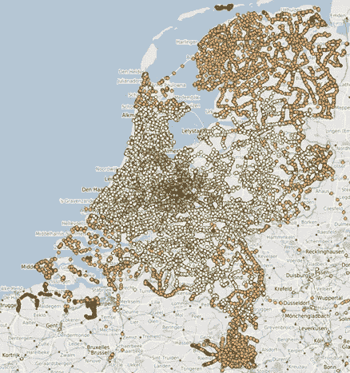
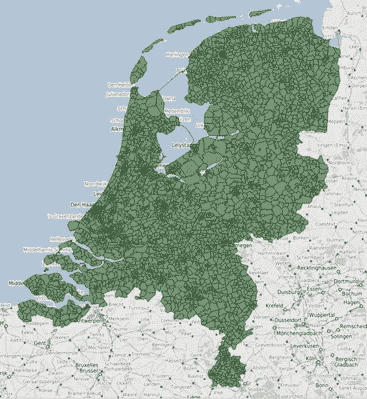
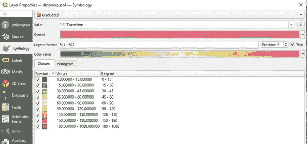
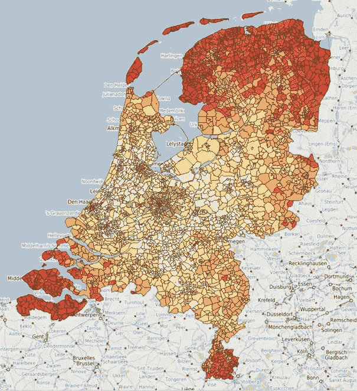
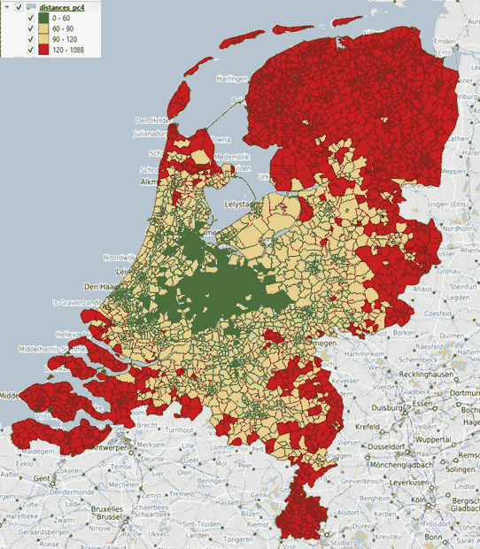

# 基于 OTP 和 QGis 的旅行时间可视化

> 原文：<https://towardsdatascience.com/visualization-of-travel-times-with-otp-and-qgis-3947d3698042?source=collection_archive---------15----------------------->

## 使用开源产品和开放数据创建荷兰公共交通出行时间的惊人可视化

作者图片(由 QGIS 创建)

荷兰公共交通的最大发展之一是公共可用数据的持续增长。结合 OpenStreetMap，这为多模式出行规划者提供了充足的信息。 [OpenTripPlanner](https://opentripplanner.org) 是一个非常完整的 TripPlanner 实现的例子。本文将向您展示如何使用 OTP 和 QGis 来可视化从一个起点到荷兰所有地区的旅行时间。

时代在变，在家工作正成为新的标准，而且很可能会持续下去。2 或 3 天到办公室将成为标准，减少从家到工作的旅行天数。在过去的几十年里，通勤时间保持不变，对于大多数人来说，每天大约一个小时的单程旅行是最长的。未来几十年，我预计每周通勤时间将保持稳定，增加每天可接受的旅行时间，这将允许人们离开城市，进入内陆地区(“乌得勒支以外”)。

这将提出一个问题:在一定的旅行时间内可以到达该国的哪些地区？本文将向您展示从一个位于乌得勒支市中心的虚构工作地点到荷兰所有邮政编码的旅行时间。所有的旅行都使用公共交通工具。

该项目的数据来源是 GeoFabrik 的 [OpenStreetMap 和](https://download.geofabrik.de/europe/netherlands.html) [GTFS 格式](https://gtfs.org/)的 [OVapi 用于时间表](https://ovapi.nl/)。基于 [GeoJSON](https://geojson.org/) 文件，用 [OpenTripPlanner 2.0](https://opentripplanner.org) 进行行程时间计算，用 [QGis 3](https://qgis.org) 进行可视化。

这篇文章的完整代码可以在 G [ithub](https://github.com/lmeulen/GTFS-Visuals) 上找到。

**计算行程时间**

第一步是计算旅行时间。从我们的出发点到这个国家的一系列地点。如前所述，计算是用 OTP 执行的。OTP 需要一个 OpenStreetMap PBF 文件，其中包含您感兴趣区域的街道和步行时间，以及 GTFS 的公共交通时刻表。OTP jar 是从 [Maven](https://repo1.maven.org/maven2/org/opentripplanner/otp/2.0.0/) 下载的。阴影部分是为了简单起见，因为它包括了所有的依赖项。OSM PBF 从 [GeoFabrik](https://download.geofabrik.de/europe/netherlands.html) 获得，命名为‘荷兰-最新-osm . pbf’。GTFS 从 [OVapi](http://gtfs.ovapi.nl/nl/) 下载，并以 zip ('gtfs-nl.zip ')格式下载。这三个文件都存储在同一个位置。

OTP 从命令行启动:

它将在当前目录中找到 OSM 和 GTFS 文件，并开始构建网络图。由于规模(我们正在创建一个整个国家的地图，而不是一个单一的城市)这将需要一些时间，但最终 OTP 服务器启动。需要 12G 的堆大小才能在内存中加载网络图。要测试服务器，请尝试 URL[http://localhost:8080](http://localhost:8080)。

除了 web 接口，还有一个 REST API 用于使用 OTP 服务器。旧版本的 OTP 提供了一个 REST-API，用于从单个位置请求带有旅行时间的等时线地图，但不幸的是，这个 API 在最新版本中不再可用。

GTFS 停靠点规范是为行程时间计算定义一组目的地的一个很好的切入点。对于所有已定义的公共交通站点，我们采用 LatLon 坐标，并将其四舍五入到圆点后面的三个数字。1 度大约是。111 千米，所以 xx.xxx 给出 100 米的分辨率。在移除重复的位置之后，获得将被使用的集合。通过对 LatLon 位置进行舍入，可以防止重复计算，例如，在同一条道路的相对侧有两个公共汽车站。

此示例显示了输入集的创建，其中使用了乌得勒支市中心的一个位置，旅行将发生在 2021 年 3 月 17 日 16:00。相同的文件格式可用于计算在不同时间和日期具有不同起点的一组起点-目的地，但目前，旅行的起始位置和日期时间是恒定的。

OTP 通过其 REST API 支持计划者请求。请求具有以下形式:

[http://localhost:8080/OTP/routers/2015/plan？<参数](http://localhost:8080/otp/routers/2015/plan?%3cparam)

除其他外，这些参数规定了日期、时间、起点、终点和使用的方式。通过为创建的文件中的每个起点/目的地线路调用该端点，创建了到该国公共交通可到达的所有位置的旅行时间的概览:

生成的数据集:

作者图片

**可视化行程时间**

将这些点添加到 QGis 中的地图可以合理地概述行驶时间。首先安装来自 https://qgis.org[的 QGis 3](https://qgis.org)，并按照本页的说明添加来自 https://www.openbasiskaart.nl/qgis.html[的国家底图。我们为可视化添加了 ESP-28992 地图 als 底图。](https://www.openbasiskaart.nl/qgis.html)

通过添加“文本交付图层”并将 are script 的输出文件指定为源，在底图的顶部添加了包含行驶时间的图层。确保使用 EndLon、EndLat 作为位置列(否则仅绘制起点)。现在，它将所有计算出的旅行时间显示为地图上的点:

作者图片(由 QGIS 创建)

由于公共交通点是目的地位置的基础，点的分布很好地概括了公共交通密度。我们可以给点添加一种颜色，通过将它指定为“分级”来指示旅行时间:

QGIS 图层属性屏幕(来源:QGis)

深绿色圆点在 30 分钟内，浅绿色圆点在 60 分钟内，黄色圆点在 2 小时内，橙色圆点在 4 小时内，红色圆点超过 4 小时:

作者图片(由 QGIS 创建)

虽然这是一个好的开始，但地图并没有给出完整的、易于理解的旅行时间概览。这是一大堆点。为了改进地图，我们想制作一个类似等时线的总览图。我们需要将地图划分为覆盖整个国家的区域，并根据旅行时间对这些区域进行着色。这些区域的来源将是邮政编码地图。所有邮区的形状都可以从 [ArcGIS Hub](https://arc-gis-hub-home-arcgishub.hub.arcgis.com/datasets/esrinl-content::postcodevlakken-pc-4) 中获得。到达一个邮政编码的行驶时间计算为到达上图中所有可用点的平均行驶时间:

GeoPandas 包对地理计算有很好的支持，包括在给定区域内选择点(gdf.within(…))。对于所有的邮政编码，添加一列行程时间(“travel time”)。

看上面的地图，你会怀疑不是所有的邮政编码都包括在内。执行上述代码后，超过 10%的邮政编码没有旅行时间。这些邮政编码被赋予到周围(接触)邮政编码的平均行程时间，加上所需时间的 15 分钟(用于从邮政编码到邮政编码的通勤)。如果这仍然不能产生时间，则使用完整组中的最大时间(以在以后保持带内着色)。

最后将 GeoPanda 数据帧保存为 GeoJSON 文件:

导出此数据框后，可将其作为图层添加到 QGis(例如，将 geojson 文件拖放到 QGis 的图层窗口):

作者图片(由 QGIS 创建)

邮政编码区域覆盖整个国家，对于我们的目的有足够的细节。如果需要更多细节，可以使用 PC6 数据集。

最后一步是给形状添加颜色:

QGIS 图层属性屏幕(来源:QGis)

颜色随着 15 分钟而增加，并逐渐从绿色变为红色，从而显示出全国范围内到达乌得勒支市中心的旅行时间概况:

作者图片(由 QGIS 创建)

如果给出了可接受的行驶时间，例如 90 分钟，颜色方案可以被调整为:
绿色:0 至 60 分钟
浅绿色:60 至 90 分钟
黄色:90 至 120 分钟
红色:120 分钟及更长时间

作者图片(由 QGIS 创建)

**结束语**

Open Trip Planner 2 是一款成熟的开源多模型旅行规划工具。通过它的 API，很容易集成到任何脚本或应用程序中。由于 GeoPandas 支持地理计算，因此创建地理编码数据集相对容易。QGis 是一个开源地理信息系统，可以从界面使用，如本例所示，但也配备了 Python 接口，使其更容易集成到脚本和应用程序中。创建视觉效果既简单又有帮助，因为图形概览使数据解释更容易。

*免责声明:本文包含的观点和意见仅归作者所有。*