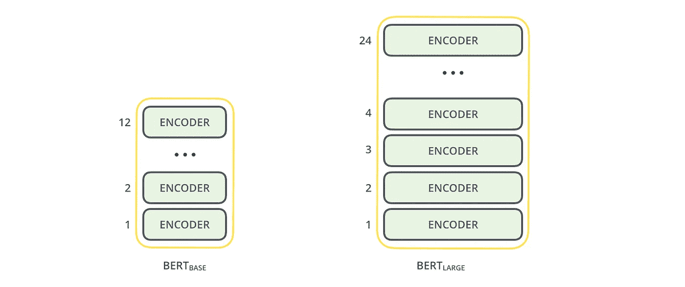
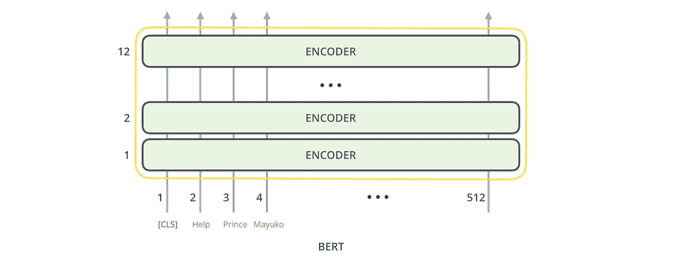
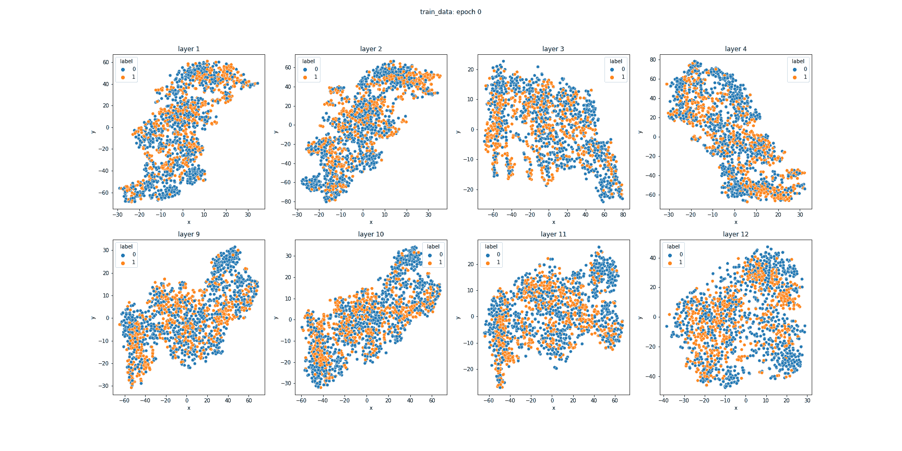
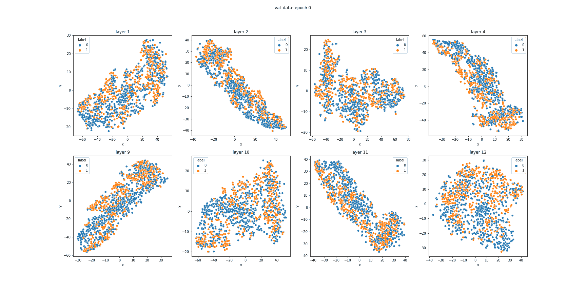

# 可视化 BERT 序列嵌入:一种看不见的方式

> 原文：<https://towardsdatascience.com/visualize-bert-sequence-embeddings-an-unseen-way-1d6a351e4568?source=collection_archive---------13----------------------->

## 实践教程

## 探索一种看不见的方式来可视化通过 BERT 的编码器层生成的序列嵌入。Python 笔记本包括完整的代码。

菲利贝托·桑蒂兰在 [Unsplash](https://unsplash.com/s/photos/data?utm_source=unsplash&utm_medium=referral&utm_content=creditCopyText) 上拍摄的照片

# 关于

像 BERT [1]这样的基于转换器-编码器的语言模型已经席卷了 NLP 社区，研究和开发阶层都大量使用这些架构来解决他们的任务。它们通过显示文本分类、下一句预测等各种语言任务的最新成果而变得无处不在。

BERT- *base* 架构堆叠了 12 个编码器层，这使得它拥有高达 1 亿个可调参数！BERT- *large* 架构更上一层楼，拥有 24 个编码器层和大约 3.5 亿个参数！🤯

插图选自[http://jalammar.github.io/illustrated-bert/](http://jalammar.github.io/illustrated-bert/)

# 为什么这么多层？

在输入文本序列的前向传递中，来自这些编码器块中的每一个的输出可以被视为上下文化嵌入的序列。然后，将每个上下文化嵌入序列作为输入提供给下一层。

编码器层的这种重复应用实现了:

*   当输入通过它们时，提取输入的不同特征
*   每个连续的层建立在前一层突出显示的图案上

插图选自[http://jalammar.github.io/illustrated-bert/](http://jalammar.github.io/illustrated-bert/)

众所周知，在使用这些深度架构时，非常容易陷入过度拟合的陷阱。

查看每个编码器层如何为输入提供自己的嵌入，一个有趣的问题可能会出现在人们的脑海中:
“当我训练我的模型时，每个层的嵌入对看不见的数据进行概括的效率如何？”
简而言之，我们感兴趣的是看看 BERT 的每一层能够在多大程度上发现数据中的模式，这些模式保存着看不见的数据。

在本教程中，我们将讨论一种非常酷的方式来可视化每一层在为分类任务寻找模式时的效率。

# 把手放在某物或者某人身上💪

有了动机，让我们看看我们将要做什么。

## 目标

为多个时期训练一个 BERT 模型，并可视化每一层在这些时期分离数据的效果。我们将为序列分类任务训练 BERT(使用[*BertForSequenceClassification*](https://huggingface.co/transformers/model_doc/bert.html#bertforsequenceclassification)类)。通过对实现细节进行一些调整，同样的练习可以扩展到其他任务。比如语言建模(使用 [*BertForMaskedLM*](https://huggingface.co/transformers/model_doc/bert.html#bertformaskedlm) 类)。在您自己的数据集上重新训练语言模型，并检查每个集群的特征或嵌入的分布！

## 使用的资源/库

**训练:**

1.  🤗变压器:*BertForSequenceClassification*模型，但是你也可以插入其他的变压器-编码器分类器架构，比如*RobertaForSequenceClassification*、*DistilBertForSequenceClassification*等等。
2.  PyTorch

**可视化:**

1.  海生的
2.  Matplotlib

**数据集:**

HatEval [2]，一个将推文标记为仇恨/中性的数据集。

然而，你可以随意在[配套的 Jupyter 笔记本](https://www.kaggle.com/tanmay17061/transformers-bert-hidden-embeddings-visualization)中加载你自己的数据集。

# 同伴 Jupyter 笔记本

我把数据加载、模型训练和嵌入可视化的完整代码放在这个笔记本里。本教程中的代码仅用于解释目的。完整的工作代码请参考笔记本。

# ⚠️我们不会报道的

由于本文只关注层嵌入的可视化，我们将只遍历代码的相关部分。其余的代码超出了本教程的范围。我假设你事先知道🤗变压器 BERT 基本工作流程(数据准备、培训/评估循环等)。

# 我们开始吧

提取每个 BERT 编码器层的隐藏状态:

1.  这🤗变形金刚为我们提供了一个*BertForSequenceClassification*模型，它由:
    (1 x*bertendedgings*层)→ (12 x *BertLayer* 层)→ (1 x *BertPooler* 层在嵌入 for*'【CLS】'*token)→(*tanh*激活)→(脱落层)
    注意分类头(从池层开始)是我们将可视化直接来自 12 x *BertLayer* 层的嵌入。
2.  *sent _ id*和*掩码*在 a 中准备🤗变压器 BERT 兼容格式
3.  数据集的标签需要对可视化进行颜色编码
4.  当将*output _ hidden _ States = True*参数提供给模型的[前向传递](https://huggingface.co/transformers/model_doc/bert.html#transformers.BertForSequenceClassification.forward)时，这 1 个*Bert embeddeds*层和 12 个 *BertLayer* 层中的每一个都可以返回它们的输出(也称为 *hidden_states* )。因此，模型输出隐藏状态的维数是(13，数据点数，最大序列长度，嵌入维数)
5.  由于我们只对来自 12 个 *BertLayer* 层的嵌入感兴趣，我们切掉不需要的*bertlembedding*层嵌入，留给我们维度的隐藏状态(12，数据点数，最大序列长度，嵌入维度)

接下来，我们定义一个函数，该函数可以在一个时期后为我们的数据集(例如- train/val/test)的分割绘制层的嵌入:

1.  *dim _ reducer*:scikit-learn 的 t-SNE 降维实现，将我们的嵌入从 BERT 默认的 768 维减少到 2 维。您也可以使用 [PCA](https://scikit-learn.org/stable/modules/generated/sklearn.decomposition.PCA.html) ，这取决于哪个更适合您的数据集。
2.  *visualize _ layer wise _ embeddings*:定义一个函数，该函数可以在每个时期后为我们的数据集(train/val/test)的分割绘制层的嵌入
3.  在每个层上循环计算:
    - *layer_embeds* :由层输出的嵌入，一个形状张量(number_of_data_points，max_sequence_length，embedding _ dimension)
    -*layer _ averaged _ hidden _ States*:通过对序列的所有非屏蔽记号上的嵌入取平均值，为每个数据点创建单个嵌入，产生一个形状张量(number_of_data_points，embedding _ dimension)

这些计算值最终使用 [Seaborn 库](https://seaborn.pydata.org/)绘制在新图上。

最后，将我们到目前为止在训练循环中看到的内容整合在一起:

在这里，我们在每个历元调用一次*visualize _ layer wise _ embeddings*函数，用于我们想要单独可视化的数据集的每个分割。

我选择可视化前 4 层和后 4 层的嵌入。

# 可视化🔬👨‍⚕️

我们已经准备好了我们的可视化！
我更进一步，把不同的图片拼接成 gif，让事情变得更方便！代码再次出现在笔记本中。
挺审美的吧？🤩

跨 BERT 模型层的训练数据的可视化

花点时间了解一下每一层的输出。试着从中得出一些有趣的推论！

我将给出一些例子:
-你能评论一下每一层在每个连续时期的表现吗？
-分类器的训练精度从时段 4 下降到时段 5！你能从上面的 gif 中验证这个事实吗？**

BERT 模型各层验证数据的可视化

最后，我们更感兴趣的是知道我们的嵌入是否有助于我们概括。我们可以通过上面的验证分割可视化来判断。

我想到的一些有趣的问题是:
-哪一层比其他层概括得更好？
-最后一层能在多大程度上区分职业？
-您认为训练和验证分割的嵌入之间的可分性有什么不同吗？
-对序列中所有非屏蔽标记的嵌入取平均值是否比仅对“*【CLS】*”标记进行嵌入产生更好的结果？(要回答这个问题，你可能需要稍微调整一下笔记本😉)

# 更进一步🙇‍♂️

不要仅仅停留在这里！
在所提供的笔记本中进行试验，尝试混合搭配不同层的输出嵌入，看看哪种组合有助于产生最佳的下游性能！

**回答:与时段 5 相比，时段 4 的第 12 层的嵌入更整齐地聚集在一起！这清楚地表明分类器在损失函数空间中击中然后超过了最小值。

# 参考

[1]: BERT:用于语言理解的深度双向变压器的预训练，Delvin 等人，2019
[2]: SemEval-2019 任务 Twitter 中针对移民和女性的仇恨言论的多语言检测，Basile 等人，2019