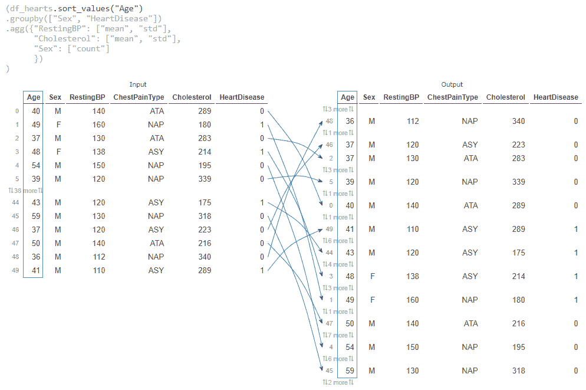
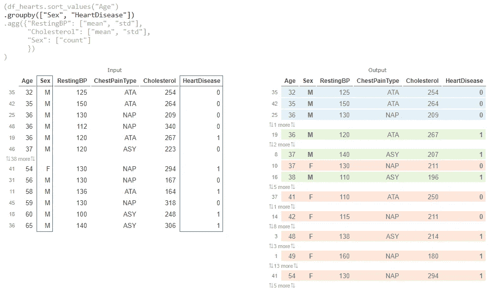
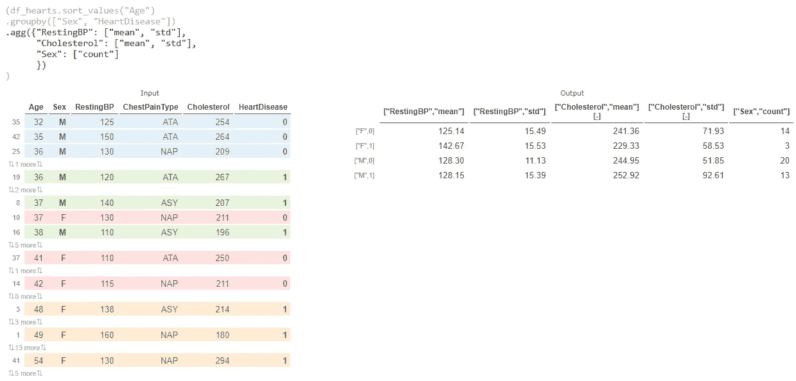

# 使用 PandasTutor 可视化您的熊猫数据转换

> 原文：<https://towardsdatascience.com/visualize-data-transformation-using-pandastutor-6126627dd225?source=collection_archive---------23----------------------->

## 工具

## 在浏览器中可视化您的 Python 熊猫代码，并查看您的数据如何逐步转换

Pandas 是一个强大的 Python 库，可用于任何探索性数据分析。有时，您可能难以可视化数据转换。PandasTutor 来了，这是一个网络应用程序，可以让你看到你的 pandas 代码如何一步一步地转换数据。

如果您有复杂的转换，并且想要可视化您的步骤或者向其他人解释它，这可能会很方便。

PandasTutor 可以让你可视化不同的熊猫变换，从[排序](https://pandastutor.com/vis.html#trace=example-code/py_sort_values.json)到[按多列分组](https://pandastutor.com/vis.html#trace=example-code/py_groupby_multi.json)，甚至按列分组和[执行多重聚合](https://pandastutor.com/vis.html#trace=example-code/py_sort_groupby_agg.json) [1]。

# PandasTutor 创建者

熊猫导师是由加州大学圣地亚哥分校的 Sam Lau 和 Philip Guo 创建的。该工具主要用于教学目的，正如其创建者在此处[所述](https://docs.google.com/document/d/1kvY8baGjaMbg8ucMTjXlmLeYJXVQKQr09AttwUu3F_k/edit#heading=h.3xhjglvrau6z)。这解释了这个工具的一些局限性(我将在后面的文章中讨论这些局限性)。

Sean Kross 和 Philip Guo 为 R 用户开发了一个类似的工具，叫做 Tidy Data Tutor。

# 个案研究

在本文中，我们将研究一个示例，其中我们对一些值进行排序，然后按多个列进行分组，最后我们将对多个列执行不同的聚合！

# 资料组

让我们使用来自 *Kaggle 数据集【2】的心力衰竭预测数据集。*你可以在下面找到数据。数据在[开放数据库(ODbl)许可](https://opendatacommons.org/licenses/odbl/1-0/)下可用，允许*用户自由共享、修改和使用该数据库，同时为其他人保持同样的自由。*【3】

<https://www.kaggle.com/fedesoriano/heart-failure-prediction>  

由于熊猫导师只对小数据起作用，我就取前 50 行红心数据)。

# 密码

下面是这篇文章中用于可视化的代码。您可能会注意到，CSV 数据在这里被编码，这是该工具的当前限制。

所以我们的转换只是最后几行(第 63–69 行)。

# 结果

# 步骤 1:对数据帧进行排序

`sort_values()`结果的可视化(步骤 1)(使用 [PandasTutor](https://pandastutor.com/vis.html) 生成)

# 第二步:可视化熊猫分组操作

对步骤 1 中的结果进行排序并可视化后，我们可以可视化 groupby()操作。

`groupby()`结果的可视化(步骤 1 和 2)(使用 [PandasTutor](https://pandastutor.com/vis.html) 生成)

# 步骤 3:计算多个列的不同聚合

在这里，我将计算“RestingBP”和“胆固醇”两列的平均值和标准差，并提供每个组的计数(这里我使用“性别”列来获得该信息。)

最终结果的可视化，即聚合(步骤 1-3)(使用 [PandasTutor](https://pandastutor.com/vis.html) 生成)

# 有趣的分享功能

Pandas Tutor 还为您提供了一个可共享的 URL，其中甚至包括转换中使用的 CSV 数据。例如，你可以在这里或者通过下面的链接查看我的转换代码和结果[！](https://pandastutor.com/vis.html#code=import%20pandas%20as%20pd%0Aimport%20io%0A%0Acsv%20%3D%20'''%0AAge,Sex,ChestPainType,RestingBP,Cholesterol,FastingBS,RestingECG,MaxHR,ExerciseAngina,Oldpeak,ST_Slope,HeartDisease%0A40,M,ATA,140,289,0,Normal,172,N,0,Up,0%0A49,F,NAP,160,180,0,Normal,156,N,1,Flat,1%0A37,M,ATA,130,283,0,ST,98,N,0,Up,0%0A48,F,ASY,138,214,0,Normal,108,Y,1.5,Flat,1%0A54,M,NAP,150,195,0,Normal,122,N,0,Up,0%0A39,M,NAP,120,339,0,Normal,170,N,0,Up,0%0A45,F,ATA,130,237,0,Normal,170,N,0,Up,0%0A54,M,ATA,110,208,0,Normal,142,N,0,Up,0%0A37,M,ASY,140,207,0,Normal,130,Y,1.5,Flat,1%0A48,F,ATA,120,284,0,Normal,120,N,0,Up,0%0A37,F,NAP,130,211,0,Normal,142,N,0,Up,0%0A58,M,ATA,136,164,0,ST,99,Y,2,Flat,1%0A39,M,ATA,120,204,0,Normal,145,N,0,Up,0%0A49,M,ASY,140,234,0,Normal,140,Y,1,Flat,1%0A42,F,NAP,115,211,0,ST,137,N,0,Up,0%0A54,F,ATA,120,273,0,Normal,150,N,1.5,Flat,0%0A38,M,ASY,110,196,0,Normal,166,N,0,Flat,1%0A43,F,ATA,120,201,0,Normal,165,N,0,Up,0%0A60,M,ASY,100,248,0,Normal,125,N,1,Flat,1%0A36,M,ATA,120,267,0,Normal,160,N,3,Flat,1%0A43,F,TA,100,223,0,Normal,142,N,0,Up,0%0A44,M,ATA,120,184,0,Normal,142,N,1,Flat,0%0A49,F,ATA,124,201,0,Normal,164,N,0,Up,0%0A44,M,ATA,150,288,0,Normal,150,Y,3,Flat,1%0A40,M,NAP,130,215,0,Normal,138,N,0,Up,0%0A36,M,NAP,130,209,0,Normal,178,N,0,Up,0%0A53,M,ASY,124,260,0,ST,112,Y,3,Flat,0%0A52,M,ATA,120,284,0,Normal,118,N,0,Up,0%0A53,F,ATA,113,468,0,Normal,127,N,0,Up,0%0A51,M,ATA,125,188,0,Normal,145,N,0,Up,0%0A53,M,NAP,145,518,0,Normal,130,N,0,Flat,1%0A56,M,NAP,130,167,0,Normal,114,N,0,Up,0%0A54,M,ASY,125,224,0,Normal,122,N,2,Flat,1%0A41,M,ASY,130,172,0,ST,130,N,2,Flat,1%0A43,F,ATA,150,186,0,Normal,154,N,0,Up,0%0A32,M,ATA,125,254,0,Normal,155,N,0,Up,0%0A65,M,ASY,140,306,1,Normal,87,Y,1.5,Flat,1%0A41,F,ATA,110,250,0,ST,142,N,0,Up,0%0A48,F,ATA,120,177,1,ST,148,N,0,Up,0%0A48,F,ASY,150,227,0,Normal,130,Y,1,Flat,0%0A54,F,ATA,150,230,0,Normal,130,N,0,Up,0%0A54,F,NAP,130,294,0,ST,100,Y,0,Flat,1%0A35,M,ATA,150,264,0,Normal,168,N,0,Up,0%0A52,M,NAP,140,259,0,ST,170,N,0,Up,0%0A43,M,ASY,120,175,0,Normal,120,Y,1,Flat,1%0A59,M,NAP,130,318,0,Normal,120,Y,1,Flat,0%0A37,M,ASY,120,223,0,Normal,168,N,0,Up,0%0A50,M,ATA,140,216,0,Normal,170,N,0,Up,0%0A36,M,NAP,112,340,0,Normal,184,N,1,Flat,0%0A41,M,ASY,110,289,0,Normal,170,N,0,Flat,1%0A'''%0A%0Adf_hearts%20%3D%20pd.read_csv%28io.StringIO%28csv%29%29%0Adf_hearts%20%3D%20df_hearts%5B%0A%20%20%20%20%5B%22Age%22,%20%22Sex%22,%20%22RestingBP%22,%20%22ChestPainType%22,%20%22Cholesterol%22,%20%22HeartDisease%22%5D%0A%5D%0A%0A%28df_hearts.sort_values%28%22Age%22%29%0A.groupby%28%5B%22Sex%22,%20%22HeartDisease%22%5D%29%0A.agg%28%7B%22RestingBP%22%3A%20%5B%22mean%22,%20%22std%22%5D,%20%0A%20%20%20%20%20%20%22Cholesterol%22%3A%20%5B%22mean%22,%20%22std%22%5D,%0A%20%20%20%20%20%20%22Sex%22%3A%20%5B%22count%22%5D%0A%20%20%20%20%20%20%7D%29%0A%29&d=2021-12-08&lang=py&v=v1)

# 优点:

*   逐步可视化
*   交互式绘图(您可以跟踪转换前后的数据行)
*   可共享的 URL

# 缺点(当前限制):

*   仅适用于小代码(代码应为 5000 字节)。由于数据也是编码的，而不是从文件中读取的，因此，您只能可视化小型数据集。
*   如前一步所述，您必须将数据和代码一起编码，因为不支持从外部资源(文件或链接)读取。
*   有限的熊猫方法支持。
*   你只能在最后一行想象熊猫的表情。您可能需要将多个步骤放在一起，或者单独运行可视化。

*关于不支持的功能或其他常见问题的完整列表，您可以在这里* *查看* [*。*](https://docs.google.com/document/d/1kvY8baGjaMbg8ucMTjXlmLeYJXVQKQr09AttwUu3F_k/edit#heading=h.3xhjglvrau6z)

# 结论

在本文中，我们检查了一个很好的工具，它可以一步一步地可视化 Pandas 数据转换，生成交互式图表来比较每次转换前后的数据。这对于那些想要巩固自己对熊猫转型的理解，或者想要与他人分享那些转型的人(熊猫导师甚至提供了一个可分享的网址)来说，非常有用。

感谢阅读🙏

> [加入我的邮件列表，接收类似的帖子](https://www.ealizadeh.com/subscribe/)。也可以在[中](https://medium.com/@ealizadeh)、 [LinkedIn](https://www.linkedin.com/in/alizadehesmaeil/) 、 [Twitter](https://twitter.com/intent/follow?screen_name=es_alizadeh&tw_p=followbutton) 关注我。

👉*如果你喜欢阅读这样的故事(以及媒体上的其他故事)，并且也想支持我成为一名作家，可以考虑注册*[*【https://medium.ealizadeh.com/membership】*](https://medium.ealizadeh.com/membership)*来获得所有故事的全部信息(免责声明:如果你使用我的链接注册，我将免费为你赚取一小笔佣金。)*

<https://medium.ealizadeh.com/membership>  

# 参考

[1][https://pandastutor.com/](https://pandastutor.com/)

[https://www.kaggle.com/fedesoriano/heart-failure-prediction](https://www.kaggle.com/fedesoriano/heart-failure-prediction)

[3][https://opendatacommons.org/licenses/odbl/1-0/](https://opendatacommons.org/licenses/odbl/1-0/)

*原载于*【https://ealizadeh.com】