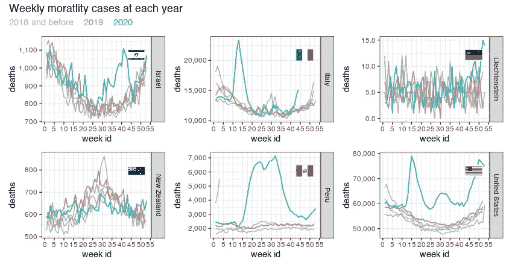
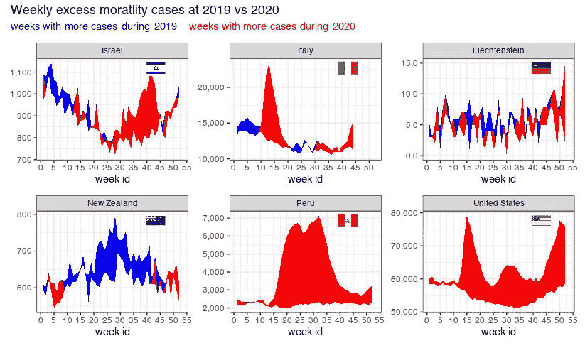
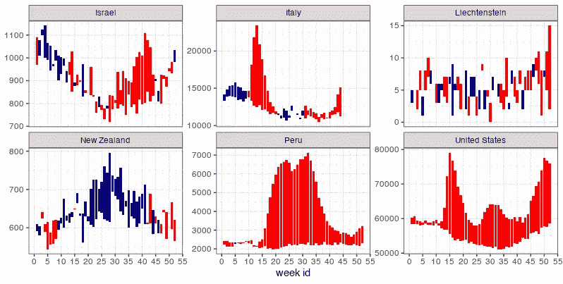
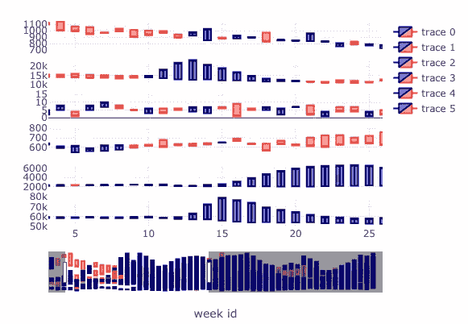

# 可视化新冠肺炎期间各国的超额死亡率

> 原文：<https://towardsdatascience.com/visualize-excess-mortality-across-countries-during-the-covid-19-5630413b7368?source=collection_archive---------58----------------------->

对我的孩子们来说，最令人兴奋的事情，尤其是在新冠肺炎时间，就是打开几乎每天都送到我们家门口的投递箱。尽管大多数送货都是食品杂货，但孩子们总是对这次他们将在盒子里找到什么宝贝充满热情和兴奋。

这也是我在发现一个新的新冠肺炎数据集时的感受。它采用了一种有趣但简单的方法:该数据集只是统计了每个国家的所有死亡人数，并与前几年进行比较，而不是关注死亡原因和对每个记录的潜在偏差进行无休止的辩论。主要假设是，新冠肺炎相关的死亡率效应只是今年独特的死亡病例与前几年之间的差异。

这个数据集的作者查阅了世界各地可靠的死亡率记录，并让数据集[可供我们所有人探索](https://github.com/akarlinsky/world_mortality)。

这篇博客文章将重点复制[存档论文](https://www.medrxiv.org/content/10.1101/2021.01.27.21250604v1)中的一些分析，使用简单的可视化工具，没有花哨的数学符号，或其他流行病学标度/转换/相对比率等。

我们先来看看今年的死亡病例和往年有什么不同。虽然数据集包括全球 79 个国家的数据，但我将只关注其中几个国家，每个国家都有独特的模式。

图一。来源:作者

查看该图可以看到 2020 年**(*蓝线*)与前几年相比的独特分布:**2015–2018**(*灰线*)，以及 **2019** ( *红线*)。Lichtenstein 是一个特殊的案例研究，前几年每周的案例相对很少，很难从视觉上发现多年来的任何差异。**

**接下来，让我们决定什么是最好的(或至少足够好的)参考*非 covid* 年份。一种方法是取所有/最近/前几年子集的平均值。为了简单起见，也为了避免多年来无关的年度趋势影响，让我们只使用 2019 年作为参考年。**

****

**图二。来源:作者**

**接下来，让我们用*带状图*来可视化 2020 年至 2019 年间的超额死亡率案例。当 2020 年的病例数高于 2019 年时，两条线之间的红色区域是每周增加的病例数。但是，如果 2019 年的病例数多于 2020 年，则会用蓝色区域表示。**

****

**图 3。来源:作者**

***红色*和*蓝色*之间的每周波动表明没有恒定的趋势，因此， *covid-year* 的影响较小。请注意，每个图都有自己的 Y 轴刻度。查看论文，了解评估这种影响的更多量化方法。**

**另一个让上述形象化的尝试是用*烛台*情节:**

****

**图 4。来源:作者**

**这里是另一个*烛台*图，带有一个嵌入了 HTML 滑动条的 Java 脚本，用于 x 轴周，通过 *plotly* 包允许更多用户友好的交互。(尽管我不知道如何用区域命名轨迹，以及如何将 HTML 文件作为动态图像/动画加载到 Medium 中)。**

****

**图 5。来源:作者**

# ****后记**:**

**希望您受到了启发，可以自己处理这些数据，并尝试一下。**

**在这个博客上，我学到了一些新的实践，比如在每个面(国家)上添加旗帜图标作为网格对象，绑定/分面情节支线剧情，以及其他技巧。**

**我也希望在世界地图上把这些地方作为贫民窟添加进去，但是可能在另一个帖子上。**

**我用过的 R 包有:ggplot2，patchwork，ggflags，plotly，tidyverse，
lubridate，magrittr，gghighlight，ggtext，tidyquant，ISOweek。**

**将很高兴应要求分享 R 代码。**

**我差点忘了交叉引用我之前关于新冠肺炎可视化的博文:**

> **[如何在单个长管道 R 代码行中创建一个种族栏动画情节](/how-to-create-a-race-bar-animated-plot-in-a-single-long-piped-r-line-of-code-6216f09ed844?source=your_stories_page-------------------------------------)**
> 
> **[新冠肺炎死亡可视化:美国各州的种族条形图](https://drorberel.medium.com/covid-19-death-visualization-race-bar-chart-for-us-states-96edc59102a9?source=your_stories_page-------------------------------------)**
> 
> **[新冠肺炎第一波后美国各州排名恢复，使用谷歌移动数据](/ranking-recovery-of-us-states-after-covid-19-first-wave-using-google-mobility-data-fec9df6f1864?source=your_stories_page-------------------------------------)**
> 
> **[可视化萨克斯图并测量移动趋势](/ranking-recovery-of-us-states-after-covid-19-first-wave-using-google-mobility-data-fec9df6f1864?source=your_stories_page-------------------------------------)**

**查看我的其他[博客文章](https://medium.com/@drorberel)和我的 [GitHub 页面](https://drorberel.github.io/)获得更多有趣的阅读。[领英](https://www.linkedin.com/in/dror-berel-1848496/)。**