# 用 PyGraphistry 可视化 GitHub 社交网络

> 原文：<https://towardsdatascience.com/visualize-github-social-network-with-pygraphistry-dfc23a38ec8d?source=collection_archive---------6----------------------->

## [实践教程](https://towardsdatascience.com/tagged/hands-on-tutorials)

## 分析机器学习开发者和 Web 开发者之间的联系

# 动机

你有没有想过不同角色的 GitHub 开发者是如何连接的？例如，如果一个人是机器学习开发人员，他/她关注的人中有百分之多少是 web 开发人员？如果一个人是 web 开发人员，他/她关注的人中有百分之多少是机器学习开发人员？


作者图片

在本文中，我们将使用由 GitHub 开发人员的大型社交网络组成的数据来回答这个问题。我们还将使用 PyGraphistry 来可视化不同类型的开发人员是如何相互联系的。


GIF by Author——在这里与剧情[互动。](https://hub.graphistry.com/graph/graph.html?dataset=c8a429715e014bfdb7dc9e183f14952f)

# 加载数据集

我们将使用 Kaggle 中的 GitHub 社交网络[来分析 GitHub 开发者的大型社交网络。节点是至少有 10 个存储库的开发人员。如果一个人是机器学习开发者，`ml_target=1`，否则`ml_target=0`。](https://www.kaggle.com/femikj/github-social-network?select=github_edges_1.csv)

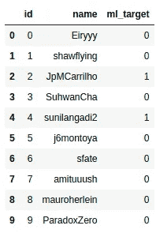

作者图片

边缘是这些开发者之间的相互追随关系。


作者图片

# 分析每种开发人员类型的联系

## ML 开发人员和 Web 开发人员的百分比

让我们从找出网络中 web 开发者(𝑃(Web 开发者)和机器学习开发者(𝑃(ML 开发者)的百分比开始。

这个网络中 74%的开发者是 web 开发者。

## 混合连接的百分比

网络中混合连接(一个 web 开发者和一个机器学习开发者之间的连接)的百分比是多少？

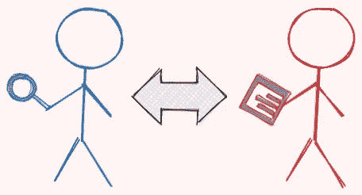

作者图片

从连接`edges`工作台和`nodes`工作台开始:


作者图片

接下来，计算网络中混合连接的百分比— 𝑃(ML 开发人员与 web 开发人员连接)。

```
0.1546558340224842
```

相同连接的百分比几乎比混合连接的百分比高 5.5 倍。

## 网络开发者的联系

另一个需要分析的有趣问题是:如果一个人是 web 开发人员，他/她的人脉中有百分之几是 web 开发人员，他/她的人脉中有百分之几是机器学习开发人员？

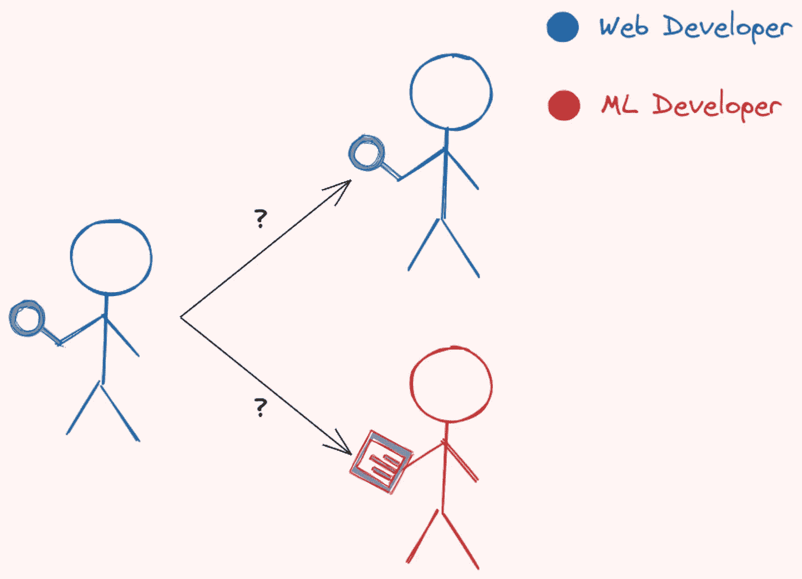

作者图片

让我们用贝叶斯定理来回答这个问题。

[](/bayes-theorem-clearly-explained-with-visualization-5083ea5e9b14) [## 贝叶斯定理，用可视化清晰地解释

### 如果您的 COVID 检测呈阳性，那么您实际上患有 COVID 的几率有多大？

towardsdatascience.com](/bayes-theorem-clearly-explained-with-visualization-5083ea5e9b14) 

根据贝叶斯定理，我们知道:


从前面的计算中我们已经知道𝑃(ML 开发者与网络开发者)和𝑃(Web 开发者)连接。让我们用这些百分比来找出 ML 开发者|Web 开发者的𝑃(Connect):

```
0.20852347708049263
```

现在，找到𝑃(Connect 对一个网页开发者来说是很容易的:

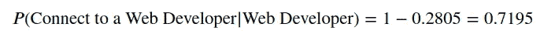

这意味着如果一个人是 web 开发人员:

*   他的人脉是网络开发者的比例是 71.95%
*   他的关系是 ML 开发者的百分比是 28.05%。

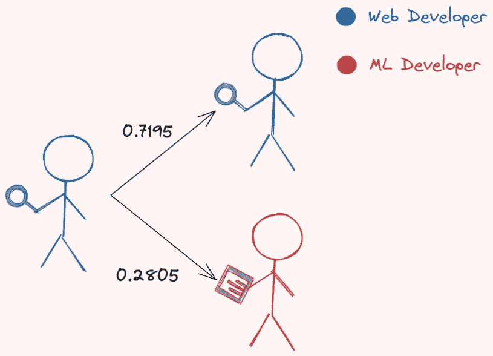

作者图片

这些百分比与网络中 ML 开发者和 web 开发者的百分比非常相似(0.258 和 0.741)。

## ML 开发人员的联系

同样，我们可以找到𝑃(Connect 对一个 Web 开发者|ML 开发者):

```
0.5986779897985065
```

和𝑃(Connect 对一个 ML 开发者|ML 开发者):

```
0.4103
```

现在，我们知道如果一个人是 ML 开发者:

*   他/她的联系人是 web 开发人员的比例为 59.87%
*   他/她的关系是 ML 开发者的百分比是 41.03%。


作者图片

由于 ML 开发者在网络中的百分比只有 25.8%，所以看到一个 ML 开发者的人脉中有 41.03%是 ML 开发者就很惊讶了。这意味着 ML 开发者更有可能跟随其他人而不是 web 开发者。

# 使用 PyGraphistry 可视化网络

让我们通过使用 PyGraphistry 可视化 GitHub 网络来尝试确认上一节的结论。

## 什么是 PyGraphistry？

PyGraphistry 是一个可视化大型图形的 Python 库。由于我们将在本文中使用大型图表，PyGraphistry 是一个完美的工具。

要安装 PyGraphistry，请键入:

```
pip install pygraphistry
```

## 开始

要使用 PyGraphistry，首先在[graphistry.com](https://www.graphistry.com/)创建一个免费账户，然后注册新账户:

接下来，指定图形的节点和边。我们还使用`encode_point_icon`来显示不同角色的不同图标:

绘制图表:

现在你应该在你的笔记本上看到类似下面的东西！


GIF by Author —在这里与剧情[互动。](https://hub.graphistry.com/graph/graph.html?dataset=c8a429715e014bfdb7dc9e183f14952f)

这里可以和上面[的剧情互动。节点越大，它连接的节点就越多。](https://hub.graphistry.com/graph/graph.html?dataset=c8a429715e014bfdb7dc9e183f14952f)

将鼠标悬停在特定节点上会显示它所连接的节点。

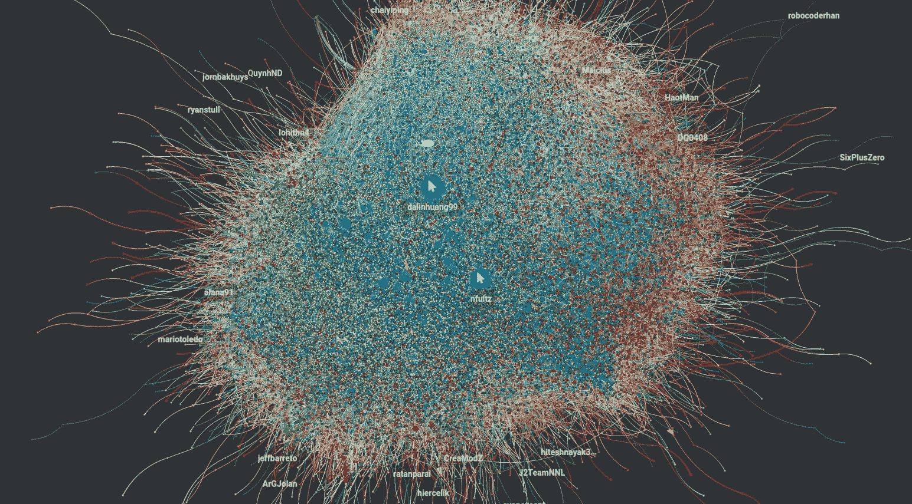

GIF by Author —在这里与剧情[互动。](https://hub.graphistry.com/graph/graph.html?dataset=c8a429715e014bfdb7dc9e183f14952f)

单击一个节点将为您提供关于该节点的信息。


作者图片

## 编码点颜色

目前的情节很美，但信息量不大。因为我们想知道不同角色的开发人员是如何相互联系的，所以让我们根据每个开发人员的角色给节点涂上颜色。

机器学习开发者是银色的，web 开发者是栗色的。


作者图片—与剧情互动[此处](https://hub.graphistry.com/graph/graph.html?dataset=b87abffc6d7a40cfb3d9cf876bf5c71e)

> 你可以在这里和[上面的剧情互动。如果颜色没有按预期显示，您可能需要刷新。](https://hub.graphistry.com/graph/graph.html?dataset=b87abffc6d7a40cfb3d9cf876bf5c71e)

我们可以看到相同角色的开发人员倾向于聚集在一起。

## 确定影响者

谁是获得最多连接节点数的开发人员？我们可以通过点击屏幕顶部的数据表图标找到答案。

表格打开后，按度数(一个节点连接了多少个节点)对表格进行排序，然后单击您感兴趣的点，该点将在下图中突出显示:


GIF by Author —在这里与情节[互动](https://hub.graphistry.com/graph/graph.html?dataset=b87abffc6d7a40cfb3d9cf876bf5c71e)

从表中我们可以看出，大部分热门的开发者都是 web 开发者。这并不奇怪，因为 web 开发人员比 ML 开发人员多得多。

# 检测社区

社区是彼此紧密连接的节点的子集，并且松散地连接到同一图中的其他社区中的节点。

让我们尝试使用 Louvain 方法来检测图中的社区。由于我们正在处理一个大图，我们将使用 [cuGraph](https://github.com/rapidsai/cugraph) 来加速代码。

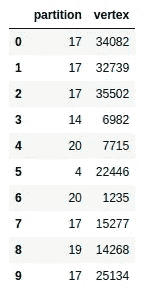

作者图片

在上表中，`partition`是节点(或`vertex`)所属的社区。

让我们看看有多少个社区:

```
array([ 0,  1,  2,  3,  4,  5,  6,  7,  8,  9, 10, 11, 12, 13, 14, 15, 16, 17, 18, 19, 20, 21], dtype=int32)
```

总共有 22 个社区。让我们想象一下这些社区是什么样子的。从连接`nodes`表和`parts`表开始，获取节点及其分区的名称。


作者图片

然后我们用 [faker](https://faker.readthedocs.io/en/master/) 自动为不同的分区创建不同的颜色。

[](/how-to-create-fake-data-with-faker-a835e5b7a9d9) [## 如何用 Faker 创建假数据

### 您可以收集数据或创建自己的数据

towardsdatascience.com](/how-to-create-fake-data-with-faker-a835e5b7a9d9) 

您应该会看到类似下面的内容！


Gif by Author —在这里与情节[互动](https://hub.graphistry.com/graph/graph.html?dataset=7050c382c64540e5933e3fb08b2696ad)

你可以在这里与上图[互动。我们可以看到，同一个社区中的节点(具有相同的颜色)倾向于聚集在一起。](https://hub.graphistry.com/graph/graph.html?dataset=7050c382c64540e5933e3fb08b2696ad)

## 每种类型开发人员的社区

大多数 web 开发人员属于什么社区？我们可以通过只选择 web 开发人员的节点来解决这个问题。要过滤节点，请单击屏幕顶部的过滤器按钮。

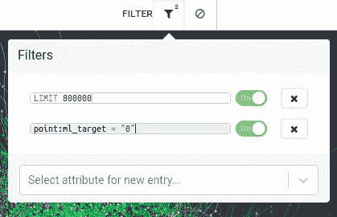

作者图片

您应该只看到 web 开发人员的节点:

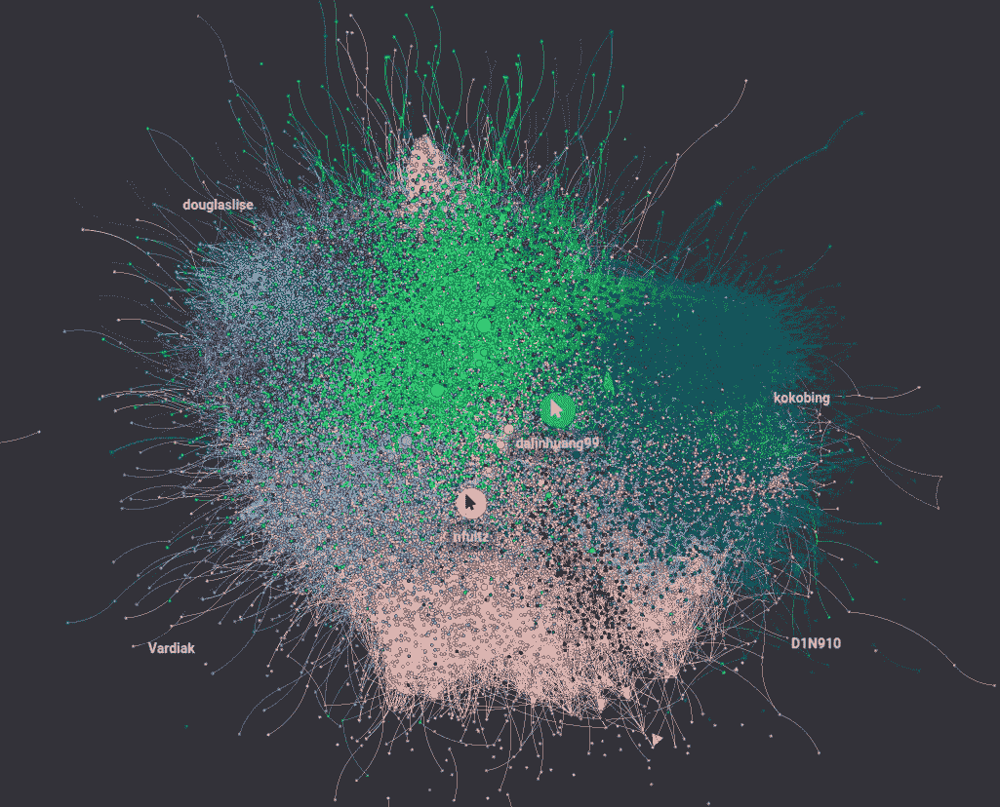

作者图片

似乎 web 开发人员属于不同的社区。让我们看看 ML 开发者属于哪些社区:

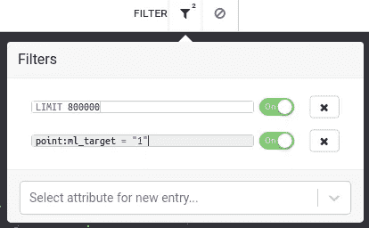

作者图片

该图仅包含 ML 开发人员:

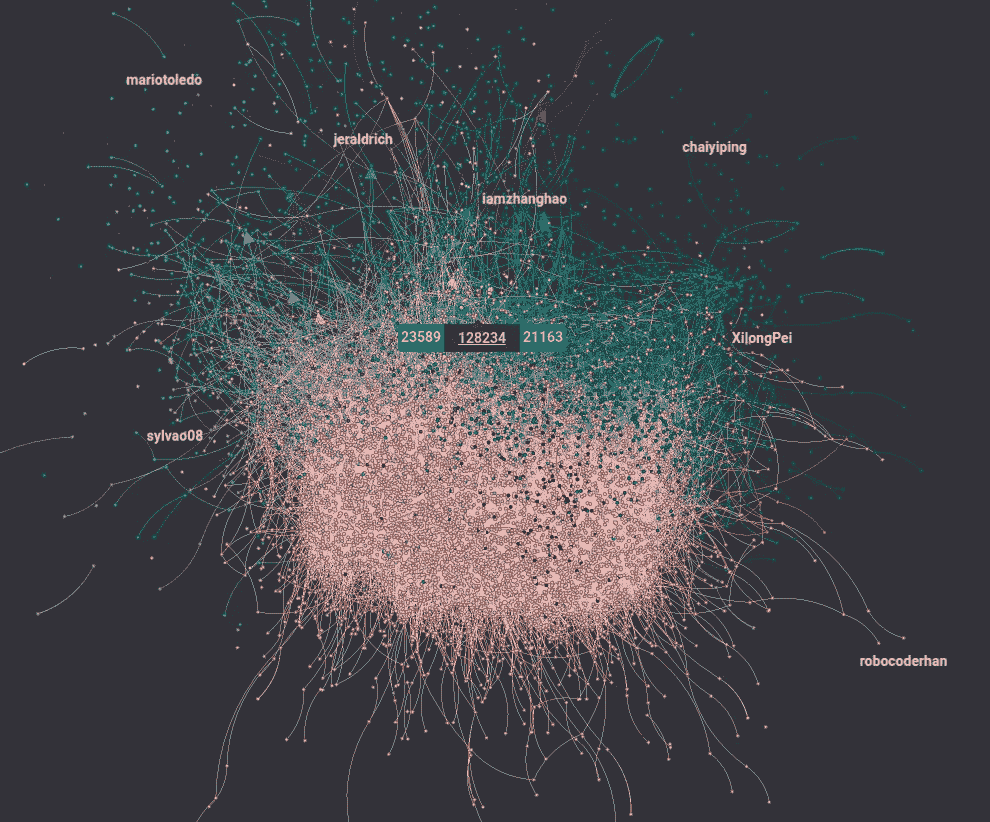

作者图片

有意思！大部分 ML 开发者属于粉色社区。这意味着，与 web 开发人员不同，ML 开发人员倾向于在同一个社区中。换句话说，ML 开发者之间的联系更加紧密。

## 每个社区中 ML 开发者的百分比

每个社区中 ML 开发者的比例是多少？让我们用一个分组条形图来说明这一点:

看起来在大多数社区中有一小部分 ML 开发者。这意味着大多数社区都相当多样化。

# 结论

恭喜你！你刚刚学习了如何使用贝叶斯统计和 PyGraphistry 分析社交网络。希望这篇文章能给你分析身边网络所需的动力和知识。你可能会对你从图表中发现的东西感到惊讶。

在这个 GitHub repo 中随意发挥和分叉本文的源代码:

[](https://github.com/khuyentran1401/Data-science/blob/master/visualization/visualize_github_network/github_explore.ipynb) [## 数据科学/github _ explore . ipynb at master khuyentran 1401/数据科学

### 收集了有用的数据科学主题以及代码和文章-Data-science/github _ explore . ipynb，位于 master …

github.com](https://github.com/khuyentran1401/Data-science/blob/master/visualization/visualize_github_network/github_explore.ipynb) 

我喜欢写一些基本的数据科学概念，并尝试不同的数据科学工具。你可以在 LinkedIn 和 Twitter 上与我联系。

如果你想查看我写的所有文章的代码，请点击这里。在 Medium 上关注我，了解我的最新数据科学文章，例如:

[](/observe-the-friend-paradox-in-facebook-data-using-python-314c23fd49e4) [## 使用 Python 观察脸书数据中的朋友悖论

### 平均来说，你的朋友比你的朋友多吗？

towardsdatascience.com](/observe-the-friend-paradox-in-facebook-data-using-python-314c23fd49e4) [](/pyvis-visualize-interactive-network-graphs-in-python-77e059791f01) [## Pyvis:用 Python 可视化交互式网络图

### 只需要几行代码

towardsdatascience.com](/pyvis-visualize-interactive-network-graphs-in-python-77e059791f01) [](https://pub.towardsai.net/visualize-gender-specific-tweets-with-scattertext-5167e4600025) [## 用分散文本可视化特定性别的推文

### 区分推文中的性别，并在交互式 HTML 散点图中呈现

pub.towardsai.net](https://pub.towardsai.net/visualize-gender-specific-tweets-with-scattertext-5167e4600025) [](https://khuyentran1476.medium.com/visualize-similarities-between-companies-with-graph-database-212af872fbf6) [## 使用图形数据库可视化公司之间的相似性

### 用 Neo4j 建立和分析图形数据库

khuyentran1476.medium.com](https://khuyentran1476.medium.com/visualize-similarities-between-companies-with-graph-database-212af872fbf6) 

# 引用

FEMI·K·j .(2021 年 7 月 25 日)。GitHub 社交网络，
第 1 版。从[https://www.kaggle.com/femikj/github-social-network](https://www.kaggle.com/femikj/github-social-network)取回 2021–11–22。[公共许可证。](https://www.kaggle.com/femikj/github-social-network/metadata)