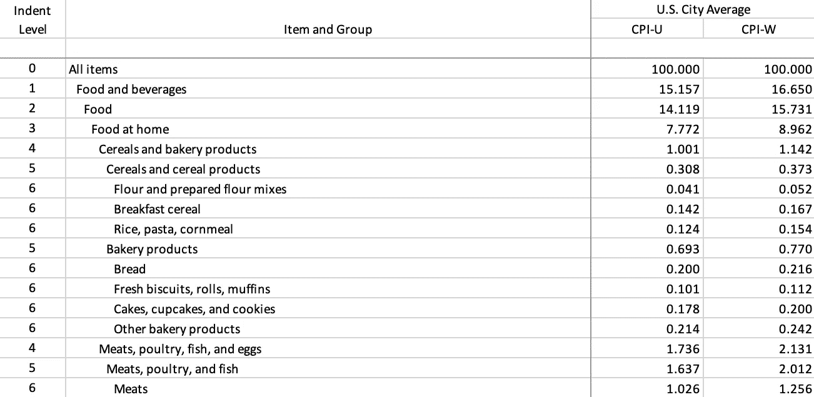
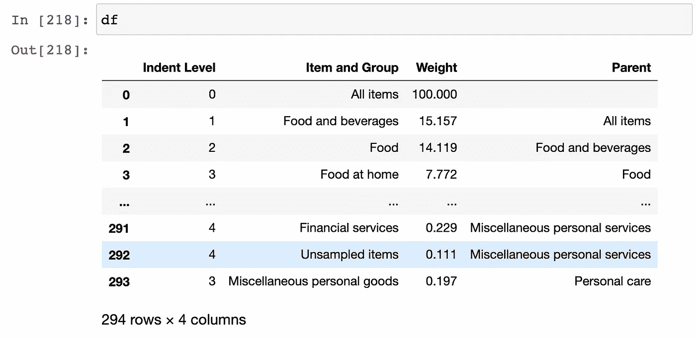
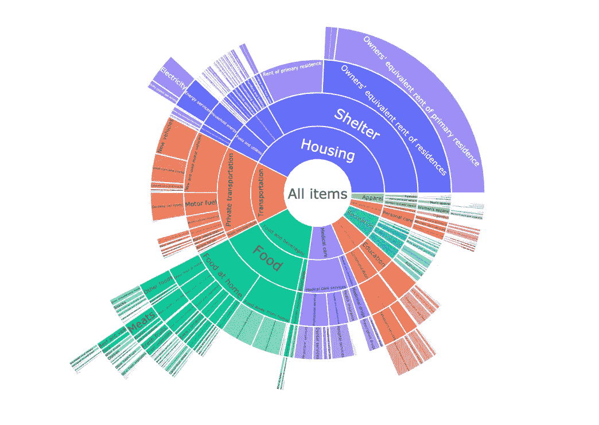
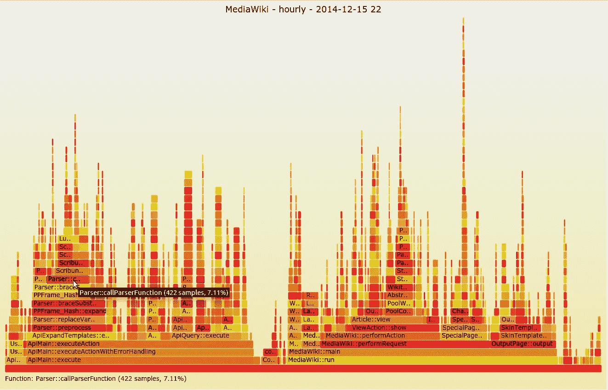

# 使用 Plotly 和 Datapane 可视化分层数据

> 原文：<https://towardsdatascience.com/visualize-hierarchical-data-using-plotly-and-datapane-7e5abe2686e1?source=collection_archive---------5----------------------->

## [实践教程](https://towardsdatascience.com/tagged/hands-on-tutorials)

## 使用交互式图表探索嵌套很深的通货膨胀数据集

按类别显示数据很容易——只要用一个不起眼的条形图或饼图就行了(尽管 T2 有一个关于哪个最好的 100 年历史的争论)。

但是如果每个类别都有子类别呢？而那些子类别又有子子类别？这是许多领域中常见的数据模式，包括文件系统、生物学和经济学。

照片由 [niko photos](https://unsplash.com/@niko_photos?utm_source=unsplash&utm_medium=referral&utm_content=creditCopyText) 在 [Unsplash](https://unsplash.com/s/photos/tree?utm_source=unsplash&utm_medium=referral&utm_content=creditCopyText) 上拍摄

在本文中，我们将介绍几种交互式显示嵌套数据的方法，并讨论每种方法的优缺点。

# 数据:美国消费者价格指数(CPI)权重

想知道通货膨胀是如何计算的吗？从本质上讲，政府将每月收集数千种普通商品的价格数据，根据重要性进行加权，并将它们组合成一个“篮子”，广泛代表普通家庭的支出。然后，他们跟踪这些项目的价格变化，以计算出经济的整体通胀水平。

这个篮子可以用来粗略衡量每个人是如何花钱的。这是一个有趣的数据集，因为数据自然是分层的:从最高层的类别如“食品”一直到单个产品如“多力多滋”。

[警告:通货膨胀方法论是一门深奥的学问——要小心，否则你可能会在晦涩的政府统计网站上浪费掉几天的时间！]

为了进行这种探索，我们将根据美国劳工统计局[的公开数据](https://www.bls.gov/cpi/tables/relative-importance/home.htm#Archived%20Relative%20Importance%20Data)来研究美国消费者价格指数的不同类别和权重。数据来自 Excel 文件，具有以下特征:

该数据包含 295 个不同的类别，分布在 8 个不同的“缩进级别”，从 1—“食品和饮料”( 15.16%重量)，到 8 —“生牛肉末”(0.17%重量)。请注意，它并没有深入到单个产品。这些项目按层次排列，因此每个项目的权重将等于其子项权重的总和。

我们首先将数据加载到 Pandas 中，并做一些预处理。特别是，我们需要使用行索引和缩进级别来获取每一行的“父级”,因为许多图形库都需要这些信息。我们最终得到以下数据框架:

让我们开始一些可视化！我们将使用 Plotly 创建交互式图表，并使用 [Datapane](http://datapane.com) 使我们的图表具有交互性，因此用户可以自己探索数据。当您有复杂的数据，而这些数据又不容易用静态图表示时，这一点尤其重要。

# **1。旭日图**

我们将从 Sunburst 图表开始:一种高级类型的饼图，其中不同级别的数据表示为同心圆。

使用 Plotly 制作旭日图非常简单:

它在我的浏览器上交互显示，但当我试图将其复制到 Medium 时，它显示为静态图。不过不用担心，我们可以使用 Datapane 将图表上传到 Datapane.com，然后共享或嵌入交互式报告:

运行这段代码后，Datapane 生成一个报告，我们可以通过 URL 查看我们的绘图:[https://data pane . com/u/johnmicahreid/reports/visualizing-deep-nested-data/](https://datapane.com/u/johnmicahreid/reports/visualizing-deeply-nested-data/)

此时，我们可以共享报告，或者直接嵌入报告，如下所示:

回到分析，这个图表看起来很有趣，但很混乱，很难阅读深度嵌套的小权重类别。将它限制在两个级别看起来更好:

通过简化图表，你遗漏了信息，但这可能是一件好事。有效的数据可视化是向你的受众传达一个清晰的信息，你的图表越明显+简单，他们就越有可能理解。

对于这张图表，我希望有人理解的故事如下:“哇，看起来住房成本是通货膨胀的最大因素！”

# 2.树形图

树状图类似于旭日图，只是它们以矩形形式表示数据。它们比旭日图有优势，因为图上每个矩形的面积与你要展示的数量成正比。

构建树状图使用的 Plotly 语法与 sunburst 完全相同:

这要清楚得多，但是区域并不完全准确，因为一些空间被边界框和文本占据了。此外，一些嵌套很深的层次被切断，难以阅读。如果我们把情节限制在前两层，我们会得到一个更整洁的画面:

# 3.桑基图

另一种选择是桑基图，它最初被发明用来显示能量在系统中的传递。如果您想要显示经过几个不同阶段的数据，请使用它—唯一的建议是进入系统的“流量”应该等于流出系统的“流量”。

Plotly 中的代码要复杂得多，因为我们需要将数据转换成不同的格式:

与前两种情况相比，我们在这里看到了一个类似的信息密度问题——有太多的信息需要一目了然，较小的类别被极度压缩。Sankey 图和 sunburst/treemap 之间的一个有趣的区别是在图的最右端显示所有没有子节点的节点的方式，即使它们有不同的缩进级别。

让我们再来看看前两个级别:

这更清楚，但我个人建议不要使用桑基图，除非你有真正令人信服的理由这样做，因为它们相当不直观，数据通常可以用更好的方式表示。

# 4.图表

从第一原理思考问题，我们的数据本质上是一个树形结构，树是一种图形。所以让我们试着把数据形象化为图表。

这里的代码要复杂得多，因为我们需要将数据帧转换成一系列的边和节点。我们将使用 [networkx](https://networkx.org/) 来转换和存储数据，并 Plotly 将其可视化。不再有高级 API，所以我们将手动绘制每个节点和边。

正如你从这个 viz 中看到的，图很好地表现了不同量之间的**关系**，并且可以轻松地适应许多不同的节点。唯一的缺点是，您需要将鼠标悬停在每个节点上才能读取该点的值。我们还可以尝试各种技巧，如使节点的大小与权重成比例，以及不同的节点定位算法，但结果开始看起来很奇怪。

# 5.其他选择

冰柱图是另一种可视化嵌套数据的好方法，基本上是一组堆叠的垂直条形图。我们可以在 D3.js 可视化库中看到一个很好的例子:

Mike Bostock 的 D3.js 文档中的 Icicle embed

[火焰图](http://www.brendangregg.com/flamegraphs.html)是一个类似的概念，但是旋转了。它们是由 Brandon Gregg 发明的，作为一种分析软件性能的方法。这里 X 轴是时间，Y 轴代表函数调用深度，每个矩形代表一个不同的函数调用。

来自[维基共享资源](https://upload.wikimedia.org/wikipedia/commons/b/b5/MediaWiki_flame_graph_screenshot_2014-12-15_22.png)的火焰图示例

这两种方法似乎都比以前的方法在显示多层次嵌套方面做得更好，但不幸的是，我还没有找到任何优秀的 Python 库来制作它们！如果你有任何想法，请在评论中告诉我。

# 最后

*   嵌套数据很难很好地可视化，如果可能的话，您应该尝试一次只显示两个级别。
*   除非您的数据非常符合目的和/或您的点数相对较少，否则不要使用桑基图。
*   决定是显示每个类别的**比例**更重要，还是显示类别之间的**关系**更重要。如果是后者，那么图表可能是一个不错的选择。
*   如果你有 JS 技能，冰柱图是一个很好的选择

如果你有兴趣自己试验一下，这里有一些数据: