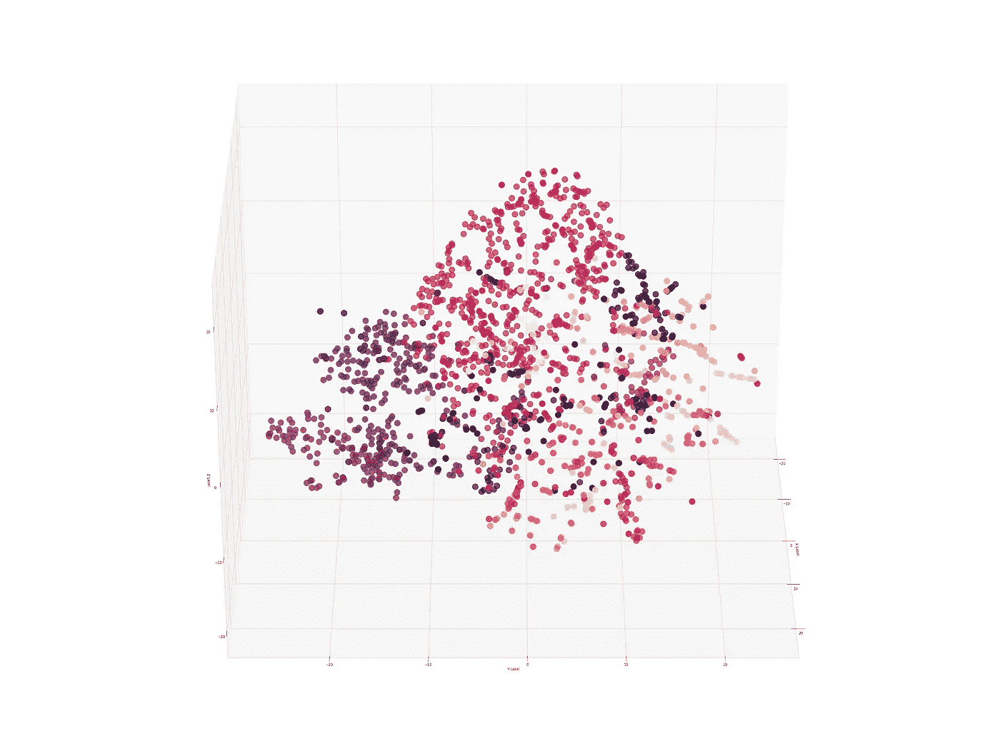
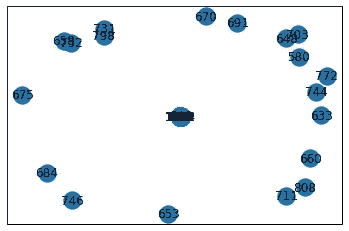
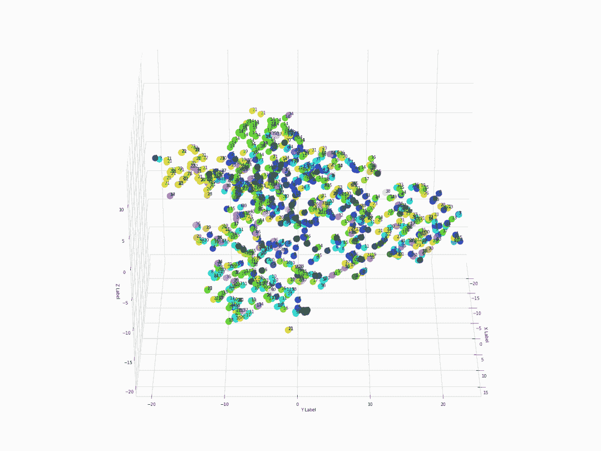

# 使用 3D 360 度动画散点图可视化高维网络数据

> 原文：<https://towardsdatascience.com/visualize-high-dimensional-network-data-with-3d-360-degree-animated-scatter-plot-d583932d3693?source=collection_archive---------29----------------------->

作者图片

# 介绍

在网络分析的环境中，我们经常会遇到极其复杂的数据，这些数据是不可读或无法解释的。虽然一些算法框架(例如 node2vec)可以将网络数据合并到统计机器学习中，但产生的数据仍然是高维的，并且在可视化方面难以管理。在这篇博客中，我将与你分享我用来降低复杂性和解决这个问题的方法之一。

# 数据

出于演示目的，使用了来自斯坦福大学 SNAP 的数据集“电子邮件-欧盟-核心网络”。你可以在这里找到原始数据集:[https://snap.stanford.edu/data/email-Eu-core.html](https://snap.stanford.edu/data/email-Eu-core.html)。我认为，如果我用真实世界的复杂数据集向您展示代码，会更有意义。因此，我使用这个数据集，而不是模拟数据。在 SNAP 上可用的网络数据中，这个网络可能具有最简单的结构。

图的阶(节点数)是 1005，图的大小(边数)是 25571。该数据集还带有每个顶点/节点的地面实况标签。当我们生成可视化时，我们将使用地面真实标签来注释顶点。解决这个问题的方法之一(如果没有标签)是使用 k-means 聚类来获得标签。

注意:我在 Google Colab 中完成了这个代码演示。如果您在本地 ide 中工作，可能需要以不同的方式配置路径。但是作品的逻辑应该是一样的。

# 密码

## 第一步:加载所有必需的包

生成图嵌入所需的核心包是 networkx 和 node2vec。应用详情可以参考本文:[利用 NetworkX、Gephi、Node2Vec](https://medium.com/analytics-vidhya/analyzing-disease-co-occurrence-using-networkx-gephi-and-node2vec-53941da35a0f) 分析疾病共现。其余的包用于为我们的网络数据生成 3D-360 度散点图。

## 第二步:读取数据

因为这是一个未加权的图，所以我将图中所有边的权重设置为 1。我将标签的顶点列的数据类型转换为“string ”,因为稍后将对其进行索引以进行注释。

## 第三步:将数据导入图表并绘图

如果我们不执行降维，并找到一种方法使图形更稀疏，那么您将得到图 1 中的图形，它根本不可读。此外，node2vec 算法需要一个 networkx 图作为输入。

图一。原始图表

## 第四步:使用 node2vec 获取嵌入

您可以注意到，在代码中，我手动计算了 vector_size (dimensions)的起点和图的顺序。这种做法受到了谷歌[机器学习速成班](https://developers.google.com/machine-learning/crash-course/embeddings/video-lecture)的启发。而经验法则是， ***维数的大小等于可能值的四次方根(维数=可能值的个数** 0.25)*** 。

## 第五步:用 3D 360 度动画散点图可视化

执行***three dplot(model)***命令后，我们得到的就是图 2。来自同一个部门的人，比如第 21 部门(黄色点)和第 14 部门(绿色点)，更喜欢呆在一起(更频繁地联系)。部门 4、5 和 7-分别是紫色、深蓝和淡蓝色点-也可以被识别为彼此保持接近的部门。

图二。三维 360 度散点图

对于高分辨率的图形，请访问此[链接](https://github.com/jinhangjiang/jinhangjiang.github.io/blob/master/images/3DRotation/full_rot.gif)获取原始 gif。

要复制结果，请访问笔记本的[链接](https://github.com/jinhangjiang/jinhangjiang.github.io/blob/master/code_demo/3DRotation.ipynb)。

# 结论

在这篇博客中，我们使用了***【node 2 vec】****，****networkx****，****tsne(PCA)****，****seaborn****，****matlibplot***等。制作 3D 360 度动画散点图，以可视化高维复杂的网络数据。

***欢迎随时联系我上***[***LinkedIn***](https://www.linkedin.com/in/jinhangjiang/)***。***

# 相关阅读

[使用 NetworkX、Gephi 和 Node2Vec 分析疾病共现](https://medium.com/analytics-vidhya/analyzing-disease-co-occurrence-using-networkx-gephi-and-node2vec-53941da35a0f)

[网络分析与 R |操纵网络数据](/network-analysis-in-r-manipulating-network-data-ee388fba7215)

[NetworkX:操纵子图的代码演示](/networkx-code-demo-for-manipulating-subgraphs-e45320581d13)

[什么是嵌入，你能用它做什么](/what-is-embedding-and-what-can-you-do-with-it-61ba7c05efd8?source=---------5----------------------------)