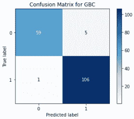
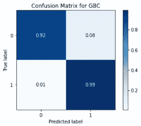
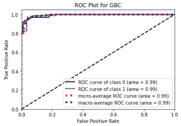
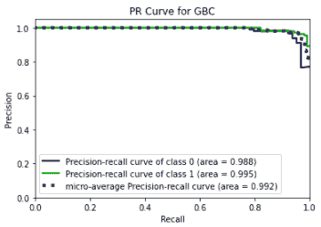
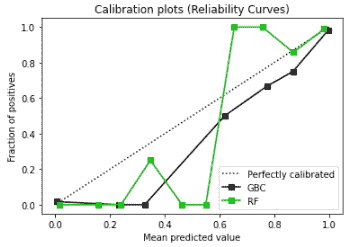
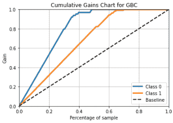
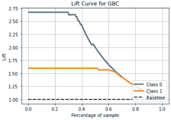
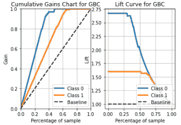

# 如何像专业人士一样可视化机器学习结果

> 原文：<https://towardsdatascience.com/visualize-machine-learning-metrics-like-a-pro-b0d5d7815065?source=collection_archive---------13----------------------->

## 只用一行代码


照片由[米哈伊尔·尼洛夫](https://www.pexels.com/@mikhail-nilov?utm_content=attributionCopyText&utm_medium=referral&utm_source=pexels)从[佩克斯](https://www.pexels.com/photo/woman-holding-papers-standing-next-to-a-charts-bulletin-9304688/?utm_content=attributionCopyText&utm_medium=referral&utm_source=pexels)拍摄

# 动机

评估机器学习模型是机器学习工作流程中的一个重要步骤。在本文中，我们研究了如何使用 Scikit-plot 轻松可视化各种常见的机器学习指标。虽然它的名字可能表明它只与 Scikit-learn 模型兼容，但 Scikit-plot 可用于任何机器学习框架。在幕后，Scikit-plot 使用 matplotlib 作为它的图形库。

Scikit-plot 最好的部分是它只需要一行代码来可视化每个指标。

# 设置

安装软件包

```
pip install scikit-plot==0.3.7
```

导入必要的包

```
import pandas as pd
import numpy as np
from sklearn import datasets
from sklearn.ensemble import GradientBoostingClassifier, RandomForestClassifier
from sklearn.model_selection import cross_val_predict, train_test_splitimport scikitplot as skplt
```

为了演示 Scikit-plot，我们将使用乳腺癌数据集训练一个简单的随机森林和梯度增强分类器。

```
X,y = datasets.load_breast_cancer(return_X_y = True)
X_train, X_test, y_train, y_test = train_test_split(X,y, test_size = 0.3, stratify = y)gbc = GradientBoostingClassifier()
gbc_model = gbc.fit(X_train, y_train)
y_gbc_proba = gbc_model.predict_proba(X_test)
y_gbc_pred = np.where(y_gbc_proba[:,1] > 0.5, 1, 0)rfc = RandomForestClassifier()
rfc_model = rfc.fit(X_train, y_train)
y_rfc_proba = rfc_model.predict_proba(X_test)
y_rfc_pred = np.where(y_rfc_proba[:,1] > 0.5, 1, 0)
```

让我们看看如何使用 Scikit-plot 来可视化各种指标。

# 混淆矩阵

混淆矩阵将基础事实与预测标签进行比较，并将结果分为真阳性、真阴性、假阳性和假阴性。为了绘制混淆矩阵，我们简单地调用`plot_confusion_matrix`方法。

```
skplt.metrics.plot_confusion_matrix(y_test, y_gbc_pred, normalize=False, title = 'Confusion Matrix for GBC')
```



作者图片

要显示 0 到 1 之间的标准化值，只需将`normalize`参数设置为`True`

```
skplt.metrics.plot_confusion_matrix(y_test, y_gbc_pred, normalize=True, title = 'Confusion Matrix for GBC')
```



作者图片

# 受试者工作特性曲线

ROC 曲线显示了分类器在所有分类阈值下相对于随机基线分类器的性能(真阳性率，也称为召回率和假阳性率)。

```
skplt.metrics.plot_roc(y_test, y_gbc_proba, title = 'ROC Plot for GBC')
```

默认情况下，ROC 图带有宏观和微观平均值。我们可以通过将`plot_micro`或`plot_macro`参数设置为`False`来隐藏这些情节线。`plot_roc`方法显示所有类别的所有 roc 曲线，并且图表在多类别绘图中可能会变得混乱，因此我们可以通过传递`classes_to_plot`参数来选择绘制特定类别的 roc 曲线。



作者图片

# 精确召回曲线(PR 曲线)

精确度和召回率曲线显示所有分类阈值的精确度和召回率值。它总结了精确度和召回率之间的权衡。

```
skplt.metrics.plot_precision_recall(y_test, y_gbc_proba, title = 'PR Curve for GBC')
```

默认情况下，精确召回曲线带有宏观和微观平均值。我们可以通过将`plot_micro`或`plot_macro`参数设置为`False`来隐藏这些情节线。`plot_precision_recall`显示所有类别的 PR 曲线，在多类别图中图表可能会变得混乱，因此我们可以通过传递`classes_to_plot`参数来选择绘制特定类别的 PR 曲线。



作者图片

# 校准图

校准图也称为概率校准曲线，是一种检查预测值是否可以直接解释为置信水平的诊断方法。例如，校准良好的二进制分类器应该对样本进行分类，使得对于概率约为 0.8 的样本，大约 80%的样本来自正类。该函数仅适用于二元分类任务。

```
probas_list = [y_gbc_proba, y_rfc_proba]
clf_names = ['GBC', 'RF']
skplt.metrics.plot_calibration_curve(y_test, probas_list = probas_list, clf_names = clf_names)
```



作者图片

# 累积增益曲线

累积增益曲线显示模型的性能，并与随机基线分类器进行比较。它显示了在考虑概率最高的一部分人口时实现目标的百分比。该功能仅适用于二元分类。

```
skplt.metrics.plot_cumulative_gain(y_test, y_gbc_proba, title = 'Cumulative Gains Chart for GBC')
```



作者图片

# 升力曲线

提升曲线显示了当考虑具有最高概率的人群的一部分时，与随机基线分类器相比，每个类别的响应率。

```
skplt.metrics.plot_lift_curve(y_test, y_gbc_proba, title = 'Lift Curve for GBC')
```



作者图片

# 调整图表属性

Scikit-plot 允许用户分别使用`figsize`、`title_fontsize`和`text_fontsize`参数调整基本属性，如图形大小、标题字体大小和文本字体大小。

```
skplt.metrics.plot_lift_curve(y_test, y_gbc_proba, title = 'Lift Curve for GBC', figsize = (10,10), title_fontsize = 20, text_fontsize = 20)
```

此外，这些方法还通过`ax`参数接受`matplotlib.axes.Axes`对象。这很有用，因为我们可以定义要绘制的轴。例如，我们希望在同一个子图上并排绘制累积收益图和提升曲线。我们可以首先创建一个 1x2 子图网格，并使用`ax`参数在子图的不同网格中绘制每个图表。

```
fig, ax = plt.subplots(1,2)
skplt.metrics.plot_cumulative_gain(y_test, y_gbc_proba, ax = ax[0], title = 'Cumulative Gains Chart for GBC')
skplt.metrics.plot_lift_curve(y_test, y_gbc_proba, ax = ax[1],  title = 'Lift Curve for GBC')
plt.show()
```



作者图片

这些方法的输出是`matplotlib.axes._subplots.AxesSubplot`对象，我们可以使用 matplotlib 方法进一步操作这些对象。例如，我们可以执行以下操作来调整垂直轴的范围。

```
import matplotlib.pyplot as plt
ax = skplt.metrics.plot_lift_curve(y_test, y_gbc_proba, title = 'Lift Curve for GBC')
ax.set_ylim(0,3)
```

# 结论

我们研究了如何使用一行代码绘制各种常见的机器学习指标，以及如何使用 matplotlib 调整图表属性以满足我们的需求。Scikit-plot 中还有很多我们在本文中没有涉及到的功能，比如为聚类问题绘制肘图和剪影图。查看 [Scikit-plot](https://scikit-plot.readthedocs.io/) 文档了解更多详情。