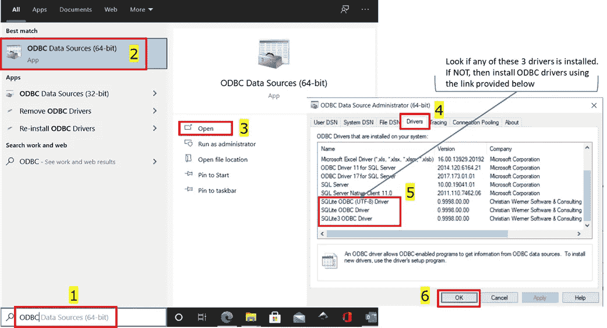
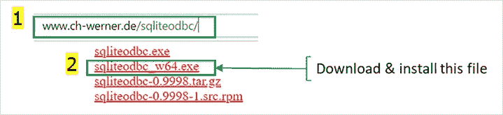
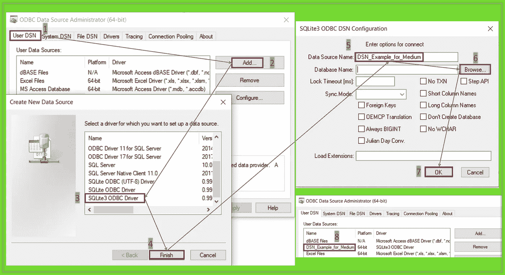
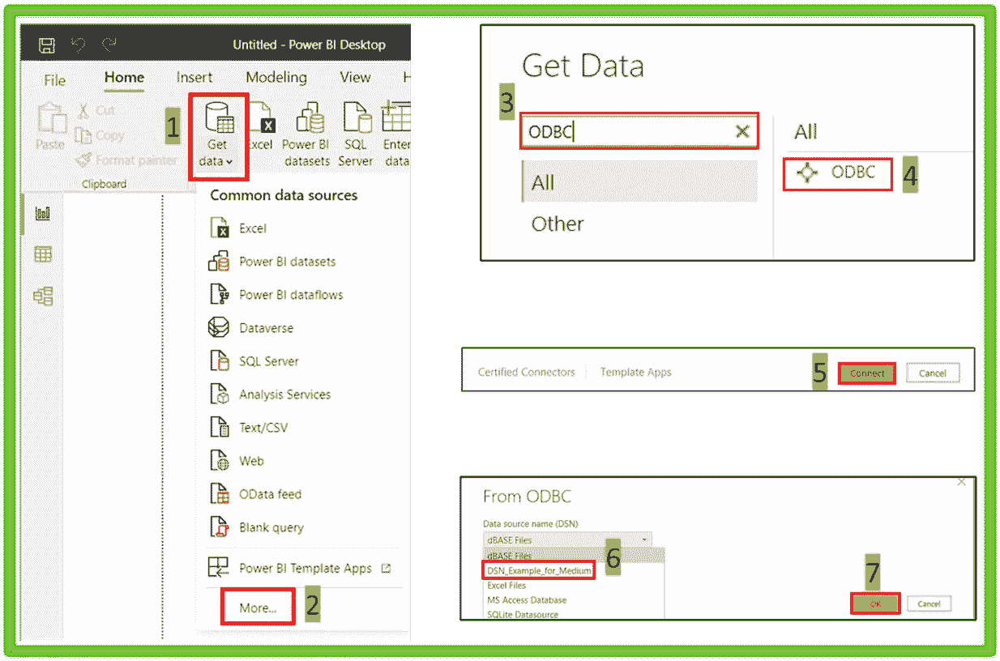
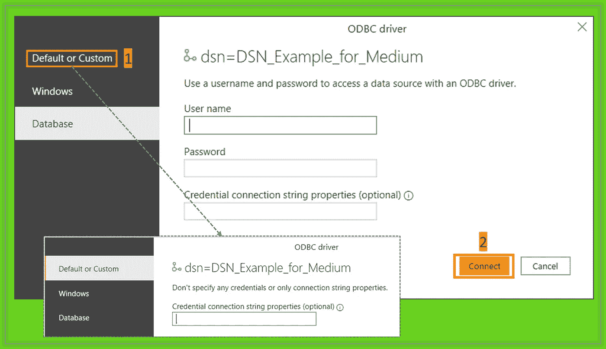
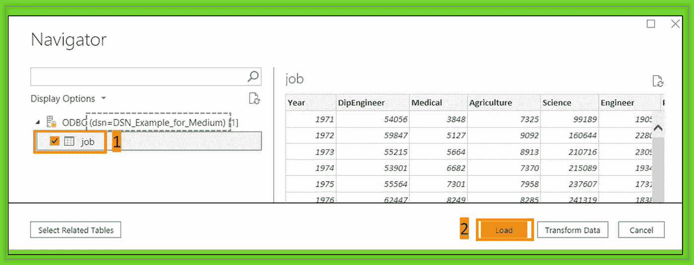
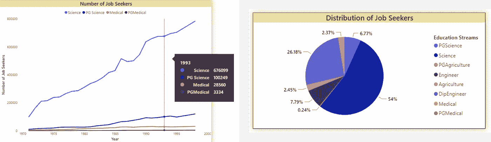

# 借助 Power BI 可视化 SQLite 数据

> 原文：<https://towardsdatascience.com/visualize-sqlite-data-with-power-bi-734856383643?source=collection_archive---------12----------------------->

## 使用 SQL 和 Power BI 进行实际数据分析

## 将 SQLite 数据库与 Power BI 相连接并将数据快速转化为洞察力的分步指南


照片由[艾萨克·史密斯](https://unsplash.com/@isaacmsmith?utm_source=medium&utm_medium=referral)在 [Unsplash](https://unsplash.com?utm_source=medium&utm_medium=referral) 拍摄

***power bi⚡️***
power bi desktop 支持多种数据源，包括 Excel、SQL Server、IBM Db2 数据库等等。虽然 Power BI 提供了 Azure SQL 数据库和 SQL 数据仓库的连接器，但是你不会找到任何 SQLite 数据库的连接器。但好消息是，您仍然可以在 Power BI 中可视化这些数据。⚡️

💡这篇文章末尾的指导项目将是展示您的数据科学作品集的绝佳素材。

几天前，我创建了一个 SQLite 数据库来练习 SQL 查询。但是，我更好奇的是，如何在 Power BI 中可视化这些数据。然后，我按照下面的过程来达到我的目标。

关于 SQLite 数据库及其创建方式的更深入的见解可以在我之前的文章中找到。

<https://medium.com/analytics-vidhya/sql-database-with-python-5dda6c9a0c8d>  

在开始这个过程之前，让我告诉你更多关于这个英雄的事情😎我们的故事— ***SQLite ODBC 驱动***

> *驱动程序是促进两个应用程序之间通信的接口*

# SQLite ODBC 驱动程序

ODBC 代表开放式数据库连接。

它是微软开发和维护的界面。我们将使用 ODBC 驱动程序来访问 SQLite 数据库中的数据。

ODBC 驱动程序允许我们将 SQLite 数据库添加到它的数据源列表中，然后这个数据源可以连接到任何应用程序进行进一步的分析和可视化。当然，这些数据库可以通过 Python 或任何其他编程来访问。但是，通过 ODBC 驱动程序访问它要方便得多。

我们开始吧！

让我们来看看继续这个故事所需要的所有东西。

1.  ***一个 SQLite 数据库*** :我正在赠送我自己创建的 SQLite 数据库📚作为一个很好的外卖。你可以在这里找到<https://github.com/17rsuraj/data-curious/tree/master/TowardsDataScience>*。数据库文件的名称是`tds.sqlite`*
2.  ****SQLite ODBC 驱动*** :我发现我一些同事的电脑上已经安装了。不过你可以随时从[***这里***](http://www.ch-werner.de/sqliteodbc/) 下载。根据您的操作系统，选择 32 位或 64 位版本。*
3.  ****Power BI Desktop 版*** :如果你是在职专业人士，可以使用你的工作邮箱访问 Power BI Desktop。如果您是学生，将需要您的学校电子邮件地址才能访问。威力 BI 桌面可以从 [***这里***](https://powerbi.microsoft.com/en-us/downloads/) 下载。*

# *检查 SQLite ODBC 驱动程序*

*这简单明了。只需在开始菜单中查找 ODBC 数据源并打开它。*

*你需要这三个驱动中的任何一个-
*1。SQLite ODBC 驱动程序
2。SQLite3 ODBC 驱动程序
3。SQLite ODBC (UTF-8)驱动程序**

*如下图所示，您可以在“驱动程序”选项卡下检查这一点。*

**

*检查 ODBC 驱动程序(作者图片)*

*如果您看到上面列出的任何驱动程序，您可以跳过 SQLite ODBC 驱动程序的安装。*

# *安装 SQLite ODBC 驱动程序*

*SQLite ODBC 驱动可以在 [***这里***](http://www.ch-werner.de/sqliteodbc/) 下载。*

**

*下载并安装 SQLite ODBC 驱动程序(图片由作者提供)*

*一旦安装了这个驱动程序，然后再次检查它现在是否在 ODBC 数据源管理器中可见，如上图所示。*

# *分配数据源名称(DSN)*

*至此，您将拥有 SQLite ODBC 驱动程序和 Power BI Desktop。让我们开始通过 ODBC 驱动程序将 SQLite 数据库与 Power BI 连接起来。
下一步是为所需的数据源创建一个*名称*。使用这个名称，我们可以在使用 Power BI 时识别所需的数据源。*

**

*在 ODBC 数据源管理器中设置数据源名称(图片由作者提供)*

*上图中的 DSN 代表*数据源名称*。在“开始”菜单中搜索 ODBC 数据源管理器，然后按照此图片快速设置 DSN。要完成该过程，请在步骤 8 之后，在 ODBC 数据源管理器窗口中单击 OK。*

> *📌上图中需要记住的要点是:*

```
*1\. Select the correct ODBC driver as shown in step 3
2\. Type in a meaningful Data Source Name as shown in step 5
3\. Browse for the sqlite3 database file which you want to visualize in step 6\. For this particular example, you can download my self-created database [file](https://github.com/17rsuraj/data-curious/blob/master/TowardsDataScience/tds.sqlite).
4\. After step 7, you must see your DSN in the ODBC Data Source Administrator window as shown in step 8.*
```

# *将数据导入 Power BI*

*离目标又近了一步🎯现在，让我们用 Power BI 连接数据源。只需打开 Power BI 桌面，按照下面的一系列图片进行操作。*

**

*从 ODBC 获取数据(图片由作者提供)*

*如上图所示，您必须为在上一步中创建的数据源选择 DSN。一旦您在步骤 7 中单击 OK，您将被提示输入*连接凭证*。*

**

*数据库连接凭据(作者图片)*

*只需选择*默认或自定义*选项，然后点击连接。接下来，您将在数据源导航器窗口中看到所有可用的表。在这里，您还会在顶部看到 DSN(如下面蓝色虚线矩形所示)*

**

*数据源导航器(图片由作者提供)*

*如上图所示，选择要可视化的表并加载数据。如果您对任何数据操作感兴趣，也可以选择*转换数据*选项。*

*如果数据库有多个表，并且您希望可视化多个表中的数据，请选择所有表并加载数据。必须在 Power BI 的 ***模型*** 视图中手动创建表之间的关系。*

*行动的时间到了！！！🎭*

# *电力商业智能中的数据可视化*

*由于来自 SQL 数据库的数据现在被导入到 Power BI 中，因此可以根据可用的数据创建各种可视化。这是我创造的视觉效果。*

**

*电力 BI 中的数据可视化(图片由作者提供)*

*您肯定可以利用 Power BI 可视化的强大功能进行创造性的可视化。我已经开始把我的工作从 Excel 转移到这个磁盘数据库，你也可以跟着做。*

## *💡项目创意！！*

*使用[***Web Scraping***](/web-scraping-make-your-own-dataset-cc973a9f0ee5)创建您自己的数据集，通过练习 [***数据争论***](/data-wrangling-raw-to-clean-transformation-b30a27bf4b3b) 技术对其进行评估和清理，并将其存储在 SQL [***数据库***](https://medium.com/analytics-vidhya/sql-database-with-python-5dda6c9a0c8d) 中，以最终在 Power BI 中将其可视化，这不失为一个好主意。*

**长话短说，**

*我向您展示了使用 Power BI 可视化 SQLite 数据的过程。有适当图片支持的一步一步的方法一定会帮助你更好地理解。*

*如果你想直接开始而不创建任何数据库，没问题！现成的 SQLite 数据库文件📚正在我的 [Github](https://github.com/17rsuraj/data-curious/tree/master/TowardsDataScience) repo 上等你。*

*此外，项目构想可以用其中给出的资源来实现。正如我常说的，我乐于接受建设性的反馈和通过 LinkedIn 分享知识。*

***感谢您的阅读和宝贵时间！***

*希望对你在任何数据集上练习 DataViz 有所帮助。*