# 可视化不可见的量子位相位

> 原文：<https://towardsdatascience.com/visualize-the-invisible-qubit-phase-e65c04f14969?source=collection_archive---------21----------------------->

## 并学习如何区分相对相位和全局相位

本帖是本书的一部分: [**用 Python 动手做量子机器学习**](https://www.pyqml.com/page?ref=medium_invisible&dest=/) **。**

当我们处理振幅时，量子位的相位是决定性因素。即使我们不能直接测量相位，它也不是不可见的。一旦，我们可以使用我们的模拟器来可视化它。第二，我们可以用数学来精确描述。

当我们观察布洛赫球时，具有正振幅的态位于 X 轴和 Z 轴的前侧。

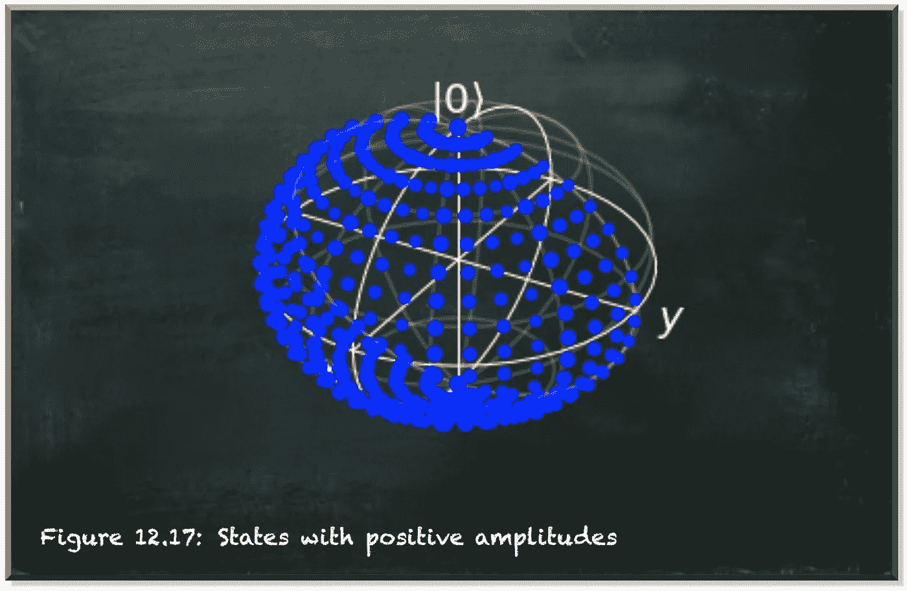

作者弗兰克·齐克特的图片

相比之下，具有负振幅的态位于布洛赫球的背面。

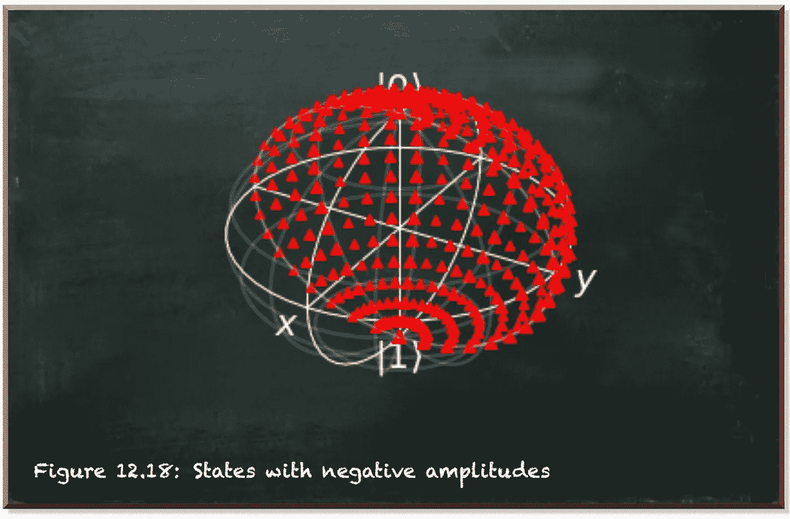

作者弗兰克·齐克特的图片

首先，让我们考虑一些简单的状态。如果我们将量子位状态向量绕 Y 轴旋转角度θ，我们得到以下状态。对于 0

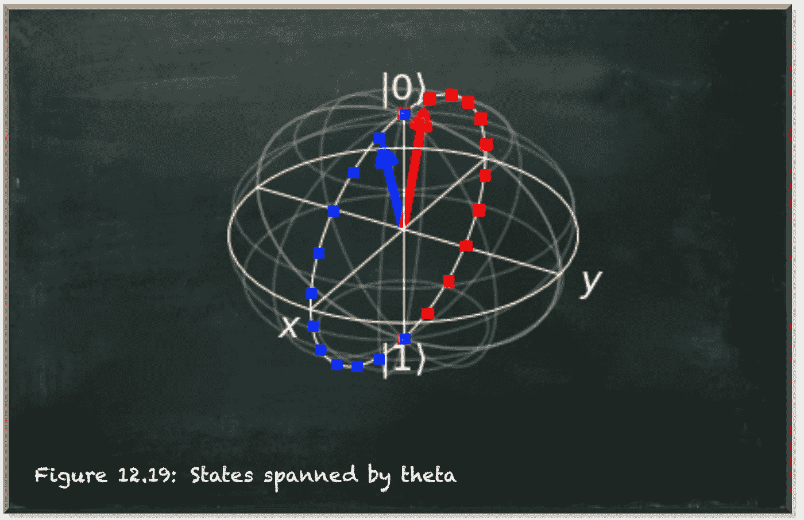

作者弗兰克·齐克特的图片

该图示出了这些状态位于 X 轴和 Z 轴跨越的平面上。向量θ指定绕 Y 轴的旋转。因此，我们把相应的门称为 RY-gate。

在 Z 轴上相互镜像的两个向量具有相同的测量概率，例如图中所示的两个向量。它们共享相同的测量概率，但是它们的相位不同。

# Z 门

Z 门反映了 Z 轴上量子位的状态。它具有类似于 X 门的效果，反映 X 轴上的状态。x 轴上的反射会影响最终的测量概率，因为它会改变到 z 轴端点(|0⟩和|1⟩).)的邻近度但是它没有触及这个阶段。相反，Z 轴上的反射会翻转相位，但不会影响测量概率。

以下等式表示 Z 门的变换矩阵。

Z-gate 将|+⟩态的量子位转变为|−⟩.态|+⟩和|−⟩位于 x 轴上。数学上，下面的等式描述了这种转换。

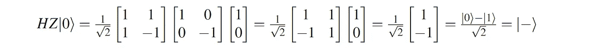

让我们通过编程来看看 Z 门的效果。

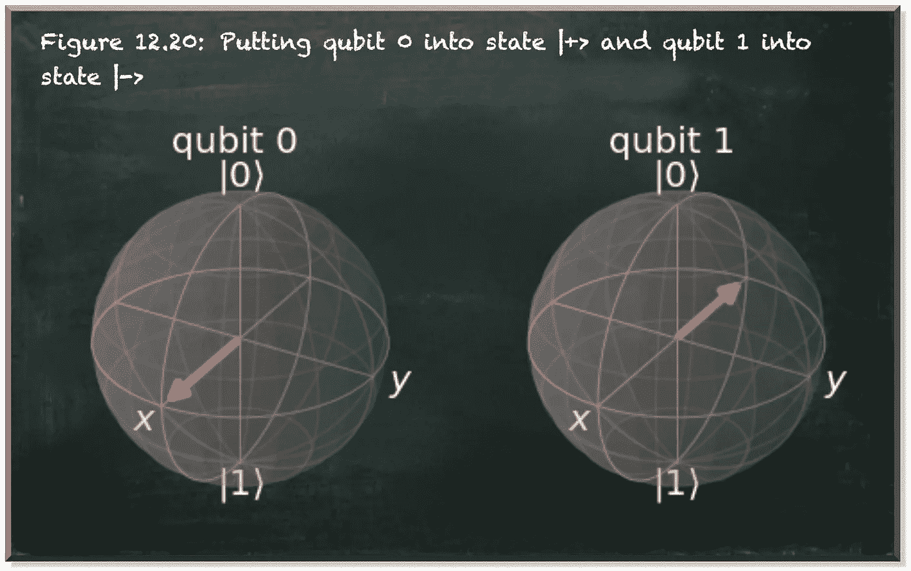

作者弗兰克·齐克特的图片

Qiskit 让我们很容易地展示量子位状态向量。我们照常定义和准备量子电路(第 4-11 行)。在这种情况下，我们在量子位 0(第 7 行)上应用一个单一的 Hadamard 门，在量子位 1(第 10-11 行)上应用一个附加的 Z 门。

我们使用`'statevector_simulator'`-后端执行电路。但是我们没有从执行结果中获取计数，而是调用了`get_statevector()`-函数(第 13 行)。输出是状态向量的数组，就像`array([ 0.5+0.j, 0.5+0.j, -0.5+0.j, -0.5+0.j])`。

我们可以将这个数组输入从`qiskit.visualization`(第 2 行)导入的函数`plot_bloch_multivector`(第 14 行)。结果，我们得到了每个量子位的布洛赫球表示。

我们可以看到两个向量都在 Y 轴上。它们的振幅产生相同的测量概率，每个概率为 0.5。|+⟩状态向量指向 x 轴的正方向(正面),而|−⟩状态向量指向负方向(背面)。

让我们看另一个例子。在应用 Z 门之前，让我们围绕 Y 轴将状态旋转一个小θ。

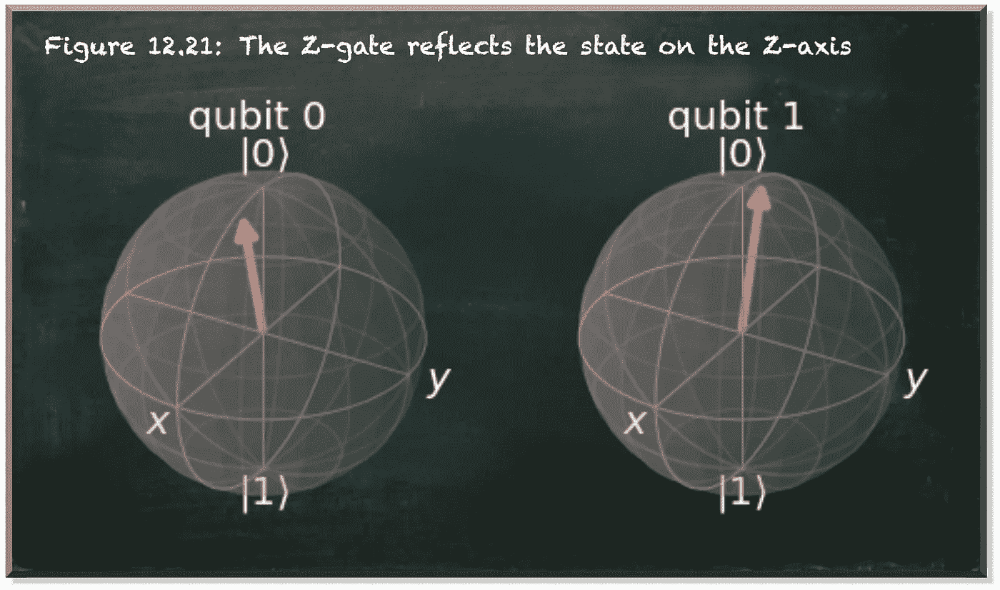

作者弗兰克·齐克特的图片

第二个例子强调了轴上的反射。它不是坐标系中心的反射。

Z 门有一个显著的特性。它对|0⟩和|1⟩.的量子位没有影响显然不是，因为这两个状态位于 Z 轴上。

作者弗兰克·齐克特的图片

从数学角度来看，|0⟩.的情况很简单

我们得到了可视化的确认。但是|1⟩.怎么样

这个等式的结果是不明确的。得到的状态向量不同于原始向量|1⟩.

相移似乎有所不同。但是可视化显示这两个向量是相同的。

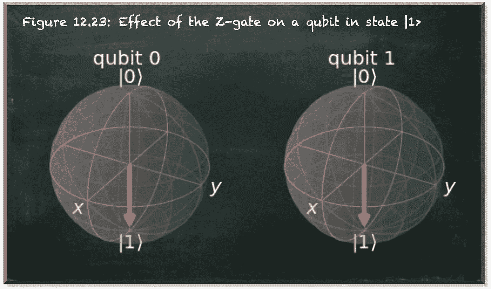

作者弗兰克·齐克特的图片

负号似乎无关紧要。但是如果我们把这个状态叠加会怎么样呢？

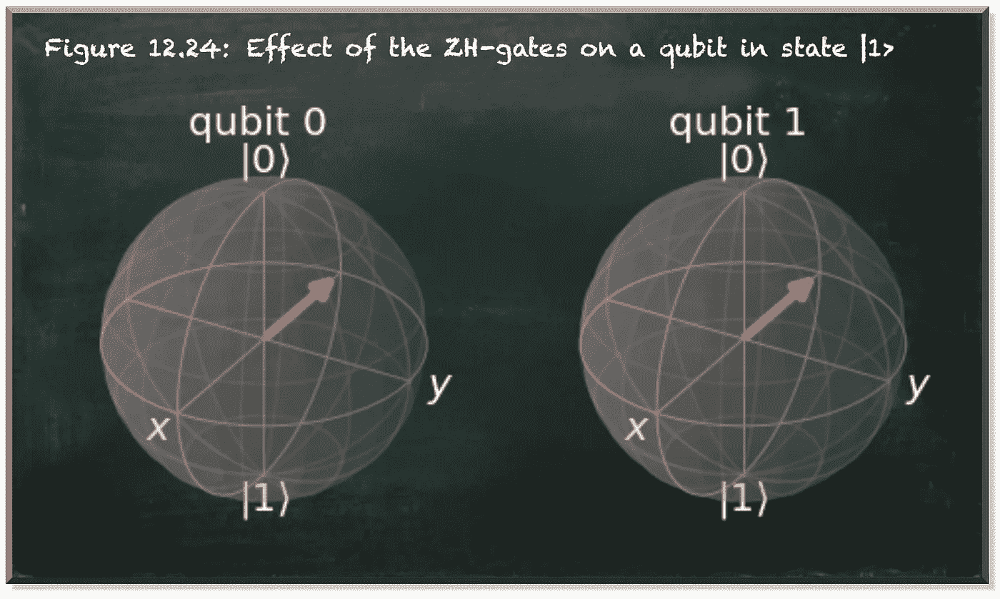

作者弗兰克·齐克特的图片

同样，可视化告诉我们，这些状态之间没有区别。那么，让我们再来看看数学。如果我们将哈达玛门应用于|1⟩，就会得到|−⟩.

如果我们首先应用 z 门，符号从|0⟩的幅度跳到|1⟩.的幅度

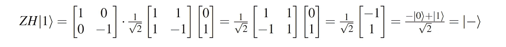

你还记得帖子[中的量子数学——你准备好接受红色药丸](/quantumic-math-are-you-ready-for-the-red-pill-4860f0ad79bf)了吗，在那里阐述了无法区分

正如我们刚刚看到的，当我们在任一态上应用其他量子门时，结果态没有区别。α|0⟩态和β|1⟩态构成了一个共享的量子态。对于得到的量子位状态向量，α或β是否包含相位并不重要。

不过还是再细致一点吧。Qiskit 提供了另一种可视化，量子状态的“qsphere”表示。在这种表示中，点的大小与状态中相应项的概率成比例，颜色表示相位。

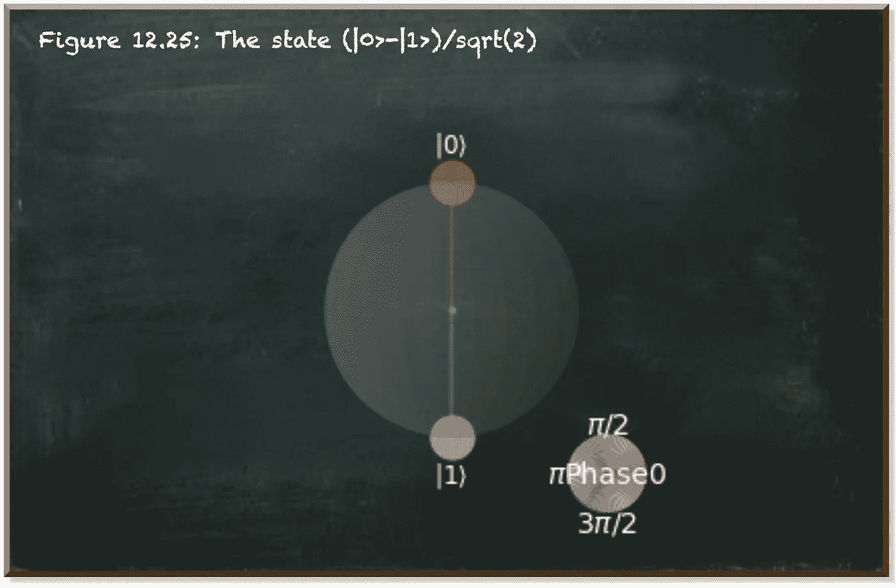

作者弗兰克·齐克特的图片

上图显示了|0⟩−|1⟩/sqrt(2).状态下的量子位在应用 Z 门(第 6 行)之前，我们首先应用 Hadamard 门(第 5 行)。相位适用于状态|1⟩.的振幅因此，我们只能看到绿松石色的|1⟩。|0⟩仍然是红色的。两个圆具有相同的大小，因为两个状态具有相同的测量概率。

现在，让我们像以前一样在|1⟩态的量子位上应用 z 门和哈达玛门。

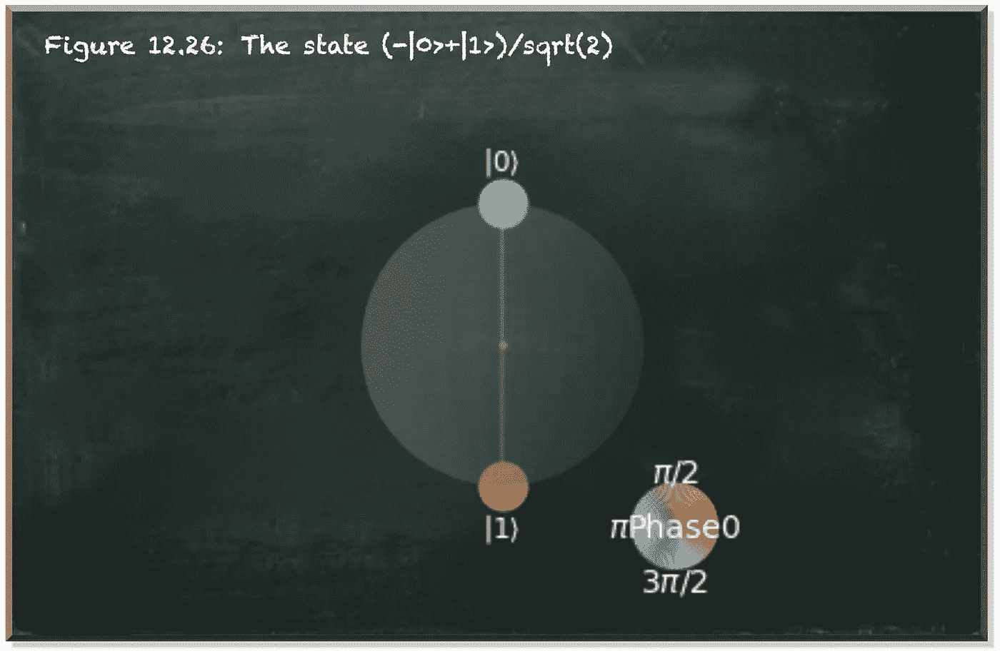

作者弗兰克·齐克特的图片

这个电路导致−|0⟩+|1⟩/sqrt(2).状态这些颜色表明我们对|0⟩.进行了相移

因此，我们可以将相位应用于两个幅度之一，α或β。重要的是，我们不能将它应用于两个幅度，因为这将有效地再次恢复整体相位。

# 多量子位相位

如果我们有多个量子比特呢？下面的等式表示两个量子位系统的状态。

两量子位系统可以处于四种不同的状态。每个状态也有一个振幅。

事实上，我们已经在上面指定了一个两量子位系统来并排显示两个布洛赫球。量子位 0 处于|0⟩−|1⟩/sqrt(2 状态)而量子位 1 处于−|0⟩+|1⟩/sqrt(2).状态

让我们看看这个系统的四个状态的总体阶段。

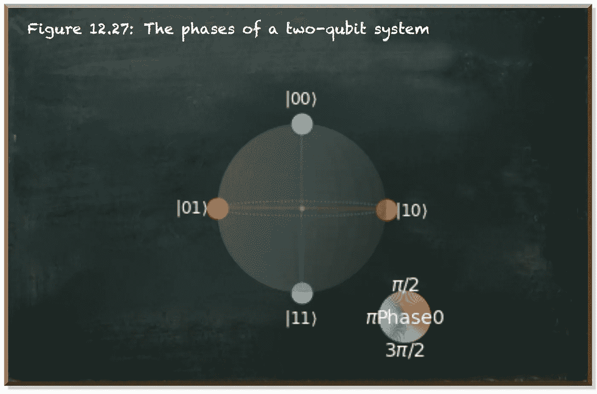

作者弗兰克·齐克特的图片

我们看到|00⟩和|11⟩.这两个国家的相位发生了变化在这种记法中，我们从右边(位置 0 的量子位)到左边(位置 1 的量子位)读取量子位。|11⟩获得量子位 0 相移的状态具有|1⟩振幅中的相位(如在|0⟩−|1⟩/sqrt(2)).因此，状态|00⟩得到量子位 1 的相移，它的相位在|0⟩ (−|0⟩+|1⟩/sqrt(2)).)的振幅中

尽管这很有道理，但这并不是全部事实。让我们看看如果两个量子位都处于|0⟩−|1⟩/sqrt(2).态会发生什么我们期望看到|01⟩和|10⟩.阶段的转变

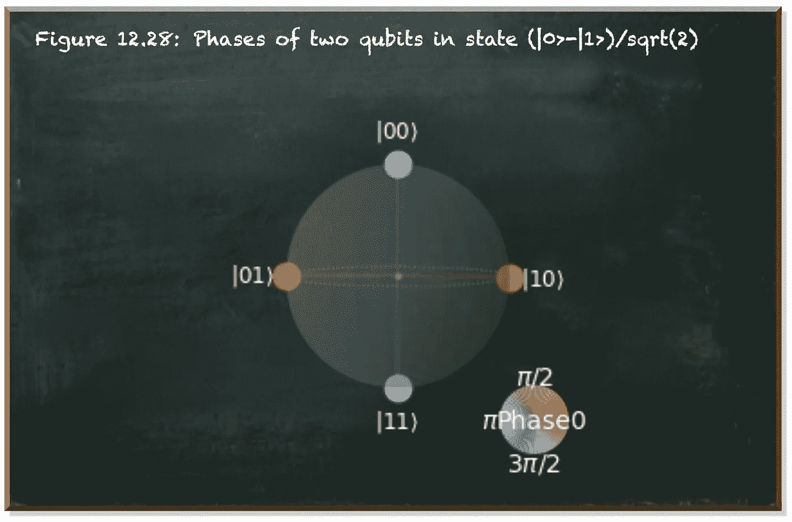

作者弗兰克·齐克特的图片

与我们的预期不同，我们在|00⟩和|11⟩.看到了相位的变化原因很简单，相位是相对的。我们有两个相似但偏移的波。但是你怎么知道这两个波中哪一个是原始的呢？

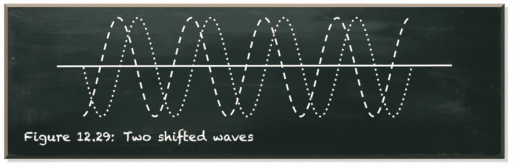

作者弗兰克·齐克特的图片

因此，我们需要接受这样一个事实:我们无法区分

当我们使用单个量子位时，区分这两种状态的能力是虚假的。当我们加入第二个量子位元时，它已经消失了。

下面的电路在单个量子位上产生|0⟩−|1⟩/sqrt(2 状态。

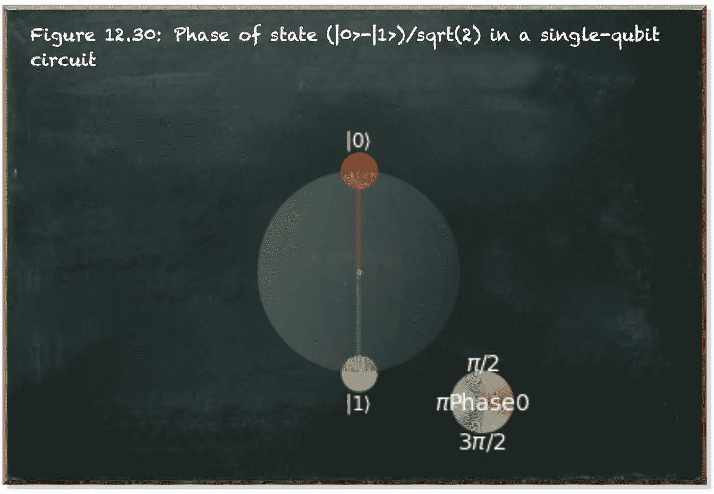

作者弗兰克·齐克特的图片

我们在|1⟩.看到了这个阶段看看当我们将电路定义为两个量子位的电路时会发生什么。

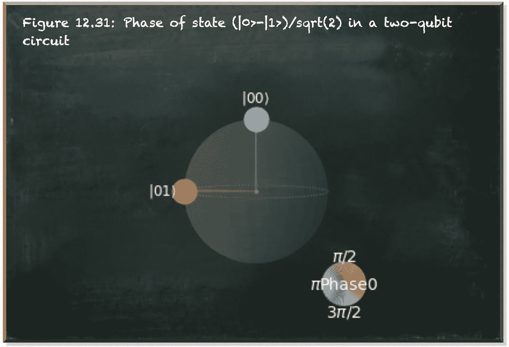

作者弗兰克·齐克特的图片

在两个量子位的电路中，我们看到了|00⟩.态的相位因此，当我们对两个量子位中的一个施加相移时，我们看到它处于|1⟩.态

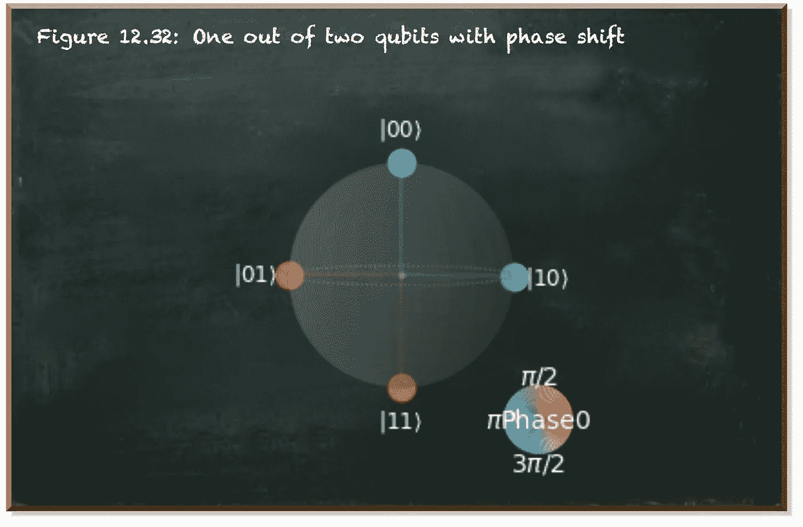

作者弗兰克·齐克特的图片

在这种情况下，我们通过应用哈达玛门(第 4-5 行)将两个量子位置于叠加态。我们在位置 0 移动量子位的相位。因此，我们看到这个量子位(右手边)的不同状态具有不同的相位。|1⟩状态中量子位为 0 的状态与|0⟩.状态中量子位为 0 的状态具有不同的相位同样，Qiskit 仅对**相对相位**有意义，并指示量子位 0 处于|0⟩.状态时的状态偏移**全局相位**不可观测。

# 结论

全局相位是我们使用的数学框架的人工制品。它们没有物理意义。如果两个状态只有一个全局相位不同，那么它们实际上代表的是同一个物理系统。

相比之下，相对相位是量子力学的核心，因此是量子计算中最令人感兴趣的部分。如果两个状态相差一个相对相位，它们就是以不同方式演化的不同系统。即使分开测量它们看起来是一样的，但当它们干扰其他量子系统时，会有不同的效果。

本帖是本书的一部分: [**用 Python 动手做量子机器学习**](https://www.pyqml.com/page?ref=medium_invisible&dest=/) **。**

在这里免费获得前三章。