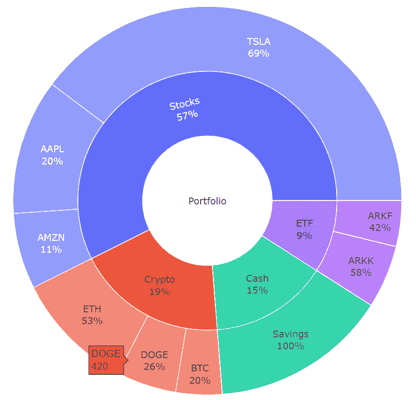
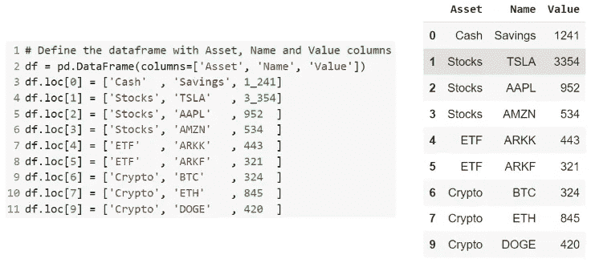
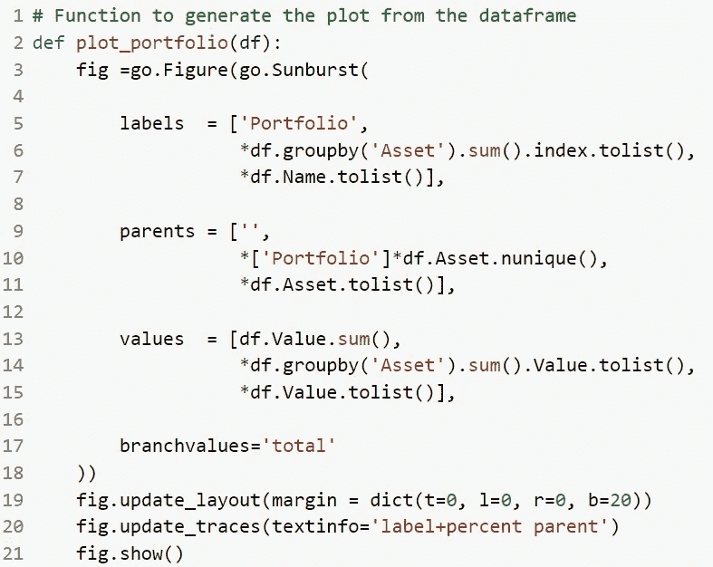

# 使用 Google Colab 用旭日图可视化你的投资组合

> 原文：<https://towardsdatascience.com/visualize-your-investment-portfolio-with-sunburst-plots-using-google-colab-b8c1cdef25cf?source=collection_archive---------23----------------------->

## 旭日图是形象化你的投资组合的一种有见地的方式。Google Colab 使在浏览器中创建动态图变得很容易。

图一。展示投资组合的旭日图示例。图片由作者提供。

旭日图是可视化分层数据的一种有见地的方式。投资组合是此类数据的一个很好的例子，因为它可以细分为几个资产类别，每个资产类别可以进一步细分为单个资产，如上例所示。在这个小故事中，我分享了使用 google colab 创建如上图所示的情节的简单步骤。

## 运行代码以获得您自己的绘图

如果您只想运行代码并获得投资组合的绘图，您可以简单地替换以下 google colab 笔记本中的值:

<https://colab.research.google.com/drive/1r2j8NzPL8HaC3O2f74XMabOiYVJ1nIxc?usp=sharing>  

该图是基于一个简单的表生成的，该表有 3 列:资产、名称和值。下图显示了如何逐行构建表格(左图)以及生成的格式化数据帧(右图)。

图二。用于在笔记本中创建数据帧(左图)和数据帧渲染(右图)的代码示例。图片由作者提供。

## 绘图功能如何工作

对于情节，我使用的是 [Plotly 库](https://plotly.com/python/sunburst-charts/)。从数据帧生成绘图的代码如下:

图 3。用于生成图 1 中的绘图的代码。图片由作者提供。

代码非常简洁，所以让我一步一步地解释它。

*   每个标签必须有一个父标签和值。例如，您可以看到第一个标签是“Portfolio ”,有一个父项" "(空-无父项),其值是表中所有资产的总和。这将创建中心圆(图 1 中的白色区域)。
*   下一步是图的第一个环，对应于资产类别。在第 6 行和第 14 行，数据帧按资产分组，并对值求和。然后在第 6 行，选择`index`，对应于唯一资产的列表。在第 14 行选择了`Value`，对应于每项资产的总价值。资产类别的父项总是“投资组合”标签，因此在第 10 行“投资组合”被添加了 *n* 次，其中 *n* 是可以通过`df.Asset.nunique()`获得的独特资产的数量。另外，注意列表前的`*`被用来使值“离开列表”，否则结果将是列表中的列表，这不是我们在这里想要的。
*   最后，对于图的第二个环，所有单独的名称(第 7 行)和相应的值(第 15 行)被添加到标签和值列表中。在这种情况下，父资产是表中每一行对应的资产(第 11 行)。
*   在第 17 行中，设置`branchvalues='total'`确保分支跨越父节点上方的所有空间，因为分支中值的总和等于父节点值。
*   在第 19 行中，`update_layout`可以用来添加或删除图形周围的边距。
*   在第 20 行，`update_traces`可以用来设置在绘图中显示哪些信息。在这种情况下，选项`labels+percent parent`确保绘图显示标签名称和相对于父标签的百分比。根据功能描述，`text_info`的选项可以是用“+”字符连接的['标签'，'文本'，'值'，'当前路径'，'根百分比'，'条目百分比'，'父百分比']的任意组合。

仅此而已！我希望你觉得这个故事有用，并享受创造情节的乐趣！

**免责声明:本故事的内容仅供参考。图、表或文本中提及的资产仅用于说明目的，并不代表任何类型的投资建议或认可。**