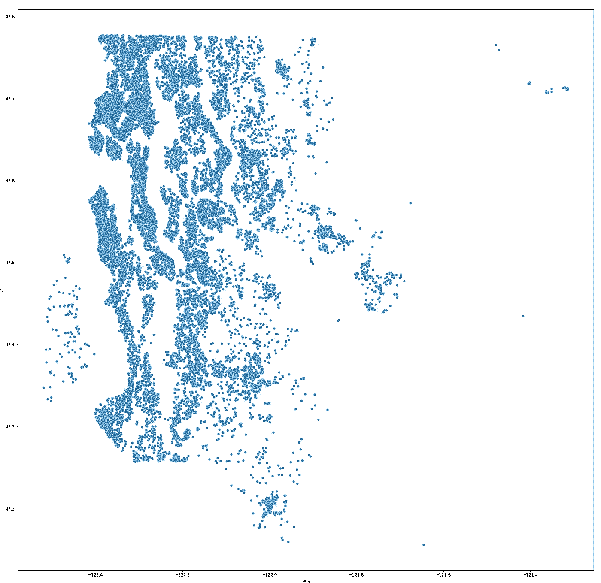
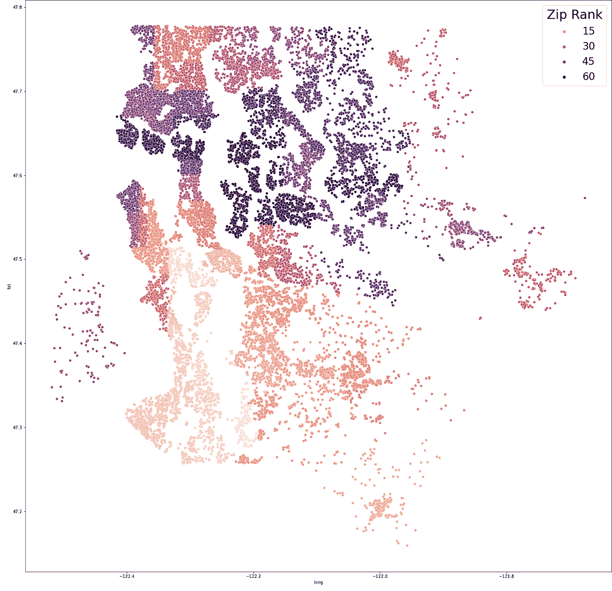
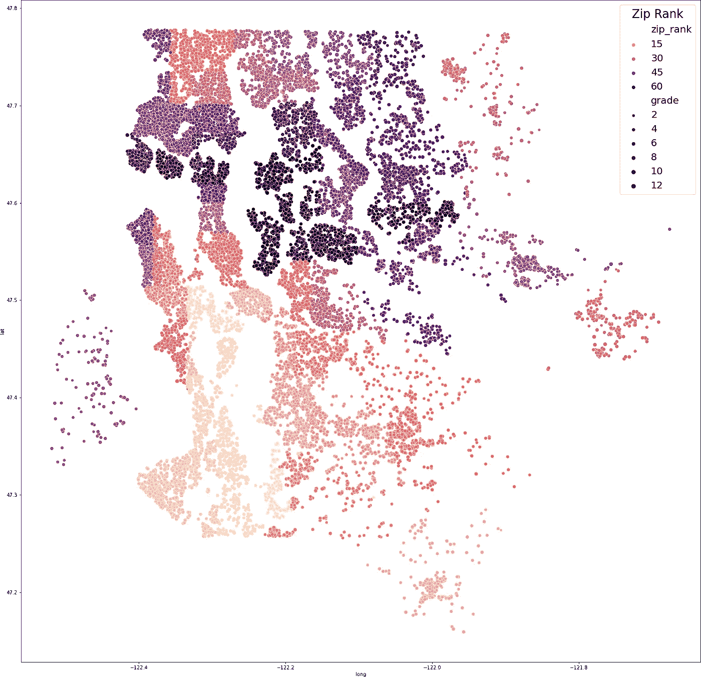

# 用基本的 Viz 包可视化你的地图数据

> 原文：<https://towardsdatascience.com/visualize-your-map-data-with-basic-viz-packages-448ef703ffc2?source=collection_archive---------35----------------------->

## 仅使用基本工具创建信息丰富的地图可视化


美国宇航局在 [Unsplash](https://unsplash.com/s/photos/map?utm_source=unsplash&utm_medium=referral&utm_content=creditCopyText) 拍摄的照片

当我处理房地产数据时，我经常在打开数据集时做一件事情，就是制作数据的地理可视化。我这样做没有使用任何复杂的包或形状文件。这不仅是一个很好的方式来形象化我的住房所在的物理空间，而且我可以用这个形象化来看到可能通知我的目标的其他元素。我所需要的是 Seaborn 和一个带有一些经度/纬度信息的数据集。

我首先加载我的相关包并加载我的数据集。在本例中，我使用的是国王郡住宅数据集。

```
# data processing tools
import pandas as pd
import numpy as np# Visualization tools
import seaborn as sns
import matplotlib
import matplotlib.pyplot as plt
%matplotlib inline# load and look at our king county housing data
df = pd.read_csv(‘kc_house_data.csv’)
df
```

这只适用于具有 lat/long 的数据集，但效果惊人。请看我获取数据集并生成国王县区域的地图:

```
# plotting latitude and longitude as a visual scatter plot to look for location outliersplt.figure(figsize=(25,25))ax = sns.scatterplot(data=df, x=”long”, y=”lat”, palette=”magma_r”)plt.show();
```



只用了几行代码，我就制作出了所有数据点的地图。我能做的第一件事是轻松识别基于位置的异常值。例如，对于 King County 数据集，在经度-121.65 以东只有几个属性不在我们想要建模的大都市区附近。我可以删除这些属性，而不用担心删除了有用的数据。

```
# drop the properties east of the metropolitan area
df.drop(df[df[‘long’] > -121.65].index, inplace=True)
```

不过，我可以用这张地图展示更多。我们都知道位置是房地产的一切，所以让我们在地图上展示一下，只需多几行代码。

我们将使用每个邮政编码的房屋价值中值对 70 个邮政编码从低到高进行价格排序。为此，我们将为我们的邮政编码制作一个等级查找表，然后将其应用于数据帧。

```
 # we’re using the median house value for a zip code to determine the zip code’s sort, so we can visualize the zip code importance# group our dataframe by zipcode on median home price, sorted ascending. 
zipsorted = pd.DataFrame(df.groupby(‘zipcode’)[‘price’].median().sort_values(ascending=True))# rank each zip code and assign rank to new column
zipsorted[‘rank’] = np.divmod(np.arange(len(zipsorted)), 1)[0]+1# function that looks up a segment that a data entry belongs to
def make_group(x, frame, column):
 ‘’’Takes in a line, a lookup table, and a lookup column
 returns value of target column
 PARAMETERS:
 line from dataframe x
 lookup table frame
 column to return rank’’’
 y = frame.loc[(frame.index == x)][column]
 z = np.array(y)
 z[0]
 return z[0]# make a new column on our dataframe. Look up each zip entry’s group, and append to the column.
df[‘zip_rank’] = df[‘zipcode’].apply(lambda x: make_group(x, zipsorted, ‘rank’))
```

顺便说一下，不要在你的模型中使用这些等级，至少在你分割和使用正确的目标编码之前不要使用。这会将您的拒绝数据泄露到您的模型中。我们现在只是把它作为一个可视化工具。

现在我们将制作和以前一样的地图，但是这一次我们将使用我们的 zip 等级给地图着色。

```
plt.figure(figsize=(25,25))ax = sns.scatterplot(data=df, x="long", y="lat", hue='zip_rank', palette="magma_r")# Add title to legend
ax.legend(title='Zip Rank', title_fontsize=30, fontsize=24)plt.show();
```



现在，我们不仅制作了我们所在地区的地图，还展示了一些重要信息——即位置对价格的重要性。

如果我们尝试，我们可以在地图上显示更多信息，尽管在这个比例下，可能很难看到太多。但这是同样的地图，又是另一个维度，使用我们的“等级”属性来确定我们的散点大小。

```
 plt.figure(figsize=(25,25))ax = sns.scatterplot(data=df, x=”long”, y=”lat”, hue=’zip_rank’, size=’grade’, palette=”magma_r”)
# Add title to legend
ax.legend(title=’Zip Rank’, title_fontsize=24, fontsize=20)plt.show();
```



就像那样，我们已经为一个住宅集制作了一个有用的和信息丰富的可视化，所有这些都没有使用任何额外的包或 shapefiles！我们需要的只是熊猫、numpy、matplotlib 和 seaborn 的基本套装。