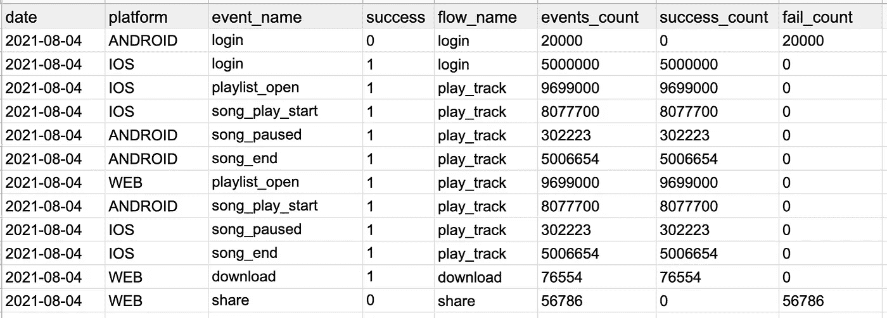
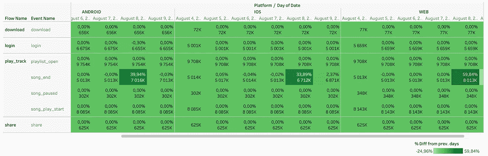
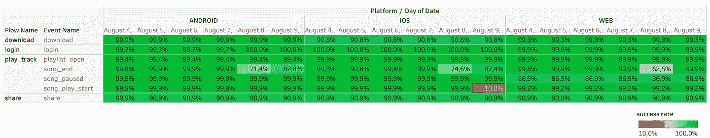
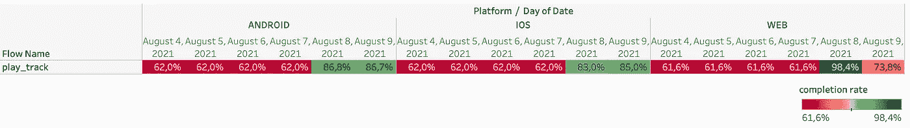

# 使用 GA4、BigQuery 和 Tableau 可视化您的产品健康状态指标

> 原文：<https://towardsdatascience.com/visualize-your-product-health-status-metrics-using-ga4-bigquery-and-tableau-9cc91cf9b6d3?source=collection_archive---------30----------------------->

## 了解热图表的强大功能！

在这篇文章中，我将分享一个我最喜欢的监控数码产品健康状态的可视化工具。我将关注这三个指标:1 .用法，2。成功率& 3。完成率。我还将分享如何从 BigQuery 查询提到的度量数据。

GA4 允许所有用户将原始数据导出到 Google cloud & BigQuery。这个特性非常棒，因为对于数据专业人员来说，原始数据就像是好厨师的新鲜有机食材。两者都是伟大食谱的必备！此外，Google Cloud 拥有广泛的分析工具来转换数据、分析数据、在其上应用 ML &构建数据产品，等等。

> 对于数据专业人员来说，原始数据就像是好厨师的新鲜有机食材。两者都是伟大食谱的必备！

让我们首先通过在 BigQuery 中查询来获取这些指标的数据。下面的查询应该可以帮助我们实现这一点。

```
-- Standard SQL, BigQuery
select parse_date('%Y%m%d',t.event_date) as date, platform, event_name, p.value.int_value as success, p2.value.string_value as flow_name,count(event_name) as events_count,if(p.value.int_value=1,count(event_name),0) as success_count,if(p.value.int_value=0,count(event_name),0) as fail_countfrom `[gcp_ptoject_name].[dataset_name].events_*` t, t.event_params p, t.event_params p2where p.key = 'success' and _table_suffix between '20210101' and '20211231' and p2.key = 'flow_name'group by 1,2,3,4,5order by date desc
```

我们得到了按日期、平台、流名称、事件名称和成功状态计数的事件&然后我们做一些计算来计数成功和失败事件的数量。

上述查询的结果应该类似于下表:



现在，在获得我们需要的数据之后，是时候将它可视化了。我将使用热图表来可视化这三个指标。

热图表是我最喜欢的可视化数据的图表之一。这是一个任何人都能理解的简单图表(只是一个表格)。它可以在一个图像中封装多个维度，并使您能够轻松地发现趋势，如果您愿意，还可以检查绝对数字。

现在，让我们来看看每个指标的热图。

## **1-用法:**

使用是指人们尝试进行某项活动的总次数。您也可以通过尝试参加活动的用户数量来计算。

这个指标不需要预先计算，我们从 BigQuery 获得的数据中明确显示了这一点。

下面的热图表是一个可视化所有事件和流的每个平台的使用趋势的示例。每个单元格包括两个值(事件数和与上一个值的差异%)。天)。颜色代码用于表示与前一天的百分比差异，以显示每个事件的使用趋势如何变化。例如，在 8 月 8 日，所有平台的 song_end 事件都有一个使用高峰。



热图表—所有平台的每个事件和流量的使用趋势。

— — — —

## **2-成功率:**

成功率是指成功完成一项活动的人占所有尝试完成这项活动的人的百分比。

要计算成功率，需要将成功的事件除以所有事件。以下是如何在 Tableau 中对上述数据进行操作。

```
sum([Success Count])/SUM([Events Count]) 
```

下面的热图是一个示例，直观显示了每个平台所有事件和流的成功率随时间的变化情况。颜色代码用于显示某些功能的成功率是否下降。例如，在下图中，8 月 9 日 iOS 应用程序的 song_play_start 事件的成功率显著下降。



热图表—所有平台的每个事件和流程的成功率。

— — — —

## **3-完成率:**

完成率是完成流程的用户与开始流程的用户之间的差异。即，完成收听音轨的人/开始音轨的所有人。

为了计算完成率，您可以使用 [Tableau LOD](https://help.tableau.com/current/pro/desktop/en-us/calculations_calculatedfields_lod.htm) 特性来创建指标。例如，下面是为上面的数据创建的代码。

```
{include [Flow Name],DAY([Date]),[Platform]: sum(if(CONTAINS([Event Name],"end")) then [Events Count] else 0 END)/
sum(if(CONTAINS([Event Name],"start")) then [Events Count] else 0 END)}
```

下面的热图是一个示例，显示了一个流程在每个平台上的完成率。颜色代码用于完成率，以显示它是否在某些日期或平台下降。例如，在下面的图表中，play_track 流增加了所有平台在 8 月 8 日和 9 日之间的完成率。



# 结论:

在这篇文章中，我试图分享我最喜欢的图表之一，热图表，以及如何可视化健康状态指标。我还讨论了如何在 BigQuery 中查询数据。

你有其他可视化健康状态指标的想法吗？如果有，请在评论区与我们分享！:)

— — — -

你可以在下面查看我以前的帖子:

[用这个框架简化你的 GA4 追踪&分析——以 Spotify App 为例。](/simplify-your-ga4-tracking-analysis-with-this-framework-spotify-app-as-an-example-6fb5327201b0)

[确保您的应用为用户提供最佳体验的 3 项指标。](/3-metrics-to-make-sure-your-app-is-delivering-the-best-experience-to-its-users-93adb248553e)

— — —

**注:本帖所有数据均为虚拟数据，并非真实数据。**