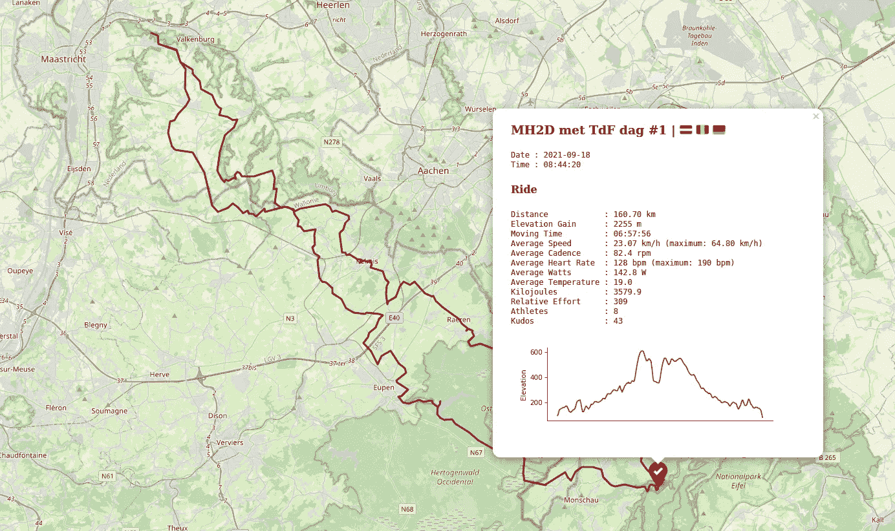
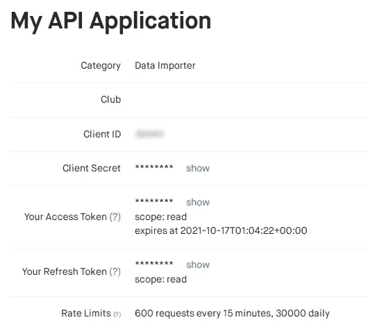
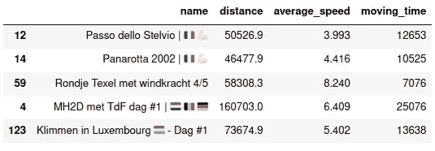
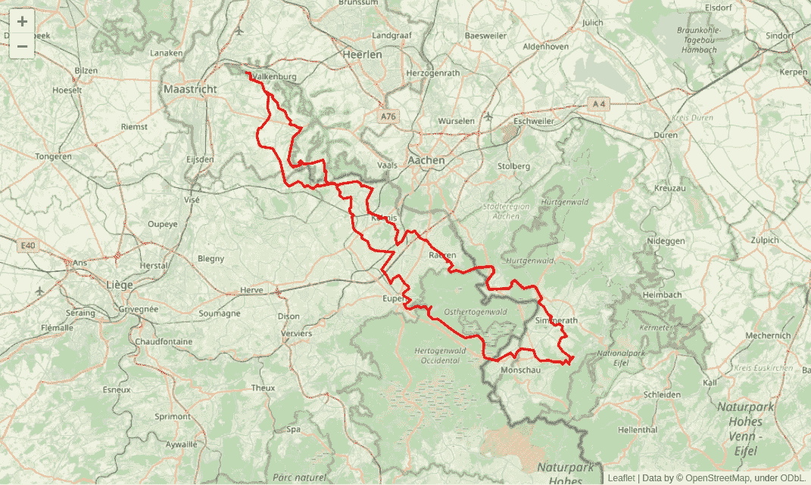
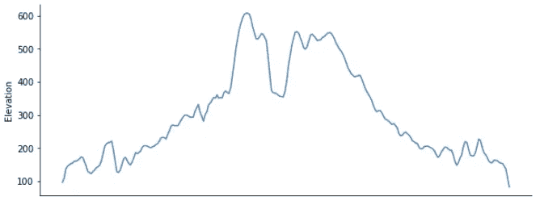
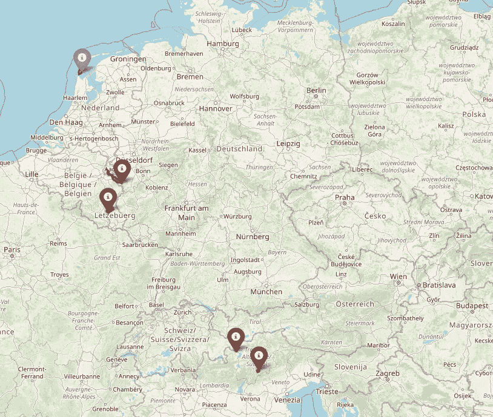
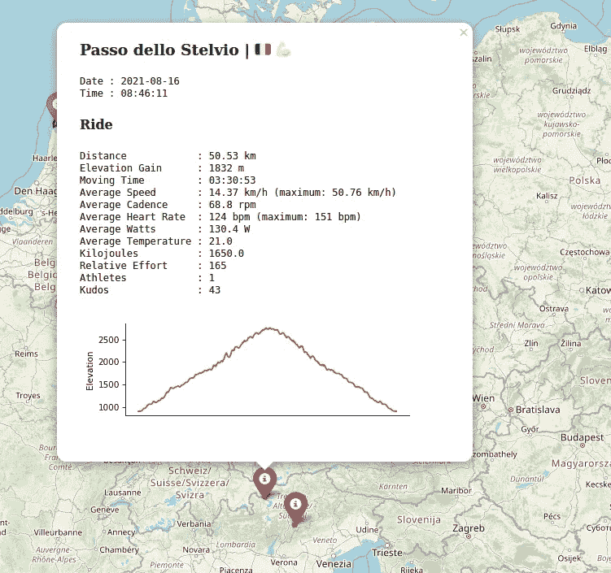

# 使用 Python 在交互式地图上可视化您的 Strava 数据

> 原文：<https://towardsdatascience.com/visualize-your-strava-data-on-an-interactive-map-with-python-92c1ce69e91d?source=collection_archive---------9----------------------->

## 使用 Strava API 和 Python 下载您的活动数据、创建高程剖面并在交互式地图上绘制您的活动详细信息，只需几个简单的步骤。



作者图片

D 下载你的 Strava 数据并不复杂。但首先，您必须通过一个一次性的手动过程，授权您的应用程序访问您的所有活动数据。首先，我建议你按照 Matt Ambrogi 在他精彩的[故事](/using-the-strava-api-and-pandas-to-explore-your-activity-data-d94901d9bfde)中解释的步骤[。之后，你就可以走了。](https://medium.com/u/1e23ad8f92c5?source=post_page-----92c1ce69e91d--------------------------------)

首先:导入一些重要的 Python 包。还建议禁用特定的`urllib3`警告。

```
# import modules
import os
import requests
import urllib3
import pandas as pd
import numpy as np
import time
import matplotlib.pyplot as plt
import folium
import polyline
import base64
from tqdm import tqdm# disable warnings
urllib3.disable_warnings(urllib3.exceptions.InsecureRequestWarning)
```

要下载您的 Strava 数据，需要设置一些变量。当您在线登录到您的 Strava count 时，您可以查找所需的值。进入“设置”，然后进入“我的 API 应用程序”。



作者图片

您将需要您的*客户端 ID* 、*客户端密码*和*刷新令牌*。在下面的代码块中，将文本*在此插入您的值*替换为您的个人值。

```
# set strava variables
client_id = ‘insert your value here‘
client_secret = ‘insert your value here’
refresh_token = ‘insert your value here'
```

基于您刚刚声明的变量，您可以获得一个新的访问令牌。

```
# define function to get a new access token
def get_access_token(client_id, client_secret, refresh_token):

   oauth_url = ‘[https://www.strava.com/oauth/token'](https://www.strava.com/oauth/token')

   payload = {
       ‘client_id’: client_id, 
       ‘client_secret’: client_secret, 
       ‘refresh_token’: refresh_token, 
       ‘grant_type’: ‘refresh_token’, 
       ‘f’: ‘json’, 
   }

   r = requests.post(oauth_url, data=payload, verify=False)

   access_token = r.json()[‘access_token’] return access_token# get new access token
access_token = get_access_token(client_id, client_secret, refresh_token)
```

现在您有了一个新的访问令牌，您可以下载您的 Strava 数据。一页数据包含 200 个活动(默认值)。因此，平均每周 4 次活动大约是每年 1 页 Strava 数据(4 次活动**×50 周)。我们将设置一个初始值，最大获取 10 页。然而，当发现一个空页面时，控制循环将停止。**

```
# define function to get your strava data
def get_data(access_token, per_page=200, page=1):

   activities_url = ‘[https://www.strava.com/api/v3/athlete/activities'](https://www.strava.com/api/v3/athlete/activities')
   headers = {‘Authorization’: ‘Bearer ‘ + access_token}
   params = {‘per_page’: per_page, ‘page’: page}

   data = requests.get(
       activities_url, 
       headers=headers, 
       params=params
   ).json()

   return data# get you strava data
max_number_of_pages = 10
data = list()
for page_number in tqdm(range(1, max_number_of_pages + 1)):
    page_data = get_data(access_token, page=page_number)
    if page_data == []:
        break
    data.append(page_data)
```

现在我们有了一个带有页面结果的列表中的数据，我们将把它们放在一个字典中，并打印下载的活动数量。

```
# data dictionaries
data_dictionaries = []
for page in data:
    data_dictionaries.extend(page)# print number of activities
print(‘Number of activities downloaded: {}’.format(len(data_dictionaries)))
```

最后一步是将数据标准化为熊猫数据框架，并对一些数据进行采样以获得第一印象。

```
# normalize data
activities = pd.json_normalize(data_dictionaries)# sample activities
activities[['name', 'distance', 'average_speed', 'moving_time']]\
.sample(5)
```



作者图片

列`map.summary_polyline`是 Google 格式的，我们需要先解码，然后才能在地图上绘制路线(折线)。

```
# add decoded summary polylines
activities[‘map.polyline’] = activities[‘map.summary_polyline’].apply(polyline.decode)
```

新创建的列`map.polyline`将用于使用开放高程 API 向数据帧添加高程数据。注意:根据活动的数量和距离(折线中的坐标数)，下载高程数据可能需要相当长的时间。

```
# define function to get elevation data using the open-elevation API
def get_elevation(latitude, longitude):
    base_url = ‘[https://api.open-elevation.com/api/v1/lookup'](https://api.open-elevation.com/api/v1/lookup')
    payload = {‘locations’: f’{latitude},{longitude}’}
    r = requests.get(base_url, params=payload).json()[‘results’][0]
    return r[‘elevation’]# get elevation data
elevation_data = list()
for idx in tqdm(activities.index):
    activity = activities.loc[idx, :]
    elevation = [get_elevation(coord[0], coord[1]) for coord in activity['map.polyline']]
    elevation_data.append(elevation)# add elevation data to dataframe
activities['map.elevation'] = elevation_data
```

在我们的数据框架中还有一些工作要做。日期没有日期时间格式，距离以米为单位，速度以米每秒为单位。设置一个索引列并删除我们不使用的列也是一个很好的做法。

```
# convert data types
activities.loc[:, ‘start_date’] = pd.to_datetime(activities[‘start_date’]).dt.tz_localize(None)
activities.loc[:, ‘start_date_local’] = pd.to_datetime(activities[‘start_date_local’]).dt.tz_localize(None)# convert values
activities.loc[:, ‘distance’] /= 1000 # convert from m to km
activities.loc[:, ‘average_speed’] *= 3.6 # convert from m/s to km/h
activities.loc[:, ‘max_speed’] *= 3.6 # convert from m/s to km/h# set index
activities.set_index(‘start_date_local’, inplace=True)# drop columns
activities.drop(
    [
        ‘map.summary_polyline’, 
        ‘resource_state’,
        ‘external_id’, 
        ‘upload_id’, 
        ‘location_city’, 
        ‘location_state’, 
        ‘has_kudoed’, 
        ‘start_date’, 
        ‘athlete.resource_state’, 
        ‘utc_offset’, 
        ‘map.resource_state’, 
        ‘athlete.id’, 
        ‘visibility’, 
        ‘heartrate_opt_out’, 
        ‘upload_id_str’, 
        ‘from_accepted_tag’, 
        ‘map.id’, 
        ‘manual’, 
        ‘private’, 
        ‘flagged’, 
    ], 
    axis=1, 
    inplace=True
)
```

我们的第一个情节开始了！我们将从在地图上绘制一条活动路线开始。为了正确地使地图居中，我们计算质心或“折线中心”。

```
# select one activity
my_ride = activities.iloc[0, :] # first activity (most recent)# plot ride on map
centroid = [
    np.mean([coord[0] for coord in my_ride['map.polyline'][0]]), 
    np.mean([coord[1] for coord in my_ride['map.polyline'][0]])
]
m = folium.Map(location=centroid, zoom_start=10)
folium.PolyLine(my_ride['map.polyline'], color='red').add_to(m)
display(m)
```



作者图片

让我们画出这次乘坐的高度剖面图。

```
# plot elevation profilefig, ax = plt.subplots(figsize=(10, 4))
ax = pd.Series(my_ride[‘map.elevation’][0]).rolling(3).mean().plot(
    ax=ax, 
    color=’steelblue’, 
    legend=False
)
ax.set_ylabel(‘Elevation’)
ax.axes.xaxis.set_visible(False)
ax.spines[‘top’].set_visible(False)
ax.spines[‘right’].set_visible(False)
plt.show()
```



作者图片

现在，我们准备在一张地图上绘制所有活动，每条路线(中途)都有一个标记，还有一个包含所有活动详细信息的交互式弹出窗口。对于每种类型的活动(骑行、跑步、步行)，我们将使用不同的颜色。我们将分两步进行。在步骤 1 中，我们创建弹出窗口所需的所有高程剖面。在步骤 2 中，创建并保存了实际的地图。

步骤 1:立面图

```
# color scheme
color = {'Ride':'red', 'Run':'blue', 'Walk':'purple'}# create dictionary with elevation profiles
elevation_profile = dict()for row in activities.iterrows():
    row_values = row[1]

    # figure
    fig, ax = plt.subplots(figsize=(6, 2))
    ax = pd.Series(row_values[‘map.elevation’]).rolling(3).mean().plot(
        ax=ax, 
        color=color[row_values[‘type’]],
        legend=False, 
    )
    ax.set_ylabel(‘Elevation’)
    ax.axes.xaxis.set_visible(False)
    ax.spines[‘top’].set_visible(False)
    ax.spines[‘right’].set_visible(False)
    png = ‘elevation_profile_{}.png’.format(row_values[‘id’])
    fig.savefig(png, dpi=75)
    plt.close()

    # read png file
    elevation_profile[row_values[‘id’]] = base64.b64encode(open(png, ‘rb’).read()).decode()

    # delete file
    os.remove(png)
```

第二步:绘制交互式地图

```
# plot all activities on map
resolution, width, height = 75, 6, 6.5def centroid(polylines):
    x, y = [], []
    for polyline in polylines:
        for coord in polyline:
            x.append(coord[0])
            y.append(coord[1])
    return [(min(x)+max(x))/2, (min(y)+max(y))/2]m = folium.Map(location=centroid(activities['map.polyline']), zoom_start=4)for row in activities.iterrows():
    row_index = row[0]
    row_values = row[1]
    folium.PolyLine(row_values['map.polyline'], color=color[row_values['type']]).add_to(m)

    halfway_coord = row_values['map.polyline'][int(len(row_values['map.polyline'])/2)]# popup text
    html = """
    <h3>{}</h3>
        <p>
            <code>
            Date : {} <br>
            Time : {}
            </code>
        </p>
    <h4>{}</h4>
        <p> 
            <code>
                Distance&nbsp;&nbsp;&nbsp;&nbsp;&nbsp;&nbsp;&nbsp;&nbsp;&nbsp;&nbsp;&nbsp;&nbsp: {:.2f} km <br>
                Elevation Gain&nbsp;&nbsp;&nbsp;&nbsp;&nbsp;&nbsp: {:.0f} m <br>
                Moving Time&nbsp;&nbsp;&nbsp;&nbsp;&nbsp;&nbsp;&nbsp;&nbsp;&nbsp: {} <br>
                Average Speed&nbsp;&nbsp;&nbsp;&nbsp;&nbsp;&nbsp;&nbsp: {:.2f} km/h (maximum: {:.2f} km/h) <br>
                Average Cadence&nbsp;&nbsp;&nbsp;&nbsp;&nbsp: {:.1f} rpm <br>
                Average Heart Rate&nbsp;&nbsp: {:.0f} bpm (maximum: {:.0f} bpm) <br>
                Average Watts&nbsp;&nbsp;&nbsp;&nbsp;&nbsp;&nbsp;&nbsp: {:.1f} W <br>
                Average Temperature&nbsp: {:.1f} <br>
                Kilojoules&nbsp;&nbsp;&nbsp;&nbsp;&nbsp;&nbsp;&nbsp;&nbsp;&nbsp;&nbsp: {:.1f} <br>
                Relative Effort&nbsp;&nbsp;&nbsp;&nbsp;&nbsp: {:.0f} <br>
                Athletes&nbsp;&nbsp;&nbsp;&nbsp;&nbsp;&nbsp;&nbsp;&nbsp;&nbsp;&nbsp;&nbsp;&nbsp: {:.0f} <br>
                Kudos&nbsp;&nbsp;&nbsp;&nbsp;&nbsp;&nbsp;&nbsp;&nbsp;&nbsp;&nbsp;&nbsp;&nbsp;&nbsp;&nbsp;&nbsp: {:.0f} <br>
            </code>
        </p>
    
    """.format(
        row_values['name'], 
        row_index.date(), 
        row_index.time(),  
        row_values['type'], 
        row_values['distance'], 
        row_values['total_elevation_gain'], 
        time.strftime('%H:%M:%S', time.gmtime(row_values['moving_time'])), 
        row_values['average_speed'], row_values['max_speed'], 
        row_values['average_cadence'],  
        row_values['average_heartrate'], row_values['max_heartrate'], 
        row_values['average_watts'], 
        row_values['average_temp'], 
        row_values['kilojoules'], 
        row_values['suffer_score'], 
        row_values['athlete_count'], 
        row_values['kudos_count'], 
        elevation_profile[row_values['id']], 
    )

    # add marker to map
    iframe = folium.IFrame(html, width=(width*resolution)+20, height=(height*resolution)+20)
    popup = folium.Popup(iframe, max_width=2650)
    icon = folium.Icon(color=color[row_values['type']], icon='info-sign')
    marker = folium.Marker(location=halfway_coord, popup=popup, icon=icon)
    marker.add_to(m)m.save('mymap.html')
display(m)
```



作者图片



作者图片

您的互动地图另存为`mymap.html`，可以分享！你只需要一个网络浏览器来查看你的(本地)文件。

# 最后的想法

Python 是一种功能强大的语言，拥有惊人的库来可视化您的数据。你最喜欢的可视化地理数据的语言和包是什么？让我知道你的想法。

<https://medium.datadriveninvestor.com/create-thematic-maps-using-shapefiles-in-julia-135ea67e9628>  </reactive-data-analysis-with-julia-in-pluto-notebooks-b4652defd03e>  </5-amazing-pandas-features-you-probably-dont-know-about-5533498aac88> 