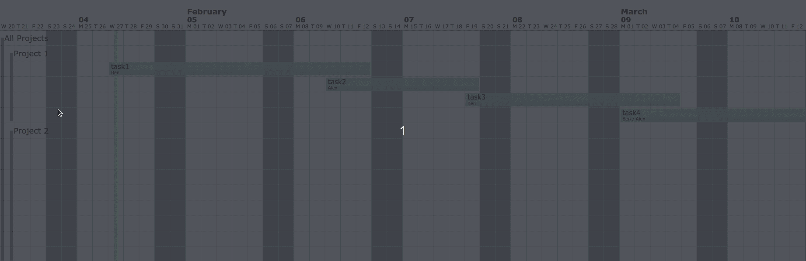
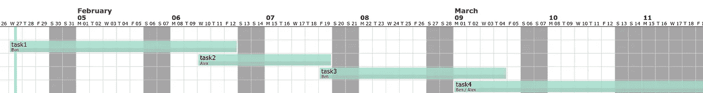

# 使用 Python 甘特图可视化您团队的项目

> 原文：<https://towardsdatascience.com/visualize-your-teams-projects-using-python-gantt-chart-5a1c1c98ea35?source=collection_archive---------7----------------------->

## 利用您的 Python 技能来帮助您的团队管理他们的任务

# 动机

如果您在团队中工作，团队中可能会有多个项目。每个项目还有一些有截止日期的子任务。每个子任务被分配给不同的团队成员。

如果每个成员都有不同的休假日期，日程安排就更复杂了。有没有一种方法可以让你用 Python 可视化所有这些细节，如下图？



作者图片

是的，你可以用 python-gantt。

# 什么是甘特图？

甘特图是一种条形图，它提供了一段时间内任务计划的可视化视图。x 轴代表时间线，y 轴代表任务。

Python 中有多个库可以让你创建甘特图，但我发现的图形最漂亮的是 python-gantt。

要安装 [python-gantt](https://pypi.org/project/python-gantt/) ，请使用

```
pip install python-gantt
```

# 入门指南

我们将从一个简单的例子中学习如何使用 python-gantt。假设你的公司只有两名员工:Ben 和 Alex。您希望在一个项目中为不同的员工分配不同的任务。

# 创建员工

从使用`gantt.Resource()`方法创建雇员开始。

## 创建一些任务

接下来，我们使用`gantt.Tasks`方法为您的员工创建一些任务

`gantt.Tasks`方法内部参数说明:

*   `start`:开始日期
*   `duration`:任务的持续时间
*   `resources`(可选):任务会分配给谁
*   `color`(可选):任务栏的颜色

## 创建项目

一个项目可能有不同的任务。例如，“清理数据”项目可以包括较小的任务，如“研究数据”、“选择最佳特征”等。

可能有多个项目，例如“清理数据”、“构建模型”和“测试模型性能”。在这个例子中，我们将只创建一个包含上面创建的所有任务的项目。

## 创建假期(可选)

您也可以使用`add_vacation`方法将自定义假期添加到甘特图中

现在我们已经准备好可视化我们的甘特图了！

## 用甘特图可视化

要可视化甘特图，请使用`make_svg_for_tasks`方法

这将创建一个 SVG 图像，如下所示



作者图片

点击[此处](https://khuyentran1401.github.io/docs/Project_1.svg)查看图表。在上图中，灰色单元格表示休息日(周末和假期)，蓝色竖线表示今天。我们还可以看到每个任务的持续时间以及每个任务分配给了谁。

# 多个项目和里程碑

在现实生活中，甘特图可能看起来比上面更复杂，因为可能有多个项目。在一个项目中，可能有多个里程碑。

里程碑标志着工作主要阶段的完成。每个里程碑可以有不同的任务。

这些细节听起来很复杂。好消息是，使用 python-gantt 可以很容易地将所有这些细节包含在甘特图中。

## 创建项目 2、里程碑和任务

要创建一个里程碑，使用`gantt.Milestone`方法。参数`depends_of`指定每个里程碑依赖于哪些任务。

酷！现在我们向项目 2 添加任务和里程碑

## 可视化所有项目

为了合并我们创建的所有项目，我们将创建一个包含项目 1 和项目 2 的父项目

然后可视化所有项目


作者图片

点击[这里](https://khuyentran1401.github.io/docs/multiple_projects.svg)查看上面的甘特图。

# 结论

恭喜你！您刚刚学习了如何用 Python 创建甘特图。创建一个，并展示给你的队友和经理。他们会很高兴能够在一个地方可视化所有项目和任务。

在[Github repo](https://github.com/khuyentran1401/Data-science/blob/master/visualization/gantt_chart/gantt_chart.ipynb)中，您可以随意使用本文的代码。

我喜欢写一些基本的数据科学概念，并尝试不同的算法和数据科学工具。你可以在 LinkedIn 和 Twitter 上与我联系。

[](/how-to-create-interactive-and-elegant-plot-with-altair-8dd87a890f2a) [## 如何用 Altair 创建交互式剧情

### 在 5 行简单的 Python 代码中利用您的数据分析

towardsdatascience.com](/how-to-create-interactive-and-elegant-plot-with-altair-8dd87a890f2a) [](https://medium.com/towards-artificial-intelligence/visualize-gender-specific-tweets-with-scattertext-5167e4600025) [## 用分散文本可视化特定性别的推文

### 区分推文中的性别，并在交互式 HTML 散点图中呈现

medium.com](https://medium.com/towards-artificial-intelligence/visualize-gender-specific-tweets-with-scattertext-5167e4600025) [](/top-6-python-libraries-for-visualization-which-one-to-use-fe43381cd658) [## 可视化的 6 大 Python 库:使用哪一个？

### 对使用哪种可视化工具感到困惑？我为你分析了每个图书馆的利弊

towardsdatascience.com](/top-6-python-libraries-for-visualization-which-one-to-use-fe43381cd658) [](/i-scraped-more-than-1k-top-machine-learning-github-profiles-and-this-is-what-i-found-1ab4fb0c0474) [## 我收集了超过 1k 的顶级机器学习 Github 配置文件，这就是我的发现

### 从 Github 上的顶级机器学习档案中获得见解

towardsdatascience.com](/i-scraped-more-than-1k-top-machine-learning-github-profiles-and-this-is-what-i-found-1ab4fb0c0474)