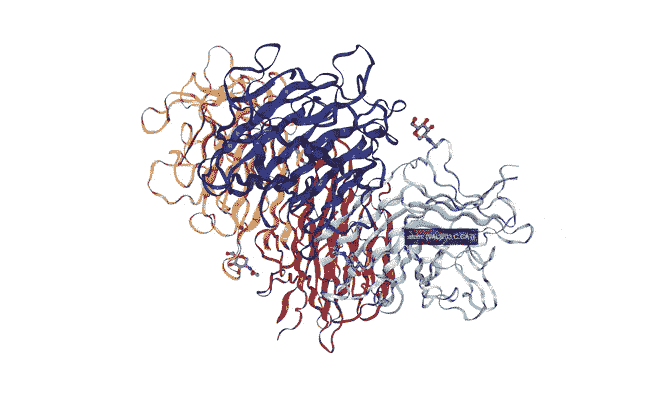
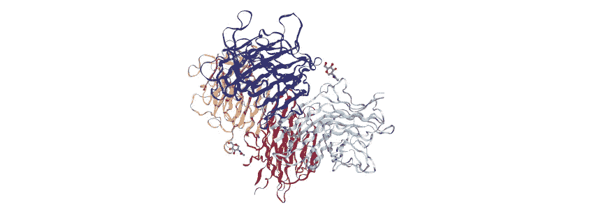
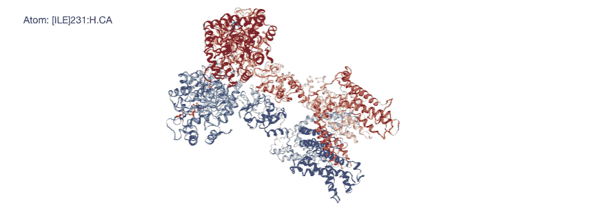
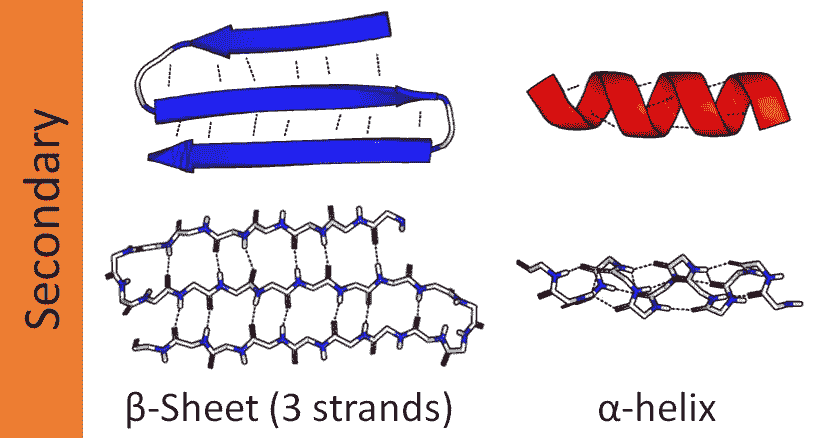

# 在 Python 中可视化和分析蛋白质

> 原文：<https://towardsdatascience.com/visualizing-and-analyzing-proteins-in-python-bd99521ccd?source=collection_archive---------0----------------------->

## [数据科学](https://towardsdatascience.com/data-science/home)

## 生物蛋白组学

人类生物学极其复杂。即使我们的理解越来越多，我们的答案只会发现越来越多的问题。人类基因组计划的完成给了许多科学家信心，我们可以通过基因组学解决生物学中的紧迫问题。然而，随着我们对生物学理解的加深，我们已经认识到其他因素会影响生物体基因组的利用。因此，新的研究领域诞生了，以解决这些相互联系和灵活的领域，包括转录组学(mRNA 的研究)和蛋白质组学(蛋白质的研究)。



作者 GIF

正如我在[之前的博客](/the-art-of-science-7a2ebb72275f)中提到的，Biopython 软件包非常强大，可以简单地可视化和分析 DNA 和 RNA 序列。它还具有蛋白质分析能力！所以让我们开始吧。

[蛋白质数据库](https://www.rcsb.org/)是探索和下载蛋白质序列的一站式商店。PDB 为此开发了自己的文件格式——恰当地命名为. pdb。但随着更大、更复杂的蛋白质被分析，另一种格式被开发出来——CIF 和 mmCIF。CIF(晶体学信息文件)被开发用来存档研究晶体中原子排列的小分子晶体学实验。用 mmCIF 将 CIF 扩展到更大的分子(大分子，因此 mm ),并取代了 PDB 格式。[ [1](https://pdb101.rcsb.org/learn/guide-to-understanding-pdb-data/beginner%E2%80%99s-guide-to-pdb-structures-and-the-pdbx-mmcif-format)

# 用 PDB 格式可视化

虽然 mmCIF 现在是标准，但仍有对 PDB 文件的传统支持。

让我们看看[植物血凝素-L](https://www.rcsb.org/structure/1FAT) ，一种在某些豆类中发现的凝集素，如菜豆。

导入必要的包:

```
from Bio.PDB import *
import nglview as nv
import ipywidgets
```

现在我们将创建 Biopython 的 PDBParser 的一个实例，并使用 nglview 库来创建我们的交互式可视化。我们可以平移、缩放和旋转分子，甚至悬停以获取特定的原子信息。

```
pdb_parser = PDBParser()
structure = pdb_parser.get_structure("PHA-L", "Data/1FAT.pdb")
view = nv.show_biopython(structure)
```



作者图片

# 用 CIF 格式可视化

我们处理 CIF 文件的过程将非常相似，只是使用 MMCIF 解析器来代替！在这里，我们正在想象一个更大的蛋白质 [6EBK](https://www.rcsb.org/structure/6EBK) ，或者脂质纳米盘中的电压激活 kv 1.2–2.1 桨嵌合体通道(一口…)

```
cif_parser = MMCIFParser()
structure = cif_parser.get_structure("6EBK", "fa/6ebk.cif")
view = nv.show_biopython(structure)
```



作者图片

# 访问蛋白质信息

## 页眉

获取蛋白质信息的最直接方式是通过标题，这是一个元数据字典，有 PDB 和 CIF 两种文件格式。

```
mmcif_dict = MMCIFDict.MMCIFDict("fa/1fat.cif")
len(mmcif_dict) # 689
```

这产生了一个关于蛋白质信息的大字典，包括对蛋白质排序的引用、结构信息、原子与原子的位置和角度以及化学成分。如你所见，这本词典有 689 个词条。

## 剩余序列

你想要分析的最重要的信息之一是蛋白质或多肽的残基——想想氨基酸——序列。因为蛋白质可以由几个多肽组成，我们使用一个框架来了解我们正在检查的组织水平。从整体结构，到单个原子。

我们文件中的结构对象遵循父子关系中的 SMCRA 体系结构:

*   一个 **S** 结构由模型组成
*   一个 **M** 模型由链条组成
*   链由残基(氨基酸)组成
*   一个**R**e 由**A**Tom 组成

有许多方法可以解析结构元数据以返回蛋白质的残基序列。以下是三种方式:

```
# .get_residues() method in a loop
for model in structure:
    for residue in model.get_residues():
        print(residue)# .get_residues() method as generator object
residues = structure.get_residues() # returns a generator object
[item for item in residues]# .unfold_entities - keyword for each level of the SMCRA structure
Selection.unfold_entities(structure, "R") # R is for residues
```

## 构建多肽

得到上面的残基序列会返回整个蛋白质结构的序列，但是蛋白质通常由几个较小的多肽组成，我们可能想要单独分析它们。Biopython 通过可以产生这些单独多肽的多肽构建体来实现这一点。

```
polypeptide_builder = CaPPBuilder()
counter = 1for polypeptide in polypeptide_builder.build_peptides(structure):
    seq = polypeptide.get_sequence()
    print(f"Sequence: {counter}, Length: {len(seq)}")
    print(seq)
    counter += 1# Sequence: 1, Length: 36
# SNDIYFNFQRFNETNLILQRDASVSSSGQLRLTNLN
# Sequence: 2, Length: 196
# NGEPRVGSLGRAFYSAPIQIWDNTTGTVASFATSFT...ASKLS
# Sequence: 3, Length: 233
# SNDIYFNFQRFNETNLILQRDASVSSSGQLRLTNLN...ASKLS
# Sequence: 4, Length: 36
# SNDIYFNFQRFNETNLILQRDASVSSSGQLRLTNLN
# Sequence: 5, Length: 196
# NGEPRVGSLGRAFYSAPIQIWDNTTGTVASFATSFT...ASKLS
# Sequence: 6, Length: 35
# SNDIYFNFQRFNETNLILQRDASVSSSGQLRLTNL
# Sequence: 7, Length: 196
# NGEPRVGSLGRAFYSAPIQIWDNTTGTVASFATSFT...ASKLS
```

# 分析残基序列

所以现在我们有了这 7 条链的残基序列，但是我们也有了很多分析这些序列的方法。

```
from Bio.SeqUtils.ProtParam import ProteinAnalysis
```

唯一需要注意的是。上面的 get_sequences()返回一个 Biopython Seq()对象——查看我之前的博客[以深入了解 Seq()对象及其功能——而 ProteinAnalysis 需要一个字符串。](/the-art-of-science-7a2ebb72275f)

```
analyzed_seq = ProteinAnalysis(str(seq))
```

我们现在准备运行以下方法来建立对我们序列的理解！

## 分子量

我们可以计算多肽的分子量。

```
analyzed_seq.molecular_weight()
# 4176.51669
```

## 肉汁

> 蛋白质肉汁返回您输入的蛋白质序列的肉汁(亲水性的大平均值)值。通过将每个残基的亲水性值相加并除以序列长度来计算肉汁值(Kyte 和 Doolittle1982).*[*2*](https://pubmed.ncbi.nlm.nih.gov/7108955/)*

**值越高，疏水性越强。值越低，亲水性越强。我们后面会讨论如何通过残基疏水性生成残基。**

```
**analyzed_seq.gravy()
# -0.5611**
```

## **氨基酸计数**

**我们可以很容易地计算出每种氨基酸的数量。**

```
**analyzed_seq.count_amino_acids()
# {'A': 1,
 'C': 0,
 'D': 2,
 'E': 1,
 'F': 3,
 'G': 1,
 'H': 0,
 'I': 2,
 'K': 0,
 'L': 5,
 'M': 0,
 'N': 6,
 'P': 0,
 'Q': 3,
 'R': 3,
 'S': 5,
 'T': 2,
 'V': 1,
 'W': 0,
 'Y': 1}**
```

## **氨基酸百分比**

**以及序列中每个氨基酸的百分比！**

```
**analyzed_seq.get_amino_acids_percent()
# {'A': 0.027777777777777776,
 'C': 0.0,
 'D': 0.05555555555555555,
 'E': 0.027777777777777776,
 'F': 0.08333333333333333,
 'G': 0.027777777777777776,
 'H': 0.0,
 'I': 0.05555555555555555,
 'K': 0.0,
 'L': 0.1388888888888889,
 'M': 0.0,
 'N': 0.16666666666666666,
 'P': 0.0,
 'Q': 0.08333333333333333,
 'R': 0.08333333333333333,
 'S': 0.1388888888888889,
 'T': 0.05555555555555555,
 'V': 0.027777777777777776,
 'W': 0.0,
 'Y': 0.027777777777777776}**
```

## **二级结构**

**一个非常有用的方法。secondary _ structure _ fraction()-返回三种经典二级结构中的氨基酸比例。这些是β折叠、α螺旋和转角(残基改变方向的地方)。**

****

**[图片](https://commons.wikimedia.org/wiki/File:Alpha_beta_structure_(full).png)由[托马斯·沙菲](https://commons.wikimedia.org/wiki/User:Evolution_and_evolvability)在[维基媒体](https://commons.wikimedia.org/wiki/Main_Page)的 [CC BY-SA 4.0](https://creativecommons.org/licenses/by-sa/4.0/deed.en) 许可下提供。**

```
**analyzed_seq.secondary_structure_fraction() # helix, turn, sheet
# (0.3333333333333333, 0.3333333333333333, 0.19444444444444445)**
```

## **蛋白质秤**

**蛋白质尺度是一种使用滑动窗口测量肽序列长度上残基的某些属性的方法。标度由基于不同物理和化学性质的每种氨基酸的值组成，例如疏水性、二级结构趋势和表面可及性。与一些链级测量(如整体分子行为)相反，尺度允许对序列的较小部分将如何表现有更细粒度的理解。**

```
**from Bio.SeqUtils.ProtParam import ProtParamData**
```

**一些常见的秤包括:**

*   **kd → Kyte & Doolittle 疏水性指数[ [原文](https://pubmed.ncbi.nlm.nih.gov/7108955/)**
*   **弹性→标准化平均弹性参数(B 值)[ [原文](https://pubmed.ncbi.nlm.nih.gov/8090708/)**
*   **hw → Hopp & Wood 亲水性指数[ [原文](https://www.pnas.org/content/78/6/3824)**
*   **em → Emini 表面分数概率(表面可达性)[ [原著](https://www.springer.com/gp/book/9789401063074)**

> **可在[这里](https://github.com/biopython/biopython/blob/master/Bio/SeqUtils/ProtParamData.py#L6)找到一些常见秤的文档。**

**让我们以疏水性指数(kd)为例。这是一个等级，每个残基都有一个代表其疏水性水平的相关值。**

```
**kd = {"A": 1.8, "R": -4.5, "N": -3.5, "D": -3.5, "C": 2.5, 
      "Q": -3.5, "E": -3.5, "G": -0.4, "H": -3.2, "I": 4.5, 
      "L": 3.8, "K": -3.9, "M": 1.9, "F": 2.8, "P": -1.6, 
      "S": -0.8, "T": -0.7, "W": -0.9, "Y": -1.3, "V": 4.2}**
```

**正值是疏水的。异亮氨酸(I)和缬氨酸(V)最疏水，精氨酸(R)和赖氨酸(K)最亲水。疏水性残基通常位于多肽的内部，而亲水性残基位于外部，因此这一尺度也给出了该多肽可能如何折叠的意义。**

**蛋白质规模分析需要设置一个窗口大小，在此范围内计算平均值。您还可以使用“edge”关键字来指定相邻残基的重要性，基本上是将它们的重要性加权到窗口的平均值。**

```
**analysed_seq.protein_scale(window=7, param_dict=ProtParamData.kd)# [-0.7571428571428572,
 -0.2428571428571429,
 -0.24285714285714288,
 -0.38571428571428573,
 -0.6285714285714287,
 -0.942857142857143,
 -1.842857142857143,
 -1.442857142857143,
 -2.3428571428571425,
 -1.3000000000000003,
 -0.01428571428571433,
 0.1285714285714285,
 0.1285714285714285,
 -0.014285714285714235,
 -0.4142857142857143,
 0.3428571428571428,
 -0.31428571428571417,
 -0.35714285714285715,
 -1.014285714285714,
 -0.6285714285714284,
 -0.10000000000000002,
 0.3428571428571429,
 -0.4142857142857142,
 0.24285714285714285,
 -1.0,
 -0.34285714285714286,
 -0.32857142857142857,
 -0.7142857142857143,
 -0.1142857142857144,
 -0.11428571428571435]**
```

## **把它绑在一起**

**让我们把所有的方法放在一起，创建一个脚本，它可以遍历我们结构中的每个链，并运行一些常规分析。我们将创建一个空容器，然后用每个序列的关键信息的字典填充它。在这个嵌套结构中，我们可以像对 Python 中的任何容器一样进行切片，以选择单个条目。**

```
**# Create empty list for chains
all_seqs = []
counter = 1# For each polypeptide in the structure, run protein analysis methods and store in dictfor pp in ppb.build_peptides(structure):
    seq_info = {} # create an empty dict
    seq = pp.get_sequence() # get the sequence like above
    analyzed_seq = ProteinAnalysis(str(seq)) # needs to be a str     # Specify dict keys and values    
    seq_info['Sequence Number'] = counter # set sequence id
    seq_info['Sequence'] = seq # store BioPython Seq() object
    seq_info['Sequence Length'] = len(seq) # length of seq
    seq_info['Molecular Weight'] = analyzed_seq.molecular_weight()
    seq_info['GRAVY'] = analyzed_seq.gravy() # hydrophobicity 
    seq_info['AA Count'] = analyzed_seq.count_amino_acids() 
    seq_info['AA Percent'] = analyzed_seq.get_amino_acids_percent() # tuple of (helix, turn, sheet)
    seq_info['Secondary Structure'] = \
        analyzed_seq.secondary_structure_fraction()

    # Update all_seqs list and increase counter
    all_seqs.append(seq_info)
    counter += 1**
```

**选择第一个序列将返回包含我们的分析和值的字典！**

```
**all_seqs[0] # select the first sequence# {'Sequence Number': 1,
 'Sequence': Seq('SNDIYFNFQRFNETNLILQRDASVSSSGQLRLTNLN'),
 'Sequence Length': 36,
 'Molecular Weight': 4176.52,
 'GRAVY': -0.5611,
 'Amino Acid Count': {'A': 1,
  'C': 0,
  'D': 2,
  'E': 1,
  'F': 3,
  'G': 1,
  'H': 0,
  'I': 2,
  'K': 0,
  'L': 5,
  'M': 0,
  'N': 6,
  'P': 0,
  'Q': 3,
  'R': 3,
  'S': 5,
  'T': 2,
  'V': 1,
  'W': 0,
  'Y': 1},
 'Amino Acid Percent': {'A': 0.027777777777777776,
  'C': 0.0,
  'D': 0.05555555555555555,
  'E': 0.027777777777777776,
  'F': 0.08333333333333333,
  'G': 0.027777777777777776,
  'H': 0.0,
  'I': 0.05555555555555555,
  'K': 0.0,
  'L': 0.1388888888888889,
  'M': 0.0,
  'N': 0.16666666666666666,
  'P': 0.0,
  'Q': 0.08333333333333333,
  'R': 0.08333333333333333,
  'S': 0.1388888888888889,
  'T': 0.05555555555555555,
  'V': 0.027777777777777776,
  'W': 0.0,
  'Y': 0.027777777777777776},
 'Secondary Structure': (0.3333333333333333,
  0.3333333333333333,
  0.19444444444444445)}**
```

**我们也可以很容易地选择特定的值。**

```
**all_seqs[0]['Sequence']# Seq('SNDIYFNFQRFNETNLILQRDASVSSSGQLRLTNLN')all_seqs[0]['Molecular Weight']# 4176.52**
```

# **结论**

**Biopython 不仅使处理 DNA 序列变得容易，它还可以用于蛋白质组学来可视化和分析蛋白质。它为常规蛋白质分析提供了强大而灵活的方法，可用于根据您的特定需求开发定制管道。我知道，随着我继续深入研究 Biopython 所提供的功能，我将会继续留下深刻的印象，因此您可以期待将来有更多的文章介绍它的功能。**

**和往常一样，本文中描述的所有代码和依赖项都可以在这个 repo 中找到，随着我对 Biopython 的探索，我将继续更新这个 repo。我希望本指南向您展示用 Biopython 开始自己的生物信息学项目是多么简单，我期待看到您能创造出什么！**

# **连接**

**我一直在寻找连接和探索其他项目！你可以在 [GitHub](https://github.com/ArenCarpenter) 或 [LinkedIn](https://www.linkedin.com/in/aren-carpenter/) 上关注我，并在[媒体](https://arencarpenter.medium.com/)上查看我的其他故事。我也有一个[推特](https://twitter.com/ArenCarpenter)！**

# **来源**

**[1] R. K. Green，[PDB 结构和 PDBx/mmCIF 格式的初学者指南](https://pdb101.rcsb.org/learn/guide-to-understanding-pdb-data/beginner%E2%80%99s-guide-to-pdb-structures-and-the-pdbx-mmcif-format)。**

**[2] J. Kyte 和 R.F. Doolittle，[一种显示蛋白质亲水特性的简单方法](https://pubmed.ncbi.nlm.nih.gov/7108955/) (1983)，J. Mol .生物。157 (1): 105–32.**