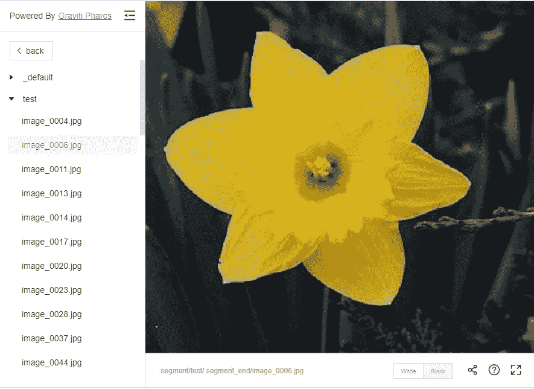
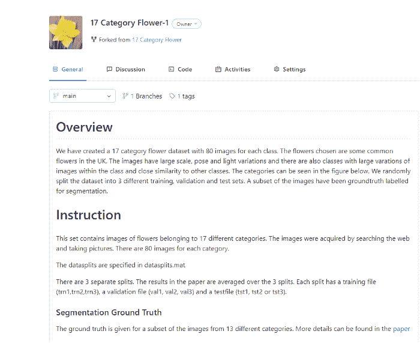
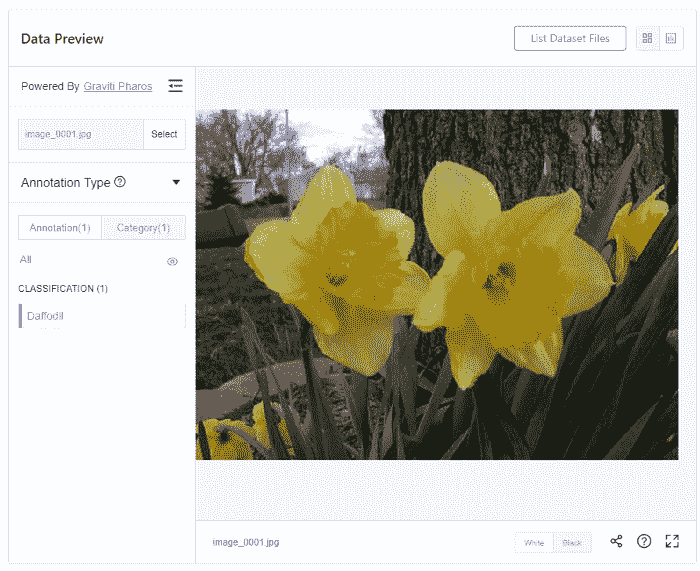
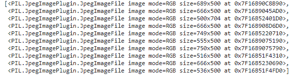
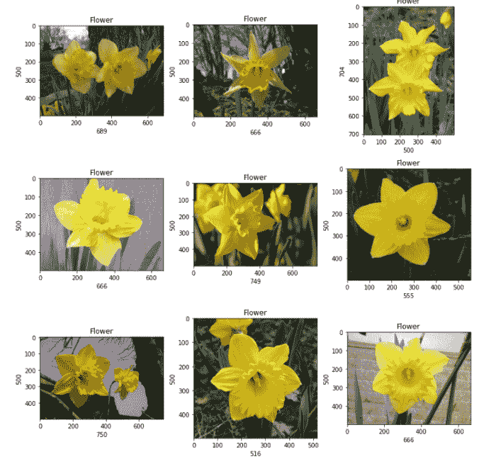
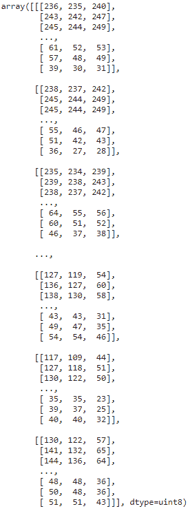
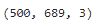
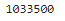
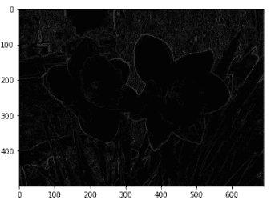
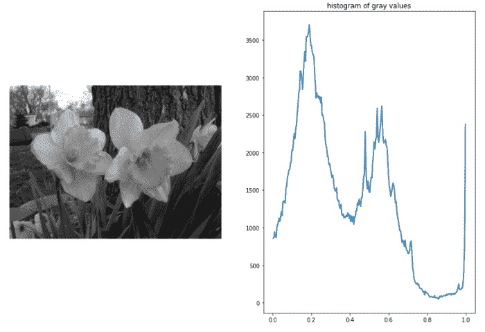

# 可视化和预处理图像数据集

> 原文：<https://towardsdatascience.com/visualizing-and-preprocessing-image-dataset-e3ad574f7be6?source=collection_archive---------17----------------------->

## 使用 Tensorbay 和 SkImage 对大型数据集进行可视化和预处理



来源:作者

当创建计算机视觉项目或模型时，我们通常使用大型数据集。不仅图像数据集的大小比文本数据集大，而且使用了更多的图像，因此我们的模型不会过拟合，并且具有高性能。

我们在哪里可以找到新的、新鲜的数据集？鉴于它们的大小，下载可能吗？我们都曾在 MNIST、FashionMNIST、CIFAR-10 等数据集上工作过。，但是这些都是旧的，用过很多次了。一旦我们访问了新的数据集，我们如何在不下载到本地的情况下轻松使用它们？

答案是使用来自 [Graviti](https://www.graviti.com/?utm_medium=0806Himanshu) 的 TensorBay。TensorBay 是一个数据集管理平台，可自动化和简化整个流程，包括数据托管、版本控制和数据可视化。为了便于集成，Graviti 为 TensorBay 开发了一个基于 Python 的 SDK 来执行这些服务。

对于本地数据集的可视化，我们可以使用 [Pharos](https://tensorbay-python-sdk.graviti.com/en/latest/features/visualization.html#visualization/?utm_medium=0806Himanshu) ，它是 TensorBay SDK 的一个插件。Pharos 发布了一个 Flask 应用程序，允许我们可视化数据并检查其注释。这些可视化有助于识别我们的数据是如何组织的，以及数据中是否存在异常。

对于图像处理，使用了一个 Python 库 Skimage。Skimage 包含不同的算法，可以用来编辑图像。

在本文中，我们将使用 TensorBay、Pharos 和 Skimage 探索图像数据可视化。让我们开始吧…

# 为访问密钥创建 Graviti 帐户

在可视化数据之前，您需要有一个访问键来访问数据和分叉数据集。除了可视化，这个键还可以让您访问其他功能，如版本控制、数据集创建等。

 [## 气体重力服务

### 编辑描述

account.graviti.com](https://account.graviti.com/sign-up/?utm_medium=0806Himanshu) 

上面给出的链接可以用来在 Graviti 上创建一个帐户。注册后，您可以从开发人员工具部分生成并使用您的访问密钥。

# 分叉数据集

下一步是派生数据集。 [Graviti](https://www.graviti.com/?utm_medium=0806Himanshu) 提供了 1000 多个数据集，可以很容易地进行相应的分叉和使用。您可以在此选择任何[数据集。对于本文，我们使用的是](https://gas.graviti.com/open-datasets/?utm_medium=0806Himanshu) [17 类别花](https://gas.graviti.com/dataset/hellodataset/Flower17/?utm_medium=0806Himanshu)数据集。



来源:作者

# 使用 Pharos 可视化数据集

要可视化一个数据集，请登陆它在 TensorBay 的主页，使用 Pharos 启动 Flask 应用程序。



来源:作者

**创建 Jupyter 笔记本**

最后一步是创建一个 Jupyter 笔记本，用于加载分叉数据集。但是首先，我们需要使用下面给出的命令安装所需的 TensorBay 及其插件 Pharos Python 库。

在下面显示的代码中，数据集在我们的本地机器上被读取，图像从 URL 中获取并保存在一个列表中，该列表将用于预处理。请记住，您需要提供自己的访问键，并派生出您想要使用的数据。

```
from tensorbay import GAS
from tensorbay.dataset import Segment
from tensorbay.dataset import Data, Dataset
import requests
from PIL import ImageACCESS_KEY = “Your Access Key”
gas = GAS(ACCESS_KEY)dataset_client = gas.get_dataset(“Flower17–1”)img_list=[]segments = dataset_client.list_segment_names()segment = Segment(“default”, dataset_client)for data in segment:
   fp = data.open()
   img_list.append(Image.open(requests.get(fp.url,        
    stream=True).raw))
img_list
```



来源:作者

在上面的图片中，你可以看到我们如何从 URL 加载不同的图片。现在我们将对将要处理的图像进行可视化，然后对这些图像进行预处理，这些图像存储在一个列表中。

```
plt.figure(figsize=(11,11))for i in range(1,10):plt.subplot(3,3,i)plt.tight_layout()plt.imshow(img_list[i-1])plt.title(‘Flower’)plt.xlabel(img_list[i-1].shape[1], fontsize=10)plt.ylabel(img_list[i-1].shape[0], fontsize=10)
```



来源:作者

```
#converting image to numpy arrayimport numpy as npimage1 = np.array(img_list[0])image1
```



来源:作者

```
image1.shape
```



来源:作者

```
image1.size
```



来源:作者

```
#Converting Grayscale
from skimage.color import rgb2gray
grayscale = rgb2gray(img_list[0])#Edge Detection
from skimage import filters
ed_sobel = filters.sobel(grayscale)
imshow(ed_sobel, cmap=’gray’);
```



边缘(来源:作者)

```
from skimage.exposure import histogram
hist, hist_centers = histogram(grayscale)#Plotting the Image and the Histogram of gray valuesfig, axes = plt.subplots(1, 2, figsize=(8, 3))axes[0].imshow(grayscale, cmap=plt.cm.gray)axes[0].axis(‘off’)axes[1].plot(hist_centers, hist, lw=2)axes[1].set_title(‘histogram of gray values’)
```



来源:作者

在 [Graviti](https://www.graviti.com/?utm_medium=0806Himanshu) 使用不同的数据集尝试这个过程，并使用 Pharos 创建可视化。请在回复部分留下你的评论，让我知道结果如何。