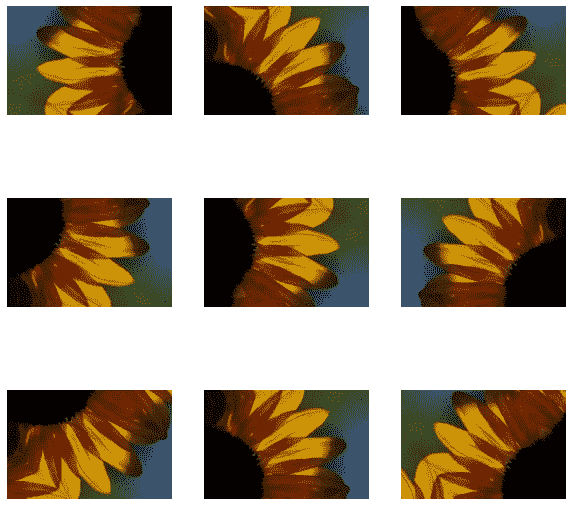
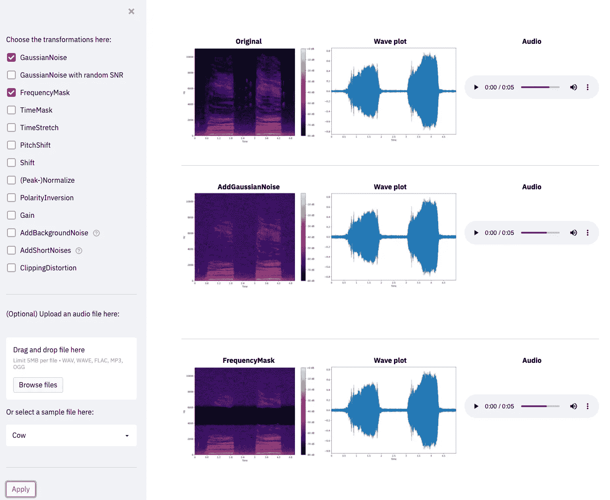

# 使用 Streamlit 可视化音频管道

> 原文：<https://towardsdatascience.com/visualizing-audio-pipelines-with-streamlit-96525781b5d9?source=collection_archive---------26----------------------->

## 检查浏览器中增强功能的效果

当处理图像数据时，从业者经常使用增强。扩充是人为随机改变数据以增加多样性的技术。将这种变换应用于训练数据使得模型更加健壮。对于图像数据，常用的方法是旋转、调整大小或模糊。转换的效果很容易看到和理解。甚至可以快速掌握多个增强，如下例所示:

示例性增强。一个 TensorFlow [教程](https://www.tensorflow.org/tutorials/images/data_augmentation)后作者创建的图片。

这种增强并不局限于图像(尽管它们在那里很受欢迎)。对于音频数据，有类似的方法来修改训练数据。不利的一面是，人们不能同时观察增强的效果，而必须手动聆听个别的转换。但是，您可以将音频数据可视化，而不是按顺序聆听所有样本。通过视觉化改变，你将检查转移到图像世界。现在，看一眼比同时听十个样本能告诉你更多。当您为新任务构建原型并希望快速检查数据集的变化时，这很有帮助。

这篇文章并没有展示如何在使用 TensorFlow 的时候增加音频数据。我在[最近的帖子](/audio-augmentations-in-tensorflow-48483260b169)中对此进行了弥补。

要创建一个简单的应用程序来完成您正在寻找的功能，谢天谢地，您不必再深入 GUI 编程了。相反，你可以利用像 [streamlit](https://streamlit.io) 这样的工具来可视化数据脚本。将这个与 [audiomentations](https://github.com/iver56/audiomentations) 包结合起来，你可以在两三个下午内构建一个可视化工具。

让我们看看这样的应用程序是什么样子的:

示例性应用的概述。图片由作者提供。你可以在这里复制代码[，在这里](https://github.com/phrasenmaeher/audio-transformation-visualization)现场试用[。](https://share.streamlit.io/phrasenmaeher/audio-transformation-visualization/main/visualize_transformation.py)

在左侧边栏，您构建了您的增强管道。选择一些转换；可能包括添加噪声(AddGaussianNoise)和掩蔽频率(FrequencyMask)。然后，上传一个音频文件或选择一个提供的样本。点击“应用”后，您可以在中心检查效果。

最左边的列包含文件的谱图表示。这种可视化显示了给定时间步长下频率的功率。中间一栏包括波形，最右边一栏显示音频播放器。

侧栏是通过调用以下代码创建的:

我们首先为所有可能的扩展创建复选框，并通过在下面放置一个水平栏来直观地划分这一部分。下一部分添加文件选择功能，最后一个按钮启动可视化过程。

主布局通过以下方法创建:

我们首先绘制未更改的音频文件，然后应用管道的单独转换。增强 A 的输出是增强 b 的输入。为了区分各个变化，我们添加一个小标题，就这样。

更多的代码在后台工作，但是没有太多令人兴奋的事情发生。如果你无论如何都想深入了解它，那么就在这里浏览这些行[。要查看运行中的完整应用程序，您有两种选择:](https://github.com/phrasenmaeher/audio-transformation-visualization/blob/main/visualize_transformation.py)

首先，你可以在你的浏览器[这里](https://share.streamlit.io/phrasenmaeher/audio-transformation-visualization/main/visualize_transformation.py)现场试用。

其次，你可以克隆[库](https://github.com/phrasenmaeher/audio-transformation-visualization)，安装需要的包，然后在命令行运行*streamlit run visualize _ transformation . py*。然后，Streamlit 在本地的[*http://localhost:8501/*上呈现并提供您的 python 脚本。](http://localhost:8501/.)

最近，这个帖子得到了一个兄弟，它展示了如何将增强应用于(TensorFlow)音频数据集。你可以在这里找到说明。