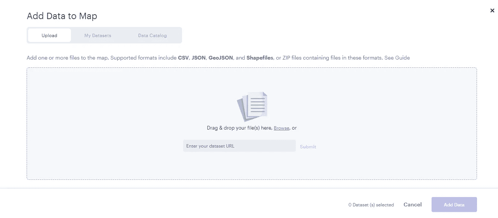
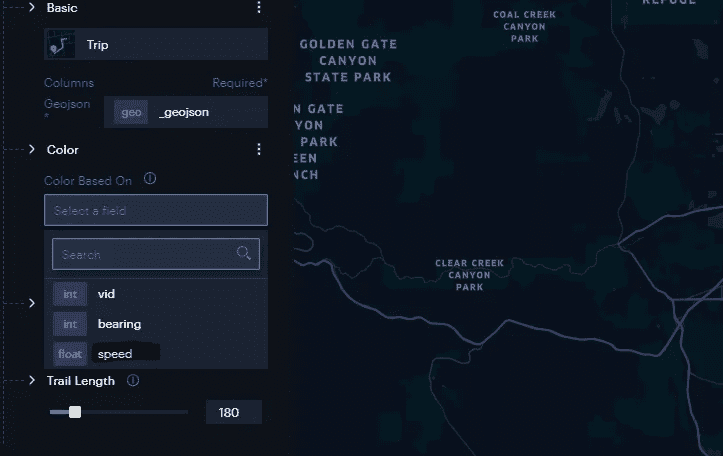

# 可视化丹佛的公共汽车轨迹

> 原文：<https://towardsdatascience.com/visualizing-bus-trajectories-in-denver-85ff02f3a746?source=collection_archive---------31----------------------->

## [实践教程](https://towardsdatascience.com/tagged/hands-on-tutorials)

## 使用 Python 和 Unfolded 可视化 RTD 的实时总线数据馈送

区域交通区，通常被称为 RTD，是丹佛运营公共交通服务的区域机构。RTD 有一个开放的数据平台，发布:

*   *时刻表数据*，包括完整的时刻表和路线配置
*   *RTD 公交服务的实时数据*，包括作为 GTFS 实时反馈的到达/离开预测和车辆位置信息

使用展开的最终可视化(Abdullah Kurkcu 图像)

我们将使用实时数据馈送来首先存储一些数据，然后使用新发布的 explode studio 来可视化公共汽车运动。利用优步的开普勒定律可以达到同样的结果。

在寻找如何下载 GTFS 实时数据的例子时，我看到了这篇精美的文章和代码，展示了如何下载这样的地理空间数据。

<https://medium.com/swlh/visualizing-istanbul-bus-traffic-with-python-and-keplergl-a84895788825>  

我按照奥赞·卡拉的方法下载了丹佛地区的 GTFS 数据，并对代码做了一些修改，还增加了一些额外的后处理步骤来计算总线速度。

我试图下载数据时遇到的问题是，GTFS 提要中有一些空闲的总线，这改变了提要的格式。例如，如果车辆空闲，则 tripID/stopID 等标签不存在。

让我们看看计划车辆的常规饲料:

如果公共汽车还没有时间表，那么 JSON 就是这样的:

如您所见，没有时间表的公共汽车没有 stopId、tripId、routeId 等。这就是为什么我们必须在尝试读取它们之前检查这些标签是否存在。让我们在整个数据下载过程中导入我们需要的库。

下面的虚拟函数将检查可能存在的标签，并使用数据或 NA 填充它们。

下面的函数将下载我们需要的数据。为了能够从 RTD 的 GTFS 实时数据馈送下载数据，您将需要 HTTP 基本身份验证凭据。

  

我们需要每分钟调用这个函数，因为公共汽车每分钟都会发送位置更新。

好了，我们现在有了我们需要的一切。您可以想运行这个函数多长时间就运行多长时间，但是我认为一个小时的数据足以构建一个很好的可视化。我让它运行了一天，并存储了数据。以下函数将 busdata 保存为 geoJSON 文件。它以 Kepler.gl 或 Unfolded 可以动画的方式格式化。

另外，如果你想计算公共汽车的速度，我写了下面这段混乱的代码。我想计算给定路线的平均公交车速度。这就是为什么该函数会计算每次 ping 之间的速度，并取该路线所有这些值的平均值。

不要忘记将其保存为新的 geoJSON 文件。

我们需要的一切都准备好了。你可以去 [kepler.gl](https://kepler.gl/demo) 或者 [unfolded.ai](https://www.unfolded.ai/) 来可视化这个 geoJSON。我将使用展开，因为我有一个老朋友在那家非常成功的公司工作。

登录 [studio.unfolded.ai](https://studio.unfolded.ai/) ，点击右上方“新地图”。这将把你带到要求你上传数据的屏幕。

只需找到您保存的 geojson 文件，并将其放在此屏幕上。展开将自动识别格式，并为您创建一个动画时间线。我们唯一需要改变的是颜色。我想根据公交车的平均速度给这些轨迹上色。

好吧，我撒谎了，这不是我唯一要改变的。我也会增加步道的长度。更长的步道看起来更酷:)谢谢展开！(图片由阿卜杜拉·库尔库提供)

仅此而已！这是最终产品的视频。你可能会看到一些飞行器。我认为原因是他们打开/关闭追踪器或者失去了与服务器的连接。

(阿卜杜拉·库尔库的视频)