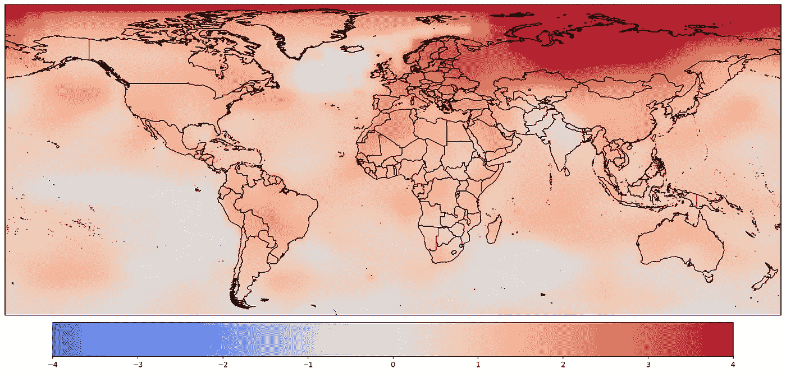
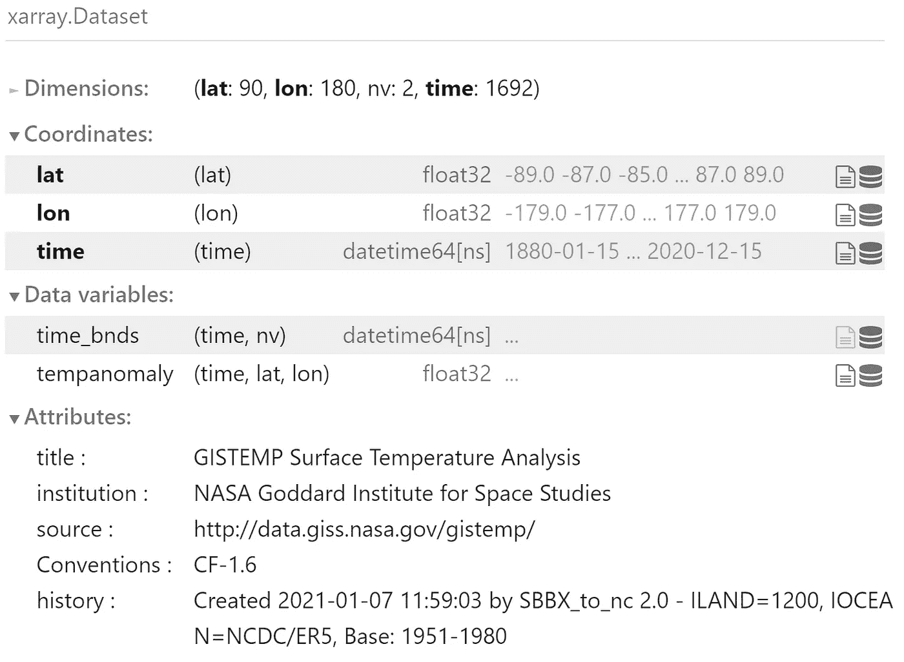
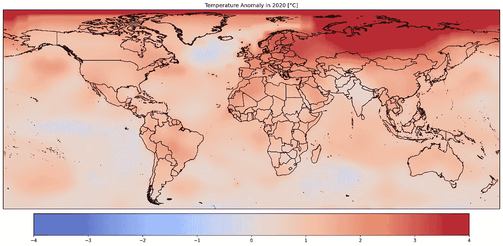
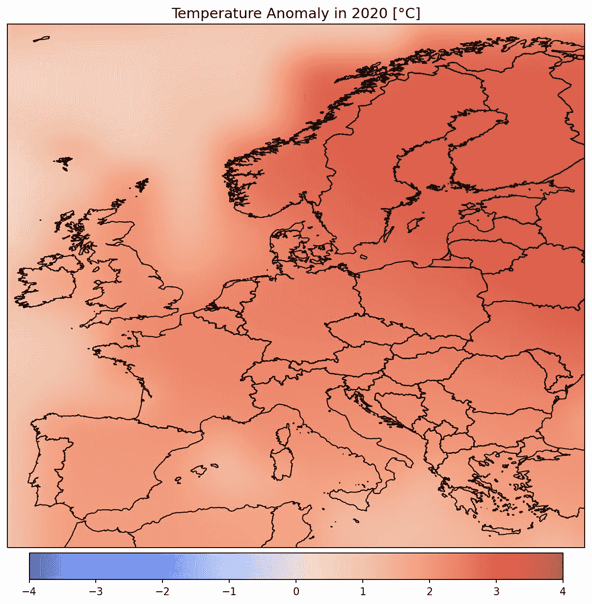

# 用 Python 可视化气候变化数据

> 原文：<https://towardsdatascience.com/visualizing-climate-change-data-with-python-74ea5bac8756?source=collection_archive---------13----------------------->

## 使用 xarray 和 cartopy Python 库创建气候变化图表

2020 年全球气温异常(图片由作者提供)-数据由美国宇航局/GISS 提供

不可否认的事实是，气候变化是当今时代人类面临的最大挑战。全球平均气温持续上升，IPCC 指出[的上升幅度应限制在比工业化前水平](https://www.ipcc.ch/sr15/)高 1.5 摄氏度，才有希望减轻气候变化的有害影响。这个目标是在[巴黎协定](https://unfccc.int/process-and-meetings/the-paris-agreement/the-paris-agreement)中设定的，该协定于 2015 年被世界上几乎所有国家采纳。然而不幸的是，几乎没有采取什么行动来解决这个问题，不断发表的令人担忧的科学研究突出了这一点。

新冠肺炎疫情导致了人类活动的大多数方面的下降，以及随之而来的化石燃料燃烧和二氧化碳排放的减少。尽管如此， [2020 年是历史上最热的年份之一](https://www.nasa.gov/press-release/2020-tied-for-warmest-year-on-record-nasa-analysis-shows)，全球各地都有极端天气事件的记录。此外，根据发表在《冰冻圈杂志》上的研究，全球冰盖正在以创纪录的速度融化，这符合 IPCC 的最坏情况。其他科学家声称，气候变化和生物多样性的丧失对人类的生存构成了前所未有的威胁，其程度甚至连专家都难以理解。

根据皮尤研究中心进行的调查，全球大约 70%的人认为气候变化是他们国家的主要威胁。与 2013 年相比，这一比例显著增加，但仍然很低，因为每个人都必须了解这一问题的严重性。让公众了解气候变化的一个方法是创建相关数据的信息性和美观的可视化。在这篇文章中，我将教你如何使用 Python 制作温度变化的地图和动画。

## **GIS temp 数据集**

我们的可视化基于美国宇航局 GISTEMP v4 数据集，该数据集结合了 NOAA GHCN v4(气象站)和 ERSST v5(海洋区域)，从而产生了我们星球整个表面气候可变性的全面记录。该数据集包括 1880 年以来的温度，每月一次，由美国国家航空航天局用于监测全球和区域气候变化。没有提供绝对温度，而是给出了与基准期(1951-1980 年)相比的异常。该数据集以 netCDF 格式在[GIS temp 网站](https://data.giss.nasa.gov/gistemp/)免费提供。如果你想了解关于数据集的更多细节，以及美国宇航局分析数据集以生成气候变化图表的方式，你可以查看相关论文。

## **Xarray 和 Cartopy 图书馆**

NetCDF 是一种支持面向数组的科学数据的文件格式，通常用于气候学和气象学等领域。有各种各样的 Python 库支持它，但是我们将使用 xarray，因为它是最强大的。Xarray 受流行的 pandas 库的启发，将其大部分功能扩展到多维数组。该库构建在 NumPy 之上，易于集成到 Python 机器学习工作流中。最后，它还具有强大的科学数据集可视化绘图功能。Cartopy 是一个用于地理空间数据可视化的 Python 库，使科学家能够创建出版物质量的地图。它与 xarray 集成得很好，所以我们要用它来生成我们的地图。

## 可视化 GISTEMP 数据

下面的代码可以在使用 Python 3 的 Jupyter 笔记本上执行，如果您愿意，甚至可以使用 Google Colab。首先，我们将通过使用`open_dataset()` xarray 函数导入必要的库并加载 GISTEMP 数据集。

(图片由作者提供)

打印 xarray 数据集输出一些关于其属性和变量的基本信息。正如我们所看到的，数据集是一个 2 ×2 的温度异常网格，每月一次。我们现在要绘制 2020 年全球气温异常图。

2020 年全球气温异常(图片由作者提供)

首先，我们将 xarray 数据集重新采样为一年一次的频率，因为这样更便于操作。之后，我们创建一个卡通地图，并添加世界上每个国家的边界。然后，我们使用`imshow()`方法绘制 xarray 数据。我们还启用了双三次插值，因此图形看起来更具视觉吸引力。我们现在要把我们的重点转移到欧洲国家，通过绘制该地区的地图。

2020 年欧洲气温异常(图片由作者提供)

我们更改了制图地理轴的范围，以仅绘制我们偏好的区域，而不是整个地图。在这种情况下，我们绘制了欧洲大陆，但您可以选择任何您喜欢的地区，这取决于您希望与哪些受众共享图表。我们现在要制作同一地区过去几十年温度变化的动画。

我们现在使用`FuncAnimation()` Matplotlib 函数来生成 1950-2020 年期间的动画，而不是生成静态图表。使用了一个名为`animate()`的附加方法，指定动画的每一帧将如何生成。这个函数作为一个参数传递给`FuncAnimation()`，同时传递的还有我们想要制作动画的时间段。之后，我们使用 [FFmpeg](https://ffmpeg.org/) 将动画保存为 MP4 视频。在所有主流操作系统上安装 FFmpeg 的下载链接和说明可从[这里](https://ffmpeg.org/download.html)获得。

## 结论

为气候变化创建信息丰富且吸引人的图表是一个相对简单的过程，我希望这篇教程能帮助你完成这个任务。由 NASA 等知名组织免费提供的科学数据集，以及众多开源工具，使得每个人都可以进行气候数据分析。我鼓励你们使用 GISTEMP 或其他类似的数据集，并告知你们地区的公民有关气候变化的信息。我们都可以为应对这一巨大挑战做出贡献，而利用数据是实现这一目标的一个很好的方式。如果你想克隆这个项目的 Github 库，可以在这里找到[。欢迎在评论中分享你的想法，或者在](https://github.com/derevirn/climate-viz) [LinkedIn](https://www.linkedin.com/in/giannis-tolios-0020b067/) 上关注我，我经常在那里发布关于数据科学、气候变化和其他主题的内容。你也可以访问我的[个人网站](https://giannis.io/)或者查看我的新书，名为[用 PyCaret](https://leanpub.com/pycaretbook/) 简化机器学习。

## 参考

[1]斯莱特，托马斯等，“地球的冰不平衡。”冰冻圈 15.1(2021):233–246。

[2]布拉德肖，科里·贾等人，“低估避免可怕未来的挑战。”保护科学前沿 1 (2021): 9。

[3]汉森，詹姆斯，等，“全球地表温度变化。”地球物理学评论 48.4 (2010)。