# 用 Python 的 Matplotlib 可视化集群

> 原文：<https://towardsdatascience.com/visualizing-clusters-with-pythons-matplolib-35ae03d87489?source=collection_archive---------0----------------------->

## 如何提高聚类分析的可视化

集群肯定不是什么新鲜事物。MacQueen 在 1967 年开发了 k-means 算法，从那以后，人们开发了许多其他实现和算法来执行对数据进行分组的任务。

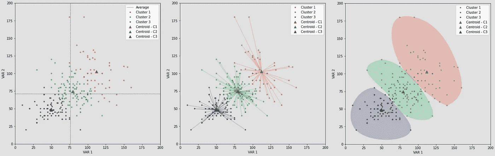

散点图—作者提供的图片

本文将探讨如何用散点图来改进我们的集群的可视化。

## 散点图

让我们从加载和准备数据开始。我将使用口袋妖怪统计数据的数据集。

```
import pandas as pddf = pd.read_csv('data/Pokemon.csv')# prepare data
types = df['Type 1'].isin(['Grass', 'Fire', 'Water'])
drop_cols = ['Type 1', 'Type 2', 'Generation', 'Legendary', '#']
df = df[types].drop(columns = drop_cols)
df.head()
```

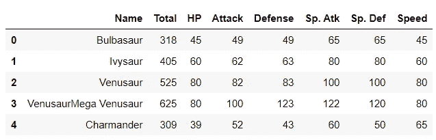

数据框-作者提供的图片

由于这篇文章与其说是关于集群，不如说是关于可视化，我将在下面的例子中使用一个简单的 k-means。

我们将计算三个集群，获得它们的质心，并设置一些颜色。

```
from sklearn.cluster import KMeans
import numpy as np# k means
kmeans = KMeans(n_clusters=3, random_state=0)
df['cluster'] = kmeans.fit_predict(df[['Attack', 'Defense']])# get centroids
centroids = kmeans.cluster_centers_
cen_x = [i[0] for i in centroids] 
cen_y = [i[1] for i in centroids]
## add to df
df['cen_x'] = df.cluster.map({0:cen_x[0], 1:cen_x[1], 2:cen_x[2]})
df['cen_y'] = df.cluster.map({0:cen_y[0], 1:cen_y[1], 2:cen_y[2]})# define and map colors
colors = ['#DF2020', '#81DF20', '#2095DF']
df['c'] = df.cluster.map({0:colors[0], 1:colors[1], 2:colors[2]})
```

然后，我们可以将用于创建聚类的字段传递给 Matplotlib 的散点图，并使用我们创建的“c”列根据聚类在图表中绘制点。

```
import matplotlib.pyplot as pltplt.scatter(df.Attack, df.Defense, c=df.c, alpha = 0.6, s=10)
```

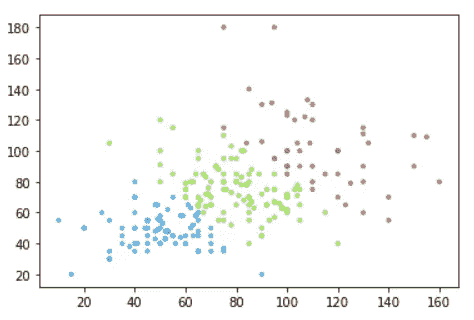

散点图—作者提供的图片

酷毙了。这是聚类数据集的基本可视化，即使没有太多信息，我们也可以开始了解我们的聚类以及它们是如何划分的。

## 多维度

我们经常使用多个变量对数据进行聚类，而散点图只能显示两个变量。可视化三个以上变量有几种选择，但都有应该考虑的缺点。

我们可以使用标记的大小，并使其成为一个气泡图，但这不是一个最佳的解决方案。我们无法将第三个变量与其他变量进行比较，因为它们的编码不同。

例如，我们可以通过查看我们之前制作的图表来判断某个记录的攻击或防御是否较高。但是如果我们把速度作为大小加入，我们就无法和其他两个变量进行比较。

```
plt.scatter(df.Attack, df.Defense, c=df.c, s=df.Speed, alpha = 0.6)
```

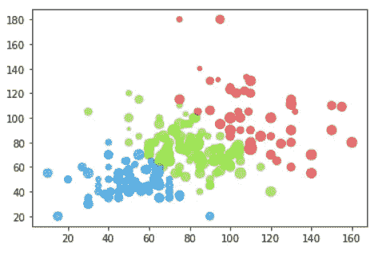

气泡图—作者图片

3D 图也可以对第三个变量进行编码，但它也可能会令人困惑，有时甚至会产生误导——这是因为取决于我们如何看待图表，它可能会给我们错误的印象。

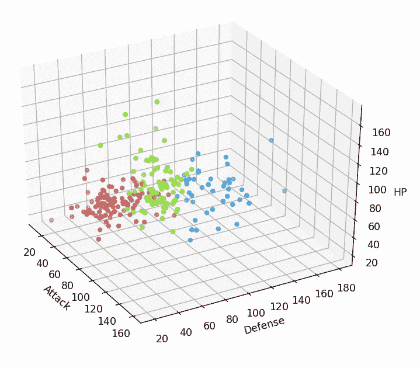

3D 散点图—图片由作者提供

不过，3D 散点图还是很有帮助的，尤其是在它们不是静态的情况下。

根据您的环境，很容易添加一些与 Matplotlib 的交互性。

一些 ide 默认会有这个；其他环境将需要扩展和一个神奇的命令，如 Jupyter Lab 上的“Matplotlib Widget”或 Jupyter notebooks 上的“Matplotlib Notebook”。

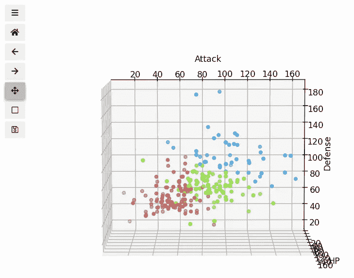

通过改变我们看图表的角度，我们可以更仔细地检查它，避免误解数据。

```
from mpl_toolkits.mplot3d import Axes3D
%matplotlib widgetcolors = ['#DF2020', '#81DF20', '#2095DF']kmeans = KMeans(n_clusters=3, random_state=0)df['cluster'] = kmeans.fit_predict(df[['Attack', 'Defense', 'HP']])
df['c'] = df.cluster.map({0:colors[0], 1:colors[1], 2:colors[2]})fig = plt.figure(figsize=(26,6))ax = fig.add_subplot(131, projection='3d')
ax.scatter(df.Attack, df.Defense, df.HP, c=df.c, s=15)ax.set_xlabel('Attack')
ax.set_ylabel('Defense')
ax.set_zlabel('HP')plt.show()
```

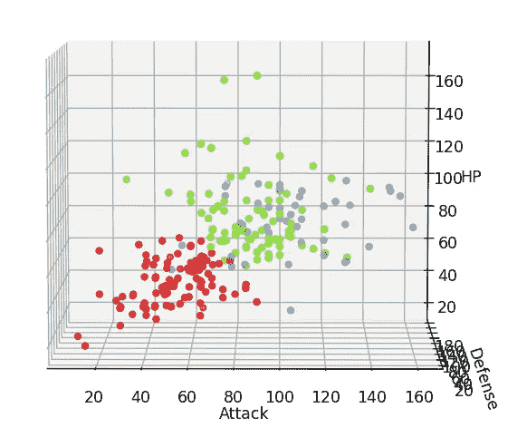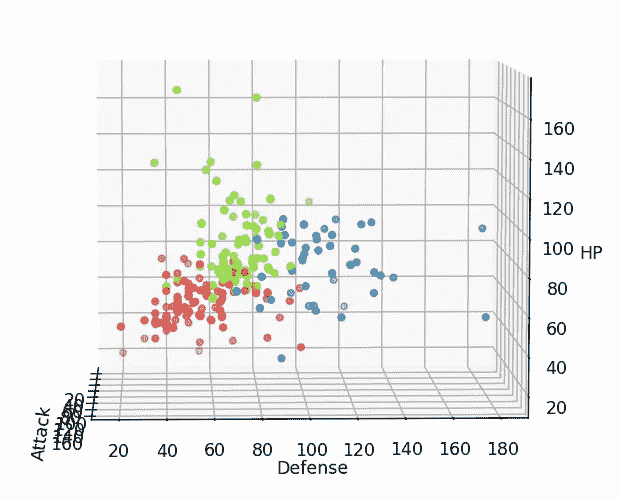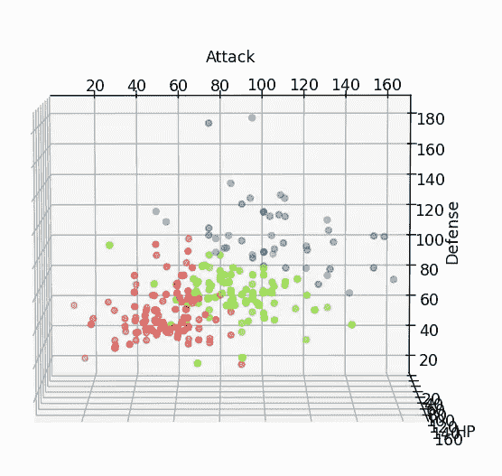

3D 散点图—图片由作者提供

总的来说，它们仍然是一个非常有限的解决方案。

我认为最好的方法是使用多个散点图，要么以矩阵格式，要么通过变量之间的变化。你也可以考虑使用一些数据简化方法，如主成分分析法，将你的变量合并成更少的因素。

## 释文

现在，让我们开始改善我们的视觉化。

如果数据可视化是讲故事，那么注释就相当于我们故事中的叙述者。他们应该帮助观众理解和关注什么是重要的，而不是占用太多的情节空间。

我们将添加基础知识、标题、标签和图例。

```
### BUILD A TWO DIMENSIONS CLUSTER AGAIN ###
# k means
kmeans = KMeans(n_clusters=3, random_state=0)
df['cluster'] = kmeans.fit_predict(df[['Attack', 'Defense']])# get centroids
centroids = kmeans.cluster_centers_
cen_x = [i[0] for i in centroids] 
cen_y = [i[1] for i in centroids]
## add to df
df['cen_x'] = df.cluster.map({0:cen_x[0], 1:cen_x[1], 2:cen_x[2]})
df['cen_y'] = df.cluster.map({0:cen_y[0], 1:cen_y[1], 2:cen_y[2]})# define and map colors
colors = ['#DF2020', '#81DF20', '#2095DF']
df['c'] = df.cluster.map({0:colors[0], 1:colors[1], 2:colors[2]})#####PLOT#####
from matplotlib.lines import Line2Dfig, ax = plt.subplots(1, figsize=(8,8))
# plot data
plt.scatter(df.Attack, df.Defense, c=df.c, alpha = 0.6, s=10)# create a list of legend elemntes
## markers / records
legend_elements = [Line2D([0], [0], marker='o', color='w', label='Cluster {}'.format(i+1), 
               markerfacecolor=mcolor, markersize=5) for i, mcolor in enumerate(colors)]# plot legend
plt.legend(handles=legend_elements, loc='upper right')# title and labels
plt.title('Pokemon Stats\n', loc='left', fontsize=22)
plt.xlabel('Attack')
plt.ylabel('Defense')
```

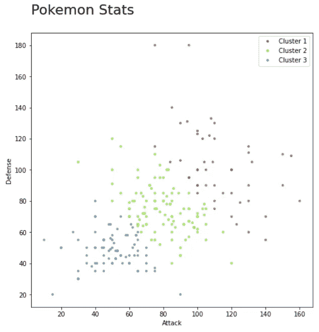

散点图—作者提供的图片

酷，现在我们可以清楚地了解这个图表是关于什么的了。

我们也可以给观众一些参考点。显示质心并画出平均值或百分位数的参考线有助于解释我们的聚类。

```
from matplotlib.lines import Line2Dfig, ax = plt.subplots(1, figsize=(8,8))
# plot data
plt.scatter(df.Attack, df.Defense, c=df.c, alpha = 0.6, s=10)
# plot centroids
plt.scatter(cen_x, cen_y, marker='^', c=colors, s=70)# plot Attack mean
plt.plot([df.Attack.mean()]*2, [0,200], color='black', lw=0.5, linestyle='--')
plt.xlim(0,200)# plot Defense mean
plt.plot([0,200], [df.Defense.mean()]*2, color='black', lw=0.5, linestyle='--')
plt.ylim(0,200)# create a list of legend elemntes
## average line
legend_elements = [Line2D([0], [0], color='black', lw=0.5, linestyle='--', label='Average')]
## markers / records
cluster_leg = [Line2D([0], [0], marker='o', color='w', label='Cluster {}'.format(i+1), 
               markerfacecolor=mcolor, markersize=5) for i, mcolor in enumerate(colors)]
## centroids
cent_leg = [Line2D([0], [0], marker='^', color='w', label='Centroid - C{}'.format(i+1), 
            markerfacecolor=mcolor, markersize=10) for i, mcolor in enumerate(colors)]
# add all elements to the same list
legend_elements.extend(cluster_leg)
legend_elements.extend(cent_leg)
# plot legend
plt.legend(handles=legend_elements, loc='upper right', ncol=2)# title and labels
plt.title('Pokemon Stats\n', loc='left', fontsize=22)
plt.xlabel('Attack')
plt.ylabel('Defense')
```

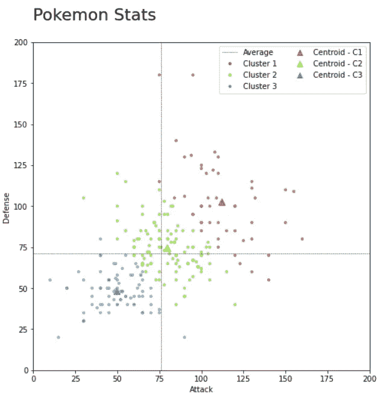

散点图—作者提供的图片

现在很容易分辨出集群是如何划分的。

红色组的攻击和防御值最高，而蓝色组最低，绿色组通常更接近平均值。

## 线

说明我们的集群工作与其结果一样重要。在 k-means 中，由于我们正在处理距离，将点连接到它们各自的质心可以帮助我们可视化算法实际在做什么。

```
fig, ax = plt.subplots(1, figsize=(8,8))
# plot data
plt.scatter(df.Attack, df.Defense, c=df.c, alpha = 0.6, s=10)
# plot centroids
plt.scatter(cen_x, cen_y, marker='^', c=colors, s=70)
# plot lines
for idx, val in df.iterrows():
    x = [val.Attack, val.cen_x,]
    y = [val.Defense, val.cen_y]
    plt.plot(x, y, c=val.c, alpha=0.2)# legend
legend_elements = [Line2D([0], [0], marker='o', color='w', label='Cluster {}'.format(i+1), 
                   markerfacecolor=mcolor, markersize=5) for i, mcolor in enumerate(colors)]
legend_elements.extend([Line2D([0], [0], marker='^', color='w', label='Centroid - C{}'.format(i+1), 
            markerfacecolor=mcolor, markersize=10) for i, mcolor in enumerate(colors)])legend_elements.extend(cent_leg)
plt.legend(handles=legend_elements, loc='upper right', ncol=2)# x and y limits
plt.xlim(0,200)
plt.ylim(0,200)# title and labels
plt.title('Pokemon Stats\n', loc='left', fontsize=22)
plt.xlabel('Attack')
plt.ylabel('Defense')
```

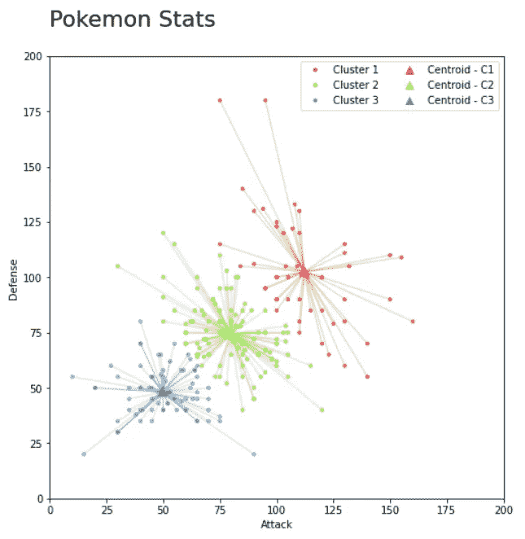

连通散点图—图片由作者提供

现在，聚类和质心之间的关系已经完全清楚了，也更容易解释算法是如何工作的。

我们还可以看到每个分类中的值是如何分布的。

例如，红色值看起来比蓝色值离其质心更远。如果组的方差对我们的分析很重要，这样的图表可能是有效的。

我们还应该注意到，绿色和蓝色之间的区别在之前的可视化中并不明显。

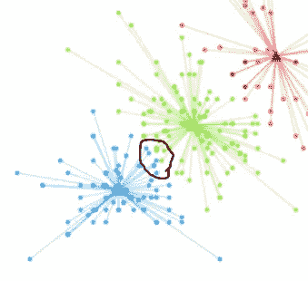

散点图—作者提供的图片

即使它们具有不同的颜色，并且连接到不同的位置，那些用黑色圈出的记录在它们之间仍然比它们自己的分类中的大多数值更相似。

这种可视化使人更难察觉到这一点，并可能给人以不同分类的值完全不同的印象。

## 凸包

另一个帮助我们可视化星团大小或分布的方法是在它周围画一个形状或一个阴影。手动这样做将花费很长时间，而且肯定不值得。

幸运的是，有一些方法可以实现自动化。

凸包是我们的数据点之间形成包围所有点的多边形的最小连接集，并且有系统地找到凸包的方法——也就是说，我们可以使用 Sklearn 来获得我们数据集的轮廓。

```
from scipy.spatial import ConvexHull
import numpy as npfig, ax = plt.subplots(1, figsize=(8,8))
# plot data
plt.scatter(df.Attack, df.Defense, c=df.c, alpha = 0.6, s=10)
# plot centers
plt.scatter(cen_x, cen_y, marker='^', c=colors, s=70)# draw enclosure
for i in df.cluster.unique():
    points = df[df.cluster == i][['Attack', 'Defense']].values
    # get convex hull
    hull = ConvexHull(points)
    # get x and y coordinates
    # repeat last point to close the polygon
    x_hull = np.append(points[hull.vertices,0],
                       points[hull.vertices,0][0])
    y_hull = np.append(points[hull.vertices,1],
                       points[hull.vertices,1][0])
    # plot shape
    plt.fill(x_hull, y_hull, alpha=0.3, c=colors[i])

plt.xlim(0,200)
plt.ylim(0,200)
```

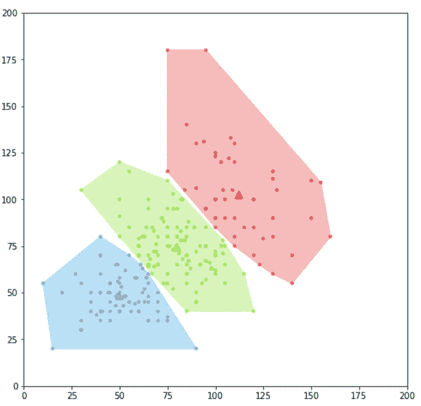

突出显示的散点图-图片由作者提供

太好了。我们甚至可以插入多边形的线条，使数据周围的形状更加平滑。

```
from scipy import interpolatefig, ax = plt.subplots(1, figsize=(8,8))
plt.scatter(df.Attack, df.Defense, c=df.c, alpha = 0.6, s=10)
plt.scatter(cen_x, cen_y, marker='^', c=colors, s=70)

for i in df.cluster.unique():
    # get the convex hull
    points = df[df.cluster == i][['Attack', 'Defense']].values
    hull = ConvexHull(points)
    x_hull = np.append(points[hull.vertices,0],
                       points[hull.vertices,0][0])
    y_hull = np.append(points[hull.vertices,1],
                       points[hull.vertices,1][0])

    # interpolate
    dist = np.sqrt((x_hull[:-1] - x_hull[1:])**2 + (y_hull[:-1] - y_hull[1:])**2)
    dist_along = np.concatenate(([0], dist.cumsum()))
    spline, u = interpolate.splprep([x_hull, y_hull], 
                                    u=dist_along, s=0, per=1)
    interp_d = np.linspace(dist_along[0], dist_along[-1], 50)
    interp_x, interp_y = interpolate.splev(interp_d, spline)
    # plot shape
    plt.fill(interp_x, interp_y, '--', c=colors[i], alpha=0.2)

plt.xlim(0,200)
plt.ylim(0,200)
```

*插值方法基于来自此[线程](https://stackoverflow.com/questions/14344099/smooth-spline-representation-of-an-arbitrary-contour-flength-x-y/18091373#18091373)的回复。
* *正如 Dragan Vidovic 在评论中指出的，我已经将参数 per=1 添加到了`splprep`函数中。

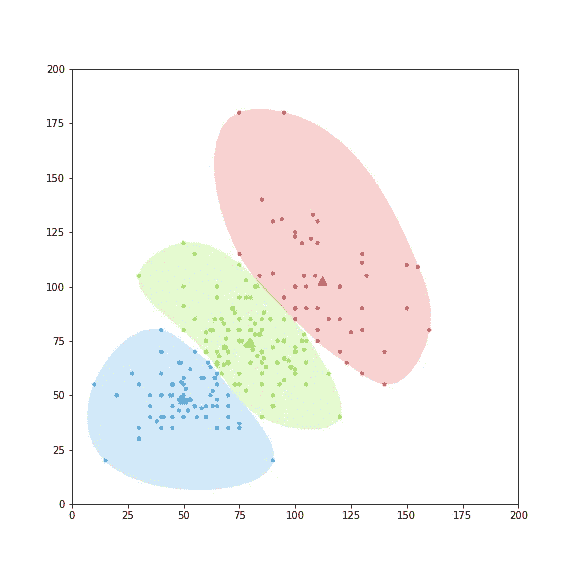

突出显示的散点图-图片由作者提供

我们不应该把这些轮廓看得太重，因为它们不是实际的测量值。但是它们仍然很好地突出了星团，所以没有观众会错过它们。

总的来说，没有简单的方法来可视化集群。每个案例都是独特的，在决定向公众展示什么之前，我们应该做大量的实验。

提到我使用的例子是干净的也很重要。我使用一个简单的数据集和两个变量进行聚类。真实情况下，不会一直是这个样子。通常，画出质心的连线会使我们的图表污染太严重，几乎无法阅读。

最好从简单的事情开始:想象变量的每一个组合，找出更有意义的或者你可以自然展示你的洞察力的变量。然后你可以尝试其他的可视化和技术来突出你的发现。

我希望你学到了一些东西，喜欢我的文章。谢谢！
[更多教程](https://linktr.ee/thiagobc23) | [酷炫玩意儿](https://thiago-bernardes-carvalho.myshopify.com/) | [推特](https://twitter.com/thiagobc231)