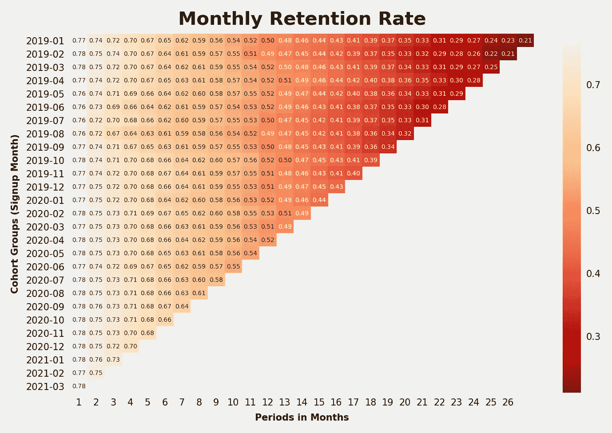
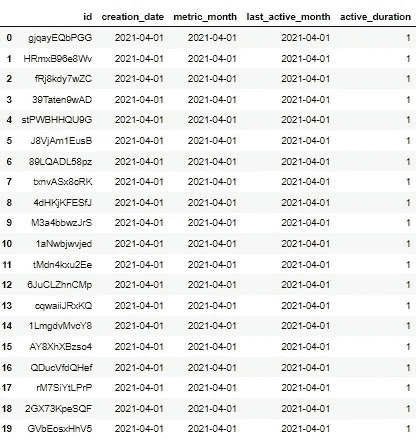
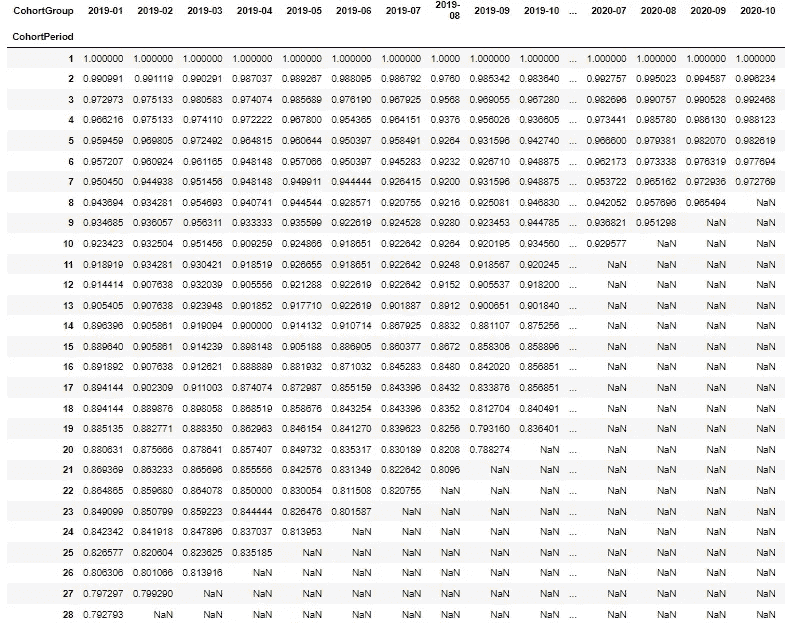
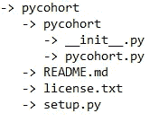

# 使用 pycohort 软件包可视化群组保持率

> 原文：<https://towardsdatascience.com/visualizing-cohort-retention-rates-with-pycohort-package-95e7f29052b3?source=collection_archive---------19----------------------->


罗伯特·卡茨基在 [Unsplash](https://unsplash.com/s/photos/rainbow?utm_source=unsplash&utm_medium=referral&utm_content=creditCopyText) 上的照片

## 关于如何在 PyPi 上创建 Python 包的教程

订阅业务的主要收入来源是定期支付。可能会有额外的一次性服务，但选择额外收费的用户数量有限，这个数字将更难预测。这就是为什么订阅业务的财务健康状况最好用留存率来衡量。如果用户对产品或服务满意，他们可能会一直呆到他们的需求改变。这就是为什么应用程序中有什么样的保留功能以及如何呈现给用户非常重要，特别是那些正在进入取消漏斗以结束重复支付周期的用户。

为了以更详细的格式快速可视化保留率，企业利用*基于时间的群组分析*。群组由在特定时间范围内注册的用户组成，该时间范围可能具有从每周到每季度的粒度。对于每个群组，在每个时间段计算保留客户的百分比，直到最近一次。

# 如何阅读基于时间的队列分析图表？

以下是基于时间的群组分析图表示例。用户根据他们的订阅开始月份被分组。每一行代表一群用户。对于每个群体，第一栏中有一个初始保留率。这是在订阅开始日期后一个月仍未离开的用户的百分比。每行的比率代表订阅旅程中给定月份的保留率。这些比率是基于某个月之后剩余的用户数量除以开始时给定群组中的所有用户数量来计算的。让我们以 2020 年 1 月注册的用户群体为例。订阅开始两个月后，75%的订阅者仍然在那里。也就是说，前两个月的流失率是 25%。由于数据拉动将于 2021 年 4 月结束，这一群体还有 16 个月的时间。16 个月后，仍有 44%的用户订阅。(*由于这是一个人工数据集，数字可能会高于真实案例的预期。*)



基于时间的队列分析

# 这个观点能概括关于保留的一切吗？

不要！该图表总结了每个群组在订阅过程中特定时期的保留率。但重要的是要记住，这些只是利率。在没有看到分子和分母的情况下，我们不应该对一家公司的未来是否处于危险之中妄下结论。可能会有新的服务增加门户网站的流量，从而增加订阅数量并增加收入，因此这是非常可取的，但费率可能会显示不同的趋势。尽管数量有所增加，但用户流失的速度可能会更快。这就是为什么这种可视化只能呈现业务的局部视图，如果单独使用可能会产生误导！

# 如何为我的公司创建类似的图表？

为了回答这个问题，我构建了一个名为 [pycohort](https://pypi.org/project/pycohort/) 的 python 包。要使用这个包，数据需要有特定的格式。否则，无法使用这些功能。首先，由用户创建的每个订阅需要有一个惟一的标识符，这个标识符需要被称为`id`。然后需要在`creation_date`字段中输入每个订阅的开始日期。`metric_month`为订阅活动的每个月添加一列。这就是为什么每活跃一个月，就会有一个新的数据点。订阅最后激活的日期需要在`last_active_month`字段中。这不一定等于取消月。如果订阅仍然有效，那么`last_active_month`将等于最近的月份。所需的最后一列是`active_duration`，它是在`creation_date`和`last_active_month`之间花费的时间。



数据帧的格式需要加载到 pycohort 函数中

在这样的数据格式中，可能会有重复。例如，对于在 2020 年 3 月创建并在 2020 年 5 月取消的订阅，将有三行:第一行的`metric_month`等于 2020 年 3 月，第二行的`metric_month`等于 2020 年 4 月，第三行的`metric_month`等于 2020 年 5 月。

在确保数据格式正确后，有 5 个函数可用来了解保留情况。前三个是计算平均值，中位数和标准差。这三个主要用于`active_duration`字段。下一个函数叫做`cohort_preprocess`。在这个函数中，上面解释的数据帧格式被转换成一个矩阵，在这个矩阵中计算每个周期中不同群组的保持率。最后一个函数`cohort_viz`将`cohort_preprocess`的输出作为输入，并打印群组分析可视化。

```
# to download the package:
!pip install pycohort# importing necessary functions from the package
from pycohort import calculate_stdev
from pycohort import calculate_mean
from pycohort import calculate_median
from pycohort import calculate_stdev
from pycohort import calculate_stdev# calculating mean
calculate_mean(df.active_duration)
>>> 13.315# calculating median
calculate_median(df.active_duration)
>>> 12# calculating standard deviation
calculate_stddev(df.active_duration)
>>> 7.256# printing the visualization
cohort_viz(cohort_preprocess(df))
```



群组预处理函数的输出

# **如何将所有功能捆绑在一个 python 包中？**

在发布这段代码之前，我创建了一个名为 pycohort 的工作目录。在那个文件夹下，有一个 readme.md，setup.py，license.txt，还有一个叫 pycohort 的文件夹。在 setup.py 下，作者需要输入与包相关的具体信息，如下所示。请注意这个包的名字不能被其他开发者使用。同样，如果你想上传一个新的版本，你需要迭代这个版本。正如你所看到的，我花了几个版本来调整代码，添加注释和提高包的效率。

```
# content of setup.py for pycohort
from setuptools import setupsetup(name='pycohort',
      version='2.6',
      description='pycohort package',
      url='[https://github.com/demirkeseny'](https://github.com/demirkeseny'),
      author='Yalim Demirkesen',
      [author_email='yalimdemirkesen@gmail.com](mailto:author_email='yalimdemirkesen@gmail.com)',
      license='MIT',
      packages=['pycohort'],
      zip_safe=False)
```

在工作目录的 pycohort 文件夹下有两个文件。__init__。py，它通知用户如何导入包，还有 pycohort.py，上面提到的所有函数都存储在这里。

```
# content of  __init__.py for pycohort
from .pycohort import calculate_mean
from .pycohort import calculate_stdev
from .pycohort import calculate_median
from .pycohort import cohort_preprocess
from .pycohort import cohort_viz
```

最终的文件布局如下所示:



# 这些文件需要上传到哪里以及如何上传？

下一步是上传我们的文件，以便其他人可以安装它们。我们将上传我们的包的站点叫做 [PyPi](https://pypi.org/manage/projects/) 。当你通常使用`pip install`下载任何 python 包时，你从 PyPi 中拉出文件夹。最佳实践是首先尝试将您的包上传到 [test PyPi](https://test.pypi.org/) 中，这是 PyPi 的一个测试库。如果顺利的话，我们可以把所有东西上传到 PyPi。为了上传我们的文件，我们需要在 test PyPi 和 PyPi 上创建一个帐户。

一旦每个文件都准备好了，帐户也创建好了，我们需要使用`cd`命令导航到 pycohort 所在的工作目录。然后我们需要运行`python setup.py sdist`。这个命令将向我们的存储库添加两个额外的文件，这样我们的包就可以上传到 PyPi，也可以从 PyPi 下载。接下来，我们需要下载`twine`包，将我们的文件推送到 PyPi 存储库。然后我们可以上传我们的包来测试 PyPi，并尝试从测试存储库中下载它。如果上传到测试 PyPi 时没有问题，我们可以转移到常规的 PyPi。您可以在下面找到所有必要的代码:

```
# navigate to pycohort working directory:
cd pycohort# download the necessary files to upload your package:
python setup.py sdist# install twine package:
pip install twine# upload package to test PyPi:
twine upload --repository-url https://test.pypi.org/legacy/ dist/*# install from test PyPi:
pip install --index-url https://test.pypi.org/simple/ pycohort# upload package to PyPi:
twine upload dist/*# install from test PyPi:
pip install pycohort
```

# 结论

如果您想要直观显示不同群组的保留趋势，这种基于时间的群组分析是一个完美的选择。一旦你的数据是上面解释的格式，那么使用 pycohort 包就更容易了。

在对这张图表做出任何决定之前，请记住，这种可视化是基于没有反映分子或分母突然变化的比率。

请点击这里找到 Github repo [，点击这里](https://github.com/demirkeseny/pycohort)找到 PyPi 链接[，获得关于软件包和功能的更详细的视图。](https://pypi.org/project/pycohort/)

特别感谢 Gunsu 阿尔丁达格所有的灵感！