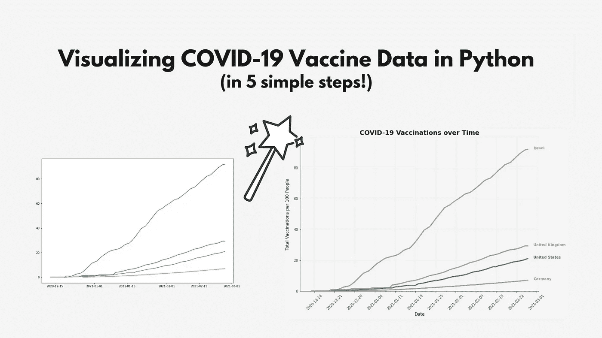

# 用 Python 可视化新冠肺炎疫苗数据(5 个简单步骤)

> 原文：<https://towardsdatascience.com/visualizing-covid-19-vaccine-data-in-python-in-5-simple-steps-51bf5ab619c9?source=collection_archive---------17----------------------->

## 让您的 MatPlotlib 图形脱颖而出

让你的 Matplotlib 可视化更加漂亮！资料来源:Nik Piepenbreier

Matplotlib 是 Python 中最常用的数据可视化库之一。然而，它的默认设置会导致单调乏味的图形。本快速教程将指导您使用一些技巧和窍门来设计更漂亮的 Matplotlib 图。

# 你会做什么！

我们将从[我们的数据世界](https://ourworldindata.org)中获取一些新冠肺炎疫苗数据，并用它将我们最初的、枯燥的 Matplotlib 可视化变成更漂亮的东西。

你的开始和结束。资料来源:Nik Piepenbreier

# 我们开始吧！

我们将从加载所需的库开始。不要被长长的导入列表吓倒——在整个教程中，我将逐一介绍每个导入的细节:

如果你在 Jupyter 笔记本上跟随，确保包含`%matplotlib inline` Jupyter magic，让你的图表在线显示。

## 加载我们的数据帧

我们将使用 Pandas 的`.read_csv()`方法加载我们的数据帧。好的一面是，随着数据的更新，您的绘图将通过简单的重新运行进行更新。

让我们看看我们在这里做了什么:

在**步骤 1** 中，我们加载数据，让 Pandas 知道只加载列的子集(`date`、`location`、`total_vaccinations_per_hundred`)，并将`date`作为日期时间值读取。

*   我们还创建了一个包含不同国家的列表。如果您希望您的可视化显示其他国家，只需确保它们与数据框中的可用内容相匹配。

> 提示:您可以通过使用 print(df['location']找到 location 中使用的国家名称。唯一())

然后，我们过滤数据框架，只包括这些国家，这样我们的可视化就不会被太多的国家弄乱。

## 汇总数据

在**步骤 2** 中，我们使用一个简单的数据透视表汇总数据。如果你想了解熊猫的数据透视表，点击这里查看我的 YouTube 视频。

*   最后，我们填充缺失的值。不幸的是，数据中分散着一些缺失值。我们使用`method='ffill'`参数向前填充任何丢失的值以获得最佳估计。

# 创造我们的视觉化

让我们开始创建我们的可视化！这有点复杂，但我会一步一步地教你:

在**步骤 3** 中，我们设置了一些辅助变量。我们想突出我们的`main_country`，在这个例子中是美国。如果您想突出显示另一个国家，只需用另一个国家(您已经在步骤 1 中过滤到数据框中)替换掉该字符串。

然后，我们使用两种字典理解将所有国家指定为灰色，透明度为 0.75，除了`main_country`，它被指定为深青色，没有透明度。要了解更多关于字典理解和它们是如何工作的，请查看这个教程。

在**步骤 4** 中，我们做了很多，所以让我们来分解一下！

*   我们举例说明一个图形和一个大小为 12x8 的轴
*   然后，我们循环遍历 countries 变量中的每个国家，分别绘制每条线。我们使用指数(我们的日期)作为 x 值，使用接种疫苗的人口比例作为 y 值。我们从步骤 3 中创建的字典中提取颜色和透明度。
*   然后，我们将文本添加到我们的绘图中，以直接在线上显示国家的标签。我们使用`timedelta`函数将索引的最后一个值增加 2 天，以在行尾和文本开始处之间创建一点缓冲。
*   我们可以使用`.max()`值来表示每个国家的值，因为这个比例只会越来越大。
*   最后，我们传入国家的名称作为要使用的字符串，并使用字典传入颜色和透明度，就像我们传入行本身一样。

**第 5 步**也有点复杂，所以我把它分成了几个子步骤。

*   对我来说，A 部分是最复杂的。我们使用`DateFormatter`将日期格式化为 YYYY-MM-DD 格式。然后我们使用`.set_major_locator()`告诉 Matplotlib 使用什么作为刻度标记，传入`WeekdayLocator`作为参数，表示我们希望使用第一个工作日作为刻度。然后，我们将标签旋转 45 度，并将 y 轴限制在 0 到 100 之间。
*   在**B 部分**中，我们移除了顶部和右侧的脊线，并降低了左侧和底部脊线的对比度。我们还添加了一个微妙的网格。
*   在**C 部分**中，我们添加了描述性轴标签和标题。
*   最后，我们在**d 部分**展示剧情

运行此代码会返回以下视觉效果:

我们最后的视觉化。图片作者:Nik Piepenbreier

# 结论

在这篇文章中，我们学习了如何使用新冠肺炎数据集生成漂亮的数据可视化。我们可以利用 Python 的强大功能，根据今天的数据自动更新我们的图表。

如果你想了解更多关于 Matplotlib 的内容，可以查看我在 YouTube 上不断增加的播放列表:

如果你想订阅我的频道，请点击下面的按钮！

点击此处订阅(图片由 stickpng.com 提供)