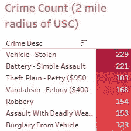

# 想象洛杉矶的犯罪

> 原文：<https://towardsdatascience.com/visualizing-crime-in-los-angeles-14db37572909?source=collection_archive---------33----------------------->

## 影响犯罪的因素有哪些？一天中的什么时候？星期几？

洛杉矶是全球特大城市之一。这个大都市每年都吸引成千上万像我一样的学生。2021 年 8 月，我将搬到洛杉矶，在南加州大学(USC)学习数据科学。自从我做出决定后，朋友、家人和其他洛杉矶人一再提醒我，这个地区可能不是最安全的。因此，我决定在 2021 年期间对洛杉矶的犯罪本质进行一次知情的调查，以确保我在这座城市的这段时间里做出明智的、由数据驱动的决定。

让我印象深刻的一件事是，LAPD 提供的犯罪数据在埃里克·加希提市长的网站上随时可供公众使用。即使在当今开放的数据世界中，这也是相对罕见的。无论如何，让我们深入这个庞大的数据集，收集一些重要的见解。

在探索和清理数据以进行适当的分析后，我想看看这个城市中最常见的犯罪类型。

[https://public . tableau . com/views/Los _ Angeles _ Crime _ Viz/common _ Crime _ types？:language = en-US&:retry = yes&:display _ count = n&:origin = viz _ share _ link](https://public.tableau.com/views/Los_Angeles_Crime_Viz/common_crime_types?:language=en-US&:retry=yes&:display_count=n&:origin=viz_share_link)

2021 年，截至 6 月，洛杉矶市记录了超过 79，000 起犯罪案件。“偷车”占所有犯罪的 11%以上，高居榜首。“自行车失窃”占所有犯罪的 1%。作为一名学生，我很可能每天骑自行车去大学，因此看到如此高的自行车被盗数量令人震惊。

好了，我们现在知道了什么类型的犯罪比其他类型的犯罪发生得更频繁，但是这些犯罪是什么时候发生的呢？他们是遵循特定的时间模式，还是一周中的某一天比其他时间承担更多的案件？

[https://public . tableau . com/views/Los _ Angeles _ Crime _ Viz/Crime _ count _ by _ day？:language = en-US&:retry = yes&:display _ count = n&:origin = viz _ share _ link](https://public.tableau.com/views/Los_Angeles_Crime_Viz/crime_count_by_day?:language=en-US&:retry=yes&:display_count=n&:origin=viz_share_link)

上面的树形图给了我们一些相当有用的见解:周末很麻烦！周五累积了全年最多的犯罪案件，随着新一周的开始，案件数量减少了近 1500 起。周五的高峰很可能是由于周末的到来，更多的人外出社交和聚会，导致深夜外出，这是犯罪发生的最大可能。就洛杉矶的犯罪而言，周二和周三是最平静的。

一天中的时间在犯罪中也起着重要的作用。我在下面绘制了一张图表，其中我们以 24H 格式显示了一天中的时间与犯罪数量的关系。

[https://public . tableau . com/views/Los _ Angeles _ Crime _ Viz/Crime _ count _ line？:language = en-US&:retry = yes&:display _ count = n&:origin = viz _ share _ link](https://public.tableau.com/views/Los_Angeles_Crime_Viz/crime_count_line?:language=en-US&:retry=yes&:display_count=n&:origin=viz_share_link)

凌晨 5 点左右，当城市的大部分人都在睡觉时，犯罪率就下降了。这是非常期待的。我还预计在傍晚 6 点左右会出现一个高峰，这时人们下班回家或者出去享受夜晚。令我惊讶的是，中午的时候几乎达到了峰值。看看在这几个小时里会发生什么类型的犯罪会很有趣。我预测这些犯罪属于“软性”类型，包括毒品违法、盗窃和财产犯罪。

[https://public . tableau . com/views/Los _ Angeles _ Crime _ Viz/common _ Crime _ hour？:language = en-US&:retry = yes&:display _ count = n&:origin = viz _ share _ link](https://public.tableau.com/views/Los_Angeles_Crime_Viz/common_crime_hour?:language=en-US&:retry=yes&:display_count=n&:origin=viz_share_link)

正如我所预测的，左上方的表格清楚地告诉我们，财产犯罪和入室盗窃是最常见的犯罪类型，在中午我们会看到每天的高峰。

尽管这些犯罪是频繁和令人不安的，但由于犯罪的性质，这仍然是一个相对安全的外出时间。然而，如果与一天中晚些时候(大约晚上 7 点)的类似高峰相比，情况就不同了。

[https://public . tableau . com/views/Los _ Angeles _ Crime _ Viz/common _ Crime _ hour？:language = en-US&:retry = yes&:display _ count = n&:origin = viz _ share _ link](https://public.tableau.com/views/Los_Angeles_Crime_Viz/common_crime_hour?:language=en-US&:retry=yes&:display_count=n&:origin=viz_share_link)

随着太阳落山，攻击性犯罪的数量显著上升。致命袭击上升到令人震惊的 294 起，而对伴侣的袭击也在增加。“软”犯罪也有所上升，被盗车辆数量几乎是中午的两倍。

虽然这提供了关于一天中什么时间更安全的有价值的见解，但我仍然不完全满意。这里还需要考虑其他因素，比如犯罪率高的地区。更重要的是，我想知道犯罪在南加州大学大学公园校区的分布情况，在接下来的两年里，我将在这里度过大部分时间。首先，我绘制了周边地区的犯罪分布图。该数据集通过地理坐标提供犯罪现场位置，这使得在 Tableau 中绘图变得简单。

[https://public . tableau . com/views/Los _ Angeles _ Crime _ Viz/map _ Viz _ Crime _ dist？:language = en-US&:retry = yes&:display _ count = n&:origin = viz _ share _ link](https://public.tableau.com/views/Los_Angeles_Crime_Viz/map_viz_crime_dist?:language=en-US&:retry=yes&:display_count=n&:origin=viz_share_link)

标记的不透明度描绘了彼此靠近的单个犯罪地点，因此形成了该区域中犯罪数据点的聚类。哪里的标记暗，哪里就有频繁的犯罪麻烦。校园东侧的 Figueroa 街有多个集群，表明那里的犯罪率较高。我是一个狂热的跑步者，我们获得的时间和地点信息帮助我计算出合适的跑步时间和潜在的安全跑步路线！让我们继续探索。南加州大学地区的犯罪类型呢？

[https://public . tableau . com/views/Los _ Angeles _ Crime _ Viz/Crime _ count _ USC？:language = en-US&:retry = yes&:display _ count = n&:origin = viz _ share _ link](https://public.tableau.com/views/Los_Angeles_Crime_Viz/crime_count_usc?:language=en-US&:retry=yes&:display_count=n&:origin=viz_share_link)

“车辆被盗”仍然是最常见的犯罪类型，该地区似乎有很多破坏和盗窃行为。《致命武器袭击》进入了前 7 名，不过我想看看它在“高峰”犯罪时段，即正午和黄昏的表现。

当“一天中的某个小时”过滤器应用于上表时，“致命武器袭击”在中午和晚上 7 点没有进入前 7 名。这让人放心，那么什么时候十恶不赦的犯罪最常见呢？

[https://public . tableau . com/views/Los _ Angeles _ Crime _ Viz/attack _ Crime？:language = en-US&:display _ count = n&:origin = viz _ share _ link](https://public.tableau.com/views/Los_Angeles_Crime_Viz/assault_crime?:language=en-US&:display_count=n&:origin=viz_share_link)

袭击犯罪在下午 4 点左右上升，在晚上 8 点和 11 点再次上升。在《安全》杂志的一篇报道中，攻击性犯罪在美国最有可能发生在晚上，我的情节也证实了这一点。同样，这个情节令人放心，并且帮助本文的读者在计划他们的一天时做出数据驱动的决定，如果他们碰巧住在洛杉矶地区的话。

继续前进，随着洛杉矶成为不同文化和种族的大熔炉，我想看看某些人群是否比其他人更容易成为犯罪的受害者。

[https://public . tableau . com/app/profile/abhinav . Rao/Viz/Los _ Angeles _ Crime _ Viz/Crime _ by _ race](https://public.tableau.com/app/profile/abhinav.rao/viz/Los_Angeles_Crime_Viz/crime_by_race)

上述种族和受害者血统类别由 LAPD 在数据集中定义，并按原样转载。西班牙裔/拉丁裔/墨西哥裔人在这个城市的犯罪率最高，其次是白人和黑人。其他亚洲人排名第四。看了看洛杉矶的[人口多样性数据](https://datausa.io/profile/geo/los-angeles-ca#demographics)，这些数字提供了一个可能的原因。49%的洛杉矶人口被归类为“西班牙裔/拉丁裔/墨西哥裔”。利用概率，人们可以确定人口分布是这两个种族在城市犯罪受害者排行榜上名列前茅的原因。(免责声明:由于缺乏可量化的数据，我在本文中没有考虑种族偏见等影响犯罪的因素。)

该市受害者的平均年龄为 29.82 岁，这表明相对年轻的人容易犯罪。为什么不看看按性别划分的犯罪数量呢？

[https://public . tableau . com/app/profile/abhinav . Rao/Viz/Los _ Angeles _ Crime _ Viz/Crime _ by _ gender](https://public.tableau.com/app/profile/abhinav.rao/viz/Los_Angeles_Crime_Viz/crime_by_gender)

该数据集按男性/女性/未知进行性别分类，因此不可能进行其他性别鉴定。尽管洛杉矶县的男女比例较高，但我们仍然看到更多的男性成为犯罪的受害者。根据 M E Lewyn 在《圣地亚哥司法杂志》上发表的一篇[文章](https://www.ojp.gov/ncjrs/virtual-library/abstracts/men-women-and-crime)，男性更有可能成为暴力犯罪的受害者。在我们的例子中，我们已经通过上面的饼状图证明了这一点。

尽管南加州大学附近地区因“不安全”而闻名，尽管有数据支持这一说法，但对 LAPD 提供的数据集的进一步分析和研究得出的结论是，在一天中的特定时间，发生的犯罪比其他时间更严重。此外，随着周末的临近，与平日相比，更有可能发生犯罪。我们还知道南加州大学周围的哪些街道相对来说比其他街道更安全，以及哪些街道可以在“高峰”犯罪时段避开。虽然我周围的人对这个地方的担忧在一定程度上是合理的，但任何读过这篇文章的人都可以获得一些重要的见解，这些见解将使他们能够在日常生活中做出数据驱动的决策。只要负责任地去做，洛杉矶有很多值得享受和体验的东西。我期待着今年秋天和以后去体验加州的美丽！

免责声明:

1.  上述文章中表达的所有观点都基于 LAPD 提供的数据集。
2.  在发布时，Medium 不支持 Tableau 可视化的嵌入，因此我在标题中提供了原始可视化的 URL，读者可以应用更多的过滤器来查看他们喜欢的数据。