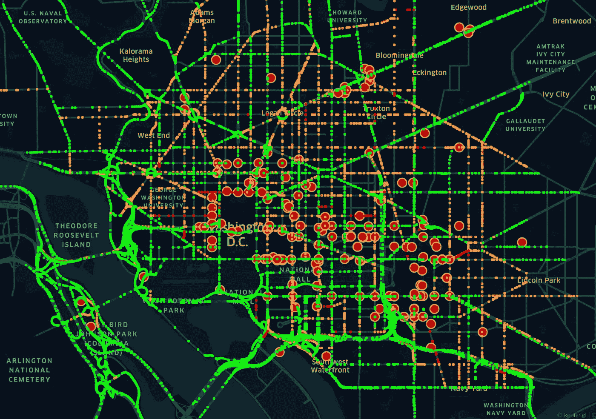
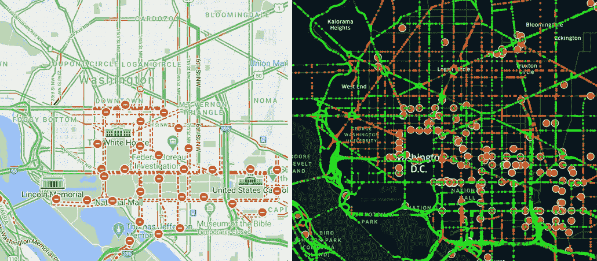

# 骚乱后宵禁期间 DC 实时交通可视化

> 原文：<https://towardsdatascience.com/visualizing-dc-real-time-traffic-during-the-curfew-after-riots-2007cc6838f6?source=collection_archive---------35----------------------->

## 流动性是城市的生命线。让我们用这里的交通流量/事故 API 来想象一下今天发生不幸的混乱之后，宵禁期间的 DC。



DC 的交通流量和事故。在 [Kepler.gl](https://kepler.gl/demo) |塞犍陀·维韦克创建的图表

不幸的是，今天的骚乱导致了混乱和生命损失。许多数据提供商免费提供实时详细信息，这对于应急人员和市民应对我们今天看到的突发事件非常有用。让我们深入研究一下使用这样一个 API 量化实时事件和流量数据的潜力。

谷歌地图在计算走哪条路线可以最大限度地减少旅行时间方面非常有用。然而，对于数据爱好者来说，它并不提供这些交通信息。TomTom，Waze，这里都是实时交通信息的提供者。就个人而言，我觉得这里最容易使用，它的免费 API 对于获取详细的交通信息非常有用，比如速度和事故。在之前的博客中，我讲述了如何使用 HERE traffic flow API 提取单个路段的交通速度:

</visualizing-real-time-traffic-patterns-using-here-traffic-api-5f61528d563>  

在这里，我将说明如何提取交通事故数据，并将这里的速度/事故与谷歌地图的图像进行比较。

```
%matplotlib inline
import numpy as np
import requests
from bs4 import BeautifulSoup
import xml.etree.ElementTree as ET
from xml.etree.ElementTree import XML, fromstring, tostringpage = requests.get('[https://traffic.api.here.com/traffic/6.2/incidents.xml?app_id=BLAH&app_code=BLAH2&bbox=38.92,-77.06;38.88,-77.00&responseattributes=sh,fc'](https://traffic.api.here.com/traffic/6.2/incidents.xml?app_id=EuBWKTOquw60Mdj8U9Tu&app_code=aEJDOiovLnfYhC6jcT_pkA&bbox=38.92,-77.06;38.88,-77.00&responseattributes=sh,fc'))
soup = BeautifulSoup(page.text, "lxml")incidents = soup.find_all('traffic_item')
```

您可以在这里注册以获得一个应用程序 id 以及证书的应用程序代码(以上示例中的 BLAH、BLAH2)。接下来，您需要一个边界框来获取流量/事件。为此，在谷歌地图上，你会看到纬度-经度对。您需要左上角和右下角的按钮来获取边界框的坐标。响应属性 fc 和 sh 非常重要，稍后可用于过滤高速公路、街道等。，但我不会在这篇文章中使用这些信息。最后一行给出了当时所有独特的事件。

```
myxml = fromstring(str(incidents[0]))
for child in myxml:
 print(child.tag)traffic_item_id
original_traffic_item_id
traffic_item_status_short_desc
traffic_item_type_desc
start_time
end_time
entry_time
criticality
verified
abbreviation
rds-tmc_locations
location
traffic_item_detail
traffic_item_description
traffic_item_description
traffic_item_description
```

查看第一个事件，有 16 个标签包含有用的事件信息，如事件开始和结束的时间、描述和位置。目前，我只对事件发生的地点感兴趣。事实证明，这并不像交通速度那样简单。但是稍微调查了一下，我发现它隐藏在位置标签中。

```
myxml = fromstring(str(incidents[0]))
for child in myxml:
 if (child.tag==’location’):
 for chelds in child:
 print(chelds.tag,chelds.attrib)intersection
geoloc
political_boundary
navtech
length
```

最后，我发现了隐藏在地理标签中的事件的来龙去脉:

```
incidents[0].location.geoloc<geoloc><origin><latitude>38.88507</latitude><longitude>-77.01081</longitude></origin><to><latitude>38.88602</latitude><longitude>-77.01051</longitude></to><geometry><shapes><shp fc="5" fw="SD" le="0.042374034341961575" lid="1186813844F">38.88507,-77.01081 38.88544,-77.01069</shp><shp fc="5" fw="SD" le="0.06625476521319096" lid="1254739814F">38.88544,-77.01069 38.88602,-77.01051</shp></shapes></geometry></geoloc>
```

您还可以查看存在哪些类型的事件。在 2021 年 6 月 1 日晚上 9 点左右，DC 总共发生了 173 起事故。所有这些都被描述为道路封闭或有计划的活动。以下是前 10 个。*注意:这里的时间显然不是美国东部时间。可能是格林威治时间，虽然我现在还不确定。*

```
for inc in incidents:
 print(inc.start_time.text, inc.end_time.text,inc.traffic_item_type_desc.text)12/15/2020 15:46:16 02/15/2023 17:00:00 ROAD_CLOSURE
01/06/2021 21:46:56 01/07/2021 21:45:44 ROAD_CLOSURE
01/06/2021 22:52:32 01/07/2021 22:52:07 ROAD_CLOSURE
12/15/2020 15:46:16 02/15/2023 17:00:00 ROAD_CLOSURE
01/06/2021 21:46:56 01/07/2021 21:45:44 ROAD_CLOSURE
12/15/2020 15:46:16 02/15/2023 17:00:00 ROAD_CLOSURE
01/06/2021 23:04:11 01/07/2021 23:01:47 ROAD_CLOSURE
12/15/2020 15:46:16 02/15/2023 17:00:00 ROAD_CLOSURE
12/15/2020 15:46:16 02/15/2023 17:00:00 ROAD_CLOSURE
01/06/2021 23:04:11 01/07/2021 23:01:47 ROAD_CLOSURE
```

最后，这里是 here 交通速度/事件与谷歌地图承诺的视觉对比:



左边是谷歌地图，右边是华盛顿 DC |塞犍陀·维韦克的数据

有一些有趣的区别。这里有更多的事件和更多的速度数据在一些较小的路段。否则，在没有谷歌地图数据的情况下，很难直观地识别速度有多相似/不同。还有，我不确定谷歌地图是如何通过颜色来识别自己的速度的。谷歌地图有 4 种颜色，从慢到快(暗红色、红色、黄色、绿色)。我在这里制作了一个类似的彩色地图，其中道路颜色根据相对于速度限制的速度进行分段:0-0.25，0.25-0.5，0.5-0.75，0.75-1(0 对应于平均速度为 0 英里/小时，1 代表速度限制)。

这里有一个获取实时信息的绝佳资源，你无法从谷歌地图上获得。此外，这里似乎有更详细的小路段交通信息，他们声称是世界第一的定位平台，相当大胆的说法。唯一的缺点是他们没有可用的历史交通数据——但希望这是未来的选择。

正如我们今天所看到的，有时一群人会以以前不可想象的方式集体行动，并造成巨大的伤害。当这种情况发生时，我们需要对不断演变的地貌有一个准确的了解。今天的事件表明，DC 政府对抗议的规模和国会大厦被渗透的突然性毫无准备。

与其他实时数据源集成的实时交通数据，包括社交媒体消息，如推文；作为社会的脉搏。这些数据提供了强大的、可操作的信息，执法部门、应急响应人员甚至市民等城市利益相关者可以利用这些信息来正确评估情况的严重性，并在时间至关重要的情况下做出关键决策。

如果你喜欢这篇文章，请关注我——我经常在复杂系统、物理学、数据科学和社会的界面上写作