# 用 Pybaobabdt 可视化决策树

> 原文：<https://towardsdatascience.com/visualizing-decision-trees-with-pybaobabdt-f8eb5b3d0d17?source=collection_archive---------9----------------------->

## [实践教程](https://towardsdatascience.com/tagged/hands-on-tutorials)

## 一个用于决策树可视化和模型解释的开源包

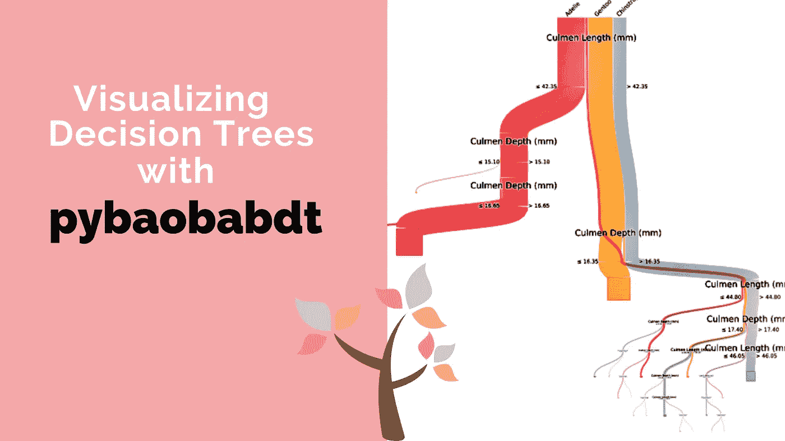

> *数据可视化是决策的语言。好的图表有效地传达信息。伟大的图表使决策成为可能，提供信息，并改善决策:* ***但丁·维塔利亚诺***

决策树可以以多种方式可视化。以**缩进节点**为例，其中每个内部节点和叶节点都被描述为文本，而父子关系是通过相对于父节点缩进子节点来显示的。

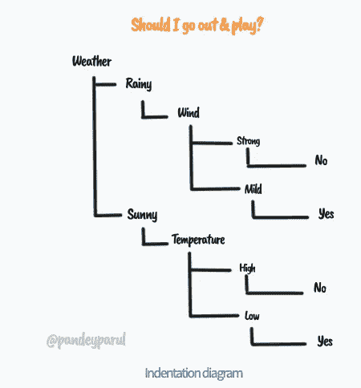

缩进图|作者图片

然后是**节点-链路图。**这是可视化决策树最常用的方法之一，决策树中的节点通过字形表示，父节点和子节点通过链接连接。

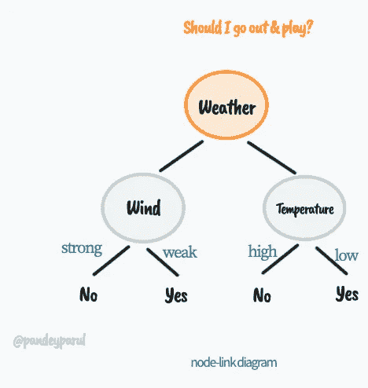

节点链接图|作者图片

**冰柱**图**图**是同样的另一个选项。除了显示关系，这些图还有助于描述节点大小。他们的名字来源于这样一个事实，即最终的可视化看起来像冰柱。

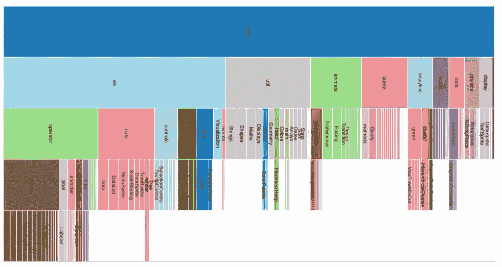

由 https://www . cs . middlebury . edu/~ can drews/showcase/infovis _ techniques _ s16/icicle _ plots/icicle plots . html| CC-经许可

虽然这些技术很有帮助，但是它们不能很好地扩展，尤其是当数据量增加时。在这种情况下，不仅可视化数据变得困难，而且解释和理解树也是一个挑战。 **BaobabView** 是一个为解决这类问题而创建的库，在本文中，我们将通过例子详细介绍它的 python 实现 **pybaobabdt** 。

# 绘制决策树的几个软件包

我们通过讨论可视化决策树的多种方式开始了这篇文章。查看各种帮助绘制决策树的库也是值得的。

## 资料组

这里我们将使用[帕尔默企鹅](https://allisonhorst.github.io/palmerpenguins/articles/intro.html)数据集作为公共数据集。这是一个众所周知的数据集，通常是 iris 数据集的替代物，目标是根据给定的特征预测**企鹅种类**。

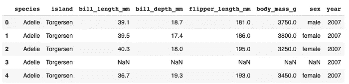

数据集|图像的前五行(按作者)

## `1\. Visualization using [sklearn.tree](https://scikit-learn.org/stable/modules/classes.html#module-sklearn.tree)`。绘图树

这是默认的方式，也是最常用的方法。它是 scikit-learn 的默认选项。

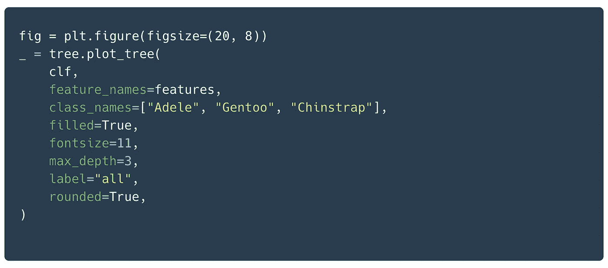

`Visualization using [sklearn.tree](https://scikit-learn.org/stable/modules/classes.html#module-sklearn.tree)`。plot_tree |作者图片

在这个例子中，树的`max_depth`被限制为 3。

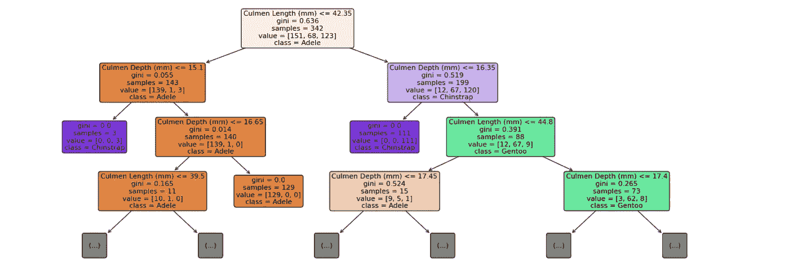

`Visualization using [sklearn.tree](https://scikit-learn.org/stable/modules/classes.html#module-sklearn.tree)`。plot_tree |作者图片

## 2.`Visualization using` 达特里维兹

[dtreeviz](https://github.com/parrt/dtreeviz) 库提供了更好的外观和直观的可视化，同时提供了更好的可解释性选项。图书馆的灵感来源于[*r2d 3*](http://www.r2d3.us/)*的*教育动画；* [*机器学习视觉入门*](http://www.r2d3.us/visual-intro-to-machine-learning-part-1/) *。**

**链接到文章** : [用 dtreeviz 库可视化决策树的更好方法](/a-better-way-to-visualize-decision-trees-with-the-dtreeviz-library-758994cdf05e)

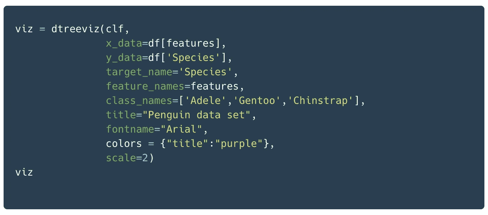

`Visualization using` dtreeviz |作者图片

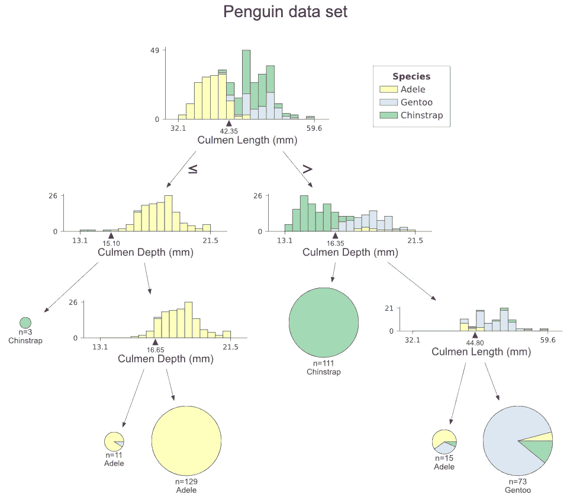

`Visualization using` 作者图片

## 3.张量流决策森林

TensorFlow 决策森林是为训练、服务、推理和解释这些决策森林模型而创建的库。它为基于树的模型和神经网络提供了统一的 API。TensorFlow 决策森林具有内置的交互式绘图方法来绘制和帮助理解树结构。

**链接到文章** : [回顾 TensorFlow 决策森林库](/reviewing-the-tensorflow-decision-forests-library-1ecf50ae00c3)

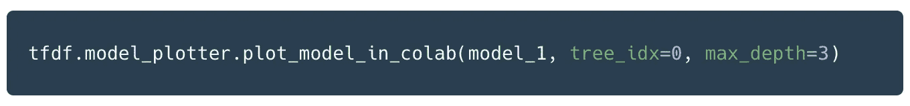

`Visualization using` 张量流决策森林(TF-DF) |图片由作者提供

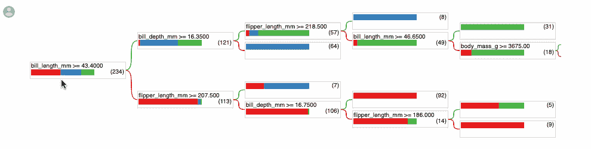

张量流决策森林(TF-DF) |图片由作者提供

# 镇上的新成员

一篇名为 [**猴面包树视图:决策树的交互式构建和分析**](https://ieeexplore.ieee.org/document/6102453) 的论文展示了一种可视化决策树的独特技术。这种技术不仅可扩展，而且使专家能够将他们的领域知识注入到决策树的构造中。该方法被称为 **BaobabView** 和依赖于可视化、交互和算法支持这三个关键方面。

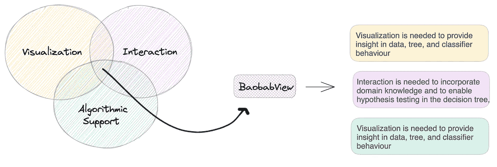

BaobabView 的三个关键方面:可视化、交互和算法支持|作者图片

以下是这篇论文的摘录，具体强调了这一点:

> 我们认为我们的工具提供了一个可视化分析方法的双重例子。我们展示了如何使用交互和可视化来增强机器学习方法；我们还展示了人工构建和分析是如何得到算法和自动化支持的。

## 名字里有什么？

你想知道这个奇怪的名字吗？这个词源于 ***非洲猴面包树*** 或 [**非洲猴面包树**](https://en.wikipedia.org/wiki/Adansonia_digitata) ，因为它与树的结构惊人地相似。


[荷兰阿纳姆的费迪南·勒乌斯](https://commons.wikimedia.org/wiki/File:Baobab_and_elephant,_Tanzania.jpg)， [CC BY-SA 2.0](https://creativecommons.org/licenses/by-sa/2.0) ，通过维基共享

pybaobabdt 包是 BaobabView 的 python 实现。现在让我们从这个库的安装开始，稍微深入一点这个库的细节。

## 装置

该软件包可以按如下方式安装:

```
pip install pybaobabdt
```

但是，需要满足一些要求:

*   Python 版本≥ 3.6
*   [PyGraphviz](https://pygraphviz.github.io/)
*   还应该安装像 sklearn、numpy、pygraphviz、matplotlib、scipy、pandas 这样的流行 python 包。

我在安装`pygraphviz`的时候经历了几次打嗝。如果您面临同样的问题，请参考随附的代码笔记本。

<https://github.com/parulnith/Data-Science-Articles/tree/main/Visualizing%20decision%20trees%20with%20Pybaobabdt>  

## Pybaobabdt 在行动

我们将继续我们的企鹅数据集，并建立一个决策树，根据给定的特征预测**企鹅物种**。

```
from sklearn.tree import DecisionTreeClassifier
y = list(df['Species'])
features = list(df.columns)
target = df['Species']
features.remove('Species')
X = df.loc[:, features]clf = DecisionTreeClassifier().fit(X,y)
```

上面的代码初始化并训练一个分类树。一旦完成，下一个任务就是使用`pybaobabdt`包来可视化树，这只需要一行代码就可以完成。

```
ax = pybaobabdt.drawTree(clf, size=10, dpi=300, features=features, ratio=0.8,colormap='Set1')
```

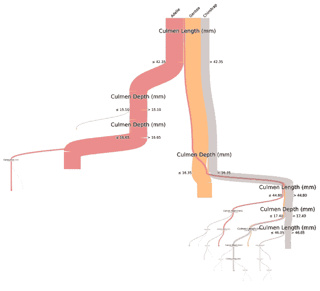

使用 Pybaobabdt 软件包可视化决策树分类器|图片由作者提供

这就对了。你有一个决策树分类器，每一类物种用不同的颜色表示。在随机森林的情况下，也可以可视化单个的树。然后，这些树可以保存为更高分辨率的图像，以便进行深入检查。

# 自定义

pybaobabdt 库也提供了许多定制。我将在这里展示其中的一些:

## 彩色地图

pybaobabdt 支持所有 matplotlib [颜色映射](https://matplotlib.org/stable/tutorials/colors/colormaps.html)。我们已经看到了`Set1`色图的样子，但是你可以从许多不同的选项中选择。以下是它们在使用时出现的次数:

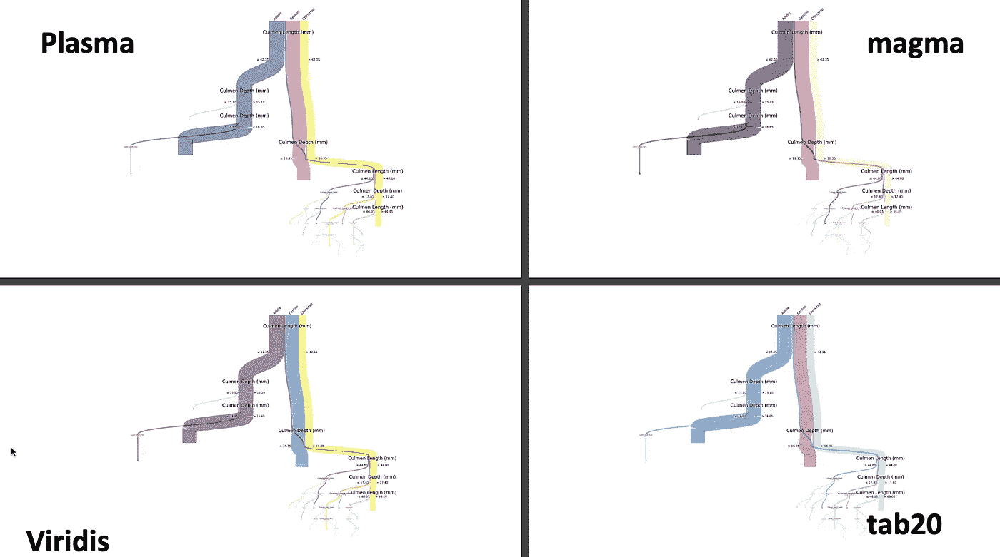

使用 Pybaoabdt 和不同的颜色图进行决策树可视化|图片由作者提供

但是您并不局限于可用的色彩映射表。你甚至可以自己定义一个。假设我们只想突出显示数据集中的一个特定类，而将所有其他类置于背景中。我们可以这样做:

```
from matplotlib.colors import ListedColormapcolors = ["green", "gray", "gray"]
colorMap = ListedColormap(colors)ax = pybaobabdt.drawTree(clf, size=10, features=features, ratio=0.8,colormap=colorMap)
```

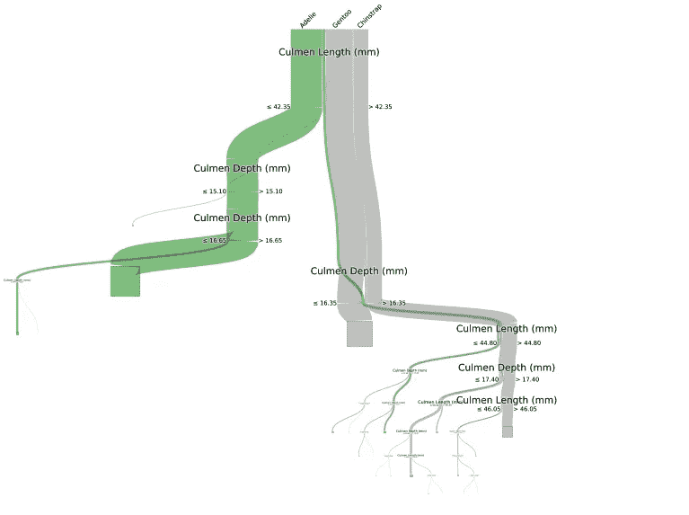

仅突出显示决策树中的特定类别|作者图片

## 比例

比率选项用于设置树的比率，默认值为 1。下面是这两个比率的比较，以及它们在屏幕上的显示方式。

```
ax = pybaobabdt.drawTree(clf, size=10, dpi=300, features=features, ratio=0.5,colormap='viridis')
```

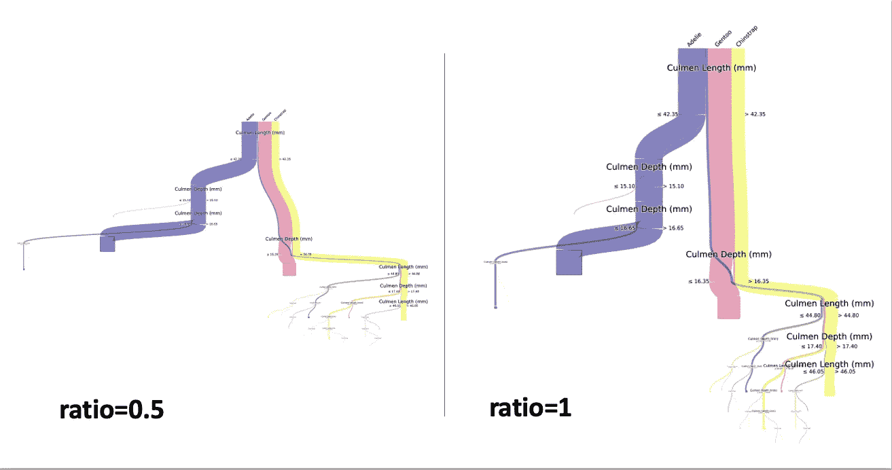

不同的比例如何影响体型|作者图片

## 最大深度=3

参数`maxdepth`控制树的深度。较低的数字限制了树的分裂，也显示了顶部分裂。如果上述树的`max_depth`设置为 3，我们将得到一个发育不良的树:

```
ax = pybaobabdt.drawTree(clf, size=10, maxdepth = 3,features=features, ratio=1,colormap='plasma')
```

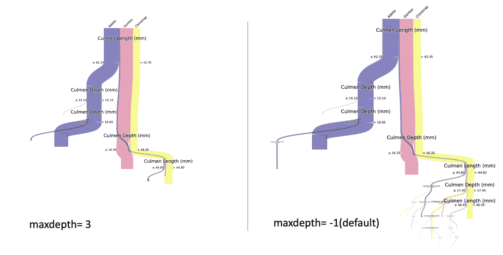

调整树的最大深度以控制树的大小|图片由作者提供

# 保存图像

输出图形可以保存如下:

```
ax.get_figure().savefig('claasifier_tree.png', format='png', dpi=300, transparent=True)
```

# 结论

pybaobabdt 包为可视化提供了一个新的视角。它包括了在它的对应物中没有见过的特征。主要思想是通过有意义的可视化来帮助用户理解和解释树。本文使用了一个简单的例子来演示这个库。然而，将它用于更广泛和更复杂的数据集，以了解它在实际意义上的优势，这将是一个很好的练习。我将把它留给读者做练习。

# 参考资料和进一步阅读:

*   [pybaobabdt 包的官方 Github 库。](https://gitlab.tue.nl/20040367/pybaobab/-/tree/main)
*   [**决策树的交互式构建、分析和可视化**，*斯特夫·范·登·埃尔森*，理学硕士。论文，埃因霍温工业大学，2011 年](http://alexandria.tue.nl/extra1/afstversl/wsk-i/elzen2011.pdf)
*   [了解决策树](https://medium.com/analytics-vidhya/a-guide-to-machine-learning-in-r-for-beginners-decision-trees-c24dfd490abb)