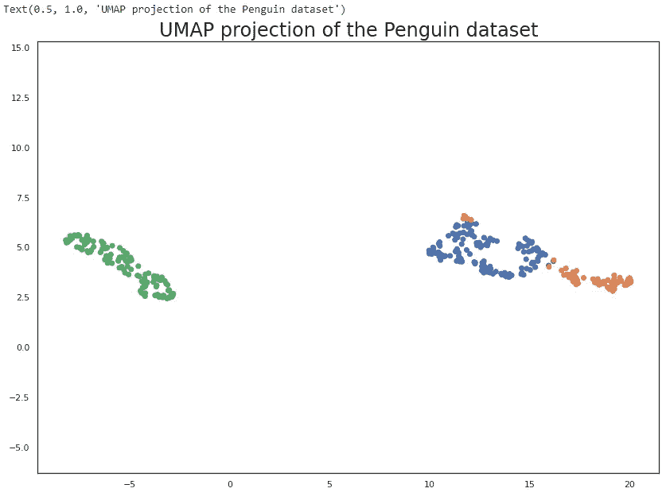

# 可视化降维

> 原文：<https://towardsdatascience.com/visualizing-dimensionality-reduction-18172a92e5ed?source=collection_archive---------31----------------------->

## 使用 UMAP 进行降维



来源:作者

在处理大型数据集时，降维是最重要的方面之一，因为它有助于将数据转换到较低的维度，以便我们可以识别一些重要的特征及其属性。它通常用于避免在分析大型数据集时出现的维数灾难。

当我们进行数值分析或创建机器学习模型时，处理高维数据可能会很困难。使用高维数据集会导致高方差，并且模型不会被一般化。如果我们降低维度，我们可以使机器学习模型更加一般化，并避免过度拟合。

UMAP 是一个开源的 Python 库，有助于可视化降维。

在本文中，我们将探索 UMAP 提供的一些功能。

让我们开始吧…

# 安装所需的库

我们将从使用 pip 安装 UMAP 库开始。下面给出的命令可以做到这一点。

```
!pip install umap-learn
```

# 导入所需的库

在这一步中，我们将导入加载数据集和可视化降维所需的库。

```
import umap
from sklearn.preprocessing import StandardScaler
import matplotlib.pyplot as plt
import pandas as pd
%matplotlib inline
```

# 正在加载数据集

在本文中，我们将使用从 Github 获取的著名的 Palmer Penguins 数据集。

```
penguins = pd.read_csv("https://github.com/allisonhorst/palmerpenguins/raw/5b5891f01b52ae26ad8cb9755ec93672f49328a8/data/penguins_size.csv")
penguins.head()
```

加载数据集后，我们将从删除空值开始，并使用 UMAP 创建一个 reducer 对象。该缩减器将用于维度缩减，并进一步用于可视化。

```
penguins = penguins.dropna()
penguins.species_short.value_counts()
reducer = umap.UMAP()
penguin_data = penguins[
[
"culmen_length_mm",
"culmen_depth_mm",
"flipper_length_mm",
"body_mass_g",
]
].values
scaled_penguin_data = StandardScaler().fit_transform(penguin_data)
embedding = reducer.fit_transform(scaled_penguin_data)
```

# 绘制降维图

在这一步，我们将绘制降维图。

```
plt.scatter(embedding[:, 0], embedding[:, 1], c=[sns.color_palette()[x] for x in penguins.species_short.map({"Adelie":0, "Chinstrap":1, "Gentoo":2})])
plt.gca().set_aspect('equal', 'datalim')
plt.title('UMAP projection of the Penguin dataset', fontsize=24)
```


降维(来源:作者)

在这里，您可以清楚地看到企鹅数据集的维数减少。

继续尝试不同的数据集，执行降维，并使用 UMAP 绘制。如果您发现任何困难，请在回复部分告诉我。

本文是与 [Piyush Ingale](https://medium.com/u/40808d551f5a?source=post_page-----18172a92e5ed--------------------------------) 合作完成的。

# 在你走之前

***感谢*** *的阅读！如果你想与我取得联系，请随时通过 hmix13@gmail.com 联系我或我的* [***LinkedIn 个人资料***](http://www.linkedin.com/in/himanshusharmads) *。可以查看我的*[***Github***](https://github.com/hmix13)**简介针对不同的数据科学项目和包教程。还有，随意探索* [***我的简介***](https://medium.com/@hmix13) *，阅读我写过的与数据科学相关的不同文章。**