# 使用 t-SNE 和 PCA 可视化特征向量/嵌入

> 原文：<https://towardsdatascience.com/visualizing-feature-vectors-embeddings-using-pca-and-t-sne-ef157cea3a42?source=collection_archive---------6----------------------->

丹尼斯·库默在 [Unsplash](https://unsplash.com?utm_source=medium&utm_medium=referral) 上拍摄的照片

在学习机器学习或深度学习的基础知识的同时训练一个模型是一个非常受引导的过程。数据集已被很好地理解，并被充分格式化以供您使用。然而，当你步入现实世界，试图解决行业或现实生活中的挑战时，数据集通常是混乱的，如果一开始不存在的话。理解为什么你的模型不简单。没有具体的步骤引导你找到答案。然而，某些工具允许您调查并获得关于模型输出的更深入的见解。可视化是一个非常强大的工具，可以提供非常宝贵的信息。在这篇文章中，我将讨论两种非常强大的技术，可以帮助你在低维空间中可视化高维数据，以找到趋势和模式，即主成分分析和 t-SNE。我们将采用一个基于 CNN 的示例，并在测试数据集中注入噪声来进行可视化研究。

# 介绍

在深入研究如何使用这两种技术之前，我将简要介绍一下它们。

## 主成分分析[1]

PCA 是一种探索性工具，通常用于将大型复杂数据集简化为更小、更容易理解的数据集。它通过进行正交线性变换来实现这一点，该变换将数据转换到一个新的坐标系中，该坐标系以主成分的形式根据其方差内容进行排列，即您的高维相关数据被投影到一个具有线性独立基的较小空间中。第一个分量的方差最大，最后一个分量的方差最小。在原始空间中相关的特征在这个新的子空间中用线性独立或正交的基向量来表示。[注意:给定向量空间 V 的基集 B 包含的向量允许 V 中的每个向量唯一地表示为这些向量的线性组合[2]。PCA 的数学超出了本文的范围。]您可以将这些组件用于许多事情，但在本文中，我将使用这些组件来可视化特征向量或嵌入中的模式，我们通常从 2D/3D 空间中的神经网络的倒数第二层获得这些模式。

## t-分布随机邻居嵌入(t-SNE) [2]

t-SNE 是一种强大的可视化技术，可以帮助发现低维空间中的数据模式。这是一种非线性降维技术。然而，与 PCA 不同，它涉及迭代优化，这需要时间来收敛，并且有一些参数可以调整。这涉及到两个主要步骤。首先，t-SNE 在高维对象对上构建概率分布，使得相似的对象被分配较高的概率，而不相似的对象被分配较低的概率。相似性是基于某个距离(例如欧几里德距离)来计算的。接下来，t-SNE 在低维空间中定义了类似的概率分布，并最小化了两个分布之间关于空间中点的位置的 Kullback-Leibler 散度(KL 散度)。KL 散度是一个统计工具，它允许你测量两个分布之间的相似性。当你用一个分布来近似另一个分布时，它会给你丢失的信息。因此，如果 KL 散度被最小化，我们会发现一个分布，它是相似和不相似物体的高维分布的一个很好的低维近似。这也意味着结果不会是唯一的，每次运行都会得到不同的结果。因此，在做出结论之前，多次运行 t-SNE 算法是一个好主意。

接下来，我将讨论我们将在本文中使用的分类数据集和体系结构。

# 使用 CNN 的 MNIST 分类

我想使用真实世界的数据集，因为我最近在工作中的一个项目中使用了这种技术，但由于 IP 原因，我不能使用该数据集。所以我们将使用著名的 MNIST 数据集[4]。(尽管它现在已经成为一个玩具数据集，但它已经足够多样化，可以展示这种方法。)

它总共由 70，000 幅手写数字图像组成。这些样本分为 60，000 个训练样本和 10，000 个测试样本。这些是 28x28 灰度图像。一些带有相应标签的随机样本如下所示。

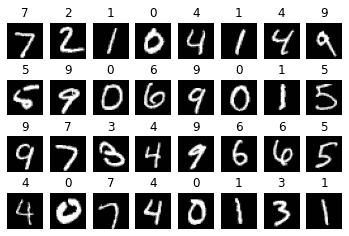

来源:作者

我将使用一个小的 CNN 架构来执行分类并在 PyTorch 中构建它。该架构如下所示:

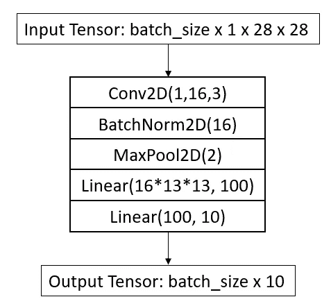

来源:作者

它由一个带有 16 个滤波器的 conv2d 层和两个完全连接的线性层组成。网络为每个图像输出 10 个值。我已经应用了最大池来减少特征尺寸。网络参数摘要如下所示。

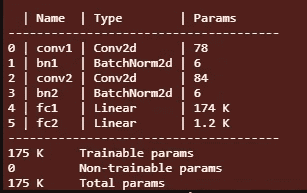

来源:作者

我们看到，即使这个微小的网络也有 175k 个参数。这里需要注意的是，与全连接层相比，CNN 层的网络参数非常少。这些线性图层还会对网络的输入大小产生限制，因为它是针对 28x28 输入计算的，并且会针对其他输入大小更改其尺寸。这就是为什么我们不能将具有全连接层的预训练 CNN 模型用于与训练期间使用的维度大小不同的输入。除了最后一层，我在每一层之后都应用了 relu 激活。因为 PyTorch 中的交叉熵损失需要原始逻辑。它在内部应用 softmax。因此，在使用该特定功能时，请记住这一点。

对于训练，我使用具有默认设置的 Adam 优化器，并且模型被训练 20 个时期，并且基于最低验证损失保留最佳模型。通过查看 train 和 val 指标，我观察到了随着训练的进行过度拟合的趋势。我觉得给你看看可能是个好主意。

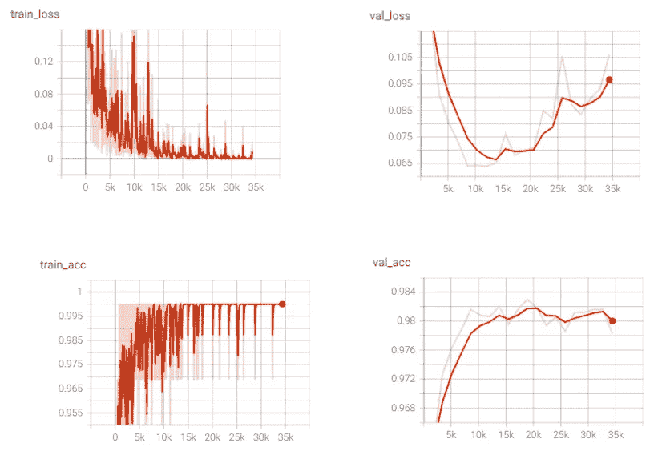

来源:作者

在整个训练过程中，我们看到训练损失呈下降趋势，训练准确率呈上升趋势。这意味着我们的模型复杂度对于我们的训练数据集来说是足够的。对于验证损失，我们看到直到第七个时期(步骤 14k)损失减少，然后损失开始增加。验证准确度经历了增加，然后也在接近结束时开始降低。想了解更多关于偏差-方差权衡、过拟合和欠拟合的内容，可以阅读本文:[https://towardsdatascience . com/bias-variance-trade-off-7b 4987 DD 9795？sk = 38729126412 b 0 DC 94 ca 5 D2 a 9494067 b 7](/bias-variance-trade-off-7b4987dd9795?sk=38729126412b0dc94ca5d2a9494067b7)

现在我们将转移到今天文章的核心，特征向量或嵌入的可视化。

# 特征向量的可视化

我不会解释训练代码。所以让我们从视觉化开始。我们将需要导入一些库。我在我的脚本中使用了 [PyTorch Lightning](https://pytorch-lightning.readthedocs.io/en/latest/) ，但是代码将适用于任何 PyTorch 模型。

我们加载训练好的模型，将其发送到 GPU，并将其置于评估模式。将你的模型放入 eval 是非常重要的，因为它将设置 BatchNorm、Dropout 等层。在推理过程中恰当地表现。

接下来，我们加载我们的 MNIST 数据集，并在数据集中注入一些噪声样本。

注入的噪声看起来像这样。

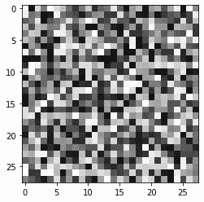

来源:作者

所以我们知道，模型必须要抛出一些类，但是对于这些样本来说，这是无用的。这是使用 DL 模型的问题之一，如果您遇到非分布数据，那么很难预测模型会预测什么。对看不见的数据进行归纳总是一个挑战。我已经定义了模型，它返回嵌入张量和最终预测张量。这使得无需改变 PyTorch 中的前钩就可以容易地接近。

但是，如果您发现自己想要访问预训练模型的中间层的输出，您可以使用下面的代码来注册前向挂钩。

MNIST 数据集的预测代码如下。我们只需在数据集上循环，向前遍历网络，提取嵌入，并将其存储在嵌入张量中。

为了进行健全性检查，我绘制了几个样本输入测试点的输出预测。

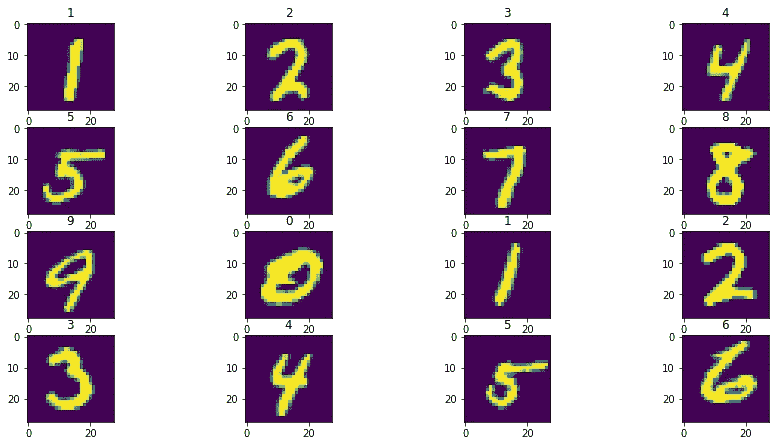

来源:作者

该模型似乎按预期工作，预测标签显示在每个子情节的顶部。最后，我们可以做 t-SNE 和主成分分析投影，看看一些漂亮的视觉效果。我用 scikit-learn 来学习这些算法。

经过训练的模型嵌入的结果图如下所示。正如我们所料，我们看到了 11 个漂亮的星团。该模型预测所有的噪声样本为八个。我们看到这些噪声图像中最右边的紫色集群。这是一种异常，这种异常或异常值应该在您的真实数据集调查中进一步调查。您可以使用 x，y 位置来获取嵌入的索引，并将它们映射到图像索引。那会告诉你那些样品有什么问题。

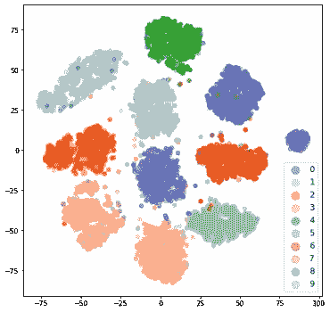

来源:作者

我还计算了 3D t-SNE 投影，只是为了说明做这件事同样容易。

我们在 3D 投影中也观察到了同样的现象。

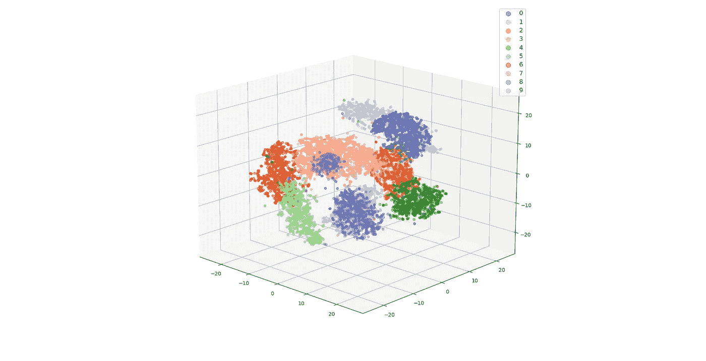

来源:作者

对于 PCA，代码非常相似，但是我们使用 PCA 类而不是 TSNE。我做了类似 t-SNE 的二维和三维投影。但是，对于 PCA，您需要记住一个额外的参数。这就是被解释的方差比率。这将告诉您主成分捕获的数据的差异量。这些值越高，主成分就越能更好地显示低维空间中数据的变化。但是较低的值表明只有 2 或 3 个组件不太擅长显示模式。

对于前两个主成分，仅捕获嵌入中 25%的变化。我们确实看到了一些模式，但是这些集群并不像 t-SNE 嵌入那样清晰。主成分分析图中的异常值并不明显。不过，3D 图显示的聚类更好一些。这是因为 3 个分量捕获了更多的方差。因此，PCA 可视化的有效性将取决于您的数据。

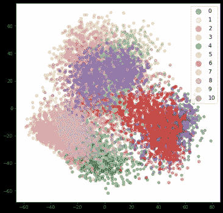

来源:作者

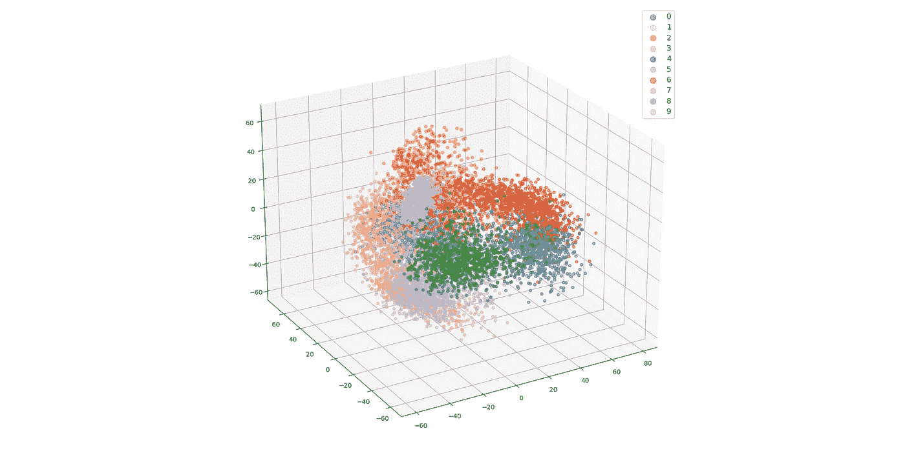

来源:作者

在我结束之前，我想再给你们看一个图，让 t-SNE 视觉化的力量更加清晰。作为一个实验，我用一个随机权重的模型计算了嵌入量，并绘制了 t-SNE 投影。为了正确地向您展示聚类，我根据我们可用的实际标签对这些重量进行了颜色编码。我们看到 t-SNE 从一个未训练的模型中提取的嵌入中给了我们 11 个聚类。

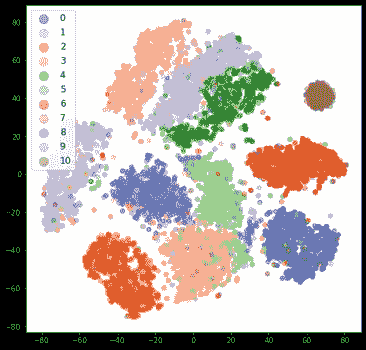

来源:作者

但是你必须小心，SNE 霸王龙会产生一些毫无意义的集群。我还要重申我在导言中所说的，这些预测并不是唯一的。因此，投射几次，并验证你在所有情况下都得到了相似的结果。

# 结论

我们研究了 t-SNE 和 PCA 来可视化从神经网络获得的嵌入/特征向量。这些图可以向您显示数据中的异常值或异常，可以进一步调查以了解这种行为发生的确切原因。这些方法的计算时间随着样本的增加而增加，所以要认识到这一点。感谢您的阅读，我希望您喜欢阅读这篇文章。代码可从这里获得:[https://github . com/msminhas 93/embeddings-visualization/blob/main/readme . MD](https://github.com/msminhas93/embeddings-visualization/blob/main/README.md)

# 参考

[1]https://en.wikipedia.org/wiki/Principal_component_analysis

[2][https://en . Wikipedia . org/wiki/Basis _(线性代数)](https://en.wikipedia.org/wiki/Basis_(linear_algebra))

[3][https://jakevdp . github . io/python datascience handbook/05.09-principal-component-analysis . html](https://jakevdp.github.io/PythonDataScienceHandbook/05.09-principal-component-analysis.html)

[http://yann.lecun.com/exdb/mnist/](http://yann.lecun.com/exdb/mnist/)